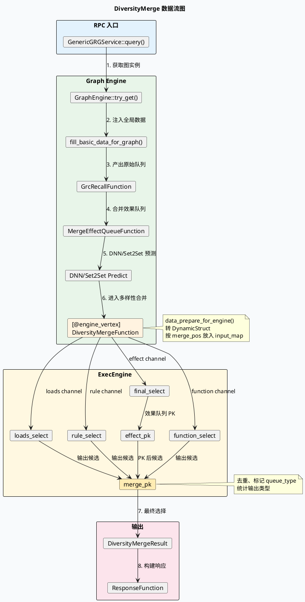
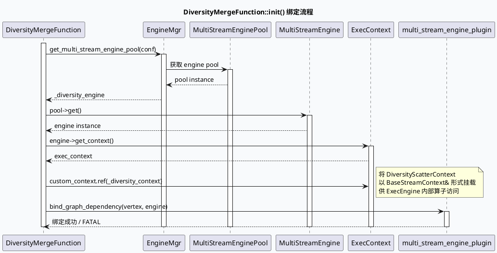
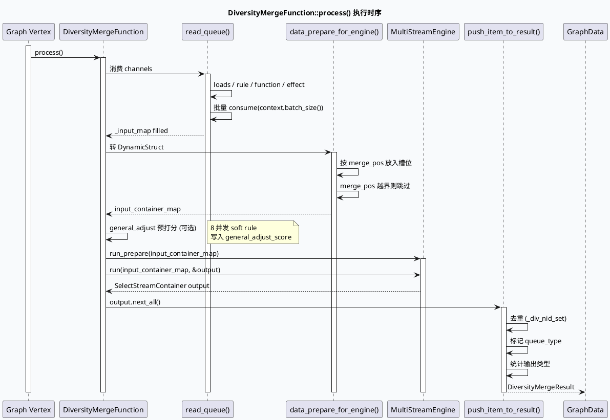

# ExecEngine MultiStreamEngine 绑定 GraphDependency 深入理解（GRG DiversityMerge）

> 日期：2026-05-29  
> 主题来源：`notes/weekly-topic-selection/daily-plan-20260529.json` 的 `fri.base_lib` 计划项  
> 范围：只分析 GRG 中 `DiversityMergeFunction` 如何把图引擎 GraphData / Channel 依赖绑定到 ExecEngine `MultiStreamEngine`，不泛化到所有 brpc / graph-engine 用法。

---

## 0. 架构全景图

<div style="position: relative; font-family: -apple-system, BlinkMacSystemFont, 'Segoe UI', Roboto, sans-serif; background: #f8fafc; border-radius: 12px; padding: 24px; margin: 16px 0;">
<style scoped>
.arch-wrapper { display: flex; gap: 16px; }
.arch-main { flex: 1; }
.arch-layer { border-radius: 8px; padding: 16px; margin-bottom: 12px; }
.arch-layer.user { background: #dbeafe; border-left: 4px solid #3b82f6; }
.arch-layer.application { background: #dcfce7; border-left: 4px solid #22c55e; }
.arch-layer.ai { background: #fef3c7; border-left: 4px solid #f59e0b; }
.arch-layer.data { background: #fce7f3; border-left: 4px solid #ec4899; }
.arch-layer.infra { background: #f3e8ff; border-left: 4px solid #a855f7; }
.arch-box { background: rgba(255,255,255,0.8); border-radius: 6px; padding: 8px 12px; margin: 4px; font-size: 12px; display: inline-block; }
.arch-box.highlight { background: #fff; border: 2px solid #f59e0b; font-weight: 600; }
.arch-grid { display: flex; flex-wrap: wrap; gap: 8px; margin-top: 8px; }
.arch-layer-title { font-size: 14px; font-weight: 700; margin-bottom: 8px; color: #1e293b; }
</style>
<div class="arch-wrapper">
<div class="arch-main">
<div class="arch-layer user">
<div class="arch-layer-title">👤 用户层 (RPC 入口)</div>
<div class="arch-grid">
<div class="arch-box">GenericGRGService::query()</div>
<div class="arch-box">GraphEngine::try_get()</div>
<div class="arch-box">fill_basic_data_for_graph()</div>
</div>
</div>
<div class="arch-layer application">
<div class="arch-layer-title">⚙️ 图引擎层 (Graph Engine)</div>
<div class="arch-grid">
<div class="arch-box">GrcRecallFunction</div>
<div class="arch-box">MergeEffectQueueFunction</div>
<div class="arch-box">DNN/Set2Set Predict</div>
<div class="arch-box highlight">[@engine_vertex] DiversityMergeFunction</div>
</div>
</div>
<div class="arch-layer ai">
<div class="arch-layer-title">🧠 ExecEngine 层 (MultiStreamEngine)</div>
<div class="arch-grid">
<div class="arch-box">loads_select</div>
<div class="arch-box">rule_select</div>
<div class="arch-box">function_select</div>
<div class="arch-box">final_select</div>
<div class="arch-box">effect_pk</div>
<div class="arch-box highlight">merge_pk</div>
</div>
</div>
<div class="arch-layer data">
<div class="arch-layer-title">💾 数据流层 (Channels)</div>
<div class="arch-grid">
<div class="arch-box">LoadsQueue</div>
<div class="arch-box">RuleQueue</div>
<div class="arch-box">FunctionQueue</div>
<div class="arch-box">EffectQueue</div>
<div class="arch-box">DiversityMergeResult</div>
</div>
</div>
<div class="arch-layer infra">
<div class="arch-layer-title">🔧 基础设施层</div>
<div class="arch-grid">
<div class="arch-box">GraphPool</div>
<div class="arch-box">EngineMgr</div>
<div class="arch-box">MutableChannel</div>
<div class="arch-box">bind_graph_dependency()</div>
</div>
</div>
</div>
</div>
</div>

---

## 1. API 模型：Graph Engine 外层 vertex + ExecEngine 内层 multi-stream

GRG 服务不是直接在 RPC 方法里做排序合并，而是在入口取到 Graph 实例后运行图：`GenericGRGService::query()` 通过 `ApplicationContext` 获取 `graph_engine`，按 UA 选择 `graph_name`，`try_get(graph_name)` 得到池化图实例，然后 `fill_basic_data_for_graph()` 注入全局数据，最后 `run()` 调用 `graph->run(end_node, err_node)`；运行结束后调用 `pooled_graph->reset()` 复用图实例（`/home1/code_read/code-read-mv-grg/baidu/feed-gr/feeda-mv-grg/src/service/grg_service.cpp:48-91`, `/home1/code_read/code-read-mv-grg/baidu/feed-gr/feeda-mv-grg/src/service/grg_service.cpp:203-219`）。

在这个外层 Graph 中，`DiversityMergeFunction` 被声明为 `[@engine_vertex]`，它一方面像普通 Graph vertex 一样声明 `emit/depend` 数据，另一方面通过 `[.option] plugin: multi_stream_engine_plugin` 与 `conf: multi_stream_diversity.conf` 进入 ExecEngine 的多流选择配置（`/home1/code_read/code-read-mv-grg/baidu/feed-gr/feeda-mv-grg/conf/plugins/graph/short_micro_video/vertex.conf:798-934`）。

`multi_stream_engine_plugin` 可用的 engine 配置来自 `exec_engine.conf`：同一插件配置了 `multi_stream_diversity.conf`、`multi_stream_diversity_new.conf`、`news_diversity.conf` 三个 engine 文件（`/home1/code_read/code-read-mv-grg/baidu/feed-gr/feeda-mv-grg/conf/plugins/exec_engine/exec_engine.conf:1-3`）。本文只分析当前主链路 `multi_stream_diversity.conf`。

### 关键 API / 宏

| API / 宏 | 文件与行号 | 作用 |
|---|---|---|
| `GraphEngine::try_get(graph_name)` | `src/service/grg_service.cpp:48-65` | 从 GraphPool 取出请求对应的图实例。 |
| `graph->find_data(...)->emit<T>()` | `src/service/grg_service.cpp:127-176` | 在 Graph 全局依赖中注入 `Request/log_id/uid/cuid/ua/ExpInfo` 等数据。 |
| `[@engine_vertex] function: DiversityMergeFunction` | `conf/plugins/graph/short_micro_video/vertex.conf:798-934` | 声明多样性合并 vertex 及其 GraphData/Channel 依赖。 |
| `EngineMgr::get_multi_stream_engine_pool(conf)` | `src/process/diversity_merge.cpp:68-76` | 按 `conf` 取出 MultiStreamEngine 池并拿到 engine 实例。 |
| `exec_context->custom_context.ref(...)` | `src/process/diversity_merge.cpp:80-85` | 将业务自定义 `DiversityScatterContext` 暴露给 ExecEngine 算子。 |
| `bind_graph_dependency(this->vertex(), _diversity_engine)` | `src/process/diversity_merge.cpp:86-90` | 把内层 ExecEngine 依赖绑定到外层 Graph vertex。 |
| `GRAPH_FUNCTION_DEPEND_MUTABLE_CHANNEL` | `src/process/diversity_merge.cpp:1848-1856` | 声明输入队列是 Graph mutable channel，而不是普通 data。 |
| `BABYLON_REGISTER_FACTORY_COMPONENT_WITH_TYPE_NAME` | `src/common/common.h:186-187` | `REGISTER_GRG_FUNCTION` 的底层注册宏，把函数注册为 `GraphProcessor`。 |

---

## 2. 数据流图



该链路中，外层 Graph 的全局依赖来自 `short_micro_video/global.conf`，其中声明了 `Request/log_id/uid/cuid/ua/tab/product/flow_loc/graph_begin_us/is_debug/is_vip_cuid/ExpInfo`，并 include 了 `vertex.conf`、`pipeline.conf`、`expression.conf`、`div_prepare.conf` 等子配置（`/home1/code_read/code-read-mv-grg/baidu/feed-gr/feeda-mv-grg/conf/plugins/graph/short_micro_video/global.conf:1-49`）。

---

## 3. MultiStreamEngine 配置语义

### Stream 结构一览

```infographic
infographic list-grid-badge-card
data
  title MultiStreamEngine 6 大 Stream
  desc multi_stream_diversity.conf 核心配置
  items
    - label loads_select
      desc loads 兜底/插入队列 | executor: loads_select_executor
    - label rule_select
      desc 规则队列 | executor: select_executor
    - label function_select
      desc 功能队列 | executor: select_executor
    - label final_select
      desc 效果队列 | executor: effect_select_executor
    - label effect_pk
      desc 效果队列提前 PK | executor: effect_pk_executor
    - label merge_pk
      desc 最终槽位选择 | 合并所有 stream 输出
```

`multi_stream_diversity.conf` 首先声明 engine 的 context schema：`dependency_schema: ContextInfo` 与 `mutable_context_schema: ContextInfo`，说明 ExecEngine 算子看到的依赖上下文不是任意 GraphData，而是由插件绑定和 ContextInfo schema 映射后的依赖集合（`/home1/code_read/code-read-mv-grg/baidu/feed-gr/feeda-mv-grg/conf/plugins/exec_engine/multi_stream_diversity.conf:1-7`）。

多流结构由五个 stream 组成：

| stream | 配置行 | 输入 pip | executor | 业务含义 |
|---|---|---:|---|---|
| `loads_select` | `multi_stream_diversity.conf:10-16` | `loads` | `loads_select_executor` | loads 兜底/插入队列。 |
| `rule_select` | `multi_stream_diversity.conf:17-23` | `rule` | `select_executor` | 规则队列。 |
| `function_select` | `multi_stream_diversity.conf:24-30` | `function` | `select_executor` | 功能队列。 |
| `final_select` | `multi_stream_diversity.conf:31-37` | `effect` | `effect_select_executor` | 效果队列，执行硬/软规则与打分。 |
| `effect_pk` | `multi_stream_diversity.conf:38-44` | `final_select` | `effect_pk_executor` | 对效果队列提前 PK，缩小候选集。 |
| `merge_pk` | `multi_stream_diversity.conf:45-64` | `loads_select/rule_select/function_select/effect_pk` | score/index/effect pk executor | 将各 stream 输出做最终槽位选择。 |

`select_executor` 使用 `exec_type: 1` 且 `stages: rule`，同时配置 `CostGenerator` 和多个 rule operator，例如 `DiversityRuleOperator` 在 `ua = 85` 时生效，`RuleSelectOperator` 使用 `multi_stream_select_hard_rule.conf` 且可配置 `is_terminal_select`（`/home1/code_read/code-read-mv-grg/baidu/feed-gr/feeda-mv-grg/conf/plugins/exec_engine/multi_stream_diversity.conf:68-124`）。`effect_select_executor` 使用 `exec_type: 3`，这与普通 rule/function 队列不同，说明效果队列的规则执行可以采取不同并发策略（`/home1/code_read/code-read-mv-grg/baidu/feed-gr/feeda-mv-grg/conf/plugins/exec_engine/multi_stream_diversity.conf:388-401`）。

软规则的触发条件主要由 ExecContext 中的 condition value 决定：例如 `EffectSoftRuleOperator` 只在 `is_open_dnn_soft_rule = 1 && is_searchc_immersive_request != 1 && ua != 87 && enable_general_adjust = 0` 时启用，配置文件引用 `multi_stream_select_soft_rule.conf`（`/home1/code_read/code-read-mv-grg/baidu/feed-gr/feeda-mv-grg/conf/plugins/exec_engine/multi_stream_diversity.conf:602-632`）。`effect_pk_executor` 根据 `is_hit_diversity_score_pk_exp`、`is_open_dnn_soft_rule`、`ua`、`is_hit_searchc_mmr_refresh_exp` 选择不同 PK 算子（`/home1/code_read/code-read-mv-grg/baidu/feed-gr/feeda-mv-grg/conf/plugins/exec_engine/multi_stream_diversity.conf:725-767`）。

---

## 4. 绑定 GraphDependency 的真实代码路径



`DiversityMergeFunction::init()` 是绑定发生的地方：它从 vertex option 读取 `plugin` 与 `conf`，用 `EngineMgr::instance().get_multi_stream_engine_pool(conf)` 获取 engine pool，再从 pool 中取出 `_diversity_engine`（`/home1/code_read/code-read-mv-grg/baidu/feed-gr/feeda-mv-grg/src/process/diversity_merge.cpp:65-76`）。随后它取出 engine context，把 `_diversity_context` 以 `BaseStreamContext&` 形式挂到 `exec_context->custom_context`，这意味着 ExecEngine 内部算子可以通过统一的 BaseStreamContext 接口访问 GRG 业务上下文（`/home1/code_read/code-read-mv-grg/baidu/feed-gr/feeda-mv-grg/src/process/diversity_merge.cpp:80-85`）。

真正的 GraphDependency 绑定是 `multi_stream_engine_plugin->bind_graph_dependency(this->vertex(), _diversity_engine)`；失败时直接 `LOG(FATAL)` 并返回错误（`/home1/code_read/code-read-mv-grg/baidu/feed-gr/feeda-mv-grg/src/process/diversity_merge.cpp:86-90`）。这一步是关键：ExecEngine 配置里大量 `[..@depend] name: ...` 依赖需要从 Graph vertex 的依赖上下文中解析，如果没有绑定，内层 rule/operator 的 `Request/SidInfo/MsvReadInfo/ShowItemListWithMeta/...` 等依赖无法连到外层 GraphData。

---

## 5. 调度与阻塞语义



`DiversityMergeFunction::process()` 的执行是同步等待内层 ExecEngine 完成：先 `run_prepare(input_container_map)`，再调用 `_diversity_engine->run(input_container_map, &output)`，并用 `SIA_START/SIA_END` 包裹 `diversity_engine_rpc` 监控耗时（`/home1/code_read/code-read-mv-grg/baidu/feed-gr/feeda-mv-grg/src/process/diversity_merge.cpp:725-806`）。因此，对外层 Graph 来说，`DiversityMergeFunction` 是一个 vertex；对内层 ExecEngine 来说，它内部还会按配置执行 stream/executor/operator。

在调用 engine 前，函数会通过 `read_queue()` 消费多个 `MutableChannelConsumer<RidTmpInfoPtr>`：loads、rule、news_rule、function、effect 被读取到 `_input_map`，其中 rule/function 在 `rec_num <= FLAGS_recnum_threshold_for_insert` 时会被跳过（`/home1/code_read/code-read-mv-grg/baidu/feed-gr/feeda-mv-grg/src/process/diversity_merge.cpp:251-273`, `/home1/code_read/code-read-mv-grg/baidu/feed-gr/feeda-mv-grg/src/process/diversity_merge.cpp:343-350`）。`read_queue()` 内部按 `context.batch_size()` 反复 `consumer.consume()`，每批调用 `data_prepare_for_engine()`，并累加 `_input_item_size`（`/home1/code_read/code-read-mv-grg/baidu/feed-gr/feeda-mv-grg/src/process/diversity_merge.cpp:1257-1274`）。

`data_prepare_for_engine()` 会把 `RidTmpInfoPtr` 转成 `DynamicStruct`，按 `item->_content_item.ext().merge_pos()` 写入对应槽位；如果 `merge_pos` 越界则跳过该 item；同时 effect/news_effect 进入 `_effect_input`，其他队列进入 `_no_effect_input`，并清理 `div_status/div_del_tag/div_log` 等运行态字段（`/home1/code_read/code-read-mv-grg/baidu/feed-gr/feeda-mv-grg/src/process/diversity_merge.cpp:1276-1345`）。

---

## 6. 真实服务使用示例

### 6.1 Effect 队列如何进入 DiversityMerge

`MergeEffectQueueFunction` 将图文效果队列和视频效果队列合并：它从 `_news_doc_feature_info` 与 `_effect_doc_feature_info` channel 读取数据，调用 `effect_merge()` 合并，然后向多个 channel 发布同一批结果，例如 `EffectMergeQueueDocSampleInfo`、`EffectMergeSet2SetDocSampleInfo`、`EffectMergeSeq2SeqDocSampleInfo`、`GenRLHFDocSampleInfo` 等（`/home1/code_read/code-read-mv-grg/baidu/feed-gr/feeda-mv-grg/src/process/merge_effect_queue_function.cpp:66-129`）。配置上，`pipeline.conf` 中该 vertex 的输入是 `NewsQueueDocSampleInfo` / `EffectQueueDocSampleInfo` 或 PKGenerate 候选队列，输出是后续 DNN/Set2Set 依赖的多个 channel（`/home1/code_read/code-read-mv-grg/baidu/feed-gr/feeda-mv-grg/conf/plugins/graph/short_micro_video/pipeline.conf:1-39`）。

随后 `ContextDnnCommonNetPredictFunction` 输出 `EffectQueueDnnPredictedResult`，`Set2setPredictFunction` 输出 `EffectQueueSet2SetPredictedResult`（`/home1/code_read/code-read-mv-grg/baidu/feed-gr/feeda-mv-grg/conf/plugins/graph/short_micro_video/pipeline.conf:174-220`）。`DiversityMergeFunction` 的 `_effect_rid_queue` 依赖选择表达式是 `is_open_set2set ? EffectQueueSet2SetPredictedResult : EffectQueueDnnPredictedResult`（`/home1/code_read/code-read-mv-grg/baidu/feed-gr/feeda-mv-grg/conf/plugins/graph/short_micro_video/vertex.conf:842-845`）。

### 6.2 General adjust 预打分如何嵌入 engine 前

在正式 `MultiStreamEngine::run()` 之前，如果 `is_open_dnn_soft_rule && !is_searchc_immersive_request && ua != 87 && enable_general_adjust`，代码会从 `_general_adjust_rule_conf` 中筛出可运行的 soft rule operator，8 并发切分 `effect_input`，调用 `operator_ptr->run_soft_rule(exec_context, &scatter_context, item_sublist)`，等待所有 future 完成后把 `div_res_score` 写入 `general_adjust_score` 并将 `exec_context->_ori_score_key` 切换到 `_general_adjust_score_key`（`/home1/code_read/code-read-mv-grg/baidu/feed-gr/feeda-mv-grg/src/process/diversity_merge.cpp:730-794`）。这说明"软规则"并不全在 `MultiStreamEngine::run()` 内部执行，GRG 在 engine 前还有一段显式预处理。

### 6.3 输出如何回到 GraphData

`MultiStreamEngine::run()` 的输出是 `SelectStreamContainer output`，代码通过 `output.next_all()` 拿到 `DynamicStruct*` 列表，再转换回 `RidTmpInfo*` 并调用 `push_item_to_result()` 写入 `div_result`（`/home1/code_read/code-read-mv-grg/baidu/feed-gr/feeda-mv-grg/src/process/diversity_merge.cpp:796-851`）。`push_item_to_result()` 会按 `div_reason` 判断来源队列并设置 `QueueType::LOADS/RULE/FUNCTION/EFFECT`，同时统计视频/图文/动态/短剧/合集等输出数（`/home1/code_read/code-read-mv-grg/baidu/feed-gr/feeda-mv-grg/src/process/diversity_merge.cpp:1352-1397`）。

---

## 7. Pitfalls

<div style="font-family: -apple-system, BlinkMacSystemFont, 'Segoe UI', Roboto, sans-serif; background: #fef2f2; border-radius: 12px; padding: 24px; margin: 16px 0; border-left: 4px solid #ef4444;">
<style scoped>
.pitfall-card { background: #fff; border-radius: 8px; padding: 16px; margin-bottom: 12px; box-shadow: 0 1px 3px rgba(0,0,0,0.1); }
.pitfall-title { font-size: 14px; font-weight: 700; color: #dc2626; margin-bottom: 8px; }
.pitfall-desc { font-size: 13px; color: #374151; line-height: 1.6; }
.pitfall-ref { font-size: 11px; color: #6b7280; margin-top: 6px; font-family: monospace; }
</style>

<div class="pitfall-card">
<div class="pitfall-title">⚠️ 1. 不要只看 multi_stream_select_soft_rule.conf</div>
<div class="pitfall-desc">它只是软规则列表；真正的 stream/executor 结构在 multi_stream_diversity.conf，而 GraphData 入口在 vertex.conf 的 [@engine_vertex]</div>
<div class="pitfall-ref">vertex.conf:798-934 | multi_stream_diversity.conf:8-66</div>
</div>

<div class="pitfall-card">
<div class="pitfall-title">⚠️ 2. Graph condition 与 ExecEngine condition 是两层条件</div>
<div class="pitfall-desc">Graph vertex 依赖中有 condition: is_open_set2set 等条件，ExecEngine operator 也有 condition: ua = 85 等。排查未执行时要分层确认。</div>
<div class="pitfall-ref">vertex.conf:849-858 | multi_stream_diversity.conf:85-88, 602-607</div>
</div>

<div class="pitfall-card">
<div class="pitfall-title">⚠️ 3. Channel 消费是批量 drain</div>
<div class="pitfall-desc">read_queue() 会一直 consume(context.batch_size()) 到空，不能假设只消费一批。</div>
<div class="pitfall-ref">diversity_merge.cpp:1257-1274</div>
</div>

<div class="pitfall-card">
<div class="pitfall-title">⚠️ 4. merge_pos 越界会静默跳过候选</div>
<div class="pitfall-desc">data_prepare_for_engine() 在 slot_index >= input_vec.size() 时 continue，这会导致输入候选未进入 engine。</div>
<div class="pitfall-ref">diversity_merge.cpp:1295-1298</div>
</div>

<div class="pitfall-card">
<div class="pitfall-title">⚠️ 5. custom_context 是共享上下文入口</div>
<div class="pitfall-desc">exec_context->custom_context.ref(...) 把业务上下文暴露给 operator，修改其字段会影响后续 operator 与统计。</div>
<div class="pitfall-ref">diversity_merge.cpp:80-85</div>
</div>

</div>

---

## 8. 调试 checklist

```infographic
infographic list-column-done-list
data
  title DiversityMerge 调试 Checklist
  items
    - label 入口是否选中了预期图
      desc 检查 get_graph_name() 中 UA 映射
      done false
    - label Graph 全局依赖是否注入
      desc 检查 Request/log_id/uid/cuid/ua/ExpInfo
      done false
    - label vertex 是否启用
      desc 检查 [@engine_vertex] 依赖、condition、plugin/conf
      done false
    - label ExecEngine 配置是否存在
      desc 检查 exec_engine.conf 与 multi_stream_diversity.conf
      done false
    - label 输入 channel 是否为空
      desc 检查 read_queue() 的 input_size 和 [fsq_test] 日志
      done false
    - label 软规则是否被 condition 跳过
      desc 检查 exec_context condition values 和 operator condition
      done false
    - label 输出是否被去重或类型过滤
      desc 检查 push_item_to_result() 的 _div_nid_set 和 div_reason
      done false
```

---

## 9. 证据 / 来源

- `/home1/code_read/code-read-mv-grg/baidu/feed-gr/feeda-mv-grg/src/main.cpp:39-89`：服务启动、protocol、Graph 初始化、service 注册。
- `/home1/code_read/code-read-mv-grg/baidu/feed-gr/feeda-mv-grg/src/service/grg_service.cpp:48-91`：GraphPool 获取、动态超时、run/reset。
- `/home1/code_read/code-read-mv-grg/baidu/feed-gr/feeda-mv-grg/conf/plugins/graph/short_micro_video/global.conf:1-49`：Graph 全局依赖与 include。
- `/home1/code_read/code-read-mv-grg/baidu/feed-gr/feeda-mv-grg/conf/plugins/graph/short_micro_video/vertex.conf:798-934`：DiversityMergeFunction engine vertex。
- `/home1/code_read/code-read-mv-grg/baidu/feed-gr/feeda-mv-grg/src/process/diversity_merge.cpp:65-90`：MultiStreamEngine pool 获取、custom_context、bind_graph_dependency。
- `/home1/code_read/code-read-mv-grg/baidu/feed-gr/feeda-mv-grg/conf/plugins/exec_engine/multi_stream_diversity.conf:1-767`：MultiStreamEngine streams、executors、operators、conditions。

---

## 10. 未确认问题

1. `multi_stream_engine_plugin` 的实现未在当前 GRG 仓库中直接找到；已确认调用点为 `src/process/diversity_merge.cpp:86-90`，配置入口为 `vertex.conf:930-932`，下一步应在外部依赖 `baidu/feed/general/common-processor/plugin/exec_engine.h` 或 `baidu/feed/gr/exec_engine` 库中继续追踪 `bind_graph_dependency()`。
2. `ExecType` 数值（如 `exec_type: 1/3`）的枚举定义未在当前代码库中直接找到；已确认配置使用位置为 `multi_stream_diversity.conf:70-75` 与 `multi_stream_diversity.conf:388-393`，下一步应搜索 exec_engine 基础库枚举。
3. `DiversityRuleOperator`、`RuleSelectOperator`、`DiversityScorePkOperatorV2` 的具体算法实现位于外部 exec_engine/operator 依赖或本仓库其他目录，本文仅基于绑定链路与配置语义分析。

---

## 七、业务代码库适配分析
> **分析时间**：2026-06-20T18:29:29.417989
> **目标代码库**：feeda-mv-grg（序列生成）、feeda-mv-grc（召回汇聚）

## 业务代码库适配分析

### 1. 分析摘要

- 从扫描结果看，`ExecEngine MultiStreamEngine + GraphDependency/Channel 绑定` 这一模式已经在 **feeda-mv-grg** 和 **feeda-mv-grc** 两个业务代码库中出现了明确落点，尤其集中在多样性合并、队列调整、图解析和视频分发链路中。  
  - **feeda-mv-grg** 更偏向最终序列生成，已发现 10 个相关文件，典型场景包括 `operator/diversity/*` 下的软规则、资源潜力调整、Set2Set 规则等。
  - **feeda-mv-grc** 更偏向召回汇聚和图处理，已发现 7 个相关文件，其中 `processor/video_launch/diversity_merge.cpp` 与技术笔记中的 `DiversityMergeFunction` 场景最接近，可作为迁移和复用参考。

- 从标准容器使用规模看，两个代码库中 `std::vector`、`std::string`、`std::unordered_map` 使用量非常大，说明业务逻辑仍大量依赖显式容器传递中间状态。若后续将更多排序、合并、PK、队列选择逻辑迁移到 `MultiStreamEngine`，并通过 Graph `MutableChannel` / `GraphData` 统一绑定依赖，可以减少手写流程编排代码，提高多流策略配置化能力。但该技术适合 **多队列、多阶段、强依赖、可配置选择策略** 的场景，不建议泛化替换所有普通容器或简单处理函数。

---

### 2. 代码库详情

#### 2.1 feeda-mv-grg：序列生成服务

- **扫描发现**
  - 已发现目标技术相关使用：10 个文件。
  - 重点文件集中在 `operator/diversity/` 目录，例如：
    - `operator/diversity/set2set_short_soft_rule.cpp`
    - `operator/diversity/hudong_q_adjust_soft_rule.cpp`
    - `operator/diversity/grg_adjust_resource_potent_nid_operator.cpp`
    - `operator/diversity/mv_text_soft_rule.cpp`
    - `operator/diversity/icf_trigger_tq.cpp`
  - 这些文件多数属于多样性规则、软规则调整、资源潜力调权等逻辑，与 `DiversityMergeFunction` 中的多流候选处理、规则队列选择、最终 merge/pk 有较高关联。

- **标准容器使用规模**
  - `std::vector`：1969 次，分布在 356 个文件。
  - `std::string`：2443 次，分布在 425 个文件。
  - `std::unordered_map`：734 次，分布在 205 个文件。
  - 说明 feeda-mv-grg 中仍有大量业务代码通过容器手动维护候选集、特征、队列状态和中间映射关系。

- **典型代码形态**
  - `model/model.h`
    ```cpp
    class Model {
    public:
        virtual int predict(std::vector<RidTmpInfoPtr>& candidate_vec, uint32_t pos) = 0;
    };
    ```
  - `model/paddle_model.h`
    ```cpp
    virtual int predict(std::vector<RidTmpInfoPtr>& candidate_vec, uint32_t pos) {
        return 0;
    }
    ```
  - `model/paddle_model.h`
    ```cpp
    int predict_with_tensor_input(std::vector<RidTmpInfoPtr>& candidate_vec,
                general_predict::PredictSample* predict_sample = nullptr,
                bool is_from_cube = true) const {
        return predict<ModelDependInput>(candidate_vec, predict_sample, is_from_cube);
    }
    ```

- **适配判断**
  - `model/model.h`、`model/paddle_model.h` 这类预测接口当前以 `std::vector<RidTmpInfoPtr>&` 作为输入，适合继续保持轻量接口，不建议直接改造成 ExecEngine Stream。
  - `operator/diversity/*` 下的多样性规则逻辑更适合抽象为 ExecEngine operator 或 stream executor，尤其是涉及候选插入、软规则过滤、队列调权、资源分桶的逻辑。

---

#### 2.2 feeda-mv-grc：召回汇聚服务

- **扫描发现**
  - 已发现目标技术相关使用：7 个文件。
  - 重点文件包括：
    - `processor/video_launch/diversity_merge.cpp`
    - `processor/adjust.cpp`
    - `plugin/graph_parser.cpp`
    - `processor/video_launch/function_queue_adjust.cpp`
    - `processor/video_launch/news_filter_pipeline.cpp`
  - 其中 `processor/video_launch/diversity_merge.cpp` 与技术笔记中的 `src/process/diversity_merge.cpp` 高度相似，应作为引入 `MultiStreamEngine` 和 `bind_graph_dependency()` 的主要参考文件。

- **标准容器使用规模**
  - `std::vector`：8426 次，分布在 1273 个文件。
  - `std::string`：7150 次，分布在 1228 个文件。
  - `std::unordered_map`：2833 次，分布在 638 个文件。
  - 相比 feeda-mv-grg，feeda-mv-grc 的容器使用规模更大，说明其召回、聚合、图处理、HTTP 调试、pipeline 组织中存在更多显式数据搬运逻辑，具备更高的配置化和引擎化改造潜力。

- **典型代码形态**
  - `service/grc_http_service.cpp`
    ```cpp
    std::unordered_map<std::string, std::vector<int>> depend_map;
    auto &all_vertex = graph_engine->get_vertexs_message(graph_name);
    for (int i = 0; i < all_vertex.size(); ++i) {
        for (auto &depend : all_vertex[i].depends) {
    ```
  - `service/grc_http_service.cpp`
    ```cpp
    static std::vector<std::string> colors{
        "#FFB6C1", "#DC143C", "#DB7093", ...
    };
    ```
  - `service/grc_http_service.cpp`
    ```cpp
    std::string resp_str;

    std::vector<std::string> sub_access_off_vec;
    std::vector<std::string> sub_access_on_vec;
    ```

- **适配判断**
  - `service/grc_http_service.cpp` 中的图依赖展示、调试参数解析、颜色表等逻辑不适合迁移到 ExecEngine，继续使用 STL 即可。
  - `processor/video_launch/diversity_merge.cpp`、`processor/video_launch/function_queue_adjust.cpp`、`processor/video_launch/news_filter_pipeline.cpp` 这类处理请求候选队列、规则过滤、合并输出的模块更适合引入 `MultiStreamEngine` 风格的多流配置化执行。

---

### 3. 💡 适用性评估与建议

- **建议 1：以 `processor/video_launch/diversity_merge.cpp` 作为 feeda-mv-grc 的首个对齐参考点**
  - 该文件与技术笔记中的 `DiversityMergeFunction` 场景最接近，建议优先检查是否已经具备以下结构：
    - Graph vertex 级别的 `depend/emit` 声明。
    - 对输入队列使用类似 `GRAPH_FUNCTION_DEPEND_MUTABLE_CHANNEL` 的 channel 依赖。
    - 在初始化阶段通过 `EngineMgr::get_multi_stream_engine_pool(conf)` 获取 `MultiStreamEngine`。
    - 在运行前调用类似 `bind_graph_dependency(vertex, engine)` 的绑定逻辑。
  - 如果当前仍存在大量手写队列合并、去重、PK、插入逻辑，可优先拆成类似：
    - `loads_select`
    - `rule_select`
    - `function_select`
    - `final_select`
    - `effect_pk`
    - `merge_pk`
  - 这样可以把策略组合从 C++ 分支逻辑迁移到 engine conf，降低后续实验和灰度成本。

- **建议 2：feeda-mv-grg 的 `operator/diversity/*` 适合逐步沉淀为 ExecEngine operator**
  - 重点关注以下文件：
    - `operator/diversity/set2set_short_soft_rule.cpp`
    - `operator/diversity/hudong_q_adjust_soft_rule.cpp`
    - `operator/diversity/grg_adjust_resource_potent_nid_operator.cpp`
    - `operator/diversity/mv_text_soft_rule.cpp`
    - `operator/diversity/icf_trigger_tq.cpp`
  - 这些文件更像是多样性合并过程中的“规则算子”或“软约束算子”，建议不要一次性改造为完整 Graph vertex，而是先抽象为 ExecEngine 内部 operator：
    - 输入：候选 item、当前 slot、上下文特征、队列类型。
    - 输出：是否保留、调整分、插入位置、原因码。
  - 可参考技术笔记中的 `exec_context->custom_context.ref(...)` 模式，将业务上下文，例如 `DiversityScatterContext`、实验参数、请求维度信息，以 custom context 形式暴露给算子，避免在多个 operator 中重复解析全局依赖。

- **建议 3：`model/model.h` 与 `model/paddle_model.h` 暂不建议直接迁移，但应规范与多流引擎的边界**
  - 当前接口：
    - `model/model.h`
    - `model/paddle_model.h`
  - 主要形态是：
    ```cpp
    std::vector<RidTmpInfoPtr>& candidate_vec
    ```
  - 这类模型预测接口属于批量候选打分，不建议直接替换成 Graph Channel 或 ExecEngine Stream，否则会增加模型层对图引擎的耦合。
  - 更推荐的做法是：
    - 模型层继续使用 `std::vector<RidTmpInfoPtr>&`。
    - 在 `DiversityMergeFunction` 或类似处理节点中完成 Graph Channel 到 `std::vector` 的一次性转换。
    - 预测完成后再把结果写回候选结构，供 `MultiStreamEngine` 的下游 stream 使用。
  - 这样可以避免模型代码感知 Graph/ExecEngine，同时保留多流合并阶段的配置化能力。

- **建议 4：`plugin/graph_parser.cpp` 可用于增强图依赖可观测性，而不是迁移业务策略**
  - feeda-mv-grc 中的 `plugin/graph_parser.cpp` 与图配置解析相关，可作为验证 Graph vertex 依赖绑定是否正确的工具侧入口。
  - 建议增加对以下信息的解析或调试输出：
    - engine vertex 使用的 plugin 名称，例如 `multi_stream_engine_plugin`。
    - engine conf 文件名，例如 `multi_stream_diversity.conf`。
    - vertex 的 `depend/emit` 数据。
    - mutable channel 类型依赖。
    - 绑定到 ExecEngine 的 stream 名称。
  - 这类增强可以辅助排查：
    - Graph 配置中声明了依赖，但 ExecEngine 未绑定成功。
    - Channel 名称不一致导致 stream 输入为空。
    - 多个 engine conf 之间复用 vertex 名称引起误判。

- **建议 5：`process/response_function.cpp`、`data/base.h` 等公共边界文件应保持轻量，避免直接引入 ExecEngine 细节**
  - 如果业务代码中存在类似 `process/response_function.cpp` 的响应组装模块，建议只消费最终的 `DiversityMergeResult`，不要直接依赖 `MultiStreamEngine` 的中间 stream 输出。
  - 如果存在类似 `data/base.h` 的基础数据结构定义文件，建议只定义稳定的数据结构，例如候选 item、队列类型、结果原因码、上下文 key，不要在其中包含 engine pool、executor、plugin conf 等执行层概念。
  - 推荐边界分层：
    - `data/base.h`：定义稳定数据结构。
    - `processor/video_launch/diversity_merge.cpp` 或 `process/diversity_merge.cpp`：负责 Graph dependency 与 ExecEngine 绑定。
    - `operator/diversity/*.cpp`：实现具体规则算子。
    - `process/response_function.cpp`：只处理最终结果到 response 的转换。

---

### 4. ⚠️ 引入风险与限制

- **风险 1：Graph dependency 与 ExecEngine stream 依赖容易出现名称和生命周期不一致**
  - `bind_graph_dependency()` 的核心价值是把外层 Graph vertex 的 `GraphData/Channel` 绑定给内层 `MultiStreamEngine`。
  - 迁移时要重点检查：
    - Graph `vertex.conf` 中的 depend 名称。
    - C++ 宏中声明的依赖名称。
    - engine conf 中 stream input 名称。
    - mutable channel 的生命周期。
  - 任一名称不一致，都可能导致 stream 输入为空，但错误不一定在编译期暴露。

- **风险 2：不要把所有 `std::vector` / `std::unordered_map` 使用都视为迁移对象**
  - 两个代码库中 STL 使用量很高，但并不代表都适合迁移到 ExecEngine。
  - 不建议迁移的场景包括：
    - HTTP 参数解析，例如 `service/grc_http_service.cpp` 中的 query 参数处理。
    - 静态配置表，例如颜色数组、调试展示数据。
    - 模型预测接口内部的 batch 容器，例如 `model/model.h`。
    - 局部临时变量和简单映射关系。
  - 适合迁移的是多阶段、多队列、多策略组合，并且需要通过配置快速实验的流程型逻辑。

- **风险 3：引入 MultiStreamEngine 后调试链路会变长**
  - 原来 C++ 中一段顺序逻辑可能直接通过断点定位。
  - 迁移后问题可能分散在：
    - Graph vertex 配置。
    - engine conf。
    - executor/operator 实现。
    - custom context 注入。
    - mutable channel 输入输出。
  - 建议在 `processor/video_launch/diversity_merge.cpp` 或对应 `DiversityMergeFunction` 中增加统一 trace：
    - 每个 stream 输入数量。
    - 每个 stream 输出数量。
    - merge 前后去重数量。
    - 每个队列类型的命中数量。
    - fallback 或空队列原因。

- **风险 4：业务上下文通过 `custom_context` 传递时要避免悬垂引用**
  - 技术笔记中提到：
    ```cpp
    exec_context->custom_context.ref(...)
    ```
  - 这种方式适合避免大对象拷贝，但要求被引用对象生命周期覆盖整个 engine 执行过程。
  - 迁移时需要确认：
    - context 是否属于当前请求。
    - 是否会被异步 executor 延后访问。
    - Graph reset 前是否仍有 stream 在访问 context。
    - 是否存在复用 pooled graph 后残留旧请求数据的问题。
  - 对池化图实例尤其要注意 `pooled_graph->reset()` 后的状态清理，避免跨请求污染。

---
*本章节由 Hermes Agent 自动分析生成，基于代码库静态扫描结果。*
