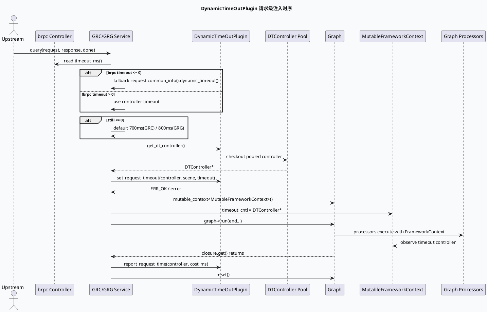
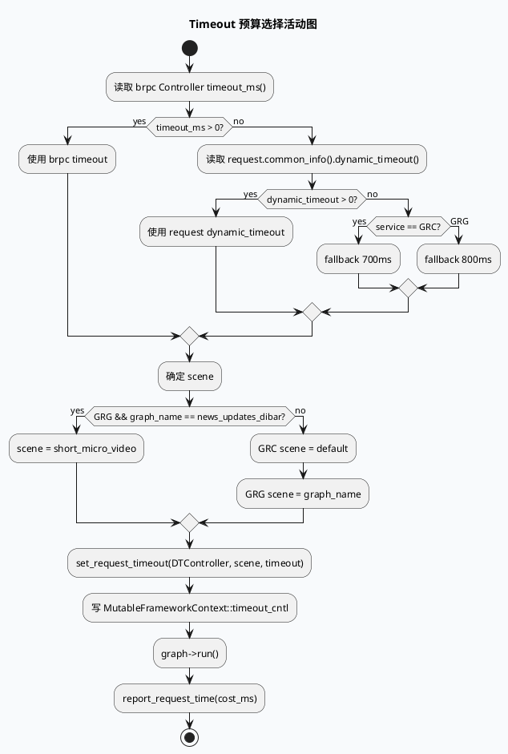

# DynamicTimeOutPlugin 动态超时注入与场景映射

> 日期：2026-05-30  
> 主题来源：`notes/weekly-topic-selection/daily-plan-20260529.json` 的 `sat.base_lib` 计划项  
> 范围：GRC/GRG 服务入口中 DynamicTimeOutPlugin 的 controller 获取、上游 timeout 选择、scene 映射、FrameworkContext 注入与请求耗时回报。  
> 内网文档：今日计划未提供 KU URL/doc-id；当前 `ku-doc-manage` 不支持全站 keyword search，因此本文用代码库检索结果替代，相关业务语义需人工补充。

---

## 0. 架构全景图

<div class="arch-wrapper dt-arch"><style scoped>.dt-arch{font-family:-apple-system,BlinkMacSystemFont,'Segoe UI',Roboto,sans-serif;background:#f8fafc;border:1px solid #dbe4ee;border-radius:14px;padding:22px;margin:16px 0;color:#172033}.dt-arch .arch-title{font-size:18px;font-weight:800;margin-bottom:14px}.dt-arch .arch-layer{border-radius:10px;padding:14px;margin:10px 0}.dt-arch .user{background:#dbeafe;border-left:5px solid #2563eb}.dt-arch .application{background:#dcfce7;border-left:5px solid #16a34a}.dt-arch .ai{background:#fef3c7;border-left:5px solid #d97706}.dt-arch .data{background:#fce7f3;border-left:5px solid #db2777}.dt-arch .infra{background:#ede9fe;border-left:5px solid #7c3aed}.dt-arch .arch-layer-title{font-size:13px;font-weight:800;margin-bottom:8px}.dt-arch .arch-grid{display:grid;grid-template-columns:repeat(4,minmax(0,1fr));gap:8px}.dt-arch .arch-box{background:rgba(255,255,255,.84);border:1px solid rgba(15,23,42,.08);border-radius:8px;padding:9px;font-size:12px;line-height:1.35}.dt-arch .arch-box.highlight{border:2px solid #d97706;background:#fff7ed;font-weight:800}.dt-arch small{display:block;color:#64748b;margin-top:3px}</style><div class="arch-title">Dynamic Timeout 在 Graph-Engine 服务中的位置</div><div class="arch-layer user"><div class="arch-layer-title">① RPC / Request Layer</div><div class="arch-grid"><div class="arch-box">brpc Controller<small>`cntl->timeout_ms()`</small></div><div class="arch-box">GRCRequest.common_info<small>`dynamic_timeout()`</small></div><div class="arch-box">GRC graph name<small>default / video_immersion / searchc...</small></div><div class="arch-box">GRG graph name<small>default / short_micro_video / news_updates_dibar</small></div></div></div><div class="arch-layer application"><div class="arch-layer-title">② Service Entry Layer</div><div class="arch-grid"><div class="arch-box">GRC `query()`<small>取图 + req info 注入</small></div><div class="arch-box highlight">GRC `run()`<small>timeout fallback = 700ms</small></div><div class="arch-box">GRG `query()`<small>取图 + dt controller</small></div><div class="arch-box highlight">GRG `fill_basic_data_for_graph()`<small>timeout fallback = 800ms</small></div></div></div><div class="arch-layer ai"><div class="arch-layer-title">③ DynamicTimeOutPlugin Layer</div><div class="arch-grid"><div class="arch-box">ApplicationContext::get<DynamicTimeOutPlugin>()<small>构造期获取插件</small></div><div class="arch-box">get_dt_controller()<small>池化 DTController</small></div><div class="arch-box highlight">set_request_timeout(scene, timeout)<small>按场景注册预算</small></div><div class="arch-box">report_request_time()<small>请求结束上报耗时</small></div></div></div><div class="arch-layer data"><div class="arch-layer-title">④ Graph Context / DAG Runtime</div><div class="arch-grid"><div class="arch-box">MutableFrameworkContext<small>`timeout_cntl` 指针</small></div><div class="arch-box">FrameworkContext<small>processor 读取超时状态</small></div><div class="arch-box">GraphData global depends<small>Request/log_id/ua/ExpInfo</small></div><div class="arch-box">graph->run(...).get()<small>阻塞等待 DAG 完成</small></div></div></div><div class="arch-layer infra"><div class="arch-layer-title">⑤ Lifecycle Boundary</div><div class="arch-grid"><div class="arch-box">GraphPool::try_get()<small>池化图实例</small></div><div class="arch-box">closure.get / send_response<small>等待或先发送响应</small></div><div class="arch-box">graph->reset()<small>复用图前清理 GraphData</small></div><div class="arch-box highlight">controller lifetime<small>不能跨 reset 后引用</small></div></div></div></div>

---

## 1. 关键结论

DynamicTimeOutPlugin 在 GRC 和 GRG 都不是普通业务 processor，而是服务入口在每个请求开始时从插件池取出 `DTController`，再把它挂到 Graph 的 `MutableFrameworkContext::timeout_cntl`。后续 Graph Processor / ExecEngine 看到的超时状态来自这个 context 指针，而不是直接读取 brpc controller。

两层服务的差异主要有三点：

1. **默认预算不同**：GRC fallback 为 `700ms`，GRG fallback 为 `800ms`。
2. **scene 映射不同**：GRC 当前固定写 `scene = "default"`；GRG 使用 `graph_name` 作为 scene，并将 `news_updates_dibar` 映射成 `short_micro_video`。
3. **注入位置不同**：GRC 在 `run()` 中注入 timeout；GRG 在 `fill_basic_data_for_graph()` 中注入 timeout，然后 `run()` 只负责执行与上报。

---

## 2. 核心调用链



### GRC 入口

GRC 构造函数在服务对象创建时通过 `ApplicationContext::instance().get<DynamicTimeOutPlugin>()` 保存插件指针；请求进入后先初始化 `GRCSessionContext`，再按 UA 选择 graph name 并 `try_get(graph_name)`。真正的 timeout 注入在 `GenericGRCService::run()` 中完成：

| 步骤 | 证据 | 说明 |
|---|---|---|
| 插件获取 | `src/service/grc_service.cpp:56-57` | 构造期从 ApplicationContext 取 `DynamicTimeOutPlugin`。 |
| 图选择 | `src/service/grc_service.cpp:177-199` | 依据 UA 选择 `default/video_immersion/searchc_related/...` 图。 |
| controller 获取 | `src/service/grc_service.cpp:233-244` | 每请求从插件池取 `DTController`，空指针则设置错误。 |
| timeout 选择 | `src/service/grc_service.cpp:245-250` | `cntl->timeout_ms()` → request `dynamic_timeout()` → `700`。 |
| scene 注入 | `src/service/grc_service.cpp:253-264` | 当前固定 `scene = "default"`。 |
| context 注入 | `src/service/grc_service.cpp:266-270` | 写入 `MutableFrameworkContext::timeout_cntl`。 |
| 耗时上报 | `src/service/grc_service.cpp:319-320` | 图结束后 `report_request_time()`。 |

### GRG 入口

GRG 的 timeout 注入更靠前：`query()` 中拿到图和 DTController 后，在 `fill_basic_data_for_graph()` 中同时写 global GraphData 与动态超时 context。其 scene 与 graph_name 强绑定：

| 步骤 | 证据 | 说明 |
|---|---|---|
| 插件获取 | `src/service/grg_service.cpp:30-33` | 构造期获取 `DynamicTimeOutPlugin`。 |
| graph_name 选择 | `src/service/grg_service.cpp:113-120` | UA 85/87/123 → `short_micro_video`，UA 102 → `news_updates_dibar`，其他 `default`。 |
| controller 获取 | `src/service/grg_service.cpp:64-78` | `try_get(graph_name)` 后取 DTController。 |
| timeout 选择 | `src/service/grg_service.cpp:177-185` | `cntl->timeout_ms()` → request `dynamic_timeout()` → `800`。 |
| scene 映射 | `src/service/grg_service.cpp:186-190` | scene = graph_name；`news_updates_dibar` 改写为 `short_micro_video`。 |
| context 注入 | `src/service/grg_service.cpp:196-200` | 写入 `MutableFrameworkContext::timeout_cntl`。 |
| 耗时上报 | `src/service/grg_service.cpp:218-221` | `graph->run()` 返回后上报图运行耗时。 |

---

## 3. GRC vs GRG 行为差异信息图

```infographic
infographic compare-binary-horizontal-underline-text-vs
data
  title DynamicTimeOutPlugin 注入差异
  items
    - label GRC
      children
        - label timeout fallback 700ms
        - label scene 固定 default
        - label run() 内 set_request_timeout
        - label 先 emit_common_data 再 graph->run
        - label report 使用 sctx end-begin
    - label GRG
      children
        - label timeout fallback 800ms
        - label scene 基于 graph_name
        - label news_updates_dibar 复用 short_micro_video scene
        - label fill_basic_data_for_graph() 内注入
        - label report 使用 graph run elapsed
```

---

## 4. Timeout 决策模型



---

## 5. 配置/结构观察

```infographic
infographic list-grid-badge-card
data
  title 排查动态超时时的 6 个观察点
  desc 从入口预算到图内消费的最小证据集
  items
    - label Plugin 是否存在
      desc 检查 ApplicationContext 是否成功返回 DynamicTimeOutPlugin
    - label Controller 是否取到
      desc get_dt_controller 返回空会直接失败或 FATAL
    - label Timeout 来源
      desc brpc timeout 优先，其次 request dynamic_timeout，最后服务默认值
    - label Scene 名称
      desc GRC 固定 default，GRG 按 graph_name 并折叠 news_updates_dibar
    - label Context 注入
      desc 必须写 MutableFrameworkContext::timeout_cntl 后图内节点才可感知
    - label Request Time 上报
      desc 结束后 report_request_time 影响后续动态预算学习
```

---

## 6. Pitfalls 卡片

<div class="card-frame dt-card"><style scoped>.dt-card{font-family:-apple-system,BlinkMacSystemFont,'Segoe UI',Roboto,sans-serif;margin:18px 0}.dt-card .card{background:#f5f7fa;border:1px solid #cbd5e1;border-radius:16px;padding:28px;color:#263244;box-shadow:0 10px 24px rgba(15,23,42,.06)}.dt-card .card-meta{font-size:11px;font-weight:800;letter-spacing:.12em;text-transform:uppercase;color:#3d5a80}.dt-card .card-title{font-size:30px;line-height:1.1;font-weight:900;letter-spacing:-.02em;margin:8px 0 12px}.dt-card .card-subtitle{font-size:15px;line-height:1.6;color:#475569;max-width:760px}.dt-card .card-grid{display:grid;grid-template-columns:2fr 1fr;gap:16px;margin-top:18px}.dt-card .card-panel{background:rgba(255,255,255,.72);border-top:5px solid #3d5a80;border-radius:10px;padding:16px}.dt-card .card-panel.light{border-top-width:2px;background:#eef2f7}.dt-card .card-panel-title{font-size:12px;font-weight:900;text-transform:uppercase;letter-spacing:.08em;color:#263244;margin-bottom:8px}.dt-card .card-panel-text{font-size:14px;line-height:1.65;color:#334155;margin:0}.dt-card .card-highlight{border-left:5px solid #3d5a80;padding-left:12px;font-size:18px;font-weight:800;color:#1e293b;margin:12px 0}.dt-card code{background:#e2e8f0;border-radius:4px;padding:1px 4px}</style><div class="card"><div class="card-meta">Pitfall / Dynamic Timeout</div><div class="card-title">不要把 timeout 当成普通 request 字段</div><div class="card-subtitle">在 graph-engine 服务中，真正被下游节点感知的预算是挂在 <code>MutableFrameworkContext::timeout_cntl</code> 上的 DTController。只检查 request 里的 dynamic_timeout，无法判断图内节点是否已经获得超时控制器。</div><div class="card-grid"><div class="card-panel"><div class="card-panel-title">核心风险</div><p class="card-panel-text">如果 <code>set_request_timeout()</code> 成功但没有写入 <code>timeout_cntl</code>，图内 processor 可能无法感知预算；如果 scene 映射错误，动态超时插件可能把请求统计归入错误场景，导致后续预算学习偏移。</p><p class="card-highlight">scene 是预算策略的一部分</p></div><div class="card-panel light"><div class="card-panel-title">调试提示</div><p class="card-panel-text">先看服务入口三件事：controller 是否非空、scene 是否符合预期、report_request_time 是否执行。不要从某个 processor 的超时表现反推入口一定正确。</p></div></div></div></div>

---

## 7. 调试 Checklist

```infographic
infographic list-column-done-list
data
  title Dynamic Timeout 调试 Checklist
  items
    - label 确认服务构造期拿到 DynamicTimeOutPlugin
      done true
    - label 确认每次请求 get_dt_controller 返回非空
      done true
    - label 记录 brpc timeout 与 request dynamic_timeout 的最终选择
      done true
    - label 检查 GRG scene 是否从 news_updates_dibar 折叠到 short_micro_video
      done true
    - label 检查 MutableFrameworkContext::timeout_cntl 是否在 graph->run 前写入
      done true
    - label 检查异常分支是否仍会 graph reset 且不会复用悬挂 controller
      done false
    - label 若要解释预算收敛，补充 DynamicTimeOutPlugin 配置/KU 文档
      done false
```

---

## 8. 证据来源

- `src/service/grc_service.cpp:56-57`：GRC 构造期获取 `DynamicTimeOutPlugin`。
- `src/service/grc_service.cpp:177-211`：GRC 图选择、GraphPool 取图、运行入口。
- `src/service/grc_service.cpp:233-270`：GRC 获取 DTController、选择 timeout、固定 scene、注入 `MutableFrameworkContext`。
- `src/service/grc_service.cpp:293-320`：GRC `graph->run()` 与 request time 上报。
- `src/service/grg_service.cpp:30-33`：GRG 构造期获取 `DynamicTimeOutPlugin`。
- `src/service/grg_service.cpp:64-91`：GRG 取图、取 DTController、填充图数据、运行并 reset。
- `src/service/grg_service.cpp:113-120`：GRG UA 到 graph_name 映射。
- `src/service/grg_service.cpp:177-200`：GRG timeout fallback、scene 映射与 context 注入。
- `src/service/grg_service.cpp:218-221`：GRG `graph->run()` 后上报耗时。

---

## 9. 需人工补充

- DynamicTimeOutPlugin 的配置文件、scene 策略与预算学习算法未在当前服务仓库中展开；今日计划也未提供 KU URL/doc-id。若需要解释“为什么某 scene 的预算是某个值”，需要补充插件实现仓库或内部文档。