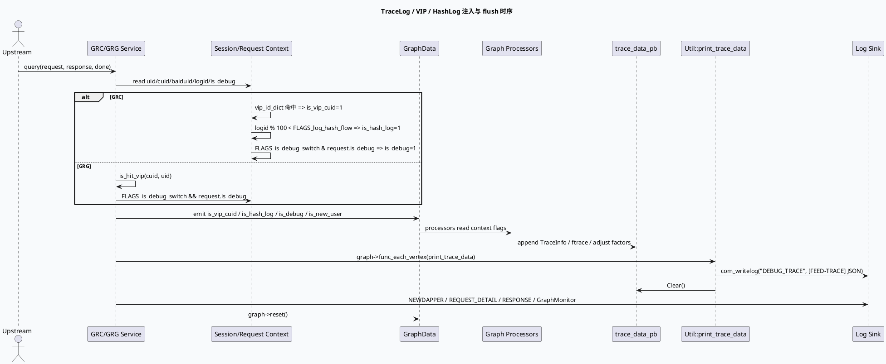

# TraceLog / VIP / HashLog 采样与业务日志分层

> 日期：2026-05-31  
> 主题来源：`notes/weekly-topic-selection/daily-plan-20260529.json` 的 `sun.base_lib` 计划项  
> 范围：GRC/GRG 服务入口对 `is_debug`、`is_vip_cuid`、`is_hash_log` 的注入，`Util::print_trace_data()` 的 DEBUG_TRACE 输出，以及 GraphMonitor/NEWDAPPER/业务明细日志的分层。  
> 内网文档：今日计划未提供 KU URL/doc-id；当前未执行全站 KU 正文检索，本文以代码库检索结果为主，业务语义需人工补充。

---

## 0. 架构全景图

<div class="arch-wrapper trace-arch"><style scoped>.trace-arch{font-family:-apple-system,BlinkMacSystemFont,'Segoe UI',Roboto,sans-serif;background:#f8fafc;border:1px solid #dbe4ee;border-radius:14px;padding:22px;margin:16px 0;color:#172033}.trace-arch .arch-title{font-size:18px;font-weight:900;margin-bottom:14px}.trace-arch .arch-layer{border-radius:10px;padding:14px;margin:10px 0}.trace-arch .user{background:#dbeafe;border-left:5px solid #2563eb}.trace-arch .application{background:#dcfce7;border-left:5px solid #16a34a}.trace-arch .ai{background:#fef3c7;border-left:5px solid #d97706}.trace-arch .data{background:#fce7f3;border-left:5px solid #db2777}.trace-arch .infra{background:#ede9fe;border-left:5px solid #7c3aed}.trace-arch .arch-layer-title{font-size:13px;font-weight:800;margin-bottom:8px}.trace-arch .arch-grid{display:grid;grid-template-columns:repeat(4,minmax(0,1fr));gap:8px}.trace-arch .arch-box{background:rgba(255,255,255,.86);border:1px solid rgba(15,23,42,.08);border-radius:8px;padding:9px;font-size:12px;line-height:1.35}.trace-arch .arch-box.highlight{border:2px solid #d97706;background:#fff7ed;font-weight:800}.trace-arch small{display:block;color:#64748b;margin-top:3px}</style><div class="arch-title">Trace / VIP / HashLog 在 Graph-Engine 请求中的分层</div><div class="arch-layer user"><div class="arch-layer-title">① Request Sampling Inputs</div><div class="arch-grid"><div class="arch-box">`common_info.is_debug()`<small>端上或上游显式 debug</small></div><div class="arch-box">`vip_id_dict` / `d_target_cuid`<small>白名单用户或 UID/CUID</small></div><div class="arch-box">`logid % 100`<small>HashLog 低比例采样</small></div><div class="arch-box">UA / flow_loc / SID<small>决定图与实验日志上下文</small></div></div></div><div class="arch-layer application"><div class="arch-layer-title">② Service Entry Injection</div><div class="arch-grid"><div class="arch-box highlight">GRC `GRCSessionContext::init()`<small>计算 debug/vip/hash/new_user</small></div><div class="arch-box">GRC `emit_common_data()`<small>写入 GraphData</small></div><div class="arch-box highlight">GRG `fill_basic_data_for_graph()`<small>写入 is_vip_cuid / is_debug</small></div><div class="arch-box">GRG `Context`<small>保留 is_hash_log 接口</small></div></div></div><div class="arch-layer ai"><div class="arch-layer-title">③ Graph Processor Trace Producers</div><div class="arch-grid"><div class="arch-box">`trace_data_pb`<small>processor 写入 TraceInfo</small></div><div class="arch-box">`ftrace.cpp`<small>调权因子与 LCN 轨迹</small></div><div class="arch-box">Adjust Engine<small>VIP 精排因子 DEBUG_TRACE</small></div><div class="arch-box">GraphMonitor<small>关键路径与 vertex cost</small></div></div></div><div class="arch-layer data"><div class="arch-layer-title">④ Log Sinks / Observability</div><div class="arch-grid"><div class="arch-box highlight">`DEBUG_TRACE`<small>[FEED-TRACE] JSON trace</small></div><div class="arch-box">`REQUEST_DETAIL` / `RESPONSE`<small>VIP 请求/响应明细</small></div><div class="arch-box">`NEWDAPPER`<small>final_path 长尾路径</small></div><div class="arch-box">Bvar / SIA<small>大小、耗时与模块归因</small></div></div></div></div>

---

## 1. 关键结论

Trace 日志不是一个单点开关，而是由 **采样标记注入 → GraphData 传播 → processor 写 trace → service 尾部统一 flush** 组成的链路：

1. **GRC 的采样入口最完整**：`GRCSessionContext::init()` 同时计算 `is_vip_cuid`、`is_hash_log`、`is_debug`、`is_new_user`，再由 `emit_common_data()` 注入到图中。
2. **GRG 偏向服务入口日志与最终路径日志**：`fill_basic_data_for_graph()` 注入 `is_vip_cuid` 和 `is_debug`；`Context` 有 `is_hash_log` 字段接口，但当前服务入口未看到对 `is_hash_log` 的填充。
3. **DEBUG_TRACE 是结构化 trace 的统一落点**：GRC/GRG 的 `Util::print_trace_data()` 都将 `trace_data_pb` 转 JSON 后写入 `DEBUG_TRACE`，并在写完后 `Clear()`，避免对象池复用导致串包。
4. **VIP 日志更重，HashLog 更轻**：VIP 会触发请求/响应明细、精排因子等重日志；HashLog 主要用于抽样打开更多 ftrace/调权因子观察，避免全流量成本。

---

## 2. 核心流程图



### GRC 入口与采样

| 机制 | 证据 | 说明 |
|---|---|---|
| VIP 命中 | `src/common/session_context.cpp:62-70` | 从 `vip_id_dict` 读取白名单，命中 CUID 或 UID 时置 `_is_vip_cuid = 1`。 |
| HashLog 采样 | `src/common/session_context.cpp:21-23`, `src/common/session_context.cpp:72-74` | `FLAGS_log_hash_flow` 默认 5，即 `logid % 100 < 5` 的低比例抽样。 |
| Debug 开关 | `src/common/session_context.cpp:21`, `src/common/session_context.cpp:72-75` | `FLAGS_is_debug_switch & req_common_info.is_debug()` 共同决定。 |
| 图数据注入 | `src/service/grc_service.cpp:129-148` | 将 `is_debug`、`is_vip_cuid`、`is_hash_log`、`is_new_user`、`ExpInfo` 写入 GraphData。 |
| 尾部 flush | `src/service/grc_service.cpp:213-220`, `src/service/grc_service.cpp:345-440` | Debug/VIP/HashLog 命中时打印 trace；同时输出 GraphMonitor/NEWDAPPER。 |

### GRG 入口与日志

| 机制 | 证据 | 说明 |
|---|---|---|
| VIP 命中 | `src/service/grg_service.cpp:153-154`, `src/service/grg_service.cpp:361-374` | 通过 `d_target_cuid` common dict 分别查 CUID/UID。 |
| Debug 注入 | `src/service/grg_service.cpp:162-163` | `FLAGS_is_debug_switch && request->common_info().is_debug()`。 |
| Trace flush | `src/service/grg_service.cpp:302-305`, `src/util/util.cpp:125-158` | 每次打印服务日志后对所有 vertex 执行 `Util::print_trace_data()`。 |
| VIP 响应明细 | `src/service/grg_service.cpp:295-300` | VIP 用户会将 response JSON 写入 `RESPONSE`。 |
| NEWDAPPER 路径 | `src/service/grg_service.cpp:326-355` | 仅 UA 85/87/123 上传/打印 graph path 与 vertex cost。 |

---

## 3. 配置/结构信息图

```infographic
infographic list-grid-badge-card
data
  title Trace 采样信号速览
  desc 哪些信号会打开更重的日志路径
  items
    - label is_debug
      desc 上游请求 debug 且服务 flag 开启；用于 microvideo_debug appId
      icon mdi/bug-check
    - label is_vip_cuid
      desc 白名单 CUID/UID；触发请求/响应明细与调权因子日志
      icon mdi/account-star
    - label is_hash_log
      desc GRC 中按 logid 百分比抽样；默认约 5%
      icon mdi/dice-5
    - label is_new_user
      desc GRC 从 first_visit_info 解析；参与 trace scene_type
      icon mdi/account-plus
```

```infographic
infographic sequence-timeline-simple
data
  title 一次请求的可观测层级
  desc 从轻量 NOTICE 到重型 DEBUG_TRACE 的递进
  items
    - time L0
      label NOTICE / BLOG
      desc logid、ua、sid、cost、errno、graph_name 等基础日志
    - time L1
      label SIA / Bvar
      desc 模块耗时、请求/响应大小、RPC 耗时
    - time L2
      label GraphMonitor / NEWDAPPER
      desc final_path、vertex cost、长尾路径定位
    - time L3
      label DEBUG_TRACE
      desc TraceInfo JSON、调权因子、LCN/ftrace 明细
    - time L4
      label VIP Detail
      desc REQUEST_DETAIL / RESPONSE 全量 JSON，成本最高
```

---

## 4. 关键实现细节

### 4.1 `DEBUG_TRACE` 的生命周期

GRC 与 GRG 的 `Util::print_trace_data()` 逻辑高度相似：遍历 `trace_data_pb`，过滤无数据项，调用 `ProtoMessageToJson()`，格式化 `[FEED-TRACE]` 行，写入 `DEBUG_TRACE`，最后 `Clear()`。这里的 `Clear()` 很关键，因为 Graph 对象池复用后，如果 trace PB 没有清空，下一次请求可能携带上一轮的 trace 数据。

- GRC：`src/util/util.cpp:147-186`
- GRG：`src/util/util.cpp:125-158`

### 4.2 VIP 与 HashLog 的成本差异

VIP 日志面向定向排查，允许输出较大的 request/response JSON 和精排因子。HashLog 面向抽样排查，适合全量线上低比例观测。不要把 VIP 级别的明细直接搬到 HashLog 分支，否则会把低比例采样变成高成本日志放大器。

### 4.3 GRC 特有的调权因子输出

`ftrace.cpp` 在 debug/hash/vip/new_user 任一命中时，会补充 LCN、topic/category/author/tag/ip/vector 等调权轨迹；UA 87 还会输出若干排序位置 trace。该文件属于策略排查的“深水区”，适合针对单 logid 或 VIP 用户定点分析。

---

## 5. Pitfalls 卡片

<div class="card-frame trace-card"><style scoped>.trace-card{font-family:-apple-system,BlinkMacSystemFont,'Segoe UI',Roboto,sans-serif;margin:18px 0}.trace-card .card{background:#f5f7fa;border:1px solid #d8e0ea;border-radius:18px;padding:24px;color:#1f2937}.trace-card .card-meta{font-size:12px;letter-spacing:.08em;text-transform:uppercase;color:#3d5a80;font-weight:800}.trace-card .card-title{font-size:28px;line-height:1.1;font-weight:900;margin:8px 0 12px}.trace-card .card-grid{display:grid;grid-template-columns:2fr 1fr;gap:14px}.trace-card .card-panel{background:rgba(255,255,255,.78);border-top:4px solid #3d5a80;border-radius:10px;padding:14px;font-size:14px;line-height:1.65}.trace-card .card-panel strong{color:#172033}.trace-card .card-tag{display:inline-block;background:#e0e7ff;color:#3730a3;border-radius:999px;padding:3px 8px;margin:3px;font-size:12px;font-weight:700}</style><div class="card"><div class="card-meta">Pitfalls · Trace Logging</div><div class="card-title">最危险的不是没日志，而是日志级别混在一起</div><div class="card-grid"><div class="card-panel"><strong>复用风险：</strong>GraphPool 复用要求 trace PB 在打印后清空；否则 DEBUG_TRACE 会串到下一次请求。<br><strong>成本风险：</strong>VIP 明细可能包含完整 request/response JSON，不能扩大到普通 hash 采样。<br><strong>语义风险：</strong>GRG `Context` 有 `is_hash_log` 字段接口，但当前入口未看到显式填充，排查时不要假设所有 processor 都能读到有效 HashLog 标记。</div><div class="card-panel"><span class="card-tag">Clear trace PB</span><span class="card-tag">Limit VIP JSON</span><span class="card-tag">Check GraphData</span><span class="card-tag">Use logid</span></div></div></div></div>

---

## 6. 调试 checklist

```infographic
infographic list-column-done-list
data
  title Trace/VIP/HashLog 排查 checklist
  desc 从入口标记到最终日志落点逐层确认
  items
    - label 确认请求 logid、ua、uid/cuid/baiduid
      desc 用于判断 hash 采样、VIP 命中和 graph_name
      done true
    - label 检查 GRCSessionContext 或 GRG fill_basic_data 注入
      desc 确认 GraphData 中 is_debug/is_vip_cuid/is_hash_log 是否存在
      done true
    - label 定位 processor 是否写入 trace_data_pb
      desc 只有写入 TraceInfo 的 vertex 才会出 DEBUG_TRACE
      done false
    - label 检查 service 尾部是否调用 print_trace_data
      desc GRC 有条件打印，GRG 在 print_log 中统一打印
      done true
    - label 检查 trace PB 是否 Clear
      desc 防止 GraphPool 复用串日志
      done true
    - label 区分 DEBUG_TRACE、NEWDAPPER、REQUEST_DETAIL、RESPONSE
      desc 不同日志名对应不同成本和排查用途
      done false
```

---

## 7. 证据来源

- `src/common/session_context.cpp:21-23`：GRC debug/hash flag 定义。
- `src/common/session_context.cpp:62-75`：GRC VIP、HashLog、Debug、NewUser 计算。
- `src/service/grc_service.cpp:129-148`：GRC 将日志标记注入 GraphData。
- `src/service/grc_service.cpp:213-220`：GRC 条件触发 trace 打印与 graph reset。
- `src/service/grc_service.cpp:345-440`：GRC VIP 明细、GraphMonitor、NEWDAPPER、Dapper 上传。
- `src/processor/new_adjust/ftrace.cpp:64-119`：GRC ftrace 在 debug/hash/vip/new_user 下输出调权轨迹。
- `src/util/util.cpp:147-186`（GRC）：DEBUG_TRACE 输出与 trace PB 清理。
- `src/service/grg_service.cpp:153-163`：GRG VIP/debug 注入。
- `src/service/grg_service.cpp:295-305`：GRG VIP response 与 trace 打印。
- `src/service/grg_service.cpp:326-355`：GRG NEWDAPPER/GraphMonitor/Dapper。
- `src/service/grg_service.cpp:361-374`：GRG VIP dict 命中逻辑。
- `src/util/util.cpp:125-158`（GRG）：DEBUG_TRACE 输出与 trace PB 清理。
