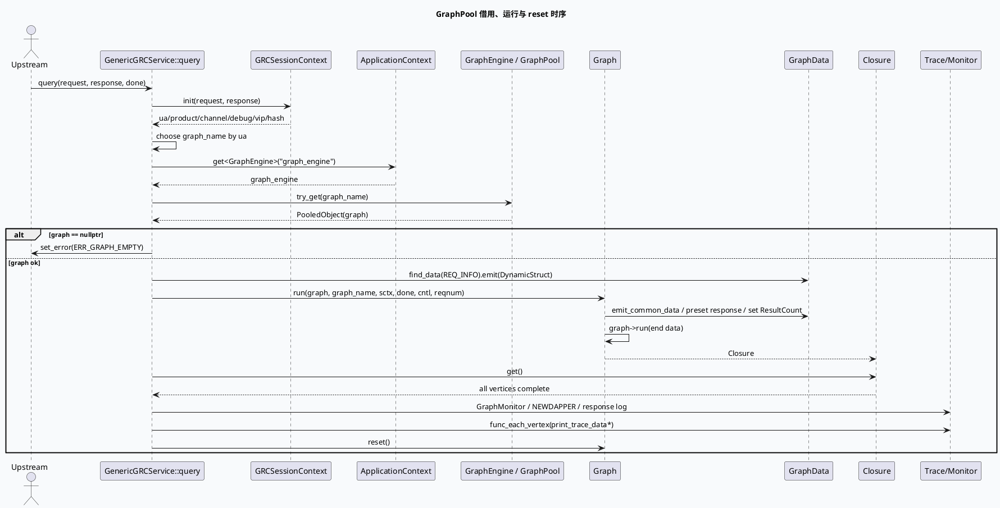

# GraphEngine GraphPool 对象池复用与 reset 生命周期

> 日期：2026-06-01  
> 主题来源：`notes/weekly-topic-selection/daily-plan-20260529.json` 的 `mon.base_lib` 计划项  
> 范围：GRC 服务入口 `GraphEngine::try_get()`、`Graph::run()`、`Closure::get()`、尾部 trace flush 与 `graph->reset()` 的完整生命周期；GRG 同类入口可按相同模式对照。  
> 内网文档：今日计划未提供 KU URL/doc-id；当前环境未发现可用 `ku` CLI，本文以代码库检索结果为主，GraphEngine 内部实现细节需人工补充。

---

## 0. 架构全景图

<div class="arch-wrapper graphpool-arch"><style scoped>.graphpool-arch{font-family:-apple-system,BlinkMacSystemFont,'Segoe UI',Roboto,sans-serif;background:#f8fafc;border:1px solid #dbe4ee;border-radius:14px;padding:22px;margin:16px 0;color:#172033}.graphpool-arch .arch-title{font-size:18px;font-weight:900;margin-bottom:14px}.graphpool-arch .arch-layer{border-radius:10px;padding:14px;margin:10px 0}.graphpool-arch .user{background:#dbeafe;border-left:5px solid #2563eb}.graphpool-arch .application{background:#dcfce7;border-left:5px solid #16a34a}.graphpool-arch .ai{background:#fef3c7;border-left:5px solid #d97706}.graphpool-arch .data{background:#fce7f3;border-left:5px solid #db2777}.graphpool-arch .infra{background:#ede9fe;border-left:5px solid #7c3aed}.graphpool-arch .arch-layer-title{font-size:13px;font-weight:800;margin-bottom:8px}.graphpool-arch .arch-grid{display:grid;grid-template-columns:repeat(4,minmax(0,1fr));gap:8px}.graphpool-arch .arch-box{background:rgba(255,255,255,.86);border:1px solid rgba(15,23,42,.08);border-radius:8px;padding:9px;font-size:12px;line-height:1.35}.graphpool-arch .arch-box.highlight{border:2px solid #d97706;background:#fff7ed;font-weight:800}.graphpool-arch small{display:block;color:#64748b;margin-top:3px}</style><div class="arch-title">GraphPool 单请求生命周期：借图 → 注入 → 求解 → 清理</div><div class="arch-layer user"><div class="arch-layer-title">① RPC Request</div><div class="arch-grid"><div class="arch-box">`GRCRequest`<small>common_info / reqnum / dynamic_timeout</small></div><div class="arch-box">`Controller`<small>logid / timeout / remote_side</small></div><div class="arch-box">`Closure done`<small>响应收尾回调</small></div><div class="arch-box">`GRCSessionContext`<small>解析 UA、product、debug、vip</small></div></div></div><div class="arch-layer application"><div class="arch-layer-title">② Service Entry</div><div class="arch-grid"><div class="arch-box highlight">`ApplicationContext::get&lt;GraphEngine&gt;("graph_engine")`<small>配置驱动获取图引擎</small></div><div class="arch-box highlight">`graph_engine->try_get(graph_name)`<small>从 GraphPool 借出可复用 Graph</small></div><div class="arch-box">`find_data(REQ_INFO)`<small>注入请求动态结构</small></div><div class="arch-box">`emit_common_data()`<small>写入 Request、SID、用户、日志标记</small></div></div></div><div class="arch-layer ai"><div class="arch-layer-title">③ Graph Runtime</div><div class="arch-grid"><div class="arch-box">`FrameworkContext.timeout_cntl`<small>动态超时对象随图上下文传播</small></div><div class="arch-box">`GraphData preset/emit`<small>ResponseForGrg / ResData / ResultCount</small></div><div class="arch-box highlight">`graph->run(end)`<small>按 UA 选择终点数据求解</small></div><div class="arch-box">`closure.get()`<small>阻塞等待所有依赖完成</small></div></div></div><div class="arch-layer data"><div class="arch-layer-title">④ Observability Before Reset</div><div class="arch-grid"><div class="arch-box">`print_trace_data`<small>debug/vip/hash 命中时输出 DEBUG_TRACE</small></div><div class="arch-box">`print_trace_data_common_adjust`<small>调权因子链路日志</small></div><div class="arch-box">GraphMonitor / NEWDAPPER<small>耗时、返回量、错误码</small></div><div class="arch-box highlight">`graph->reset()`<small>清理 GraphData 与 VertexContext，归还池化对象前的关键步骤</small></div></div></div></div>

---

## 1. 关键结论

1. **GraphPool 不是“每请求 new graph”**：服务入口通过 `ApplicationContext` 获取 `GraphEngine`，再按 `graph_name` 调用 `try_get()` 借出池化 `Graph`；这要求请求内写入的 `GraphData`、`VertexContext`、trace protobuf 都必须在请求末尾清理。
2. **图名选择发生在请求上下文初始化之后、图获取之前**：GRC 按 `ua` 映射 `default`、`video_immersion`、`searchc_related` 等图，图名错误会直接影响终点 `GraphData` 与处理链路。
3. **`reset()` 必须晚于 trace flush**：代码先 `graph->func_each_vertex(&Util::print_trace_data)` / `print_trace_data_common_adjust`，再 `graph->reset()`；如果顺序反了，trace 数据会被清空，排障证据消失。
4. **悬挂引用风险集中在 reset 之后**：任何 `GraphData::emit()` 出来的指针、`DynamicStruct` 引用、`GraphVertex` 上下文都只应在 `Closure::get()` 完成且 `graph->reset()` 前使用。

---

## 2. 核心流程图



---

## 3. 配置/结构信息图

```infographic
infographic sequence-ascending-steps
data
  title GraphPool 生命周期检查点
  desc 每个检查点都对应一次可观测的代码/日志行为；排查串包、脏数据、超时时按顺序确认
  items
    - label 1. Context init
      desc `GRCSessionContext::init` 成功后才允许选图；失败直接 set_error
      icon mdi/account-cog
    - label 2. Graph name
      desc UA 映射到 default / video_immersion / searchc_related 等图名
      icon mdi/source-branch
    - label 3. try_get
      desc `GraphPool::PooledObject` 持有本次请求借出的 Graph
      icon mdi/database-arrow-up
    - label 4. Data emit
      desc REQ_INFO、ResultCount、ResponseForGrg、ResData 写入 GraphData
      icon mdi/database-edit
    - label 5. run + get
      desc `graph->run(end)` 返回 Closure，`get()` 阻塞等待依赖完成
      icon mdi/play-circle
    - label 6. flush trace
      desc debug/vip/hash 命中时先输出 trace，再进行 reset
      icon mdi/text-search
    - label 7. reset
      desc 清理 GraphData / VertexContext，避免下次复用读到脏状态
      icon mdi/restore
```

### 图名与终点数据

| UA/场景 | graph_name | 终点数据 | 证据 |
|---|---|---|---|
| 默认小视频链路 | `default` | `GrcResponse` + `IsWritePersonalisedCacheSucc` | `src/service/grc_service.cpp:181-199`, `src/service/grc_service.cpp:292-309` |
| `ua == 85` | `video_immersion` | `GrcResponse` | `src/service/grc_service.cpp:184-188`, `src/service/grc_service.cpp:292-309` |
| 搜 C 相关 | `searchc_related` / `searchc_immersive_related` | `GrcResponse` | `src/service/grc_service.cpp:188-192`, `src/service/grc_service.cpp:297-299` |
| 二跳落地页合集 | graph_name 默认但终点切到 `ClusterData` | `ClusterData` | `src/service/grc_service.cpp:300-302` |
| 兴趣卡 | `interest_card` | `InterestCardData` | `src/service/grc_service.cpp:194-195`, `src/service/grc_service.cpp:303-305` |

---

## 4. Pitfalls 卡片

<div class="card-frame graphpool-card"><style scoped>.graphpool-card{font-family:-apple-system,BlinkMacSystemFont,'Segoe UI',Roboto,sans-serif;margin:18px 0}.graphpool-card .card{background:#fff7ed;border:1px solid #fed7aa;border-radius:16px;padding:22px;color:#1f2937;box-shadow:0 8px 24px rgba(15,23,42,.06)}.graphpool-card .card-meta{font-size:12px;font-weight:800;letter-spacing:.08em;text-transform:uppercase;color:#c2410c}.graphpool-card .card-title{font-size:28px;font-weight:900;letter-spacing:-.02em;margin:6px 0 12px}.graphpool-card .card-grid{display:grid;grid-template-columns:2fr 1fr;gap:14px}.graphpool-card .card-panel{background:rgba(255,255,255,.72);border-top:4px solid #ea580c;border-radius:10px;padding:13px;font-size:14px;line-height:1.65}.graphpool-card .card-highlight{border-left:5px solid #ea580c;padding-left:12px;font-weight:800}.graphpool-card code{background:#ffedd5;border-radius:4px;padding:1px 4px}</style><div class="card"><div class="card-meta">PITFALLS · POOLED GRAPH</div><div class="card-title">reset 不是收尾细节，而是复用边界</div><div class="card-grid"><div class="card-panel"><div class="card-highlight">只要 Graph 来自对象池，就必须假设所有请求态都会被下一次请求复用。</div><p>最危险的 bug 不是崩溃，而是“偶现串包”：某个 vertex 的 trace、response preset、动态超时对象或临时 context 没被清理，下一个请求在同一张 Graph 上读到旧值。</p></div><div class="card-panel"><b>排查优先级</b><br>① reset 是否执行<br>② reset 是否晚于日志 flush<br>③ VertexProcessor::reset 是否清自定义 context<br>④ reset 后是否仍持有 GraphData 指针</div></div></div></div>

---

## 5. 调试 checklist

```infographic
infographic list-column-done-list
data
  title GraphPool / reset 调试 checklist
  desc 适用于请求串包、trace 缺失、偶现超时、GraphData 脏值问题
  items
    - label 确认 graph_name
      desc 日志中 UA 与 graph_name 是否匹配预期；错误图会导致终点数据或依赖不同
      done false
    - label 确认 try_get 返回值
      desc `graph == nullptr` 时应走 ERR_GRAPH_EMPTY，而不是继续访问 GraphData
      done false
    - label 确认 timeout_cntl 生命周期
      desc `DynamicTimeOutPlugin::get_dt_controller()` 的对象必须覆盖 `graph->run()` 全过程
      done false
    - label 确认 Closure::get 已完成
      desc reset 前必须等待异步 vertex 全部完成，避免并发访问已清理 GraphData
      done false
    - label 确认 trace flush 顺序
      desc `print_trace_data*` 必须在 `graph->reset()` 前执行
      done false
    - label 确认 processor reset
      desc 自定义 `VertexContext`、pb、map/vector 缓存应在 processor reset 中清理
      done false
    - label 禁止 reset 后继续使用指针
      desc `emit<T>()`、`mutable_value<T>()`、`GraphData*` 不要逃逸到 reset 之后
      done false
```

---

## 6. 证据来源

- `src/service/grc_service.cpp:177-211`：获取 `GraphEngine`、按 UA 选择 `graph_name`、`try_get()`、注入 `REQ_INFO`、进入 `run()`。
- `src/service/grc_service.cpp:233-281`：动态超时控制器写入 `FrameworkContext`，公共数据与 `ResultCount` 注入。
- `src/service/grc_service.cpp:292-315`：按 UA 选择终点 `GraphData`，调用 `graph->run()` 并 `Closure::get()`。
- `src/service/grc_service.cpp:213-220`：trace flush 与 `graph->reset()` 的顺序。
- `src/processor/fill_meta.cpp:691-699`：processor reset 清理自定义上下文中的 `gcms_common_pb_meta_map`，体现池化图对 processor reset 的要求。

---

## 七、业务代码库适配分析
> **分析时间**：2026-06-20T19:02:33.739690
> **目标代码库**：feeda-mv-grg（序列生成）、feeda-mv-grc（召回汇聚）

## 业务代码库适配分析：GraphEngine GraphPool 复用与 `reset()` 生命周期

### 1. 分析摘要

- 从扫描结果看，`feeda-mv-grg` 与 `feeda-mv-grc` 两个业务代码库均已接入 GraphEngine / GraphPool 相关能力，目标使用点集中在服务入口与全局初始化文件中。其中，`feeda-mv-grc` 的使用路径与本技术笔记中的 GRC 服务入口高度一致，核心文件包括 `service/grc_service.cpp`、`service/grc_http_service.cpp`、`initializer/global.h`；`feeda-mv-grg` 也存在同类入口，主要分布在 `service/grg_service.cpp`、`service/grg_http_service.cpp`、`init/global.h`，适合按 GRC 模式做生命周期对齐检查。

- 两个代码库中 `std::vector`、`std::string`、`std::unordered_map` 使用规模较大，说明业务侧存在大量请求态容器、动态上下文、候选集和中间结果缓存。对于 GraphPool 场景，迁移/优化重点不在于简单替换 STL 容器，而在于确保这些请求态数据不会跨请求残留：即 `GraphData`、`VertexContext`、trace protobuf、自定义 map/vector 缓存必须在 `Closure::get()` 后、对象归还前被正确 flush 与 `reset()`。整体来看，`feeda-mv-grc` 的适配收益更高、风险也更集中；`feeda-mv-grg` 可复用同一套检查规则。

---

### 2. 代码库详情

#### feeda-mv-grg

- 已发现 GraphEngine / GraphPool 相关目标使用点共 3 个文件：
  - `service/grg_http_service.cpp`
  - `service/grg_service.cpp`
  - `init/global.h`

- 现有 STL 等价物使用规模：
  - `std::vector`：1969 次，分布在 356 个文件
  - `std::string`：2443 次，分布在 425 个文件
  - `std::unordered_map`：734 次，分布在 205 个文件

- 典型代码场景：
  - `model/model.h`
    - `predict(std::vector<RidTmpInfoPtr>& candidate_vec, uint32_t pos)` 以引用方式传递候选集。
    - 该类接口大概率处于请求处理链路中，需要确认 `candidate_vec` 的生命周期是否只在单次请求内有效。
  - `model/paddle_model.h`
    - `predict_with_tensor_input(std::vector<RidTmpInfoPtr>& candidate_vec, ...) const`
    - 模型预测侧大量依赖候选集 vector，若这些数据来自 GraphData 或 VertexContext，需要避免在 `graph->reset()` 后继续访问。
  - `service/grg_service.cpp`
    - 作为 GRG 服务主入口，应重点检查是否存在与 GRC 一致的调用顺序：
      - 获取 `GraphEngine`
      - `try_get(graph_name)`
      - 注入请求数据
      - `graph->run(end)`
      - `closure.get()`
      - trace / monitor flush
      - `graph->reset()`

- 初步判断：
  - `feeda-mv-grg` 已经具备接入 GraphPool 生命周期管理的基础。
  - 适配重点是对服务入口、模型预测候选集、processor 自定义上下文进行 reset 边界审计，而不是大规模改造容器类型。

#### feeda-mv-grc

- 已发现 GraphEngine / GraphPool 相关目标使用点共 3 个文件：
  - `service/grc_http_service.cpp`
  - `service/grc_service.cpp`
  - `initializer/global.h`

- 现有 STL 等价物使用规模：
  - `std::vector`：8426 次，分布在 1273 个文件
  - `std::string`：7150 次，分布在 1228 个文件
  - `std::unordered_map`：2833 次，分布在 638 个文件

- 典型代码场景：
  - `service/grc_service.cpp`
    - 与技术笔记中的主流程直接对应，是 GraphPool 生命周期的核心适配文件。
    - 已知关键流程包括：
      - 通过 `ApplicationContext::get<GraphEngine>("graph_engine")` 获取图引擎。
      - 按 UA 选择 `graph_name`，如 `default`、`video_immersion`、`searchc_related`、`interest_card` 等。
      - 调用 `graph_engine->try_get(graph_name)` 获取池化 Graph。
      - 注入 `REQ_INFO`、`ResultCount`、`ResponseForGrg`、`ResData` 等请求态数据。
      - `graph->run(end)` 后通过 `Closure::get()` 等待依赖完成。
      - 在 `graph->reset()` 前执行 trace flush。
  - `service/grc_http_service.cpp`
    - 存在对 GraphEngine 图结构的访问，例如：
      ```cpp
      std::unordered_map<std::string, std::vector<int>> depend_map;
      auto &all_vertex = graph_engine->get_vertexs_message(graph_name);
      ```
    - 该场景偏图可视化、调试或 HTTP 查询接口，重点要确认 `get_vertexs_message(graph_name)` 返回引用的生命周期是否稳定，以及是否可能被运行态 reset 影响。
  - `initializer/global.h`
    - 通常负责全局对象注册或初始化，适合作为 GraphEngine 初始化配置、对象池容量、图配置加载路径的检查入口。
  - `src/processor/fill_meta.cpp`
    - 技术笔记中已有 `fill_meta.cpp:691-699` 的 processor reset 示例，可作为业务 processor reset 的参考模式：
      - 清理自定义上下文中的 map/vector/pb 缓存。
      - 避免池化 Graph 下一次复用时读到旧状态。

- 初步判断：
  - `feeda-mv-grc` 是本技术的主要落地点，已经具备较完整的 GraphPool 使用链路。
  - 迁移潜力主要体现在：
    - 补齐所有 processor 的 reset 清理。
    - 统一 `try_get()` 空指针处理。
    - 固化 trace flush 与 `graph->reset()` 顺序。
    - 约束 `GraphData::emit()` 返回对象的逃逸行为。

---

### 3. 💡 适用性评估与建议

- **建议 1：以 `service/grc_service.cpp` 作为标准实现，固化 GraphPool 请求生命周期模板**
  - 适用文件：
    - `service/grc_service.cpp`
    - `service/grg_service.cpp`
  - 建议内容：
    - 将 GRC 中已经验证的顺序作为标准：
      1. 初始化 session context。
      2. 根据 UA / 场景选择 `graph_name`。
      3. `ApplicationContext::get<GraphEngine>("graph_engine")`。
      4. `graph_engine->try_get(graph_name)`。
      5. 注入 `REQ_INFO`、response、动态超时对象等 GraphData。
      6. `graph->run(end)`。
      7. `Closure::get()`。
      8. GraphMonitor / trace / NEWDAPPER flush。
      9. `graph->reset()`。
    - `service/grg_service.cpp` 可对照 `service/grc_service.cpp` 做一致性检查，尤其是 `Closure::get()` 与 `graph->reset()` 的相对顺序。
  - 预期收益：
    - 降低 GRG/GRC 两套入口生命周期不一致带来的偶现串包、trace 缺失、脏数据复用问题。

- **建议 2：在 `service/grc_http_service.cpp` 中区分“图结构元信息”和“请求态 GraphData”**
  - 适用文件：
    - `service/grc_http_service.cpp`
  - 已发现代码场景：
    ```cpp
    std::unordered_map<std::string, std::vector<int>> depend_map;
    auto &all_vertex = graph_engine->get_vertexs_message(graph_name);
    ```
  - 建议内容：
    - `get_vertexs_message(graph_name)` 返回的 `all_vertex` 如果是图配置/拓扑元信息，可以长期引用，但要避免与单请求 Graph 实例上的 `GraphData`、`VertexContext` 混用。
    - HTTP 调试接口中构造的 `depend_map`、`colors`、`sub_access_off_vec`、`sub_access_on_vec` 等容器应保持局部变量语义，不要挂到 Graph 或 processor context 上。
    - 如果后续为了性能将这些结构缓存为静态变量或全局变量，需要确认其是否只包含只读配置，不包含请求态数据。
  - 预期收益：
    - 避免调试/可视化接口无意中持有 GraphPool 内部对象引用，降低 reset 后悬挂引用风险。

- **建议 3：以 `src/processor/fill_meta.cpp` 的 reset 逻辑作为 processor 清理参考，批量审计自定义上下文**
  - 适用文件：
    - `src/processor/fill_meta.cpp`
    - 其他 processor 目录下持有 `std::vector`、`std::unordered_map`、protobuf、候选集缓存的文件
  - 参考代码：
    - `src/processor/fill_meta.cpp:691-699`
    - 该处已经体现了 processor reset 中清理 `gcms_common_pb_meta_map` 等自定义上下文的模式。
  - 建议内容：
    - 搜索 processor 中的以下成员或上下文缓存：
      - `std::vector`
      - `std::unordered_map`
      - `std::map`
      - `std::string`
      - protobuf message
      - `DynamicStruct`
      - `GraphData*`
      - `mutable_value<T>()` / `emit<T>()` 返回指针
    - 对所有会跨 vertex 调用保存的请求态字段补齐 reset 清理。
    - reset 中优先使用明确语义：
      ```cpp
      vec.clear();
      map.clear();
      pb.Clear();
      ptr = nullptr;
      ```
    - 对大容量容器谨慎使用 `shrink_to_fit()`，避免每次请求释放内存导致性能抖动。
  - 预期收益：
    - 直接降低 GraphPool 复用带来的脏状态残留，是最核心的适配动作。

- **建议 4：检查 `model/model.h`、`model/paddle_model.h` 中候选集引用是否会逃逸到 Graph reset 之后**
  - 适用文件：
    - `model/model.h`
    - `model/paddle_model.h`
  - 已发现代码场景：
    ```cpp
    virtual int predict(std::vector<RidTmpInfoPtr>& candidate_vec, uint32_t pos) = 0;
    ```
    ```cpp
    int predict_with_tensor_input(std::vector<RidTmpInfoPtr>& candidate_vec,
                                  general_predict::PredictSample* predict_sample = nullptr,
                                  bool is_from_cube = true) const
    ```
  - 建议内容：
    - 这些接口通过非 const 引用传递候选集，说明模型预测可能直接修改请求态数据。
    - 需要确认：
      - `candidate_vec` 是否来自 GraphData 或 VertexContext。
      - `RidTmpInfoPtr` 指向对象是否由 Graph 生命周期管理。
      - 模型内部是否异步保存了 `candidate_vec`、`RidTmpInfoPtr` 或 `PredictSample*`。
    - 若存在异步预测或延迟回调，必须保证回调完成早于 `Closure::get()` 返回，且不得在 `graph->reset()` 后继续访问这些引用。
  - 预期收益：
    - 防止模型预测链路持有旧请求候选集，避免召回/排序结果串包。

- **建议 5：在 `initializer/global.h` / `init/global.h` 中补充 GraphEngine 初始化与对象池容量的可观测配置**
  - 适用文件：
    - `initializer/global.h`
    - `init/global.h`
  - 建议内容：
    - 检查 GraphEngine 注册名是否统一为 `"graph_engine"`，避免服务入口获取失败。
    - 检查 graph_name 与配置文件中的图名是否一一对应，例如：
      - `default`
      - `video_immersion`
      - `searchc_related`
      - `searchc_immersive_related`
      - `interest_card`
    - 建议在初始化阶段输出：
      - 图名列表
      - 每张图 vertex 数量
      - GraphPool 初始容量/最大容量
      - 配置加载失败原因
    - 对 `try_get()` 失败场景增加按 graph_name 维度的错误计数。
  - 预期收益：
    - 提升图配置错误、池耗尽、图名不匹配问题的排查效率。

---

### 4. ⚠️ 引入风险与限制

- **风险 1：`graph->reset()` 顺序错误会导致 trace 丢失或并发访问已清理数据**
  - 必须保证：
    - `Closure::get()` 在 `graph->reset()` 前完成。
    - `print_trace_data`、`print_trace_data_common_adjust`、GraphMonitor、NEWDAPPER 等观测逻辑在 `graph->reset()` 前执行。
  - 如果先 reset 再打印 trace，会直接清空排障证据；如果异步 vertex 未完成就 reset，可能出现并发访问已清理 GraphData 的问题。

- **风险 2：`GraphData::emit()`、`mutable_value<T>()` 返回对象不能逃逸到 reset 之后**
  - 高风险场景包括：
    - 将 `GraphData*` 存入全局变量或静态变量。
    - 将 `DynamicStruct*`、protobuf 指针、候选集 vector 引用传入异步任务。
    - processor context 中缓存上一次请求的指针。
  - 对 `service/grc_service.cpp`、`service/grg_service.cpp`、`model/paddle_model.h` 这类跨模块传递请求态对象的路径要重点检查。

- **风险 3：STL 容器清理策略不当可能引入性能抖动**
  - 两个代码库中 STL 使用规模较大，尤其是 `feeda-mv-grc`：
    - `std::vector` 8426 次
    - `std::string` 7150 次
    - `std::unordered_map` 2833 次
  - reset 时不建议无脑释放容量：
    - `clear()` 通常足够清理请求态元素，并保留容量供下一次请求复用。
    - `shrink_to_fit()`、重新构造大 map/vector 可能导致频繁内存分配，影响 P99 延迟。
  - 对超大临时容器可以单独设计阈值策略，例如容量超过历史均值数倍时再释放。

- **风险 4：GRG 与 GRC 入口相似但终点数据和图名策略可能不同**
  - `feeda-mv-grc` 已明确存在 UA 到 graph_name 的映射以及不同终点数据：
    - `GrcResponse`
    - `ClusterData`
    - `InterestCardData`
    - `IsWritePersonalisedCacheSucc`
  - `feeda-mv-grg` 虽可参考 GRC 生命周期，但不能直接照搬终点数据和业务图名。
  - 迁移时应只复用生命周期模板，不应复用 GRC 的具体 graph_name、GraphData 名称和 response preset 逻辑。

---
*本章节由 Hermes Agent 自动分析生成，基于代码库静态扫描结果。*
