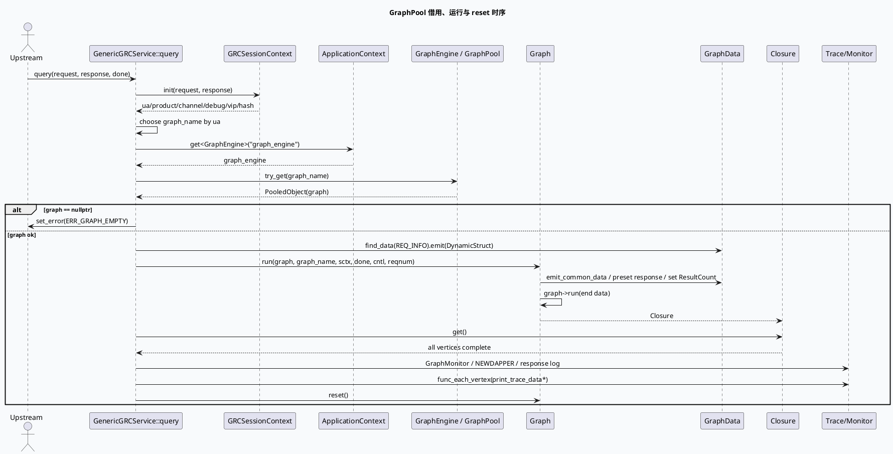

# GraphEngine GraphPool 对象池复用与 reset 生命周期

> 日期：2026-06-01  
> 主题来源：`notes/weekly-topic-selection/daily-plan-20260529.json` 的 `mon.base_lib` 计划项  
> 范围：GRC 服务入口 `GraphEngine::try_get()`、`Graph::run()`、`Closure::get()`、尾部 trace flush 与 `graph->reset()` 的完整生命周期；GRG 同类入口可按相同模式对照。  
> 内网文档：今日计划未提供 KU URL/doc-id；当前环境未发现可用 `ku` CLI，本文以代码库检索结果为主，GraphEngine 内部实现细节需人工补充。

---

## 0. 架构全景图

<div class="arch-wrapper graphpool-arch"><style scoped>.graphpool-arch{font-family:-apple-system,BlinkMacSystemFont,'Segoe UI',Roboto,sans-serif;background:#f8fafc;border:1px solid #dbe4ee;border-radius:14px;padding:22px;margin:16px 0;color:#172033}.graphpool-arch .arch-title{font-size:18px;font-weight:900;margin-bottom:14px}.graphpool-arch .arch-layer{border-radius:10px;padding:14px;margin:10px 0}.graphpool-arch .user{background:#dbeafe;border-left:5px solid #2563eb}.graphpool-arch .application{background:#dcfce7;border-left:5px solid #16a34a}.graphpool-arch .ai{background:#fef3c7;border-left:5px solid #d97706}.graphpool-arch .data{background:#fce7f3;border-left:5px solid #db2777}.graphpool-arch .infra{background:#ede9fe;border-left:5px solid #7c3aed}.graphpool-arch .arch-layer-title{font-size:13px;font-weight:800;margin-bottom:8px}.graphpool-arch .arch-grid{display:grid;grid-template-columns:repeat(4,minmax(0,1fr));gap:8px}.graphpool-arch .arch-box{background:rgba(255,255,255,.86);border:1px solid rgba(15,23,42,.08);border-radius:8px;padding:9px;font-size:12px;line-height:1.35}.graphpool-arch .arch-box.highlight{border:2px solid #d97706;background:#fff7ed;font-weight:800}.graphpool-arch small{display:block;color:#64748b;margin-top:3px}</style><div class="arch-title">GraphPool 单请求生命周期：借图 → 注入 → 求解 → 清理</div><div class="arch-layer user"><div class="arch-layer-title">① RPC Request</div><div class="arch-grid"><div class="arch-box">`GRCRequest`<small>common_info / reqnum / dynamic_timeout</small></div><div class="arch-box">`Controller`<small>logid / timeout / remote_side</small></div><div class="arch-box">`Closure done`<small>响应收尾回调</small></div><div class="arch-box">`GRCSessionContext`<small>解析 UA、product、debug、vip</small></div></div></div><div class="arch-layer application"><div class="arch-layer-title">② Service Entry</div><div class="arch-grid"><div class="arch-box highlight">`ApplicationContext::get&lt;GraphEngine&gt;("graph_engine")`<small>配置驱动获取图引擎</small></div><div class="arch-box highlight">`graph_engine->try_get(graph_name)`<small>从 GraphPool 借出可复用 Graph</small></div><div class="arch-box">`find_data(REQ_INFO)`<small>注入请求动态结构</small></div><div class="arch-box">`emit_common_data()`<small>写入 Request、SID、用户、日志标记</small></div></div></div><div class="arch-layer ai"><div class="arch-layer-title">③ Graph Runtime</div><div class="arch-grid"><div class="arch-box">`FrameworkContext.timeout_cntl`<small>动态超时对象随图上下文传播</small></div><div class="arch-box">`GraphData preset/emit`<small>ResponseForGrg / ResData / ResultCount</small></div><div class="arch-box highlight">`graph->run(end)`<small>按 UA 选择终点数据求解</small></div><div class="arch-box">`closure.get()`<small>阻塞等待所有依赖完成</small></div></div></div><div class="arch-layer data"><div class="arch-layer-title">④ Observability Before Reset</div><div class="arch-grid"><div class="arch-box">`print_trace_data`<small>debug/vip/hash 命中时输出 DEBUG_TRACE</small></div><div class="arch-box">`print_trace_data_common_adjust`<small>调权因子链路日志</small></div><div class="arch-box">GraphMonitor / NEWDAPPER<small>耗时、返回量、错误码</small></div><div class="arch-box highlight">`graph->reset()`<small>清理 GraphData 与 VertexContext，归还池化对象前的关键步骤</small></div></div></div></div>

---

## 1. 关键结论

1. **GraphPool 不是“每请求 new graph”**：服务入口通过 `ApplicationContext` 获取 `GraphEngine`，再按 `graph_name` 调用 `try_get()` 借出池化 `Graph`；这要求请求内写入的 `GraphData`、`VertexContext`、trace protobuf 都必须在请求末尾清理。
2. **图名选择发生在请求上下文初始化之后、图获取之前**：GRC 按 `ua` 映射 `default`、`video_immersion`、`searchc_related` 等图，图名错误会直接影响终点 `GraphData` 与处理链路。
3. **`reset()` 必须晚于 trace flush**：代码先 `graph->func_each_vertex(&Util::print_trace_data)` / `print_trace_data_common_adjust`，再 `graph->reset()`；如果顺序反了，trace 数据会被清空，排障证据消失。
4. **悬挂引用风险集中在 reset 之后**：任何 `GraphData::emit()` 出来的指针、`DynamicStruct` 引用、`GraphVertex` 上下文都只应在 `Closure::get()` 完成且 `graph->reset()` 前使用。

---

## 2. 核心流程图



---

## 3. 配置/结构信息图

```infographic
infographic sequence-ascending-steps
data
  title GraphPool 生命周期检查点
  desc 每个检查点都对应一次可观测的代码/日志行为；排查串包、脏数据、超时时按顺序确认
  items
    - label 1. Context init
      desc `GRCSessionContext::init` 成功后才允许选图；失败直接 set_error
      icon mdi/account-cog
    - label 2. Graph name
      desc UA 映射到 default / video_immersion / searchc_related 等图名
      icon mdi/source-branch
    - label 3. try_get
      desc `GraphPool::PooledObject` 持有本次请求借出的 Graph
      icon mdi/database-arrow-up
    - label 4. Data emit
      desc REQ_INFO、ResultCount、ResponseForGrg、ResData 写入 GraphData
      icon mdi/database-edit
    - label 5. run + get
      desc `graph->run(end)` 返回 Closure，`get()` 阻塞等待依赖完成
      icon mdi/play-circle
    - label 6. flush trace
      desc debug/vip/hash 命中时先输出 trace，再进行 reset
      icon mdi/text-search
    - label 7. reset
      desc 清理 GraphData / VertexContext，避免下次复用读到脏状态
      icon mdi/restore
```

### 图名与终点数据

| UA/场景 | graph_name | 终点数据 | 证据 |
|---|---|---|---|
| 默认小视频链路 | `default` | `GrcResponse` + `IsWritePersonalisedCacheSucc` | `src/service/grc_service.cpp:181-199`, `src/service/grc_service.cpp:292-309` |
| `ua == 85` | `video_immersion` | `GrcResponse` | `src/service/grc_service.cpp:184-188`, `src/service/grc_service.cpp:292-309` |
| 搜 C 相关 | `searchc_related` / `searchc_immersive_related` | `GrcResponse` | `src/service/grc_service.cpp:188-192`, `src/service/grc_service.cpp:297-299` |
| 二跳落地页合集 | graph_name 默认但终点切到 `ClusterData` | `ClusterData` | `src/service/grc_service.cpp:300-302` |
| 兴趣卡 | `interest_card` | `InterestCardData` | `src/service/grc_service.cpp:194-195`, `src/service/grc_service.cpp:303-305` |

---

## 4. Pitfalls 卡片

<div class="card-frame graphpool-card"><style scoped>.graphpool-card{font-family:-apple-system,BlinkMacSystemFont,'Segoe UI',Roboto,sans-serif;margin:18px 0}.graphpool-card .card{background:#fff7ed;border:1px solid #fed7aa;border-radius:16px;padding:22px;color:#1f2937;box-shadow:0 8px 24px rgba(15,23,42,.06)}.graphpool-card .card-meta{font-size:12px;font-weight:800;letter-spacing:.08em;text-transform:uppercase;color:#c2410c}.graphpool-card .card-title{font-size:28px;font-weight:900;letter-spacing:-.02em;margin:6px 0 12px}.graphpool-card .card-grid{display:grid;grid-template-columns:2fr 1fr;gap:14px}.graphpool-card .card-panel{background:rgba(255,255,255,.72);border-top:4px solid #ea580c;border-radius:10px;padding:13px;font-size:14px;line-height:1.65}.graphpool-card .card-highlight{border-left:5px solid #ea580c;padding-left:12px;font-weight:800}.graphpool-card code{background:#ffedd5;border-radius:4px;padding:1px 4px}</style><div class="card"><div class="card-meta">PITFALLS · POOLED GRAPH</div><div class="card-title">reset 不是收尾细节，而是复用边界</div><div class="card-grid"><div class="card-panel"><div class="card-highlight">只要 Graph 来自对象池，就必须假设所有请求态都会被下一次请求复用。</div><p>最危险的 bug 不是崩溃，而是“偶现串包”：某个 vertex 的 trace、response preset、动态超时对象或临时 context 没被清理，下一个请求在同一张 Graph 上读到旧值。</p></div><div class="card-panel"><b>排查优先级</b><br>① reset 是否执行<br>② reset 是否晚于日志 flush<br>③ VertexProcessor::reset 是否清自定义 context<br>④ reset 后是否仍持有 GraphData 指针</div></div></div></div>

---

## 5. 调试 checklist

```infographic
infographic list-column-done-list
data
  title GraphPool / reset 调试 checklist
  desc 适用于请求串包、trace 缺失、偶现超时、GraphData 脏值问题
  items
    - label 确认 graph_name
      desc 日志中 UA 与 graph_name 是否匹配预期；错误图会导致终点数据或依赖不同
      done false
    - label 确认 try_get 返回值
      desc `graph == nullptr` 时应走 ERR_GRAPH_EMPTY，而不是继续访问 GraphData
      done false
    - label 确认 timeout_cntl 生命周期
      desc `DynamicTimeOutPlugin::get_dt_controller()` 的对象必须覆盖 `graph->run()` 全过程
      done false
    - label 确认 Closure::get 已完成
      desc reset 前必须等待异步 vertex 全部完成，避免并发访问已清理 GraphData
      done false
    - label 确认 trace flush 顺序
      desc `print_trace_data*` 必须在 `graph->reset()` 前执行
      done false
    - label 确认 processor reset
      desc 自定义 `VertexContext`、pb、map/vector 缓存应在 processor reset 中清理
      done false
    - label 禁止 reset 后继续使用指针
      desc `emit<T>()`、`mutable_value<T>()`、`GraphData*` 不要逃逸到 reset 之后
      done false
```

---

## 6. 证据来源

- `src/service/grc_service.cpp:177-211`：获取 `GraphEngine`、按 UA 选择 `graph_name`、`try_get()`、注入 `REQ_INFO`、进入 `run()`。
- `src/service/grc_service.cpp:233-281`：动态超时控制器写入 `FrameworkContext`，公共数据与 `ResultCount` 注入。
- `src/service/grc_service.cpp:292-315`：按 UA 选择终点 `GraphData`，调用 `graph->run()` 并 `Closure::get()`。
- `src/service/grc_service.cpp:213-220`：trace flush 与 `graph->reset()` 的顺序。
- `src/processor/fill_meta.cpp:691-699`：processor reset 清理自定义上下文中的 `gcms_common_pb_meta_map`，体现池化图对 processor reset 的要求。
