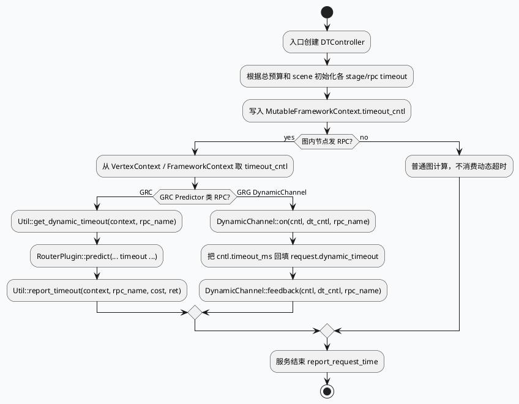

# DynamicTimeOutPlugin 动态超时注入与场景映射

- 日期：2026-06-05
- 代码库：feeda-mv-grc / feeda-mv-grg
- 本文定位：服务入口如何把上游 timeout 转换为图运行期 FrameworkContext 中可被 RPC plugin 消费的 DTController，以及 GRC/GRG 场景映射差异。
- 内网检索：本次 cron 未执行额外全文检索；如需和 KU 规范/稳定性复盘对齐，需人工补充。

<div class="arch-wrapper" style="font-family:-apple-system,BlinkMacSystemFont,'Segoe UI',sans-serif;background:#f5f7fa;border:1px solid #d8dee9;border-radius:16px;padding:18px;margin:16px 0;color:#1f2937;">
<style>.arch-title{font-size:22px;font-weight:800;margin-bottom:6px;color:#23364f}.arch-sub{font-size:13px;color:#607085;margin-bottom:14px}.arch-layer{border:1px solid #cbd5e1;border-radius:12px;margin:10px 0;padding:12px;background:#fff}.arch-layer h3{margin:0 0 10px 0;font-size:15px;color:#334155}.arch-grid{display:grid;grid-template-columns:repeat(4,1fr);gap:10px}.arch-box{border-radius:10px;padding:10px;border:1px solid #dbe3ef;background:#f8fafc;min-height:54px}.arch-box b{display:block;font-size:13px;color:#24364b}.arch-box span{display:block;font-size:12px;color:#64748b;margin-top:4px;line-height:1.35}.highlight{background:#e8f1ff;border-color:#8fb7e8}.warn{background:#fff7ed;border-color:#fdba74}.data{background:#f0fdf4;border-color:#86efac}.arrow{font-size:18px;text-align:center;color:#64748b;padding-top:18px}</style>
<div class="arch-title">动态超时全景：入口注入，图内消费，结束反馈</div>
<div class="arch-sub">核心结论：GRC 固定使用 scene=default；GRG 按 graph_name 选择 scene，但 news_updates_dibar 被归并到 short_micro_video。</div>
<div class="arch-layer"><h3>1. 服务入口层</h3><div class="arch-grid"><div class="arch-box highlight"><b>GRC query/run</b><span>grc_service.cpp:151-211<br/>run 中申请 DTController</span></div><div class="arch-box highlight"><b>GRG query</b><span>grg_service.cpp:35-89<br/>query 中申请 DTController</span></div><div class="arch-box"><b>上游 timeout</b><span>cntl->timeout_ms()<br/>common_info.dynamic_timeout()</span></div><div class="arch-box warn"><b>兜底值</b><span>GRC: 700ms<br/>GRG: 800ms</span></div></div></div>
<div class="arch-layer"><h3>2. DynamicTimeOutPlugin 层</h3><div class="arch-grid"><div class="arch-box"><b>get_dt_controller()</b><span>从 controller_pool 获取本请求控制器</span></div><div class="arch-box"><b>set_request_timeout()</b><span>按 scene + 总预算计算每个 stage/rpc 的预算</span></div><div class="arch-box data"><b>配置：GRC</b><span>dynamic_timeout.conf<br/>default/spark/guanzhu</span></div><div class="arch-box data"><b>配置：GRG</b><span>plugins/dynamic_timeout/*.conf<br/>short_micro_video/news_updates_dibar</span></div></div></div>
<div class="arch-layer"><h3>3. 图运行与 RPC 消费层</h3><div class="arch-grid"><div class="arch-box highlight"><b>FrameworkContext</b><span>graph_mutable_context->timeout_cntl = dt_cntl</span></div><div class="arch-box"><b>图内节点</b><span>通过 vertex context 读取 m_framework_context</span></div><div class="arch-box"><b>RPC plugin</b><span>Util::get_dynamic_timeout 或 DynamicChannel::on</span></div><div class="arch-box warn"><b>反馈</b><span>report_request_time / feedback 用于闭环</span></div></div></div>
</div>

## 1. 入口链路对比

```plantuml
@startuml
skinparam handwritten false
skinparam backgroundColor #f8fafc
left to right direction
title GRC / GRG 动态超时注入时序对比
actor Upstream as U
participant "brpc Controller" as C
participant "GenericGRCService" as GRC
participant "GenericGRGService" as GRG
participant "DynamicTimeOutPlugin" as DTP
participant "Graph / FrameworkContext" as Graph
participant "Graph RPC Node" as Node
U -> C: query(request, response)
C -> GRC: GRC query()
GRC -> DTP: get_dt_controller()
GRC -> GRC: timeout = cntl.timeout_ms\nelse request.dynamic_timeout\nelse 700
GRC -> DTP: set_request_timeout(dt, "default", timeout)
GRC -> Graph: mutable_context.timeout_cntl = dt
Graph -> Node: run(end)
Node -> DTP: Util::get_dynamic_timeout(context, rpc_name)
GRC -> DTP: report_request_time(dt, total_ms)
...
C -> GRG: GRG query()
GRG -> DTP: get_dt_controller()
GRG -> GRG: graph_name = get_graph_name(ua)
GRG -> GRG: timeout = cntl.timeout_ms\nelse request.dynamic_timeout\nelse 800
GRG -> GRG: scene = graph_name\nnews_updates_dibar => short_micro_video
GRG -> DTP: set_request_timeout(dt, scene, timeout)
GRG -> Graph: mutable_context.timeout_cntl = dt
Graph -> Node: run(end, err_node)
Node -> DTP: DynamicChannel::on(cntl, dt, rpc_name)
GRG -> DTP: report_request_time(dt, graph_ms)
@enduml
```

| 对比项 | GRC | GRG | 影响 |
|---|---|---|---|
| 插件获取 | 构造函数中从 `ApplicationContext` 获取 `_dynamic_timeout_plugin` | 构造函数中获取 `_dynamic_timeout_plugin`，query 中额外判空 | 插件缺失时 GRC run 才暴露；GRG 入口更早失败 |
| controller 获取 | `run()` 内 `get_dt_controller()` | `query()` 内 `get_dt_controller()` | GRC 的 timeout 注入更靠近图运行；GRG 在填充图基础数据前完成 |
| 总预算来源 | `cntl->timeout_ms()` → `request.common_info().dynamic_timeout()` → `700` | `cntl->timeout_ms()` → `request.common_info().dynamic_timeout()` → `800` | 同样请求在两服务兜底预算不同 |
| scene 选择 | 固定 `default` | `graph_name`，但 `news_updates_dibar` 改成 `short_micro_video` | GRC 多图共用 default；GRG 场景粒度更细但存在归并 |
| 注入点 | `MutableFrameworkContext.timeout_cntl` | `MutableFrameworkContext.timeout_cntl` | 图内 Processor/RPC plugin 统一从 FrameworkContext 拿控制器 |
| 反馈 | `report_request_time(dt, request_total_ms)` | `report_request_time(dt, graph_run_ms)` | 反馈口径不同：GRC 包含更多入口/回包开销，GRG 更贴近 graph cost |

## 2. 代码证据

### 2.1 GRC：固定 default scene

关键路径：

- `src/service/grc_service.cpp:56-58`：构造函数获取 `DynamicTimeOutPlugin`。
- `src/service/grc_service.cpp:233-250`：run 中从 plugin 申请 controller，并按 `cntl->timeout_ms()` / `request.dynamic_timeout()` / `700` 选择总预算。
- `src/service/grc_service.cpp:253-269`：`scene` 固定为 `default`，调用 `set_request_timeout()` 后写入 `MutableFrameworkContext.timeout_cntl`。
- `src/service/grc_service.cpp:319-320`：图运行结束后调用 `report_request_time()`。

这意味着即使 query 入口根据 UA 选择了 `dibar_reddot`、`video_immersion`、`searchc_related`、`news_updates_dibar` 等 graph，动态超时配置仍走同一个 `default` scene。配置上的 `spark`、`guanzhu` scene 在当前入口代码中没有被直接映射到 graph_name，需要确认是否由其他环境/版本使用。

### 2.2 GRG：graph_name 到 scene 的映射

关键路径：

- `src/service/grg_service.cpp:30-33`：构造函数获取 `DynamicTimeOutPlugin`。
- `src/service/grg_service.cpp:64-67`：先按 UA 选择 graph，再获取 DTController。
- `src/service/grg_service.cpp:177-200`：在 `fill_basic_data_for_graph()` 中选择预算、映射 scene、写入 `MutableFrameworkContext.timeout_cntl`。
- `src/service/grg_service.cpp:221`：图运行结束后上报 request time。

GRG 的 scene 默认等于 `graph_name`，但 `news_updates_dibar` 被强制映射到 `short_micro_video`。从配置看 `plugins/dynamic_timeout/news_updates_dibar.conf` 存在独立 scene，但入口逻辑当前不会使用它；实际生效的是 `short_micro_video.conf`。

## 3. 配置结构信息图

infographic compare-binary-horizontal-underline-text-vs
data
  title 动态超时配置结构：GRC vs GRG
  desc 两边都使用 controller_pool + scene + stages，但入口 scene 选择策略不同
  items
    - label GRC
      desc conf/plugins/dynamic_timeout.conf；controller_pool size=80；default scene 包含 ums/embedding/recall/dup/ctr_rank 等 stage；入口固定 default
      value 1
    - label GRG
      desc conf/plugins/dynamic_timeout/global.conf include short_micro_video/news_updates_dibar；入口按 graph_name 选 scene，但 news_updates_dibar 归并 short_micro_video
      value 1

theme
  palette #3D5A80 #6B7280 #D97706

### 3.1 GRC 配置重点

- `conf/plugins/dynamic_timeout.conf:1-2`：`controller_pool.size = 80`。
- `conf/plugins/dynamic_timeout.conf:4-75`：`default` scene，window_size 480，含多个 stage：
  - priority 2：`ums`、`embedding_service`。
  - priority 0：多路召回，如 `video_micro_rec`、`video_micro_cf_new`、`q_cache_recall`。
  - priority 2：`dup_rpc`。
  - priority 1：`ctr_rank_rpc`。
- `conf/plugins/dynamic_timeout.conf:76-119`：`spark` scene。
- `conf/plugins/dynamic_timeout.conf:121-135`：`guanzhu` scene。

### 3.2 GRG 配置重点

- `conf/plugins/dynamic_timeout/global.conf:1-4`：`controller_pool.size = 80`，include `short_micro_video.conf` 和 `news_updates_dibar.conf`。
- `conf/plugins/dynamic_timeout/short_micro_video.conf:1-25`：`short_micro_video` scene，window_size 300；priority 0 覆盖 `ums_rpc` 与 `microvideo_grc_recall_rpc`，priority 1 覆盖 `user_feature_service_rpc`、`request_feature_service_rpc`。
- `conf/plugins/dynamic_timeout/news_updates_dibar.conf:1-15`：存在 `news_updates_dibar` scene，但当前入口代码把该 scene 映射为 `short_micro_video`，需确认是否为刻意复用或遗留配置。

## 4. 图内消费：不是只有入口设置就结束



补充证据：

- `src/plugin/parallel_predictor.cpp:39-70`：批量预测前调用 `Util::get_dynamic_timeout(context, rpc_name)`，异步完成后 `Util::report_timeout()`。
- `src/processor/reddot/reddot_index_recall.cpp:71-77`：通过 `vertext_context.m_framework_context->timeout_cntl` 传给 URS plugin。
- `src/plugin/grc.cpp:35-51`（GRG）：`DynamicChannel::on(cntl, dt_cntl, rpc_name)` 后，如果存在 dt_cntl，会把计算出的 `cntl.timeout_ms()` 回填到 GRCRequest 的 `common_info.dynamic_timeout`，RPC 完成后再 `feedback()`。

## 5. Pitfalls 卡片

<div class="card-frame" style="font-family:-apple-system,BlinkMacSystemFont,'Segoe UI',sans-serif;max-width:980px;margin:18px 0;">
<style>.card{background:#f4f3f0;border:1px solid #ddd6cc;border-radius:18px;padding:22px;color:#2f2f2f}.card-meta{font-size:12px;font-weight:700;letter-spacing:.08em;color:#6b7280;text-transform:uppercase}.card-title{font-size:30px;line-height:1.05;font-weight:850;letter-spacing:-.02em;margin:8px 0 14px}.card-grid{display:grid;grid-template-columns:1.4fr 1fr;gap:14px}.card-panel{background:#fffaf3;border-top:4px solid #9a6b3f;border-radius:12px;padding:14px}.card-panel h4{margin:0 0 8px;font-size:15px}.card-panel p{margin:0;font-size:13px;line-height:1.65;color:#4b5563}.card-highlight{border-left:5px solid #9a6b3f;padding-left:12px;font-size:15px;line-height:1.55;background:#fff;padding-top:10px;padding-bottom:10px;border-radius:8px}</style>
<div class="card"><div class="card-meta">Pitfalls / Dynamic Timeout</div><div class="card-title">排查超时问题时，先问 scene 是否真的命中</div><div class="card-grid"><div class="card-panel"><h4>1. 配置存在 ≠ 入口使用</h4><p>GRC 配了 default/spark/guanzhu，但入口固定 default；GRG 配了 news_updates_dibar，但入口把它改成 short_micro_video。改配置前必须从 service 入口确认 scene 映射。</p></div><div class="card-panel"><h4>2. 反馈口径不同</h4><p>GRC 上报 request 总耗时，GRG 上报 graph run 耗时。跨服务比较动态超时学习效果时不能直接对齐。</p></div><div class="card-panel"><h4>3. controller 生命周期跟图复用绑定</h4><p>DTController 来自 pool，指针注入 FrameworkContext。不要在 graph reset 后持有该指针或跨请求复用。</p></div><div class="card-highlight">最容易误判的问题：看到 GRG 有 `news_updates_dibar.conf` 就以为线上在用；当前代码路径实际会走 `short_micro_video` scene。</div></div></div>
</div>

## 6. 调试 checklist

infographic list-column-done-list
data
  title 动态超时排查 Checklist
  desc 从入口、scene、配置、图内消费、反馈五个点闭环
  items
    - label 确认入口 graph_name
      desc GRC 看 ua 到 graph_name 的 if-else；GRG 看 get_graph_name()
      done true
    - label 确认 scene 映射
      desc GRC 是否仍固定 default；GRG news_updates_dibar 是否仍归并 short_micro_video
      done true
    - label 核对总预算来源
      desc cntl.timeout_ms 优先，其次 request.common_info.dynamic_timeout，最后服务兜底
      done true
    - label 检查 FrameworkContext 注入
      desc graph_mutable_context->timeout_cntl 必须在 graph->run 前完成
      done true
    - label 检查 RPC 名称和配置一致
      desc rpc_name 必须能在对应 scene 的 stage/concurrent 中找到，否则可能走默认或无动态预算
      done false
    - label 检查反馈口径
      desc 区分 report_request_time、Util::report_timeout、DynamicChannel::feedback
      done false

theme
  palette #3D5A80 #94A3B8 #D97706

## 7. 建议后续动作

1. **确认 GRG `news_updates_dibar` scene 是否应生效**：如果希望独立预算，应修改 `grg_service.cpp:186-190` 的映射；如果复用 `short_micro_video` 是预期，应删除或注释配置中的歧义说明。
2. **确认 GRC 是否需要按 graph_name 选择 scene**：当前固定 default 会让 `spark`、`guanzhu` scene 难以通过入口命中。
3. **统一监控口径**：GRC `report_request_time` 使用总请求耗时，GRG 使用 graph run 耗时；建议日志中明确字段含义，避免性能复盘时误读。
4. **对 rpc_name 做静态校验**：扫描图内 `Util::get_dynamic_timeout(context, rpc_name)` / `DynamicChannel::on(... rpc_name)` 的 rpc_name 是否全部出现在动态超时配置中。
