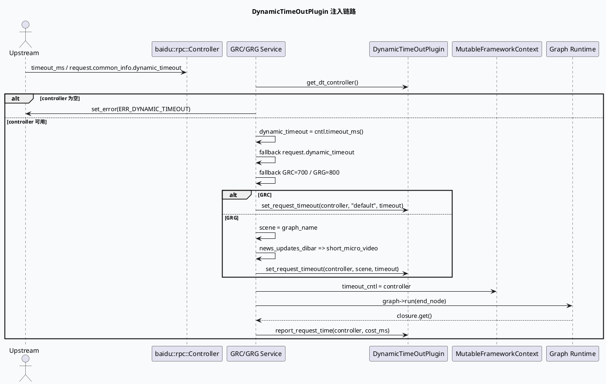

# DynamicTimeOutPlugin 动态超时注入与场景映射

> 日期：2026-06-06（Sat）  
> 来源：`daily-plan-20260529.json` 的 `recommended_7_plus_7.sat.base_lib`  
> KU 状态：今日计划未提供 `base_lib_doc_id`，内网文档证据需人工补充；本文以本地代码与配置检索为主。

## 架构全景图

<style>.arch-dt{font-family:-apple-system,BlinkMacSystemFont,"Segoe UI",sans-serif;background:#f8fafc;border:1px solid #dbe3ef;border-radius:16px;padding:18px;margin:16px 0;color:#1f2937}.arch-dt .title{font-weight:800;font-size:22px;margin-bottom:4px}.arch-dt .sub{color:#64748b;font-size:13px;margin-bottom:16px}.arch-dt .lane{border-radius:14px;padding:14px;margin:10px 0;border:1px solid #d8e2ee}.arch-dt .lane h3{margin:0 0 10px 0;font-size:15px}.arch-dt .grid{display:grid;grid-template-columns:repeat(4,minmax(0,1fr));gap:10px}.arch-dt .box{background:white;border:1px solid #cbd5e1;border-radius:12px;padding:10px;box-shadow:0 1px 2px rgba(15,23,42,.05);font-size:13px}.arch-dt .box b{display:block;font-size:14px;margin-bottom:4px}.arch-dt .flow{font-weight:700;color:#2563eb;text-align:center;padding:6px}.arch-dt .app{background:#eff6ff}.arch-dt .logic{background:#f0fdf4}.arch-dt .data{background:#fff7ed}.arch-dt .warn{border-color:#f59e0b;background:#fffbeb}</style><div class="arch-dt"><div class="title">动态超时控制：入口注入 → 场景映射 → FrameworkContext 透传</div><div class="sub">GRC 使用固定 default scene；GRG 使用 graph_name，并对 news_updates_dibar 特判映射到 short_micro_video。</div><div class="lane app"><h3>1. Service Entry</h3><div class="grid"><div class="box"><b>GRC run</b>`grc_service.cpp:233-269`<br/>从插件池获取 controller，默认 700ms。</div><div class="box"><b>GRG fill_basic_data</b>`grg_service.cpp:177-199`<br/>默认 800ms，scene 来自 graph_name。</div><div class="box"><b>RPC Controller</b>`cntl->timeout_ms()` 优先；否则 request dynamic_timeout。</div><div class="box warn"><b>Fallback</b>上游未给 timeout 时进入服务本地默认值。</div></div></div><div class="flow">↓ set_request_timeout(scene, dynamic_timeout)</div><div class="lane logic"><h3>2. DynamicTimeOutPlugin</h3><div class="grid"><div class="box"><b>Controller Pool</b>`dynamic_timeout.conf:1-2`<br/>pool size=80。</div><div class="box"><b>Scene: default</b>`dynamic_timeout.conf:4-75`<br/>GRC 当前固定使用。</div><div class="box"><b>Stage Budget</b>priority/window/default/min/max。</div><div class="box"><b>Concurrent RPC</b>ums、embedding、recall、dup、ctr_rank 等。</div></div></div><div class="flow">↓ graph_mutable_context->timeout_cntl</div><div class="lane data"><h3>3. Graph Runtime</h3><div class="grid"><div class="box"><b>FrameworkContext</b>插件 controller 注入图上下文。</div><div class="box"><b>Graph Nodes</b>下游 RPC 可按阶段消费预算。</div><div class="box"><b>Report</b>`grg_service.cpp:221` / `grc_service.cpp:319` 回报请求耗时。</div><div class="box warn"><b>风险点</b>scene 不匹配会导致预算落到错误配置。</div></div></div></div>

## 核心流程：动态超时注入时序



## 配置结构信息图

```infographic
infographic sequence-pyramid-simple
data
  title dynamic_timeout.conf 配置层次
  desc 从 controller pool 到 scene，再到 stage 与 concurrent RPC 的预算树
  items
    - label controller_pool
      desc size=80，入口为插件 controller 池
      value 80
      icon mdi/database
    - label scene
      desc default / spark / guanzhu；GRC 当前写死 default
      value 3
      icon mdi/map-marker
    - label stage
      desc priority + default/min/max timeout + window_size
      value 5
      icon mdi/timer-cog
    - label concurrent rpc
      desc ums、embedding_service、recall、dup_rpc、ctr_rank_rpc 等
      value 18
      icon mdi/call-split
```

## 关键观察

- GRC 在 `grc_service.cpp:253-256` 固定使用 `scene="default"`，因此 `dynamic_timeout.conf:4-75` 是主预算入口；`spark`、`guanzhu` 配置存在但不会由当前 GRC service 入口自动选择。
- GRG 在 `grg_service.cpp:186-190` 使用 `graph_name` 作为 scene，并将 `news_updates_dibar` 转换为 `short_micro_video`。这是跨配置排查时最容易漏掉的场景别名。
- timeout 来源优先级一致：`cntl->timeout_ms()` → `request.common_info().dynamic_timeout()` → 服务默认值；GRC 默认 700ms，GRG 默认 800ms。
- controller 最终写入 `MutableFrameworkContext.timeout_cntl`，下游 Graph 节点不应重新解析上游 timeout，而应通过上下文共享预算。

## Pitfalls 卡片

<style>.pit-card{font-family:-apple-system,BlinkMacSystemFont,"Segoe UI",sans-serif;background:#fffaf0;border:1px solid #f2d6a2;border-radius:18px;padding:20px;margin:18px 0;color:#2f2618}.pit-card .meta{font-size:12px;font-weight:800;letter-spacing:.08em;text-transform:uppercase;color:#a16207}.pit-card .headline{font-size:28px;font-weight:900;letter-spacing:-.02em;margin:6px 0 10px}.pit-card .bar{height:5px;width:88px;background:#d97706;border-radius:999px;margin:12px 0}.pit-card .cols{display:grid;grid-template-columns:2fr 1fr;gap:14px}.pit-card .panel{background:#fff;border-top:3px solid #d97706;border-radius:12px;padding:12px;box-shadow:0 1px 2px rgba(0,0,0,.04)}.pit-card p{line-height:1.65;margin:0;font-size:14px}.pit-card b{color:#7c2d12}</style><div class="pit-card"><div class="meta">pitfall / dynamic timeout</div><div class="headline">不要只看超时时间，要同时看 scene</div><div class="bar"></div><div class="cols"><div class="panel"><p><b>症状：</b>上游 timeout 明明足够，但某个 RPC 仍提前超时。常见原因不是总预算不够，而是 scene 错误导致 stage default/min/max 落入另一套配置。</p></div><div class="panel"><p><b>排查：</b>先确认入口服务、graph_name、scene 映射，再看 `dynamic_timeout.conf` 的 stage。</p></div></div></div>

## 调试 checklist

```infographic
infographic list-column-done-list
data
  title 动态超时排查清单
  desc 按入口、场景、配置、运行时上下文四层定位
  items
    - label 确认入口服务
      desc GRC 看 grc_service.cpp:233-269；GRG 看 grg_service.cpp:177-199
      done true
      icon mdi/source-branch
    - label 确认 timeout 来源
      desc cntl->timeout_ms 优先，其次 request.common_info.dynamic_timeout，最后默认值
      done true
      icon mdi/timer
    - label 确认 scene
      desc GRC=default；GRG=graph_name，news_updates_dibar 会映射 short_micro_video
      done true
      icon mdi/map
    - label 对照配置 stage
      desc dynamic_timeout.conf 中查看 window_size、priority、default/min/max
      done true
      icon mdi/file-cog
    - label 验证上下文透传
      desc MutableFrameworkContext.timeout_cntl 是否写入，下游 RPC 是否使用同一个 controller
      done false
      icon mdi/bug-check
```

## 证据来源

- `src/service/grc_service.cpp:233-269`：GRC controller 获取、timeout fallback、default scene 注入。
- `src/service/grc_service.cpp:319`：GRC report_request_time。
- `src/service/grg_service.cpp:177-199`：GRG 动态超时注册、scene 映射。
- `src/service/grg_service.cpp:221`：GRG report_request_time。
- `conf/plugins/dynamic_timeout.conf:1-75`：controller pool、default scene、stage 与 concurrent RPC 配置。
