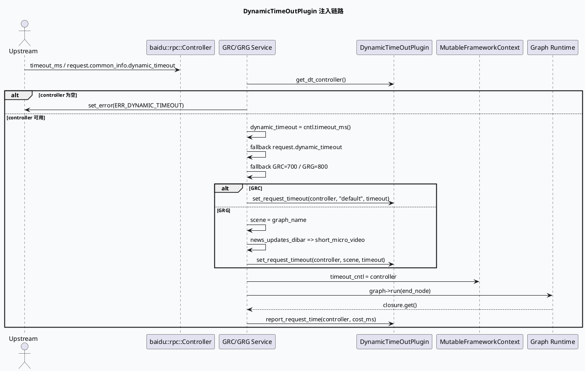

# DynamicTimeOutPlugin 动态超时注入与场景映射

> 日期：2026-06-06（Sat）  
> 来源：`daily-plan-20260529.json` 的 `recommended_7_plus_7.sat.base_lib`  
> KU 状态：今日计划未提供 `base_lib_doc_id`，内网文档证据需人工补充；本文以本地代码与配置检索为主。

## 架构全景图

<style>.arch-dt{font-family:-apple-system,BlinkMacSystemFont,"Segoe UI",sans-serif;background:#f8fafc;border:1px solid #dbe3ef;border-radius:16px;padding:18px;margin:16px 0;color:#1f2937}.arch-dt .title{font-weight:800;font-size:22px;margin-bottom:4px}.arch-dt .sub{color:#64748b;font-size:13px;margin-bottom:16px}.arch-dt .lane{border-radius:14px;padding:14px;margin:10px 0;border:1px solid #d8e2ee}.arch-dt .lane h3{margin:0 0 10px 0;font-size:15px}.arch-dt .grid{display:grid;grid-template-columns:repeat(4,minmax(0,1fr));gap:10px}.arch-dt .box{background:white;border:1px solid #cbd5e1;border-radius:12px;padding:10px;box-shadow:0 1px 2px rgba(15,23,42,.05);font-size:13px}.arch-dt .box b{display:block;font-size:14px;margin-bottom:4px}.arch-dt .flow{font-weight:700;color:#2563eb;text-align:center;padding:6px}.arch-dt .app{background:#eff6ff}.arch-dt .logic{background:#f0fdf4}.arch-dt .data{background:#fff7ed}.arch-dt .warn{border-color:#f59e0b;background:#fffbeb}</style><div class="arch-dt"><div class="title">动态超时控制：入口注入 → 场景映射 → FrameworkContext 透传</div><div class="sub">GRC 使用固定 default scene；GRG 使用 graph_name，并对 news_updates_dibar 特判映射到 short_micro_video。</div><div class="lane app"><h3>1. Service Entry</h3><div class="grid"><div class="box"><b>GRC run</b>`grc_service.cpp:233-269`<br/>从插件池获取 controller，默认 700ms。</div><div class="box"><b>GRG fill_basic_data</b>`grg_service.cpp:177-199`<br/>默认 800ms，scene 来自 graph_name。</div><div class="box"><b>RPC Controller</b>`cntl->timeout_ms()` 优先；否则 request dynamic_timeout。</div><div class="box warn"><b>Fallback</b>上游未给 timeout 时进入服务本地默认值。</div></div></div><div class="flow">↓ set_request_timeout(scene, dynamic_timeout)</div><div class="lane logic"><h3>2. DynamicTimeOutPlugin</h3><div class="grid"><div class="box"><b>Controller Pool</b>`dynamic_timeout.conf:1-2`<br/>pool size=80。</div><div class="box"><b>Scene: default</b>`dynamic_timeout.conf:4-75`<br/>GRC 当前固定使用。</div><div class="box"><b>Stage Budget</b>priority/window/default/min/max。</div><div class="box"><b>Concurrent RPC</b>ums、embedding、recall、dup、ctr_rank 等。</div></div></div><div class="flow">↓ graph_mutable_context->timeout_cntl</div><div class="lane data"><h3>3. Graph Runtime</h3><div class="grid"><div class="box"><b>FrameworkContext</b>插件 controller 注入图上下文。</div><div class="box"><b>Graph Nodes</b>下游 RPC 可按阶段消费预算。</div><div class="box"><b>Report</b>`grg_service.cpp:221` / `grc_service.cpp:319` 回报请求耗时。</div><div class="box warn"><b>风险点</b>scene 不匹配会导致预算落到错误配置。</div></div></div></div>

## 核心流程：动态超时注入时序



## 配置结构信息图

```infographic
infographic sequence-pyramid-simple
data
  title dynamic_timeout.conf 配置层次
  desc 从 controller pool 到 scene，再到 stage 与 concurrent RPC 的预算树
  items
    - label controller_pool
      desc size=80，入口为插件 controller 池
      value 80
      icon mdi/database
    - label scene
      desc default / spark / guanzhu；GRC 当前写死 default
      value 3
      icon mdi/map-marker
    - label stage
      desc priority + default/min/max timeout + window_size
      value 5
      icon mdi/timer-cog
    - label concurrent rpc
      desc ums、embedding_service、recall、dup_rpc、ctr_rank_rpc 等
      value 18
      icon mdi/call-split
```

## 关键观察

- GRC 在 `grc_service.cpp:253-256` 固定使用 `scene="default"`，因此 `dynamic_timeout.conf:4-75` 是主预算入口；`spark`、`guanzhu` 配置存在但不会由当前 GRC service 入口自动选择。
- GRG 在 `grg_service.cpp:186-190` 使用 `graph_name` 作为 scene，并将 `news_updates_dibar` 转换为 `short_micro_video`。这是跨配置排查时最容易漏掉的场景别名。
- timeout 来源优先级一致：`cntl->timeout_ms()` → `request.common_info().dynamic_timeout()` → 服务默认值；GRC 默认 700ms，GRG 默认 800ms。
- controller 最终写入 `MutableFrameworkContext.timeout_cntl`，下游 Graph 节点不应重新解析上游 timeout，而应通过上下文共享预算。

## Pitfalls 卡片

<style>.pit-card{font-family:-apple-system,BlinkMacSystemFont,"Segoe UI",sans-serif;background:#fffaf0;border:1px solid #f2d6a2;border-radius:18px;padding:20px;margin:18px 0;color:#2f2618}.pit-card .meta{font-size:12px;font-weight:800;letter-spacing:.08em;text-transform:uppercase;color:#a16207}.pit-card .headline{font-size:28px;font-weight:900;letter-spacing:-.02em;margin:6px 0 10px}.pit-card .bar{height:5px;width:88px;background:#d97706;border-radius:999px;margin:12px 0}.pit-card .cols{display:grid;grid-template-columns:2fr 1fr;gap:14px}.pit-card .panel{background:#fff;border-top:3px solid #d97706;border-radius:12px;padding:12px;box-shadow:0 1px 2px rgba(0,0,0,.04)}.pit-card p{line-height:1.65;margin:0;font-size:14px}.pit-card b{color:#7c2d12}</style><div class="pit-card"><div class="meta">pitfall / dynamic timeout</div><div class="headline">不要只看超时时间，要同时看 scene</div><div class="bar"></div><div class="cols"><div class="panel"><p><b>症状：</b>上游 timeout 明明足够，但某个 RPC 仍提前超时。常见原因不是总预算不够，而是 scene 错误导致 stage default/min/max 落入另一套配置。</p></div><div class="panel"><p><b>排查：</b>先确认入口服务、graph_name、scene 映射，再看 `dynamic_timeout.conf` 的 stage。</p></div></div></div>

## 调试 checklist

```infographic
infographic list-column-done-list
data
  title 动态超时排查清单
  desc 按入口、场景、配置、运行时上下文四层定位
  items
    - label 确认入口服务
      desc GRC 看 grc_service.cpp:233-269；GRG 看 grg_service.cpp:177-199
      done true
      icon mdi/source-branch
    - label 确认 timeout 来源
      desc cntl->timeout_ms 优先，其次 request.common_info.dynamic_timeout，最后默认值
      done true
      icon mdi/timer
    - label 确认 scene
      desc GRC=default；GRG=graph_name，news_updates_dibar 会映射 short_micro_video
      done true
      icon mdi/map
    - label 对照配置 stage
      desc dynamic_timeout.conf 中查看 window_size、priority、default/min/max
      done true
      icon mdi/file-cog
    - label 验证上下文透传
      desc MutableFrameworkContext.timeout_cntl 是否写入，下游 RPC 是否使用同一个 controller
      done false
      icon mdi/bug-check
```

## 证据来源

- `src/service/grc_service.cpp:233-269`：GRC controller 获取、timeout fallback、default scene 注入。
- `src/service/grc_service.cpp:319`：GRC report_request_time。
- `src/service/grg_service.cpp:177-199`：GRG 动态超时注册、scene 映射。
- `src/service/grg_service.cpp:221`：GRG report_request_time。
- `conf/plugins/dynamic_timeout.conf:1-75`：controller pool、default scene、stage 与 concurrent RPC 配置。

---

## 七、业务代码库适配分析
> **分析时间**：2026-06-30T19:03:01.543985
> **目标代码库**：feeda-mv-grg（序列生成）、feeda-mv-grc（召回汇聚）

## 业务代码库适配分析

### 1. 分析摘要

- 从扫描结果看，`DynamicTimeOutPlugin` 已经在两个业务代码库中落地使用：`feeda-mv-grg` 主要集中在 `service/grg_service.cpp`、`service/grg_service.h`、`init/global.h`；`feeda-mv-grc` 主要集中在 `service/grc_service.cpp`、`service/grc_service.h`、`util/util.cpp`、`util/util.hpp`。这说明当前并不是“从零引入”，而是已有入口级动态超时控制能力，后续重点应放在 **scene 映射一致性、配置覆盖范围、下游 Graph 节点消费方式** 的治理上。

- 从业务规模看，两个代码库中都存在大量 `std::vector`、`std::string`、`std::unordered_map` 等基础容器使用，说明请求处理、图节点编排、召回/排序/过滤等逻辑较复杂，RPC 调用链可能较长。动态超时机制在这种场景下具有较高迁移和优化价值：相比每个节点各自解析 timeout，统一通过 `MutableFrameworkContext.timeout_cntl` 透传预算，可以减少超时策略分散、配置失配和局部 RPC 提前超时的问题。

---

### 2. 代码库详情

#### feeda-mv-grg：序列生成服务

- 已发现 `DynamicTimeOutPlugin` 相关使用位置：
  - `service/grg_service.cpp`
  - `service/grg_service.h`
  - `init/global.h`

- 关键现状：
  - `service/grg_service.cpp` 中已经存在动态超时注册逻辑。
  - GRG 的 scene 来源于 `graph_name`。
  - 对 `news_updates_dibar` 存在特殊映射：
    - `news_updates_dibar` → `short_micro_video`
  - timeout 来源优先级为：
    - `cntl->timeout_ms()`
    - `request.common_info().dynamic_timeout()`
    - 服务默认值 `800ms`
  - controller 最终注入到 `MutableFrameworkContext.timeout_cntl`，供 Graph Runtime 和下游节点使用。

- 代码库规模信号：
  - `std::vector`：1969 次，分布在 356 个文件
  - `std::string`：2443 次，分布在 425 个文件
  - `std::unordered_map`：734 次，分布在 205 个文件

- 适配判断：
  - GRG 已具备动态超时的主链路能力。
  - 后续更适合做 **场景映射治理** 和 **Graph 节点预算消费规范化**。
  - `service/grg_service.cpp` 可作为 GRG 侧新增图、 新增 scene、 新增业务入口时的参考实现。

---

#### feeda-mv-grc：召回汇聚服务

- 已发现 `DynamicTimeOutPlugin` 相关使用位置：
  - `service/grc_service.cpp`
  - `service/grc_service.h`
  - `util/util.cpp`
  - `util/util.hpp`

- 关键现状：
  - `service/grc_service.cpp` 中已经完成 controller 获取、timeout fallback 和注入。
  - GRC 当前固定使用：
    - `scene = "default"`
  - timeout 来源优先级为：
    - `cntl->timeout_ms()`
    - `request.common_info().dynamic_timeout()`
    - 服务默认值 `700ms`
  - `report_request_time` 已在请求结束后上报，可用于插件侧统计真实请求耗时。

- 代码库规模信号：
  - `std::vector`：8442 次，分布在 1279 个文件
  - `std::string`：7170 次，分布在 1234 个文件
  - `std::unordered_map`：2834 次，分布在 639 个文件

- 适配判断：
  - GRC 代码规模明显更大，召回汇聚链路通常包含更多并发 RPC 与多阶段预算分配。
  - 当前固定 `default` scene 的方式简单稳定，但也限制了不同业务、不同 graph、不同召回场景之间的超时预算差异化能力。
  - `service/grc_service.cpp` 可作为 GRC 侧现有参考实现，但后续如果要做更精细化控制，应重点改造 scene 选择逻辑。

---

### 3. 💡 适用性评估与建议

- **建议一：以 `service/grg_service.cpp` 作为动态超时接入参考，统一新增 GRG graph 的 scene 规则**
  - 适用代码库：`feeda-mv-grg`
  - 重点文件：
    - `service/grg_service.cpp`
    - `service/grg_service.h`
    - `init/global.h`
  - 当前 GRG 已经使用 `graph_name` 作为 scene，并对 `news_updates_dibar` 做了特殊映射。
  - 建议将这类映射规则集中维护，避免在新增 graph 时出现：
    - 配置中存在 scene，但入口没有映射到；
    - 入口使用了 graph_name，但 `dynamic_timeout.conf` 中没有对应 scene；
    - 特殊业务名和配置名不一致，导致预算落入错误配置。
  - 可将现有 `news_updates_dibar -> short_micro_video` 作为参考，补充注释或封装为独立函数，例如：
    - `normalize_dynamic_timeout_scene(graph_name)`
  - 这样后续新增 `spark`、`guanzhu`、`short_micro_video` 等场景时，不需要在主流程中继续堆条件判断。

- **建议二：评估 `service/grc_service.cpp` 中固定 `default` scene 是否需要按业务场景拆分**
  - 适用代码库：`feeda-mv-grc`
  - 重点文件：
    - `service/grc_service.cpp`
    - `service/grc_service.h`
  - 当前 GRC 固定调用：
    - `set_request_timeout(controller, "default", dynamic_timeout)`
  - 这使得所有 GRC 请求都进入 `dynamic_timeout.conf` 的 `default` 配置。
  - 如果 GRC 内部存在不同召回场景、不同 graph、不同流量来源，建议评估是否从 request 或 graph 信息中提取 scene。
  - 可选方案：
    - 保持默认逻辑不变，作为 fallback；
    - 对明确业务场景增加 scene 映射；
    - 配置缺失时仍回落到 `default`，保证稳定性。
  - 适合优先检查的相关文件：
    - `service/grc_http_service.cpp`：该文件中存在 graph 可视化、graph_name、依赖关系处理逻辑，可能具备提取业务图信息的上下文。
    - `service/grc_service.cpp`：服务入口实际注入 timeout controller 的位置。

- **建议三：下游 Graph 节点应统一从 `MutableFrameworkContext.timeout_cntl` 获取预算，不再自行解析 request timeout**
  - 适用代码库：
    - `feeda-mv-grg`
    - `feeda-mv-grc`
  - 重点参考文件：
    - `service/grg_service.cpp`
    - `service/grc_service.cpp`
  - 当前入口已经把 controller 写入 graph mutable context。
  - 建议在下游 RPC 节点中统一约束：
    - 不直接使用 `cntl->timeout_ms()` 重新计算；
    - 不直接读取 `request.common_info().dynamic_timeout()`；
    - 不在节点内部硬编码 RPC timeout；
    - 统一消费 `timeout_cntl` 分配后的 stage / rpc budget。
  - 这样可以避免入口总预算、stage 预算和 RPC 实际 timeout 三者不一致。
  - 对 GRC 尤其重要，因为其代码库规模较大，`std::vector`、`std::unordered_map` 使用量高，说明业务逻辑和中间数据结构复杂，超时策略分散的概率更高。

- **建议四：对 `util/util.cpp`、`util/util.hpp` 中的动态超时辅助逻辑做边界检查和日志增强**
  - 适用代码库：`feeda-mv-grc`
  - 重点文件：
    - `util/util.cpp`
    - `util/util.hpp`
  - 扫描结果显示 GRC 中除了 service 入口外，`util` 层也存在目标库使用。
  - 建议检查这些工具函数是否承担以下职责：
    - scene 构造；
    - timeout 解析；
    - controller 获取；
    - fallback 处理；
    - 错误码转换。
  - 如果有，建议增加关键日志：
    - 原始 `cntl->timeout_ms()`
    - request 中的 `dynamic_timeout`
    - 最终采用的 `dynamic_timeout`
    - 最终 scene
    - 是否发生 fallback
  - 这对排查“上游 timeout 足够但某个 RPC 提前超时”的问题非常关键。

- **建议五：利用已有 `report_request_time` 数据反推配置合理性**
  - 适用代码库：
    - `feeda-mv-grg`
    - `feeda-mv-grc`
  - 重点文件：
    - `service/grg_service.cpp`
    - `service/grc_service.cpp`
  - 当前两侧服务在请求结束后均有 `report_request_time`。
  - 建议结合线上 P95 / P99 请求耗时，回看 `dynamic_timeout.conf` 中各 scene 的：
    - `default_timeout`
    - `min_timeout`
    - `max_timeout`
    - `window_size`
    - `priority`
  - 对于 GRG，应特别关注 `graph_name` 与 scene 是否一一对应。
  - 对于 GRC，应重点关注 `default` scene 是否承载过多差异化流量。

---

### 4. ⚠️ 引入风险与限制

- **风险一：scene 不匹配会导致预算落入错误配置**
  - GRG 使用 `graph_name` 作为 scene，并存在 `news_updates_dibar -> short_micro_video` 的别名映射。
  - 如果新增 graph 时只修改业务逻辑，没有同步更新 `dynamic_timeout.conf`，可能导致：
    - 找不到对应 scene；
    - 使用默认预算；
    - 某些 stage 的 timeout 过小；
    - 下游 RPC 提前超时。
  - 建议在 `service/grg_service.cpp` 附近增加 scene 映射说明，并在配置发布前做 scene 完整性校验。

- **风险二：GRC 固定 `default` scene 简单但不够精细**
  - `service/grc_service.cpp` 当前固定使用 `default`。
  - 好处是行为稳定，迁移成本低。
  - 限制是不同召回场景无法使用差异化预算。
  - 如果后续直接改成按 graph 或业务参数选择 scene，需要注意兼容老流量，建议先灰度：
    - 无 scene 时回落 `default`；
    - 未命中配置时回落 `default`；
    - 记录 scene 命中率和 fallback 比例。

- **风险三：下游节点重复设置 timeout 可能破坏统一预算**
  - 如果 Graph 节点或 RPC 封装中仍然硬编码 timeout，可能出现入口已注入动态超时，但实际 RPC 没有使用该预算的情况。
  - 建议在 GRC 和 GRG 中排查下游 RPC 调用封装，确认是否统一读取 `MutableFrameworkContext.timeout_cntl`。
  - 迁移时不要只改 service 入口，否则只能保证总预算注入，无法保证每个 stage / RPC 的预算真正生效。

- **风险四：controller pool 容量与高并发流量需要匹配**
  - 当前 `dynamic_timeout.conf` 中 controller pool size 为 `80`。
  - 如果请求并发高于 controller 池容量，可能出现 controller 获取失败，入口返回 `ERR_DYNAMIC_TIMEOUT`。
  - 建议结合 GRC、GRG 的线上并发、线程模型和峰值 QPS 评估 pool size。
  - 对 `service/grc_service.cpp` 和 `service/grg_service.cpp` 中 controller 获取失败分支，应保证有明确错误日志和监控指标。

---
*本章节由 Hermes Agent 自动分析生成，基于代码库静态扫描结果。*
