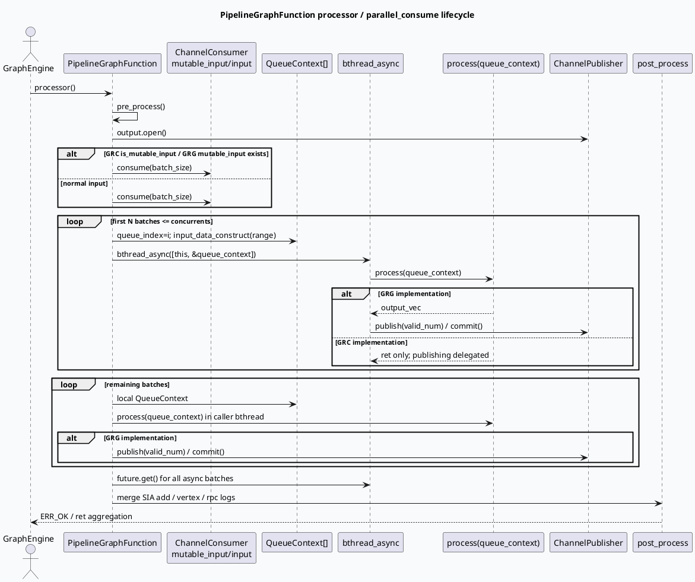

# PipelineGraphFunction parallel_consume 批消费框架

> 日期：2026-06-12  
> 今日主题来源：`daily-plan-20260529.json` Friday base-lib slot  
> 范围：GRC `src/processor/base/pipeline_function.*` 与 GRG `src/process/base/pipeline_function.*` 的 Channel 批消费、bthread 并发、QueueContext 聚合与发布语义。

## 1. 架构全景图：Channel → QueueContext → bthread → post_process

<style>.arch-wrap{font-family:-apple-system,BlinkMacSystemFont,"Segoe UI",sans-serif;background:#f8fafc;border:1px solid #d9e2ec;border-radius:18px;padding:18px;margin:16px 0;color:#243b53}.arch-title{font-size:22px;font-weight:800;margin-bottom:12px;color:#102a43}.arch-grid{display:grid;grid-template-columns:1fr 1.1fr 1fr;gap:12px}.arch-layer{background:#fff;border:1px solid #e3e8ef;border-radius:14px;padding:12px;box-shadow:0 6px 18px rgba(16,42,67,.06)}.arch-layer h3{font-size:15px;margin:0 0 10px;color:#334e68}.arch-box{border-radius:10px;padding:9px 10px;margin:8px 0;background:#edf7ff;border-left:4px solid #3d5a80;font-size:13px;line-height:1.45}.arch-box.green{background:#edfdf5;border-left-color:#2d6a4f}.arch-box.orange{background:#fff7ed;border-left-color:#c2410c}.arch-box.gray{background:#f1f5f9;border-left-color:#64748b}.arch-arrow{text-align:center;font-weight:800;color:#627d98;margin:6px 0}.arch-note{font-size:12px;color:#52606d;margin-top:10px}.arch-badge{display:inline-block;background:#dbeafe;color:#1e3a8a;border-radius:999px;padding:2px 8px;font-size:11px;font-weight:700;margin-left:6px}</style><div class="arch-wrap"><div class="arch-title">PipelineGraphFunction 批消费骨架 <span class="arch-badge">GRC / GRG shared pattern</span></div><div class="arch-grid"><div class="arch-layer"><h3>入口与配置</h3><div class="arch-box">setup：绑定 log_id / uid / cuid / SidInfo / ExpInfo / VertexContext</div><div class="arch-box gray">config：batch_size、concurrents、GRC 额外支持 is_queue / is_mutable_input / phase_name</div><div class="arch-box">processor：pre_process 后打开 output channel</div></div><div class="arch-layer"><h3>批消费与并发</h3><div class="arch-box orange">consumer.consume(batch_size) 拉取 Range</div><div class="arch-arrow">↓</div><div class="arch-box orange">前 concurrents 批：queue_contexts.resize(concurrents)，bthread_async(process)</div><div class="arch-arrow">↓</div><div class="arch-box green">剩余批：本地串行 process，移动到 local_queue_contexts</div></div><div class="arch-layer"><h3>输出与日志聚合</h3><div class="arch-box green">GRG：worker/local 分支内部 publisher->publish + commit</div><div class="arch-box">GRC：publisher 指针保存在基类，子类/vertex_post_process 决定发布</div><div class="arch-box gray">post_process 聚合 sum / vertex / rpc logs；GRG 额外 emit _pipeline_done</div></div></div><div class="arch-note">关键差异：两边同名 parallel_consume 不是完全等价实现；GRG 模板类把输出发布收敛在基类，GRC 基类只负责输入分片与上下文保留。</div></div>

## 2. 核心流程图：一次 processor 调用的生命周期



## 3. 配置与结构信息图

```infographic
infographic list-grid-badge-card
data
  title parallel_consume 的 6 个结构点
  desc 从配置、输入、并发到日志聚合的最小心智模型
  items
    - label batch_size
      desc 每次 consumer.consume 拉取的批大小；GRC setup 从 config 直接写入 context
      icon mdi/package-variant
    - label concurrents
      desc 前 N 个批次进入 bthread_async；queue_contexts 预先 resize 到 N
      icon mdi/source-branch
    - label QueueContext
      desc 承载 rid_vec/rids、output_vec、sum_related_logs、vertex_related_logs、rpc_related_logs
      icon mdi/database-outline
    - label publisher
      desc GRC 保存 publisher 指针；GRG 在基类内直接 publish/commit output_vec
      icon mdi/publish
    - label local tail
      desc 超过并发窗口的剩余批次在当前线程处理，再 move 到上下文列表
      icon mdi/arrow-collapse-down
    - label post_process
      desc 聚合各线程日志；RPC start/end 用 thread_num 做平均
      icon mdi/chart-timeline-variant
```

## 4. 实现细节拆解

### 4.1 GRC：输入分片 + 上下文保留，发布语义留给子类

- `pipeline_function.cpp:73-95`：`processor()` 先 `pre_process()`，打开 `output`，将 `publisher` 指向局部 `channel_publisher`，再按 `context.is_mutable_input()` 决定消费 `mutable_input` 还是 `input`。
- `pipeline_function.h:50-89`：`parallel_consume()` 清空 `context.queue_contexts`，读取第一批 `consumer.consume(context.batch_size(batch_index++))`，前 `concurrents` 批通过 `bthread_async([this, &queue_context])` 调用 `process(queue_context)`。
- `pipeline_function.h:69-78`：超过并发窗口的批次走本地串行 `process(queue_context)`，再 `local_queue_contexts.emplace_back(std::move(queue_context))`。
- `pipeline_function.cpp:113-198`：`post_process()` 聚合每个 `QueueContext` 内的 SIA add、vertex 和 rpc 日志。

### 4.2 GRG：模板化输入/输出类型，基类内完成发布

- `pipeline_function.h:21-31`：GRG 的 `PipelineGraphFunction<T_I, T_O>` 同时模板化输入 `T_I` 与输出 `T_O`。
- `pipeline_function.h:57-114`：`parallel_consume(T& consumer, ChannelPublisher& publisher)` 在 worker 分支和 local 分支都读取 `queue_context.output_vec` 并通过 `publisher->publish(valid_num)` 写出。
- `pipeline_function.hpp:51-68`：`processor()` 负责 `pre_process()`、打开 publisher、调用 `parallel_consume()`、写 `_pipeline_done`、`emit_normal_data()` 和 `post_process()`。
- `pipeline_function.hpp:77-161`：GRG 的日志聚合与 GRC 类似，但数据来自 `queue_contexts` 成员。

## 5. Pitfalls 卡片

<style>.card-frame{font-family:-apple-system,BlinkMacSystemFont,"Segoe UI",sans-serif;margin:18px 0}.pit-card{background:#fffaf0;border:1px solid #f3d19e;border-radius:18px;padding:20px;box-shadow:0 8px 24px rgba(120,53,15,.08);color:#3f2d20}.pit-meta{font-size:12px;font-weight:800;letter-spacing:.08em;color:#9a3412;text-transform:uppercase}.pit-title{font-size:28px;font-weight:900;letter-spacing:-.02em;margin:6px 0 12px}.pit-grid{display:grid;grid-template-columns:1.4fr 1fr;gap:14px}.pit-panel{background:#fff;border-top:4px solid #c2410c;border-radius:12px;padding:12px;font-size:14px;line-height:1.65}.pit-panel strong{color:#7c2d12}.pit-end{font-weight:900;color:#9a3412;margin-top:10px}</style><div class="card-frame"><div class="pit-card"><div class="pit-meta">debug pitfalls</div><div class="pit-title">不要把 parallel_consume 当作“纯并发 for_each”</div><div class="pit-grid"><div class="pit-panel"><strong>生命周期陷阱：</strong>lambda 捕获的是 <code>&queue_context</code>。这里安全的前提是前 N 个 queue_context 来自 resize 后的稳定 vector 槽位；本地 tail 使用局部对象但不跨线程。后续改成动态 emplace 再捕获引用会有悬挂风险。</div><div class="pit-panel"><strong>发布语义陷阱：</strong>GRG 基类会 publish output_vec；GRC 基类不会自动 publish。排查“process 有结果但下游没数据”时，先确认当前是 GRC 还是 GRG 实现。</div></div><div class="pit-end">∎ 重点看 batch/concurrents/publisher 三件事</div></div></div>

## 6. 调试 checklist

```infographic
infographic list-column-done-list
data
  title Pipeline 批消费排查清单
  desc 适用于吞吐下降、下游空数据、SIA 日志异常、RPC 耗时归因异常
  items
    - label 确认入口分支
      desc GRC 看 context.is_mutable_input；GRG 看 mutable_input 是否存在
      done true
    - label 打印 batch_size 与 concurrents
      desc 并发窗口过小会退化；过大可能放大下游 RPC/内存压力
      done true
    - label 检查 input_data_construct
      desc 是否过滤 nullptr；rid_vec/rids 是否和 range 对齐
      done true
    - label 对齐发布语义
      desc GRG 查 output_vec publish；GRC 查子类 vertex_post_process 或 publisher 使用点
      done true
    - label future.get 后看 ret
      desc 任一 worker 非 ERR_OK 会覆盖整体 ret，但 GRC processor 当前没有接住 parallel_consume 返回值
      done false
    - label 校验 SIA 聚合
      desc sum 是累加；vertex 取最早 start / 最晚 end；rpc start/end 按 thread_num 平均
      done true
```

## 7. 证据来源

- `src/processor/base/pipeline_function.h:50-89`：GRC `parallel_consume` 主体。
- `src/processor/base/pipeline_function.cpp:73-95`：GRC `processor` 打开 output、选择 input 分支。
- `src/processor/base/pipeline_function.cpp:113-198`：GRC `post_process` 聚合日志。
- `src/process/base/pipeline_function.h:57-114`：GRG `parallel_consume` 主体与 publish/commit。
- `src/process/base/pipeline_function.hpp:51-68`：GRG `processor` 生命周期。
- `src/process/base/pipeline_function.hpp:77-161`：GRG `post_process` 日志聚合。

## 8. 本次检索限制

未使用 KU 正文补充；本笔记基于本地代码检索。若需要补齐历史设计背景，可人工补充 graph-engine / ChannelConsumer 相关内部文档。
---

## 七、业务代码库适配分析
> **分析时间**：2026-07-20T19:03:16.624889
> **目标代码库**：feeda-mv-grg（序列生成）、feeda-mv-grc（召回汇聚）

## 业务代码库适配分析

### 1. 分析摘要

- `PipelineGraphFunction::parallel_consume` 批消费框架在两个业务代码库中已经存在明确落地点：`feeda-mv-grg` 与 `feeda-mv-grc` 均扫描到 10 个相关目标文件，说明该框架不是纯基础库能力，而是已经进入序列生成、召回汇聚等核心链路。当前主要价值集中在：将 Channel 输入按 batch 拆分、通过 bthread 并发处理前若干批次、使用 `QueueContext` 聚合线程内产物与日志，并在 `post_process` 阶段统一归并。

- 从代码规模看，两个业务库都存在大量 `std::vector` / `std::string` / `std::unordered_map` 使用，尤其是 `feeda-mv-grc` 中 `std::vector` 达到 8442 次、`std::unordered_map` 达到 2834 次，说明业务代码中存在大量候选集、特征、召回结果、依赖关系等集合处理场景。对于已经接入 Pipeline 的文件，优先优化 `batch_size`、`concurrents`、`QueueContext` 内部容器复用与发布语义；对于尚未接入的批量处理链路，可评估迁移到 `PipelineGraphFunction`，以减少手写循环、手写并发和分散式日志聚合带来的维护成本。

---

### 2. 代码库详情

#### feeda-mv-grg：序列生成服务

- **已发现目标库使用：10 个文件**
  - 代表文件包括：
    - `process/pk_generate_candidate_nid_emb_function_v4.cpp`
    - `process/pk_generate_candidate_nid_feasign_function.cpp`
    - `process/common_predict.cpp`
    - `process/news_fill_meta_pipeline.cpp`
    - `process/fill_meta_pipeline.cpp`

- **现有 std 等价物使用规模**
  - `std::vector`：1969 次，分布在 356 个文件
  - `std::string`：2443 次，分布在 425 个文件
  - `std::unordered_map`：734 次，分布在 205 个文件

- **典型代码特征**
  - `model/model.h` 中的 `Model::predict(std::vector<RidTmpInfoPtr>& candidate_vec, uint32_t pos)` 表明 GRG 侧存在典型的候选集批处理接口。
  - `model/paddle_model.h` 中 `predict_with_tensor_input(std::vector<RidTmpInfoPtr>& candidate_vec, ...)` 说明候选集会进一步进入模型预测、tensor 构造或特征拼接流程。
  - 这类场景通常具备较强的批处理属性，适合与 `parallel_consume` 的 `batch_size`、`concurrents` 配置联动优化。

- **当前适配基础**
  - GRG 版本的 `PipelineGraphFunction<T_I, T_O>` 已在基类中完成 `output_vec` 的 `publish(valid_num)` 与 `commit()`，因此业务子类只需要关注：
    - `input_data_construct`
    - `process(queue_context)`
    - `queue_context.output_vec` 填充
    - 日志字段写入
  - 已有文件如 `process/news_fill_meta_pipeline.cpp`、`process/fill_meta_pipeline.cpp` 可作为 GRG 侧批消费和发布语义的迁移参考。

---

#### feeda-mv-grc：召回汇聚服务

- **已发现目标库使用：10 个文件**
  - 代表文件包括：
    - `processor/video_launch/news_filter_pipeline.cpp`
    - `processor/video_launch/query_similarity_pipeline.cpp`
    - `processor/video_launch/sketchy_rpc_pipeline.cpp`
    - `processor/video_launch/get_vid_clk_pipeline.cpp`
    - `processor/video_launch/compute_ip_cb2cf_emb_pipeline.cpp`

- **现有 std 等价物使用规模**
  - `std::vector`：8442 次，分布在 1279 个文件
  - `std::string`：7170 次，分布在 1234 个文件
  - `std::unordered_map`：2834 次，分布在 639 个文件

- **典型代码特征**
  - `service/grc_http_service.cpp` 中存在：
    - `std::unordered_map<std::string, std::vector<int>> depend_map`
    - `std::vector<std::string> colors`
    - `std::vector<std::string> sub_access_off_vec`
    - `std::vector<std::string> sub_access_on_vec`
  - 这说明 GRC 侧除了召回链路外，也有较多配置解析、依赖关系构建、结果分组和字符串集合处理场景。
  - 不过 `service/grc_http_service.cpp` 更偏控制面和 HTTP 管理接口，不建议直接套用 `PipelineGraphFunction`。真正适合迁移或优化的是 `processor/video_launch/*_pipeline.cpp` 中的数据面批处理逻辑。

- **当前适配基础**
  - GRC 版本的 `parallel_consume` 负责输入分片和 `QueueContext` 保留，但**不会在基类中自动 publish**。
  - 因此 GRC 业务文件如：
    - `processor/video_launch/news_filter_pipeline.cpp`
    - `processor/video_launch/query_similarity_pipeline.cpp`
    - `processor/video_launch/sketchy_rpc_pipeline.cpp`
  - 在优化或迁移时需要重点确认输出是否由子类、`vertex_post_process` 或其他显式 publisher 逻辑完成，不能照搬 GRG 的发布模型。

---

### 3. 💡 适用性评估与建议

- **建议 1：优先以 GRG 的 `process/news_fill_meta_pipeline.cpp`、`process/fill_meta_pipeline.cpp` 作为批量填充类 Pipeline 的参考模板**
  - 适用场景：
    - meta 填充
    - 候选 item 信息补全
    - 候选集批量特征构造
  - 建议做法：
    - 检查 `batch_size` 是否与下游 RPC / 存储查询接口的最佳批量大小匹配。
    - 检查 `concurrents` 是否过小导致 CPU 或 IO 并发不足。
    - 在 `QueueContext` 内部的 `output_vec`、临时 feature vector 等容器上使用 `reserve()`，减少每个 batch 内部的重复扩容。
  - 迁移参考：
    - GRG 基类会在 `parallel_consume` 内部 publish `queue_context.output_vec`，因此 `process/news_fill_meta_pipeline.cpp`、`process/fill_meta_pipeline.cpp` 可作为“业务只填 output_vec，发布交给基类”的参考实现。

- **建议 2：对 GRG 的 `process/pk_generate_candidate_nid_emb_function_v4.cpp` 和 `process/pk_generate_candidate_nid_feasign_function.cpp` 做候选集批处理吞吐优化**
  - 适用场景：
    - 候选 nid embedding 生成
    - nid feasign 生成
    - 多候选 item 的特征拼接、模型输入构造
  - 建议做法：
    - 对 `QueueContext` 中与候选数量相关的 `std::vector` 进行容量预估，例如根据当前 batch 的 range size 进行 `reserve(range.size())`。
    - 如果 `process()` 中存在 per-rid RPC 或 per-rid 特征查询，应优先改成 batch RPC / batch 查询，并让 `batch_size` 与下游服务限流能力对齐。
    - 如果 `concurrents` 增大后尾延迟下降但错误率或超时上升，应增加并发上限保护，避免把压力直接放大到 embedding / feasign 下游。
  - 预期收益：
    - 降低候选集构造过程中的内存扩容开销。
    - 提高 batch 级 IO 合并度。
    - 减少单请求内候选处理的长尾。

- **建议 3：对 GRC 的 `processor/video_launch/sketchy_rpc_pipeline.cpp` 重点检查 RPC 并发与日志聚合**
  - 适用场景：
    - sketchy 召回 RPC
    - 外部召回源请求
    - 多 batch 并发请求
  - 建议做法：
    - 检查 `batch_size` 是否过大导致单个 RPC 请求 payload 过重。
    - 检查 `concurrents` 是否过大导致下游召回服务被瞬时打满。
    - 重点验证 `QueueContext::rpc_related_logs` 的 start/end 聚合是否符合预期，因为框架中 RPC start/end 会按 `thread_num` 做平均，错误的线程数量或遗漏日志会影响耗时归因。
  - 注意点：
    - GRC 基类不负责自动 publish，`sketchy_rpc_pipeline.cpp` 中如果 `process(queue_context)` 已经拿到召回结果，需要确认后续是否显式写入 publisher 或在 `vertex_post_process` 中统一输出。

- **建议 4：对 GRC 的 `processor/video_launch/news_filter_pipeline.cpp` 和 `processor/video_launch/query_similarity_pipeline.cpp` 优先做“局部串行 tail”成本评估**
  - 适用场景：
    - 过滤类 pipeline
    - 相似度计算类 pipeline
    - CPU 密集型候选筛选
  - 背景：
    - `parallel_consume` 只会把前 `concurrents` 个 batch 投递到 bthread，超过并发窗口的 batch 会在当前线程串行执行，并移动到 `local_queue_contexts`。
  - 建议做法：
    - 如果输入候选数经常远大于 `batch_size * concurrents`，需要观察 local tail 是否成为主耗时。
    - 对 CPU 密集型计算，可以适度增加 `concurrents`，但需要避免 bthread 过多造成调度开销。
    - 对过滤结果 vector，建议在 batch 内做原地过滤或复用容器，减少临时 `std::vector` 创建。
  - 预期收益：
    - 降低大候选集场景下的单请求长尾。
    - 避免“前几批并发、后面大量串行”的隐性退化。

- **建议 5：不要将 `service/grc_http_service.cpp` 这类控制面代码直接迁移到 PipelineGraphFunction，但可优化容器使用**
  - 适用场景：
    - HTTP 参数解析
    - graph 依赖关系展示
    - 配置开关管理
  - 建议做法：
    - `std::unordered_map<std::string, std::vector<int>> depend_map` 可以根据 `all_vertex.size()` 做 `reserve()`，减少 rehash。
    - `sub_access_off_vec`、`sub_access_on_vec` 如果来自 URL 参数拆分，可根据分隔符数量预估容量。
    - 静态颜色表 `std::vector<std::string> colors` 如果只读，可考虑改为 `static const std::array<std::string_view, N>` 或 `std::array<const char*, N>`，减少动态初始化和堆分配。
  - 说明：
    - 该文件不是典型 Channel 批消费场景，迁移到 `parallel_consume` 收益有限，优先做局部容器和字符串优化即可。

---

### 4. ⚠️ 引入风险与限制

- **风险 1：GRC 与 GRG 的发布语义不同，不能直接照搬**
  - GRG 的 `PipelineGraphFunction<T_I, T_O>` 会在基类 `parallel_consume` 中读取 `queue_context.output_vec` 并执行 `publish(valid_num)` / `commit()`。
  - GRC 的 `parallel_consume` 主要负责消费输入、并发调度和保存 `QueueContext`，不会自动发布结果。
  - 因此从 GRG 的 `process/fill_meta_pipeline.cpp` 迁移经验到 GRC 的 `processor/video_launch/news_filter_pipeline.cpp` 时，必须确认 GRC 子类是否显式使用 publisher，否则可能出现“`process` 有结果但下游无数据”的问题。

- **风险 2：`QueueContext` 引用捕获依赖 vector 槽位稳定，改造时不能随意替换为动态 emplace**
  - 当前前 N 个并发 batch 通常来自预先 `resize(concurrents)` 后的 `queue_contexts[index]`，lambda 捕获 `&queue_context` 是安全的。
  - 如果后续为了简化代码改成：
    - `queue_contexts.emplace_back(...)`
    - 然后 bthread lambda 捕获引用
  - 则 vector 扩容可能导致引用悬挂，引入隐蔽崩溃或数据错乱。

- **风险 3：并发参数不是越大越好，可能放大下游 RPC 或内存压力**
  - 对 `processor/video_launch/sketchy_rpc_pipeline.cpp`、`process/pk_generate_candidate_nid_emb_function_v4.cpp` 这类依赖外部服务或模型服务的 pipeline，增大 `concurrents` 会直接提高瞬时请求压力。
  - 如果没有下游限流、超时和熔断保护，可能导致：
    - RPC 超时增加
    - 下游错误率上升
    - 请求内存峰值升高
    - bthread 调度开销增加

- **风险 4：日志聚合语义可能影响性能归因**
  - `post_process` 中会聚合 `sum_related_logs`、`vertex_related_logs`、`rpc_related_logs`。
  - 其中 RPC start/end 存在按 `thread_num` 平均的语义，如果 `QueueContext` 写入不完整或线程数统计不准，会导致耗时看板出现偏差。
  - 在优化 `processor/video_launch/query_similarity_pipeline.cpp`、`processor/video_launch/sketchy_rpc_pipeline.cpp` 这类链路时，建议同时对比：
    - 请求总耗时
    - batch 内处理耗时
    - RPC 聚合耗时
    - 下游服务端耗时  
  避免仅根据聚合日志误判瓶颈。

---
*本章节由 Hermes Agent 自动分析生成，基于代码库静态扫描结果。*
