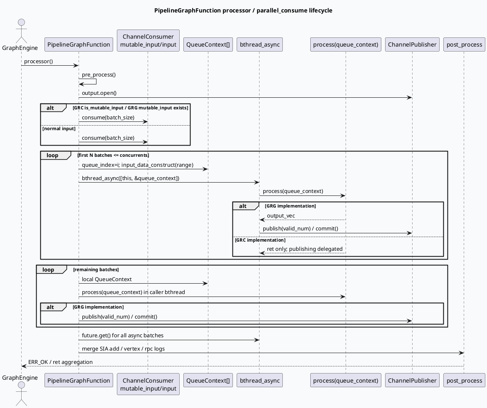

# PipelineGraphFunction parallel_consume 批消费框架

> 日期：2026-06-12  
> 今日主题来源：`daily-plan-20260529.json` Friday base-lib slot  
> 范围：GRC `src/processor/base/pipeline_function.*` 与 GRG `src/process/base/pipeline_function.*` 的 Channel 批消费、bthread 并发、QueueContext 聚合与发布语义。

## 1. 架构全景图：Channel → QueueContext → bthread → post_process

<style>.arch-wrap{font-family:-apple-system,BlinkMacSystemFont,"Segoe UI",sans-serif;background:#f8fafc;border:1px solid #d9e2ec;border-radius:18px;padding:18px;margin:16px 0;color:#243b53}.arch-title{font-size:22px;font-weight:800;margin-bottom:12px;color:#102a43}.arch-grid{display:grid;grid-template-columns:1fr 1.1fr 1fr;gap:12px}.arch-layer{background:#fff;border:1px solid #e3e8ef;border-radius:14px;padding:12px;box-shadow:0 6px 18px rgba(16,42,67,.06)}.arch-layer h3{font-size:15px;margin:0 0 10px;color:#334e68}.arch-box{border-radius:10px;padding:9px 10px;margin:8px 0;background:#edf7ff;border-left:4px solid #3d5a80;font-size:13px;line-height:1.45}.arch-box.green{background:#edfdf5;border-left-color:#2d6a4f}.arch-box.orange{background:#fff7ed;border-left-color:#c2410c}.arch-box.gray{background:#f1f5f9;border-left-color:#64748b}.arch-arrow{text-align:center;font-weight:800;color:#627d98;margin:6px 0}.arch-note{font-size:12px;color:#52606d;margin-top:10px}.arch-badge{display:inline-block;background:#dbeafe;color:#1e3a8a;border-radius:999px;padding:2px 8px;font-size:11px;font-weight:700;margin-left:6px}</style><div class="arch-wrap"><div class="arch-title">PipelineGraphFunction 批消费骨架 <span class="arch-badge">GRC / GRG shared pattern</span></div><div class="arch-grid"><div class="arch-layer"><h3>入口与配置</h3><div class="arch-box">setup：绑定 log_id / uid / cuid / SidInfo / ExpInfo / VertexContext</div><div class="arch-box gray">config：batch_size、concurrents、GRC 额外支持 is_queue / is_mutable_input / phase_name</div><div class="arch-box">processor：pre_process 后打开 output channel</div></div><div class="arch-layer"><h3>批消费与并发</h3><div class="arch-box orange">consumer.consume(batch_size) 拉取 Range</div><div class="arch-arrow">↓</div><div class="arch-box orange">前 concurrents 批：queue_contexts.resize(concurrents)，bthread_async(process)</div><div class="arch-arrow">↓</div><div class="arch-box green">剩余批：本地串行 process，移动到 local_queue_contexts</div></div><div class="arch-layer"><h3>输出与日志聚合</h3><div class="arch-box green">GRG：worker/local 分支内部 publisher->publish + commit</div><div class="arch-box">GRC：publisher 指针保存在基类，子类/vertex_post_process 决定发布</div><div class="arch-box gray">post_process 聚合 sum / vertex / rpc logs；GRG 额外 emit _pipeline_done</div></div></div><div class="arch-note">关键差异：两边同名 parallel_consume 不是完全等价实现；GRG 模板类把输出发布收敛在基类，GRC 基类只负责输入分片与上下文保留。</div></div>

## 2. 核心流程图：一次 processor 调用的生命周期



## 3. 配置与结构信息图

```infographic
infographic list-grid-badge-card
data
  title parallel_consume 的 6 个结构点
  desc 从配置、输入、并发到日志聚合的最小心智模型
  items
    - label batch_size
      desc 每次 consumer.consume 拉取的批大小；GRC setup 从 config 直接写入 context
      icon mdi/package-variant
    - label concurrents
      desc 前 N 个批次进入 bthread_async；queue_contexts 预先 resize 到 N
      icon mdi/source-branch
    - label QueueContext
      desc 承载 rid_vec/rids、output_vec、sum_related_logs、vertex_related_logs、rpc_related_logs
      icon mdi/database-outline
    - label publisher
      desc GRC 保存 publisher 指针；GRG 在基类内直接 publish/commit output_vec
      icon mdi/publish
    - label local tail
      desc 超过并发窗口的剩余批次在当前线程处理，再 move 到上下文列表
      icon mdi/arrow-collapse-down
    - label post_process
      desc 聚合各线程日志；RPC start/end 用 thread_num 做平均
      icon mdi/chart-timeline-variant
```

## 4. 实现细节拆解

### 4.1 GRC：输入分片 + 上下文保留，发布语义留给子类

- `pipeline_function.cpp:73-95`：`processor()` 先 `pre_process()`，打开 `output`，将 `publisher` 指向局部 `channel_publisher`，再按 `context.is_mutable_input()` 决定消费 `mutable_input` 还是 `input`。
- `pipeline_function.h:50-89`：`parallel_consume()` 清空 `context.queue_contexts`，读取第一批 `consumer.consume(context.batch_size(batch_index++))`，前 `concurrents` 批通过 `bthread_async([this, &queue_context])` 调用 `process(queue_context)`。
- `pipeline_function.h:69-78`：超过并发窗口的批次走本地串行 `process(queue_context)`，再 `local_queue_contexts.emplace_back(std::move(queue_context))`。
- `pipeline_function.cpp:113-198`：`post_process()` 聚合每个 `QueueContext` 内的 SIA add、vertex 和 rpc 日志。

### 4.2 GRG：模板化输入/输出类型，基类内完成发布

- `pipeline_function.h:21-31`：GRG 的 `PipelineGraphFunction<T_I, T_O>` 同时模板化输入 `T_I` 与输出 `T_O`。
- `pipeline_function.h:57-114`：`parallel_consume(T& consumer, ChannelPublisher& publisher)` 在 worker 分支和 local 分支都读取 `queue_context.output_vec` 并通过 `publisher->publish(valid_num)` 写出。
- `pipeline_function.hpp:51-68`：`processor()` 负责 `pre_process()`、打开 publisher、调用 `parallel_consume()`、写 `_pipeline_done`、`emit_normal_data()` 和 `post_process()`。
- `pipeline_function.hpp:77-161`：GRG 的日志聚合与 GRC 类似，但数据来自 `queue_contexts` 成员。

## 5. Pitfalls 卡片

<style>.card-frame{font-family:-apple-system,BlinkMacSystemFont,"Segoe UI",sans-serif;margin:18px 0}.pit-card{background:#fffaf0;border:1px solid #f3d19e;border-radius:18px;padding:20px;box-shadow:0 8px 24px rgba(120,53,15,.08);color:#3f2d20}.pit-meta{font-size:12px;font-weight:800;letter-spacing:.08em;color:#9a3412;text-transform:uppercase}.pit-title{font-size:28px;font-weight:900;letter-spacing:-.02em;margin:6px 0 12px}.pit-grid{display:grid;grid-template-columns:1.4fr 1fr;gap:14px}.pit-panel{background:#fff;border-top:4px solid #c2410c;border-radius:12px;padding:12px;font-size:14px;line-height:1.65}.pit-panel strong{color:#7c2d12}.pit-end{font-weight:900;color:#9a3412;margin-top:10px}</style><div class="card-frame"><div class="pit-card"><div class="pit-meta">debug pitfalls</div><div class="pit-title">不要把 parallel_consume 当作“纯并发 for_each”</div><div class="pit-grid"><div class="pit-panel"><strong>生命周期陷阱：</strong>lambda 捕获的是 <code>&queue_context</code>。这里安全的前提是前 N 个 queue_context 来自 resize 后的稳定 vector 槽位；本地 tail 使用局部对象但不跨线程。后续改成动态 emplace 再捕获引用会有悬挂风险。</div><div class="pit-panel"><strong>发布语义陷阱：</strong>GRG 基类会 publish output_vec；GRC 基类不会自动 publish。排查“process 有结果但下游没数据”时，先确认当前是 GRC 还是 GRG 实现。</div></div><div class="pit-end">∎ 重点看 batch/concurrents/publisher 三件事</div></div></div>

## 6. 调试 checklist

```infographic
infographic list-column-done-list
data
  title Pipeline 批消费排查清单
  desc 适用于吞吐下降、下游空数据、SIA 日志异常、RPC 耗时归因异常
  items
    - label 确认入口分支
      desc GRC 看 context.is_mutable_input；GRG 看 mutable_input 是否存在
      done true
    - label 打印 batch_size 与 concurrents
      desc 并发窗口过小会退化；过大可能放大下游 RPC/内存压力
      done true
    - label 检查 input_data_construct
      desc 是否过滤 nullptr；rid_vec/rids 是否和 range 对齐
      done true
    - label 对齐发布语义
      desc GRG 查 output_vec publish；GRC 查子类 vertex_post_process 或 publisher 使用点
      done true
    - label future.get 后看 ret
      desc 任一 worker 非 ERR_OK 会覆盖整体 ret，但 GRC processor 当前没有接住 parallel_consume 返回值
      done false
    - label 校验 SIA 聚合
      desc sum 是累加；vertex 取最早 start / 最晚 end；rpc start/end 按 thread_num 平均
      done true
```

## 7. 证据来源

- `src/processor/base/pipeline_function.h:50-89`：GRC `parallel_consume` 主体。
- `src/processor/base/pipeline_function.cpp:73-95`：GRC `processor` 打开 output、选择 input 分支。
- `src/processor/base/pipeline_function.cpp:113-198`：GRC `post_process` 聚合日志。
- `src/process/base/pipeline_function.h:57-114`：GRG `parallel_consume` 主体与 publish/commit。
- `src/process/base/pipeline_function.hpp:51-68`：GRG `processor` 生命周期。
- `src/process/base/pipeline_function.hpp:77-161`：GRG `post_process` 日志聚合。

## 8. 本次检索限制

未使用 KU 正文补充；本笔记基于本地代码检索。若需要补齐历史设计背景，可人工补充 graph-engine / ChannelConsumer 相关内部文档。