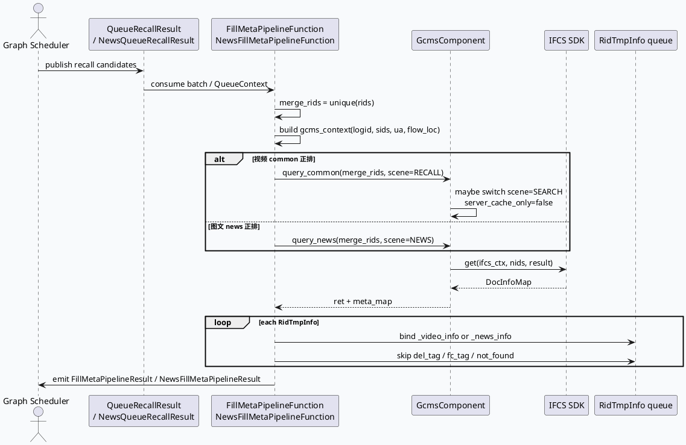

# GcmsComponent / IFCS 双场景 FillMeta 正排架构（2026-06-19）

> 本次 cron 未发现 `daily-plan-20260619.json`，按缺省主题回退到 GRC 正排补全链路。内网 KU 未提供 URL/doc-id，需人工补充策略背景；本文以代码库证据为准。

## 一、架构全景

<style>.arch-gcms{font-family:-apple-system,BlinkMacSystemFont,"Segoe UI",sans-serif;background:#f8fafc;border:1px solid #dbe4ee;border-radius:18px;padding:18px;color:#1f2937}.arch-gcms .title{font-size:24px;font-weight:800;margin-bottom:6px}.arch-gcms .sub{font-size:13px;color:#64748b;margin-bottom:16px}.arch-gcms .layer{border-radius:14px;padding:14px;margin:10px 0;border:1px solid #d6e0ea}.arch-gcms .l1{background:#eef6ff}.arch-gcms .l2{background:#f1f8f4}.arch-gcms .l3{background:#fff7ed}.arch-gcms .l4{background:#f5f3ff}.arch-gcms .grid{display:grid;grid-template-columns:repeat(4,1fr);gap:10px}.arch-gcms .box{background:white;border:1px solid #d8dee9;border-radius:12px;padding:10px;box-shadow:0 2px 8px rgba(15,23,42,.05)}.arch-gcms .box b{display:block;font-size:14px;margin-bottom:4px}.arch-gcms .box span{font-size:12px;color:#64748b;line-height:1.45}.arch-gcms .arrow{text-align:center;color:#3d5a80;font-weight:700;margin:4px 0}.arch-gcms .tag{display:inline-block;background:#dbeafe;color:#1d4ed8;border-radius:999px;padding:2px 8px;font-size:11px;margin-left:6px}</style><div class="arch-gcms"><div class="title">GRC FillMeta 正排补全：视频 / 图文双场景统一入口</div><div class="sub">核心思想：Pipeline 节点先聚合候选 rid，再通过 GcmsComponent 封装 IFCS SDK，按场景选择 common/news 正排，最后回填到 RidTmpInfo 并过滤无效内容。</div><div class="layer l1"><b>入口与队列层</b><div class="grid"><div class="box"><b>DsToRidInfoPipeline</b><span>召回 native 结果转内部 RidTmpInfo 队列</span></div><div class="box"><b>FillMetaPipelineFunction</b><span>视频正排：消费 QueueRecallResult</span></div><div class="box"><b>NewsFillMetaPipelineFunction</b><span>图文正排：消费 NewsQueueRecallResult</span></div><div class="box"><b>GraphData / Channel</b><span>通过 @depend/@emit 串联 Pipeline</span></div></div></div><div class="arrow">↓ 聚合 rid、构造 gcms_context、携带 sid / ua / flow_loc</div><div class="layer l2"><b>正排访问层 <span class="tag">GcmsComponent</span></b><div class="grid"><div class="box"><b>query_common()</b><span>视频 / 小视频 / 动态等 common 正排</span></div><div class="box"><b>query_news()</b><span>图文场景固定 GCMS_SECNE_NEWS</span></div><div class="box"><b>IFCS Context</b><span>log_id、scene、sids、server_cache_only</span></div><div class="box"><b>IfcsSdk&lt;BaseDocInfo&gt;</b><span>统一 SDK get(nids, result)</span></div></div></div><div class="arrow">↓ 返回 DocInfoMap&lt;MicroVideoInfo / NewsInfo&gt;</div><div class="layer l3"><b>回填与过滤层</b><div class="grid"><div class="box"><b>_video_info</b><span>common 正排命中后绑定 MicroVideoInfo</span></div><div class="box"><b>_news_info</b><span>news 正排命中后绑定 NewsInfo</span></div><div class="box"><b>del_tag / fc_tag</b><span>安全删除标与 fc_tag 过滤</span></div><div class="box"><b>keep_num resize</b><span>未命中正排或被过滤的候选从队列剔除</span></div></div></div><div class="layer l4"><b>观测与调试层</b><div class="grid"><div class="box"><b>SIA</b><span>fill_meta_gcms_pb_rpc / fill_meta_fill 等耗时与数量</span></div><div class="box"><b>GCMS 日志</b><span>not found、del tag、fc tag 等原因</span></div><div class="box"><b>open_gcms_statistics</b><span>采样打印缺失 nid 列表</span></div><div class="box"><b>handle_name</b><span>区分不同召回分支的正排节点</span></div></div></div></div>

## 二、核心流程图



## 三、配置 / 结构信息图

```infographic list-grid-badge-card
data
  title FillMeta 双链路关键结构
  desc 从 graph 配置到 IFCS 查询的最小闭环
  items
    - label 视频队列入口
      desc queue_vertex.conf:24-57 绑定 FillMetaPipelineFunction，输入 QueueRecallResult，输出 FillMetaPipelineResult
      icon mdi/video
    - label 图文队列入口
      desc news_queue_vertex.conf:1-13 绑定 NewsFillMetaPipelineFunction，输入 NewsQueueRecallResult，输出 NewsFillMetaPipelineResult
      icon mdi/newspaper
    - label common 场景切换
      desc gcms_component.cpp:40-79 根据 ua/flow_loc/sid 将部分请求改为 GCMS_SECNE_SEARCH
      icon mdi/source-branch
    - label news 固定场景
      desc gcms_component.cpp:80-101 使用 GCMS_SECNE_NEWS 查询 NewsInfo
      icon mdi/file-document
    - label 过滤出口
      desc fill_meta.cpp:306-315 / news_fill_meta_pipeline.cpp:94-146 命中正排才保留候选
      icon mdi/filter
```

## 四、关键代码解读

### 1. GcmsComponent 是 IFCS 的场景适配器

`gcms_component.cpp:18-31` 在初始化时创建并初始化 `IfcsSdk<BaseDocInfo>`；`query_common()` 和 `query_news()` 则负责把 GRC 运行时上下文转换成 IFCS 上下文。common 场景里最容易漏看的是 `server_cache_only`：默认只走服务端缓存，但在特定 `ua/flow_loc/sid` 命中时切到搜索场景并关闭 cache-only。

### 2. FillMeta 先全量查，再逐队列回填

`fill_meta.cpp:191-245` 先遍历所有匿名依赖队列，聚合 `merge_rids`，然后一次性调用 `GcmsComponent::query_common()`。这样减少 RPC 次数，但也意味着单次 `merge_rids` 过大时会把正排 RPC、解析、过滤压力集中在一个阶段。

### 3. 图文链路更加短闭环

`news_fill_meta_pipeline.cpp:33-68` 在每个 `QueueContext` 内构造 `merge_rids` 并调用 `query_news()`；`news_fill_meta_pipeline.cpp:89-146` 对每条候选按 `meta_map` 命中情况回填 `_news_info`，未命中直接记录 `not found, deleted` 并不进入后续队列。

## 五、Pitfalls 卡片

<style>.pit-gcms{font-family:-apple-system,BlinkMacSystemFont,"Segoe UI",sans-serif;background:#fffaf0;border-left:6px solid #d97706;border-radius:14px;padding:18px;margin:18px 0;color:#2f2418;box-shadow:0 3px 14px rgba(120,53,15,.08)}.pit-gcms .meta{font-size:12px;font-weight:800;letter-spacing:.08em;text-transform:uppercase;color:#92400e}.pit-gcms .headline{font-size:24px;font-weight:850;margin:6px 0 10px}.pit-gcms .grid{display:grid;grid-template-columns:1.3fr 1fr;gap:14px}.pit-gcms .panel{background:rgba(255,255,255,.72);border:1px solid #fed7aa;border-radius:12px;padding:12px}.pit-gcms b{color:#7c2d12}.pit-gcms p{margin:0;font-size:14px;line-height:1.65}</style><div class="pit-gcms"><div class="meta">Pitfalls · FillMeta</div><div class="headline">正排失败不只是 RPC 失败，也可能是场景 / 标记过滤</div><div class="grid"><div class="panel"><p><b>现象：</b>候选在召回后消失，排查时只看 IFCS ret=0 容易误判。common/news 都会在 meta 命中后继续检查 del_tag、fc_tag、vertical_type 等字段。</p></div><div class="panel"><p><b>建议：</b>同时查 `GCMS` 日志、SIA 的 after-gcms 数量、`open_gcms_statistics` 采样缺失 nid；确认 `ua/flow_loc/sid` 是否导致 scene 切换。</p></div></div></div>

## 六、调试 checklist

```infographic list-column-done-list
data
  title FillMeta 排障清单
  desc 从配置连线、IFCS 场景到队列保留数逐层定位
  items
    - label 确认 graph 节点连线
      desc queue_vertex.conf / news_queue_vertex.conf 的输入输出 data 名是否与上游一致
      done true
    - label 检查 IFCS 初始化
      desc gcms_component.cpp:18-31 失败会 FATAL；关注 ifcs_sdk.conf 是否加载
      done true
    - label 复核 scene 与 cache-only
      desc query_common 的搜索场景条件可能改变正排来源和命中率
      done true
    - label 对比 merge_rids 与 meta_map
      desc open_gcms_statistics 打开后看 total nid size / after gcms rpc nid size
      done true
    - label 追踪过滤原因
      desc GCMS 日志里区分 not found、del_tag、fc_tag、gcms data null
      done true
```

## 七、证据来源

- `src/main.cpp:39-85`：GRG/GRC 类服务入口模式参考，服务初始化与 brpc 注册。
- `src/plugin/gcms_component.cpp:18-31`：IFCS SDK 初始化。
- `src/plugin/gcms_component.cpp:40-79`：common 正排查询与搜索场景切换。
- `src/plugin/gcms_component.cpp:80-101`：news 正排查询。
- `src/processor/fill_meta.cpp:191-245`：视频候选聚合并调用 common 正排。
- `src/processor/fill_meta.cpp:306-315`：命中后绑定 `_video_info` / `gcms_data`。
- `src/processor/fill_meta.cpp:467-563`：fc_tag / del_tag 过滤。
- `src/processor/video_launch/news_fill_meta_pipeline.cpp:33-68`：图文正排查询。
- `src/processor/video_launch/news_fill_meta_pipeline.cpp:89-146`：图文回填、删除标过滤与 keep_num 压缩。
- `conf/plugins/graph/queue_vertex.conf:24-57`：视频 FillMetaPipelineFunction 配置。
- `conf/plugins/graph/news_queue_vertex.conf:1-13`：图文 NewsFillMetaPipelineFunction 配置。

---

## 七、业务代码库适配分析
> **分析时间**：2026-07-20T19:04:44.968140
> **目标代码库**：feeda-mv-grg（序列生成）、feeda-mv-grc（召回汇聚）

## 业务代码库适配分析

### 1. 分析摘要

- 从扫描结果看，**GcmsComponent / IFCS FillMeta 正排补全架构主要落在 `feeda-mv-grc` 召回汇聚服务中**，已经发现 `plugin/gcms_component.cpp`、`processor/news_fill_meta.cpp`、`processor/video_launch/news_fill_meta_pipeline.cpp` 等文件直接使用相关能力，可作为后续适配、扩展和性能优化的参考实现。

- `feeda-mv-grg` 序列生成服务目前**尚未发现直接使用 GcmsComponent / IFCS 正排补全链路**。该服务中 `std::vector`、`std::string`、`std::unordered_map` 使用规模较大，说明候选集、特征、模型输入等内存容器操作较频繁；如果未来需要引入正排补全能力，应优先考虑在 `feeda-mv-grc` 完成 meta 补全后传递给 GRG，避免在 GRG 模型预测链路中新增高延迟 RPC。

- 总体来看，迁移潜力集中在两类场景：
  - **GRC 内部继续统一 FillMeta 正排访问方式**，减少重复 IFCS 调用逻辑。
  - **对现有 batch 聚合、去重、回填、过滤逻辑做性能优化**，降低大规模候选下的 RPC 压力、哈希表扩容成本和队列压缩成本。

---

### 2. 代码库详情

#### feeda-mv-grg

- **当前状态**
  - 尚未发现 GcmsComponent / IFCS FillMeta 目标架构的直接使用。
  - 该代码库更偏向序列生成、模型预测、特征消费等后链路处理。
  - 已扫描到大量 STL 容器使用：
    - `std::vector`：1969 次，分布在 356 个文件
    - `std::string`：2443 次，分布在 425 个文件
    - `std::unordered_map`：734 次，分布在 205 个文件

- **典型文件**
  - `model/model.h`
    - `Model::predict(std::vector<RidTmpInfoPtr>& candidate_vec, uint32_t pos)` 表明模型预测入口直接消费候选列表。
  - `model/paddle_model.h`
    - `predict()`、`predict_with_tensor_input()` 均以 `std::vector<RidTmpInfoPtr>& candidate_vec` 作为输入。
    - 说明 GRG 的核心性能瓶颈更可能来自候选遍历、特征构造、模型推理前处理，而不是正排 RPC。

- **适配判断**
  - 不建议在 `feeda-mv-grg` 中直接复制 `GcmsComponent` 查询 IFCS。
  - 如果 GRG 需要 `_video_info`、`_news_info`、`gcms_data` 等信息，优先通过 GRC 在 FillMeta 阶段补齐后下传。
  - GRG 更适合关注：
    - 候选 vector 的复用与预分配；
    - 模型输入构造中的 string 拷贝减少；
    - `unordered_map` 查询热点的 reserve 和 key 类型优化。

#### feeda-mv-grc

- **当前状态**
  - 已发现 GcmsComponent / IFCS 相关使用，可认为该代码库已经具备目标架构落地经验。
  - 直接相关文件包括：
    - `plugin/gcms_component.cpp`
    - `initializer/global.h`
    - `processor/news_fill_meta.cpp`
    - `processor/reddot/dibar_reddot_rank_duanju.cpp`
    - `processor/video_launch/news_fill_meta_pipeline.cpp`

- **现有 STL 使用规模**
  - `std::vector`：8442 次，分布在 1279 个文件
  - `std::string`：7170 次，分布在 1234 个文件
  - `std::unordered_map`：2834 次，分布在 639 个文件

- **典型文件**
  - `plugin/gcms_component.cpp`
    - 是 IFCS SDK 的主要封装点。
    - `query_common()` 负责 common 正排，并包含 `GCMS_SECNE_SEARCH` 场景切换逻辑。
    - `query_news()` 负责 news 正排，固定使用 `GCMS_SECNE_NEWS`。
    - 可作为后续所有正排访问的统一参考。
  - `processor/video_launch/news_fill_meta_pipeline.cpp`
    - 图文链路中按 `QueueContext` 聚合 rid，调用 `query_news()`，再回填 `_news_info`。
    - 可作为短闭环 FillMeta 的参考实现。
  - `processor/news_fill_meta.cpp`
    - 已存在 news fill meta 逻辑，建议与 `video_launch/news_fill_meta_pipeline.cpp` 对齐，避免重复实现。
  - `processor/fill_meta.cpp`
    - 视频 common 正排链路的核心处理文件。
    - 当前逻辑先聚合 `merge_rids`，再一次性查询 GcmsComponent，适合做批量优化。

---

### 3. 💡 适用性评估与建议

- **建议 1：以 `plugin/gcms_component.cpp` 作为唯一 IFCS 访问入口，避免业务 Processor 直接操作 IFCS SDK**
  - 适用文件：
    - `plugin/gcms_component.cpp`
    - `processor/fill_meta.cpp`
    - `processor/news_fill_meta.cpp`
    - `processor/video_launch/news_fill_meta_pipeline.cpp`
  - 当前 `plugin/gcms_component.cpp` 已经封装了：
    - IFCS SDK 初始化；
    - common/news 场景切换；
    - `server_cache_only` 控制；
    - `log_id`、`scene`、`sids` 等上下文透传。
  - 后续如果新增短视频、动态、红点、图文召回等正排补全场景，应优先新增 `GcmsComponent` 方法或参数化现有方法，而不是在 `processor/*` 中直接创建 `IfcsSdk<BaseDocInfo>`。
  - 这样可以避免：
    - 多处 IFCS 配置不一致；
    - scene 枚举误用；
    - cache-only 策略分叉；
    - 日志和 SIA 指标不可比。

- **建议 2：优化 `processor/fill_meta.cpp` 中 `merge_rids` 的构造与去重，降低大批候选下的容器扩容成本**
  - 适用文件：
    - `processor/fill_meta.cpp`
  - 现有逻辑在 `fill_meta.cpp:191-245` 会遍历多个匿名依赖队列，聚合所有 rid 后统一调用 `GcmsComponent::query_common()`。
  - 建议优化点：
    - 在聚合前预估总候选数，对 `std::vector` 执行 `reserve()`；
    - 如果使用 `std::unordered_map` / `std::unordered_set` 做 rid 去重，也应提前 `reserve()`；
    - 对重复 rid 较多的召回分支，建议先在单队列内局部去重，再进入全局 `merge_rids`；
    - 对超大 `merge_rids` 增加分片查询，例如每批 500 或 1000 个 nid，避免单次 IFCS RPC 尾延迟放大。
  - 迁移收益：
    - 减少 vector 扩容和 rehash；
    - 降低单次 IFCS 请求体大小；
    - 改善 FillMeta 阶段 P99 延迟。

- **建议 3：统一 `processor/news_fill_meta.cpp` 与 `processor/video_launch/news_fill_meta_pipeline.cpp` 的图文 FillMeta 行为**
  - 适用文件：
    - `processor/news_fill_meta.cpp`
    - `processor/video_launch/news_fill_meta_pipeline.cpp`
  - 扫描结果显示两个文件都与 news fill meta 相关，建议确认是否存在重复逻辑：
    - rid 聚合方式是否一致；
    - `query_news()` 调用参数是否一致；
    - `_news_info` 回填条件是否一致；
    - `del_tag`、`fc_tag`、`vertical_type` 等过滤策略是否一致；
    - keep_num 压缩逻辑是否一致。
  - 如果两套逻辑存在差异，建议抽出公共 helper，例如：
    - `BuildNewsGcmsContext()`
    - `QueryNewsMetaBatch()`
    - `FillNewsInfoAndFilter()`
  - 这样可以降低图文链路策略分叉风险，也方便统一埋点和日志。

- **建议 4：在 `processor/reddot/dibar_reddot_rank_duanju.cpp` 引用正排信息时，优先复用已回填的 meta，避免二次查询**
  - 适用文件：
    - `processor/reddot/dibar_reddot_rank_duanju.cpp`
    - `processor/fill_meta.cpp`
    - `plugin/gcms_component.cpp`
  - 扫描结果显示红点短剧相关 processor 也涉及目标库使用。
  - 建议排查该文件中是否存在独立正排查询或重复 meta 解析。
  - 如果前置 FillMeta 已经在 `RidTmpInfo` 中绑定 `_video_info` 或 `gcms_data`，红点排序阶段应直接读取已有字段。
  - 只有在以下场景才建议补充查询：
    - 上游召回链路没有经过 FillMeta；
    - 该 processor 依赖的字段不在 common 正排返回结构中；
    - 业务需要不同 scene 下的正排结果。
  - 否则二次查询会增加 IFCS RPC 压力，并可能导致同一 rid 在不同 scene 下命中结果不一致。

- **建议 5：`feeda-mv-grg` 暂不直接引入 GcmsComponent，优先约束输入数据契约**
  - 适用文件：
    - `model/model.h`
    - `model/paddle_model.h`
  - `model/model.h` 和 `model/paddle_model.h` 的模型预测接口均消费 `std::vector<RidTmpInfoPtr>& candidate_vec`。
  - 如果模型特征依赖正排字段，建议在 GRC 输出给 GRG 前完成：
    - `_video_info` 补全；
    - `_news_info` 补全；
    - 删除标过滤；
    - fc_tag 过滤；
    - 无效候选剔除。
  - GRG 侧只做字段消费，不做 IFCS 查询。
  - 这样可以保证：
    - 模型预测链路延迟稳定；
    - 避免推理阶段出现外部 RPC；
    - 正排过滤口径集中在 GRC，便于排障。

---

### 4. ⚠️ 引入风险与限制

- **风险 1：scene 切换会影响正排命中率，不能只看 IFCS ret**
  - `plugin/gcms_component.cpp` 中 `query_common()` 会根据 `ua`、`flow_loc`、`sid` 等条件切换到 `GCMS_SECNE_SEARCH`，并调整 `server_cache_only`。
  - 这意味着同一个 nid 在不同请求上下文中可能命中不同正排源。
  - 排查候选丢失时，需要同时检查：
    - IFCS 返回码；
    - scene；
    - `server_cache_only`；
    - `del_tag`；
    - `fc_tag`；
    - `vertical_type`；
    - `not found` 日志。

- **风险 2：大批量 `merge_rids` 会集中放大 RPC 和解析开销**
  - `processor/fill_meta.cpp` 中视频链路采用先聚合再统一查询的方式。
  - 优点是减少 RPC 次数，缺点是单次请求过大时会导致：
    - 请求序列化成本上升；
    - IFCS 响应解析成本上升；
    - meta_map 内存峰值上升；
    - FillMeta 阶段尾延迟变差。
  - 建议为 `merge_rids` 增加批大小上限，并对超大召回分支做分片查询。

- **风险 3：news 与 common 的过滤口径可能不完全一致**
  - `processor/fill_meta.cpp` 处理视频 common 正排。
  - `processor/video_launch/news_fill_meta_pipeline.cpp` 处理图文 news 正排。
  - 两条链路虽然都经过 GcmsComponent，但回填字段和过滤条件不同。
  - 迁移或复用代码时不能简单把 `_video_info` 逻辑套到 `_news_info` 上，需要确认：
    - 删除标字段；
    - fc_tag 字段；
    - 内容类型字段；
    - keep_num 压缩策略；
    - 日志原因枚举。

- **风险 4：GRG 侧直接引入正排 RPC 可能破坏模型服务延迟稳定性**
  - `feeda-mv-grg` 当前没有直接使用目标架构。
  - 虽然该代码库中 `std::vector`、`std::unordered_map` 使用规模较大，说明候选处理量不小，但这不代表适合引入 IFCS 查询。
  - 模型预测服务通常对 P99 延迟更敏感。
  - 如果在 `model/paddle_model.h` 的预测路径中增加正排 RPC，可能导致：
    - 推理耗时不可控；
    - 外部依赖故障影响模型服务；
    - 候选过滤口径分散；
    - GRC 与 GRG 观测指标割裂。

---

### 5. 可参考落地路径

- **短期**
  - 以 `plugin/gcms_component.cpp` 为统一入口，禁止新增 Processor 直接访问 IFCS SDK。
  - 对 `processor/fill_meta.cpp` 的 `merge_rids` 增加 `reserve()` 和批大小保护。
  - 对 `processor/video_launch/news_fill_meta_pipeline.cpp` 补充更细粒度的 not found / del_tag / fc_tag 统计。

- **中期**
  - 合并或抽象 `processor/news_fill_meta.cpp` 与 `processor/video_launch/news_fill_meta_pipeline.cpp` 中重复的 news 回填逻辑。
  - 为 common/news FillMeta 提供统一的指标维度：
    - 请求 nid 数；
    - IFCS 返回数；
    - not found 数；
    - 删除过滤数；
    - fc_tag 过滤数；
    - 最终 keep 数。

- **长期**
  - 将 GRC 输出给 GRG 的 `RidTmpInfo` 数据契约固定下来。
  - GRG 的 `model/model.h`、`model/paddle_model.h` 只消费已补齐字段，不承担正排查询职责。
  - 对高频 `std::vector` / `std::unordered_map` 热点路径进行专项 profiling，再决定是否进一步替换为更高性能容器或引入对象池。

---
*本章节由 Hermes Agent 自动分析生成，基于代码库静态扫描结果。*
