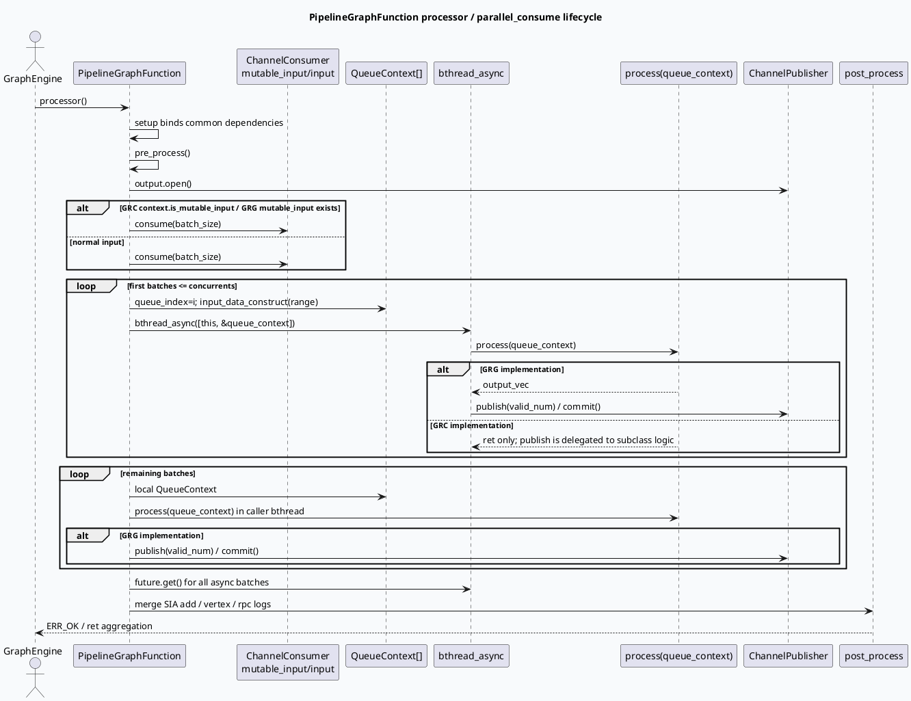

# 2026-06-20 周度代码理解：PipelineGraphFunction 批消费框架与 GRC/GRG 发布语义

> 本文面向排查 GRC/GRG C++ 服务中 Pipeline 型图节点的吞吐下降、下游空数据、SIA 耗时归因异常与 Dapper 长尾断链问题。  
> 本次未使用 KU 正文检索补充；如需历史设计背景，需人工补充 graph-engine / ChannelConsumer 内部文档。

## 1. 架构全景图：Channel 批消费如何穿过 GraphFunction

<style>.arch-wrap{font-family:-apple-system,BlinkMacSystemFont,"Segoe UI",sans-serif;background:#f8fafc;border:1px solid #d9e2ec;border-radius:18px;padding:18px;margin:16px 0;color:#243b53}.arch-title{font-size:22px;font-weight:800;margin-bottom:12px;color:#102a43}.arch-grid{display:grid;grid-template-columns:1fr 1.1fr 1fr;gap:12px}.arch-layer{background:#fff;border:1px solid #e3e8ef;border-radius:14px;padding:12px;box-shadow:0 6px 18px rgba(16,42,67,.06)}.arch-layer h3{font-size:15px;margin:0 0 10px;color:#334e68}.arch-box{border-radius:10px;padding:9px 10px;margin:8px 0;background:#edf7ff;border-left:4px solid #3d5a80;font-size:13px;line-height:1.45}.arch-box.green{background:#edfdf5;border-left-color:#2d6a4f}.arch-box.orange{background:#fff7ed;border-left-color:#c2410c}.arch-box.gray{background:#f1f5f9;border-left-color:#64748b}.arch-arrow{text-align:center;font-weight:800;color:#627d98;margin:6px 0}.arch-note{font-size:12px;color:#52606d;margin-top:10px}.arch-badge{display:inline-block;background:#dbeafe;color:#1e3a8a;border-radius:999px;padding:2px 8px;font-size:11px;font-weight:700;margin-left:6px}</style><div class="arch-wrap"><div class="arch-title">PipelineGraphFunction 批消费骨架 <span class="arch-badge">GRC / GRG shared pattern</span></div><div class="arch-grid"><div class="arch-layer"><h3>入口与配置</h3><div class="arch-box">setup：绑定 log_id / uid / cuid / SidInfo / ExpInfo / VertexContext</div><div class="arch-box gray">config：batch_size、concurrents；GRC 额外支持 is_queue / is_mutable_input / phase_name</div><div class="arch-box">processor：pre_process 后打开 output channel</div></div><div class="arch-layer"><h3>批消费与并发</h3><div class="arch-box orange">consumer.consume(batch_size) 拉取一个 Range</div><div class="arch-arrow">↓</div><div class="arch-box orange">前 N 批进入 queue_contexts.resize(concurrents) 后的稳定槽位，并通过 bthread_async(process)</div><div class="arch-arrow">↓</div><div class="arch-box green">超过并发窗口的剩余批次在当前线程串行处理，再 move 到本地上下文列表</div></div><div class="arch-layer"><h3>输出与收尾</h3><div class="arch-box">future.get 聚合 worker 返回值</div><div class="arch-box green">GRG：基类读取 output_vec 并 publish/commit</div><div class="arch-box orange">GRC：基类只持有 publisher 指针，是否 publish 由子类 process / input_data_construct 决定</div><div class="arch-box gray">post_process 聚合 SIA add / vertex / rpc 日志</div></div></div><div class="arch-note">核心差异：GRC 更像“批分片 + 上下文保留”，GRG 更像“批分片 + 基类统一发布”。排查下游空数据时必须先分清这两个模型。</div></div>

## 2. 主题选择与范围

本次主题选择 **PipelineGraphFunction parallel_consume 批消费框架**，原因是它位于 GRC/GRG 推荐服务的图引擎热路径：召回结果、正排填充、过滤、粗排、特征抽取等节点都依赖 Channel 批消费。这个框架看似只是“按 batch 并发处理”，但 GRC 与 GRG 在发布语义、返回值处理、Dapper 绑定、`_pipeline_done` 标记上都有差异。

重点阅读范围：

- GRC 基类：`src/processor/base/pipeline_function.h:50-89`、`src/processor/base/pipeline_function.cpp:73-198`。
- GRC 子类：`ds_to_ridinfo_pipeline.cpp:24-99`、`fill_meta_pipeline.cpp:26-47`、`filter_pipeline.cpp:60-65`、`sketchy_rpc_pipeline.cpp:58-84`。
- GRG 基类：`src/process/base/pipeline_function.h:21-31`、`src/process/base/pipeline_function.h:57-114`、`src/process/base/pipeline_function.hpp:51-161`。
- GRG 子类与配置：`fill_meta_pipeline.cpp:12-40`、`filter_pipeline_function.cpp:11-23`、`conf_template/recall_pipeline.conf:1-47`、`conf_value/recall_pipeline.conf:1-43`。

## 3. 核心流程图：一次 processor 调用的生命周期



## 4. 配置结构信息图：哪些参数真正改变执行形态

```infographic
infographic list-grid-badge-card
data
  title Pipeline 批消费的关键旋钮
  desc 从配置、输入、并发到日志聚合的最小心智模型
  items
    - label batch_size
      desc 每次 consumer.consume 拉取的批大小；GRC queue_vertex.conf 中 SketchyRpcPipeline 可显式设为 600
      icon mdi/package-variant
    - label concurrents
      desc 前 N 个批次进入 bthread_async；GRG recall_pipeline 模板支持 fill_meta/filter/doc_feature 级别覆盖
      icon mdi/source-branch
    - label QueueContext
      desc 承载 rid_vec/rids、output_vec、sum_related_logs、vertex_related_logs、rpc_related_logs
      icon mdi/database-outline
    - label is_mutable_input
      desc GRC 通过配置决定消费 MutableChannelConsumer；GRG 通过 mutable_input 是否存在判断
      icon mdi/swap-horizontal
    - label publisher
      desc GRC 保存 publisher 指针交给子类；GRG 基类直接 publish output_vec
      icon mdi/publish
    - label post_process
      desc 聚合 SIA：sum 累加，vertex 取最早 start/最晚 end，rpc start/end 按 thread_num 平均
      icon mdi/chart-timeline-variant
```

## 5. GRC 实现拆解：基类不保证自动发布

GRC 的 `PipelineGraphFunction` 基类负责分片、并发与日志聚合，但不统一处理每个 `QueueContext` 的输出发布。

关键点：

1. `processor()` 先执行 `pre_process()`，再打开 `output`，将 `publisher` 指向局部 `ChannelPublisher`；随后按 `context.is_mutable_input()` 选择 `mutable_input` 或 `input`。
2. `parallel_consume()` 会：
   - 清空 `context.queue_contexts`；
   - 读取第一批 `consumer.consume(context.batch_size(batch_index++))`；
   - 对前 `concurrents` 批复用 `context.queue_contexts[i]`，通过 `bthread_async([this, &queue_context])` 调用子类 `process()`；
   - 超出并发窗口的批次在本地串行执行，再 move 到 `local_queue_contexts`；
   - `future.get()` 后汇总非 0 返回值。
3. `post_process()` 聚合每个 `QueueContext` 内的 SIA 信息：`sum_related_logs` 累加、`vertex_related_logs` 合并窗口、`rpc_related_logs` 用有 RPC 日志的线程数求平均。

GRC 子类的差异会直接影响下游是否有数据：

- `DsToRidInfoPipelineVertex` 没有完全复用基类 `parallel_consume`，它自己打开 `_queue_recall_result` 与 `_queue_news_recall_result` 两个 publisher，并把 video/news 分流发布。
- `FillMetaPipelineFunction` 自定义 `processor()`，把 `_queue_recall_result` 移入 `mutable_input`，设置 `batch_opt=3`，并把输出拆成普通 fill_meta 与 card fill_meta 两路。
- `FilterPipelineFunction` 设置 `batch_opt=6` 后回到基类 `processor()`，但真正 publish 发生在 `process()` 内。
- `SketchyRpcPipelineFunction` 在 `input_data_construct()` 内对重复 nid 或 function mark 提前 publish，不进入粗排 RPC；新 nid 才进入 `queue_context.rid_vec`。

因此，在 GRC 中不能只看 `process()` 是否有结果，还要看子类是否调用 `publisher->publish()` / `commit()`，以及是否存在提前分流或提前发布。

## 6. GRG 实现拆解：模板化类型 + 基类统一发布

GRG 的 `PipelineGraphFunction<T_I, T_O>` 更强约束了输入/输出类型，并把发布语义放在基类中。

关键点：

1. 模板参数 `T_I` / `T_O` 定义 Channel 输入与输出类型，`QueueContext` 是 `PipelineContext<T_I, T_O>`。
2. `parallel_consume(T& consumer, ChannelPublisher& publisher)` 在 worker 分支和 local 分支都会读取 `queue_context.output_vec`：如果 `valid_num > 0`，基类直接 `publisher->publish(valid_num)`、`copy_n()`、`commit()`。
3. `processor()` 在批消费后还会写 `_pipeline_done`，再调用 `emit_normal_data()` 与 `post_process()`。
4. `FillMetaPipelineFunction` / `FilterPipelineFunction` 初始化时都有注释：Dapper 对 pipeline 类型产出需要手动绑定 vertex，否则长尾路径会断链；对应代码调用 `set_graph_vertex(context.get_vertex())`。

GRG 的配置更模板化：

- `conf_template/recall_pipeline.conf:1-47` 定义 FillMeta 与 Filter 的模板，包含 `pipe_name`、`batch_size`、`concurrents`。
- `short_micro_video/conf_value/recall_pipeline.conf:1-43` 用同一模板展开 loads、rule、function、effect、news、news_rule 等队列。
- function/effect/news 等队列在 feature/extract 环节显式给出 `extract_batch_size` 与 `extract_concurrents`，而 loads/rule 主要约束 doc_feature 的 batch/concurrents。

## 7. GRC vs GRG 对照表

| 维度 | GRC | GRG | 排查含义 |
|---|---|---|---|
| 基类类型 | 非模板 `PipelineGraphFunction`，主要处理 `RidTmpInfo*` | `PipelineGraphFunction<T_I,T_O>` 模板化输入输出 | GRG 更容易从类型上定位输出；GRC 要看子类 publish 点 |
| 输入选择 | `context.is_mutable_input()` 决定 | `mutable_input` 是否存在决定 | 配置与 `pre_process()` 都要查 |
| 输出发布 | 基类保存 `publisher` 指针，子类自行 publish | 基类统一发布 `output_vec` | “下游空数据”在 GRC 先查子类；GRG 先查 output_vec |
| pipeline done | 未统一写 `_pipeline_done` | `processor()` 可写 `_pipeline_done=true` | GRG 下游依赖 done 时要查 named_emit |
| Dapper 绑定 | 常规 GraphVertex 绑定 | pipeline 产出需手动 set_graph_vertex | GRG 长尾断链优先查 init 中绑定 |
| 日志聚合 | `context.queue_contexts` | 成员 `queue_contexts` | 聚合语义相似，但容器位置不同 |

## 8. Pitfalls 卡片

<style>.card-frame{font-family:-apple-system,BlinkMacSystemFont,"Segoe UI",sans-serif;margin:18px 0}.pit-card{background:#fffaf0;border:1px solid #f3d19e;border-radius:18px;padding:20px;box-shadow:0 8px 24px rgba(120,53,15,.08);color:#3f2d20}.pit-meta{font-size:12px;font-weight:800;letter-spacing:.08em;color:#9a3412;text-transform:uppercase}.pit-title{font-size:28px;font-weight:900;letter-spacing:-.02em;margin:6px 0 12px}.pit-grid{display:grid;grid-template-columns:1.35fr 1fr;gap:14px}.pit-panel{background:#fff;border-top:4px solid #c2410c;border-radius:12px;padding:12px;font-size:14px;line-height:1.65}.pit-panel strong{color:#7c2d12}.pit-end{font-weight:900;color:#9a3412;margin-top:10px}</style><div class="card-frame"><div class="pit-card"><div class="pit-meta">debug pitfalls</div><div class="pit-title">不要把 parallel_consume 当作“纯并发 for_each”</div><div class="pit-grid"><div class="pit-panel"><strong>生命周期陷阱：</strong>lambda 捕获的是 <code>&queue_context</code>。这里安全的前提是前 N 个 queue_context 来自 resize 后的稳定 vector 槽位；本地 tail 使用局部对象但不跨线程。后续改成动态 emplace 再捕获引用会有悬挂风险。</div><div class="pit-panel"><strong>发布语义陷阱：</strong>GRG 基类会 publish output_vec；GRC 基类不会自动 publish。排查“process 有结果但下游没数据”时，先确认当前是 GRC 还是 GRG 实现。</div><div class="pit-panel"><strong>返回值陷阱：</strong>GRC 基类 `parallel_consume()` 会返回 ret，但 `processor()` 当前没有接住该返回值；子类内部错误可能只体现在日志或局部 ret 上。</div><div class="pit-panel"><strong>Dapper 陷阱：</strong>GRG pipeline 类型产出如果漏掉 `set_graph_vertex(context.get_vertex())`，长尾链路可能出现断链，表现为主逻辑有数据但追踪图不完整。</div></div><div class="pit-end">∎ 重点看 batch / concurrents / publisher / output_vec / set_graph_vertex 五件事</div></div></div>

## 9. 调试 checklist

```infographic
infographic list-column-done-list
data
  title Pipeline 批消费排查清单
  desc 适用于吞吐下降、下游空数据、SIA 日志异常、RPC 耗时归因异常
  items
    - label 确认入口分支
      desc GRC 看 context.is_mutable_input；GRG 看 mutable_input 是否存在
      done true
    - label 打印 batch_size 与 concurrents
      desc 并发窗口过小会退化；过大可能放大下游 RPC/内存压力
      done true
    - label 检查 input_data_construct
      desc 是否过滤 nullptr；rid_vec/rids 是否和 range 对齐；Sketchy 是否提前发布重复 nid
      done true
    - label 对齐发布语义
      desc GRG 查 output_vec；GRC 查子类 publish/commit 以及是否有多路 publisher
      done true
    - label 检查 future.get 后 ret
      desc 任一 worker 非 ERR_OK 会覆盖 ret；GRC 基类 processor 未直接使用 parallel_consume 返回值
      done false
    - label 校验 SIA 聚合
      desc sum 累加；vertex 取最早 start/最晚 end；rpc start/end 按 thread_num 平均
      done true
    - label 校验 Dapper 绑定
      desc GRG FillMeta/Filter 等 pipeline 类型产出需要 set_graph_vertex，否则长尾路径可能断链
      done true
```

## 10. 证据索引

### GRC

- `src/processor/base/pipeline_function.h:50-89`：GRC `parallel_consume` 主体。
- `src/processor/base/pipeline_function.cpp:73-95`：GRC `processor` 打开 output、选择 input 分支。
- `src/processor/base/pipeline_function.cpp:113-198`：GRC `post_process` 聚合日志。
- `src/processor/video_launch/ds_to_ridinfo_pipeline.cpp:24-99`：自定义召回结果分流与双 publisher。
- `src/processor/video_launch/fill_meta_pipeline.cpp:26-47`：FillMeta 自定义 processor，mutable input 与 batch_opt。
- `src/processor/video_launch/filter_pipeline.cpp:60-65`：Filter 设置 batch_opt 后复用基类。
- `src/processor/video_launch/sketchy_rpc_pipeline.cpp:58-84`：Sketchy input 构造中重复 nid 提前 publish。
- `conf/plugins/graph/queue_vertex.conf:1-58`：QueueRecall 到 FillMetaPipelineResult。
- `conf/plugins/graph/queue_vertex.conf:93-215`：FilterPipeline 的依赖集合与 filter 配置。
- `conf/plugins/graph/queue_vertex.conf:551-595`：SketchyRpcPipeline 的 batch_size 与 is_mutable_input。

### GRG

- `src/process/base/pipeline_function.h:21-31`：模板化输入/输出类型定义。
- `src/process/base/pipeline_function.h:57-114`：GRG `parallel_consume` 主体与 publish/commit。
- `src/process/base/pipeline_function.hpp:51-68`：GRG `processor` 生命周期、`_pipeline_done`、`emit_normal_data`。
- `src/process/base/pipeline_function.hpp:77-161`：GRG `post_process` 日志聚合。
- `src/process/fill_meta_pipeline.cpp:12-40`：FillMetaPipeline 初始化、Dapper 绑定注释、输入输出绑定。
- `src/process/filter_pipeline_function.cpp:11-23`：FilterPipeline 初始化与 Dapper 绑定注释。
- `conf/plugins/graph/conf_template/recall_pipeline.conf:1-47`：FillMeta/Filter pipeline 模板与 batch/concurrents 参数。
- `conf/plugins/graph/short_micro_video/conf_value/recall_pipeline.conf:1-43`：loads/rule/function/effect/news/news_rule 队列实例。

## 11. 结论

PipelineGraphFunction 的核心不是“开几个 bthread”，而是把 Channel Range、QueueContext、publisher、SIA 日志和图引擎依赖绑定在一起。GRC 与 GRG 的关键差异在输出发布：GRC 的发布更分散，必须追到具体子类；GRG 的发布更集中，必须确认 `output_vec` 与 Dapper graph vertex 绑定。排查 pipeline 问题时，先画清楚“输入来自哪个 Channel、每批写到哪个 QueueContext、谁负责 publish、下游依赖哪个 data/pipeline_done”，通常能比直接看业务逻辑更快定位问题。

---

## 七、业务代码库适配分析
> **分析时间**：2026-07-20T19:06:18.350278
> **目标代码库**：feeda-mv-grg（序列生成）、feeda-mv-grc（召回汇聚）

# 业务代码库适配分析：PipelineGraphFunction 批消费框架

## 1. 分析摘要

- 这套 **PipelineGraphFunction 批消费框架** 更适合落在“候选集处理、特征抽取、过滤、模型推理、结果发布”这类热路径上。它的核心收益是把单条处理改成批处理，并通过 `concurrents + batch_size + QueueContext` 降低线程调度和 RPC/对象构造开销。
- 从扫描结果看，两个业务库都具备一定适配基础，但成熟度不同：
  - `feeda-mv-grg` 目前只发现 **1 个文件** 直接使用目标库，说明落地面较窄，适合先做 **单点试点**。
  - `feeda-mv-grc` 发现 **9 个文件** 已接触相关能力，且 `std::vector / std::string / std::unordered_map` 使用量很大，说明其业务代码天然偏向批量容器处理，**迁移潜力更高**，适合在热路径分阶段推广。

---

## 2. 代码库详情

### `feeda-mv-grg`：序列生成服务

- 已发现目标库使用：**1 个文件**
  - `strategy/diversity/rule/low_clarity_diversity_rule.cpp`
- 现有容器使用规模：
  - `std::vector`：1969 次，356 个文件
  - `std::string`：2443 次，425 个文件
  - `std::unordered_map`：734 次，205 个文件
- 可作为参考的现有代码：
  - `model/model.h`
    ```cpp
    class Model {
    public:
      virtual int predict(std::vector<RidTmpInfoPtr>& candidate_vec, uint32_t pos) = 0;
    };
    ```
  - `model/paddle_model.h`
    ```cpp
    virtual int predict(std::vector<RidTmpInfoPtr>& candidate_vec, uint32_t pos) {
        return 0;
    }
    ```
  - `model/paddle_model.h`
    ```cpp
    int predict_with_tensor_input(std::vector<RidTmpInfoPtr>& candidate_vec,
                general_predict::PredictSample* predict_sample = nullptr,
                bool is_from_cube = true) const {
        return predict<ModelDependInput>(candidate_vec, predict_sample, is_from_cube);
    }
    ```
- 适配观察：
  - 这里已经存在明显的 **批输入接口**（`candidate_vec`），与 Pipeline 批消费的输入模式天然兼容。
  - 说明 `grg` 更适合把模型推理、规则打分、候选过滤串成批式 pipeline，而不是保持单条回调式处理。

### `feeda-mv-grc`：召回汇聚服务

- 已发现目标库使用：**9 个文件**
  - `processor/new_adjust/precise_score_init_first_refresh.cpp`
  - `processor/filter/low_agile_goodrate_filter_operator.cc`
  - `processor/new_adjust/precise_score_init.cpp`
  - `processor/multi_factor/subcate_future_factor_gen.cpp`
  - `processor/multi_factor/session_ltr_dibar_factor_gen.cpp`
- 现有容器使用规模：
  - `std::vector`：8442 次，1279 个文件
  - `std::string`：7170 次，1234 个文件
  - `std::unordered_map`：2834 次，639 个文件
- 可作为参考的现有代码：
  - `service/grc_http_service.cpp`
    ```cpp
    std::unordered_map<std::string, std::vector<int>> depend_map;
    auto &all_vertex = graph_engine->get_vertexs_message(graph_name);
    for (int i = 0; i < all_vertex.size(); ++i) {
        for (auto &depend : all_vertex[i].depends) {
    ```
  - `service/grc_http_service.cpp`
    ```cpp
    std::set<std::pair<int, int>, decltype(comp_pair)> p_set(comp_pair);
    static std::vector<std::string> colors{"#FFB6C1", "#DC143C", ...};
    ```
  - `service/grc_http_service.cpp`
    ```cpp
    std::string resp_str;
    std::vector<std::string> sub_access_off_vec;
    std::vector<std::string> sub_access_on_vec;
    ```
- 适配观察：
  - `grc` 中 `processor/*` 文件分布更广，说明批处理/过滤/特征生成链路已经比较多，适合优先挑热路径做框架化改造。
  - `service/grc_http_service.cpp` 这类服务侧代码虽然不直接做 pipeline 处理，但可作为 **图依赖配置、发布链路验证、灰度监控入口** 的参考点。

---

## 3. 💡 适用性评估与建议

- **优先在 `feeda-mv-grg/model/paddle_model.h` 试点批消费化改造**
  - 这里本身就有 `predict(std::vector<RidTmpInfoPtr>& candidate_vec, ...)` 这样的批接口，最适合接入 `PipelineGraphFunction<T_I, T_O>` 风格。
  - 建议把模型推理链路包成 `process(queue_context)`，让 `candidate_vec` 直接对应 `QueueContext` 输入输出，减少每条样本单独进入模型的开销。
  - 如果 `strategy/diversity/rule/low_clarity_diversity_rule.cpp` 是规则链路入口，也可作为首个 pilot 点。

- **在 `feeda-mv-grc/processor/new_adjust/precise_score_init.cpp` 与 `precise_score_init_first_refresh.cpp` 做第一批迁移**
  - 这两个文件从命名上看属于初始化/刷新类热逻辑，往往包含批量特征构造、规则计算或 RPC 填充，适合改成 `batch_size + concurrents` 的并发批消费。
  - 建议优先评估：
    - 是否存在大量逐条循环调用下游；
    - 是否能把中间结果统一塞进 `QueueContext::output_vec` 或类似容器；
    - 是否能把耗时日志聚合放到 `post_process()` 统一处理。

- **在 `feeda-mv-grc/processor/filter/low_agile_goodrate_filter_operator.cc` 关注“提前发布/提前退出”语义**
  - 过滤类逻辑通常适合做“快速判定、批内分流”。
  - 如果当前实现有大量不满足条件就直接返回的路径，可以借鉴 `SketchyRpcPipeline` 的思路，把无需进入后续链路的数据提前 publish / drop，减少后续批次压力。
  - 适合重点检查是否存在“process 有结果但下游没数据”的现象。

- **在 `feeda-mv-grc/processor/multi_factor/subcate_future_factor_gen.cpp` 与 `session_ltr_dibar_factor_gen.cpp` 做批量特征生成改造**
  - 这类文件大概率涉及 `std::vector`、`std::unordered_map` 的频繁构造与聚合，和批消费框架的收益点高度一致。
  - 建议把“每条样本独立生成特征”改成“一个 batch 内共享上下文 + 统一输出”，减少重复内存申请和函数栈切换。
  - 若有后置统计逻辑，可参考 `post_process()` 思路统一合并。

- **把 `feeda-mv-grc/service/grc_http_service.cpp` 用作 rollout 配套能力**
  - 该文件已经在处理图依赖信息、配置和字符串响应，适合新增：
    - batch_size / concurrents 的运行态展示；
    - 节点依赖拓扑检查；
    - 灰度开关和失败回滚信息。
  - 这不是核心迁移点，但很适合作为观测与配置入口，降低改造风险。

---

## 4. ⚠️ 引入风险与限制

- **GRC 和 GRG 的发布语义不同，不能直接照搬**
  - `GRG` 基类会统一发布 `output_vec`，而 `GRC` 往往需要子类显式 `publisher->publish()` / `commit()`。
  - 迁移时如果只改 `process()` 而忽略发布逻辑，很容易出现“逻辑执行了，但下游空数据”。

- **批处理窗口和并发数会改变时序与尾延迟**
  - `batch_size` 和 `concurrents` 调大可以提升吞吐，但也可能放大下游 RPC、内存和排队延迟。
  - 对 `precise_score_init*`、`subcate_future_factor_gen.cpp` 这种可能依赖实时性/顺序性的节点，要先做压测再放量。

- **如果存在提前分流、提前发布或多输出通路，改造复杂度会明显上升**
  - 例如 `SketchyRpcPipeline` 这类逻辑会在 `input_data_construct()` 阶段提前处理重复 nid。
  - 这类代码不能机械地套统一批框架，否则容易破坏原有业务语义。

- **需要关注生命周期与引用捕获问题**
  - 批消费框架里常见 `bthread_async([this, &queue_context])` 这种写法，前提是 `queue_context` 生命周期稳定。
  - 若业务代码里存在动态扩容、临时对象复用或容器重排，改造后容易引入悬挂引用问题。

---

如果你愿意，我可以继续把这份内容整理成 **“可直接放进技术笔记的正式章节版”**，或者进一步补一版 **“按 grg / grc 两个代码库分别给出迁移优先级清单”**。

---
*本章节由 Hermes Agent 自动分析生成，基于代码库静态扫描结果。*
