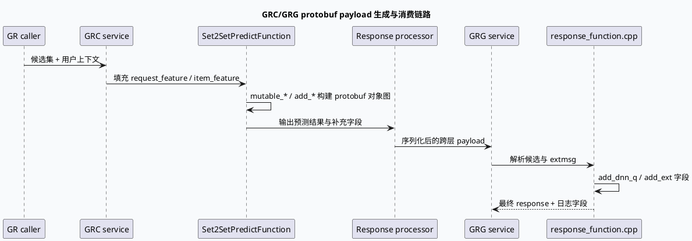

# 2026-07-07 周度代码理解：Protobuf SerializeToString 热点与 FlatBuffers 替代方向

> 本文面向排查 GRC set2set/response/cache_queue 与 GRG response/extmsg 序列化点中的 CPU 抖动、尾延迟和跨层传输放大问题。  
> 今日 daily-plan 的 KU 正文未提供 doc-id，未执行 KU 正文补充；以下结论基于本地 GRC/GRG 代码检索，历史设计背景需人工补充。

## 1. 架构全景图：序列化成本如何穿过 GRC/GRG

<style>.arch-wrap{font-family:-apple-system,BlinkMacSystemFont,"Segoe UI",sans-serif;background:#f8fafc;border:1px solid #d9e2ec;border-radius:16px;padding:18px;margin:16px 0;color:#243b53}.arch-title{font-size:22px;font-weight:800;margin-bottom:12px;color:#102a43}.arch-grid{display:grid;grid-template-columns:1fr 1fr 1fr;gap:12px}.arch-layer{background:#fff;border:1px solid #d9e2ec;border-radius:12px;padding:12px}.arch-layer h4{margin:0 0 10px;font-size:14px;color:#334e68}.arch-box{border-radius:10px;padding:10px;margin:8px 0;background:#eef4fb;border-left:4px solid #3d5a80;font-size:13px;line-height:1.45}.arch-box.hot{background:#fff4e6;border-left-color:#c05621}.arch-box.alt{background:#ecfdf5;border-left-color:#2d6a4f}.arch-flow{margin:12px 0;text-align:center;font-weight:700;color:#486581}.arch-note{font-size:12px;color:#627d98;margin-top:10px}</style><div class="arch-wrap"><div class="arch-title">GRC/GRG 序列化热路径全景</div><div class="arch-grid"><div class="arch-layer"><h4>GRC 请求/特征拼装</h4><div class="arch-box">Set2SetPredictFunction 填充 RequestFeature 与 ItemFeature</div><div class="arch-box hot">大量 repeated 字段、Swap/mutable 写入形成编码前对象图</div><div class="arch-box">ResponseWithSet2Set / response processor 汇总输出</div></div><div class="arch-layer"><h4>跨层传输边界</h4><div class="arch-box hot">SerializeToString / ParseFromString 是 CPU 与拷贝边界</div><div class="arch-box">GR -> GRC -> GRG 多层 RPC 传递候选、分数、ext 信息</div><div class="arch-box alt">FlatBuffers 适合只读结构化 payload，降低反序列化和重复拷贝</div></div><div class="arch-layer"><h4>GRG 响应/extmsg 落盘</h4><div class="arch-box">response_function.cpp 构造 PredictorQ/dnn_q 等 extmsg 字段</div><div class="arch-box hot">逐 item add_* 字段会放大 protobuf 对象构造与编码成本</div><div class="arch-box">NewResponseFunction / MergeFSResponseFunction 负责最终展示输出</div></div></div><div class="arch-flow">对象图构建 -> protobuf 编码边界 -> 下游解析/再组装 -> 用户响应与日志落盘</div><div class="arch-note">重点不是“某一行 SerializeToString 一定慢”，而是 repeated 字段数量、字符串字段、跨层复制次数和落盘 extmsg 共同决定 CPU 峰值。</div></div>

## 2. 核心调用链：从候选特征到跨层 payload



## 3. 配置/结构信息图：什么时候考虑 FlatBuffers

```infographic
infographic compare-swot
data
  title Protobuf 热点治理决策
  desc 先量化对象大小与字段增长，再决定局部优化或替换编码格式
  items
    - label Protobuf 优势
      desc 兼容存量 proto、字段演进方便、RPC 生态成熟
      icon mdi/check-circle
    - label Protobuf 风险
      desc repeated 字段和字符串多时，编码、拷贝、Parse 成本容易集中到尾延迟
      icon mdi/alert-circle
    - label FlatBuffers 适合
      desc 只读、结构稳定、跨层多次读取且无需频繁 mutation 的 payload
      icon mdi/table-large
    - label FlatBuffers 不适合
      desc 频繁增删字段、强依赖 protobuf 反射/日志链路、需要无痛兼容旧消费方
      icon mdi/block-helper
theme
  palette #3d5a80 #2d6a4f #c05621 #64748b
```

## 4. 代码观察

1. `set2set_predict_function.cpp:560-568` 将请求侧上下文复制/Swap 到 `request_feature`，说明 Set2Set 请求不是轻量标量结构，而是含多组上下文字段的对象图。
2. `response_function.cpp:4160-4171` 在 GRG 响应阶段持续 `add_dnn_q()` 并设置 `q_name/q_value`，这类 per-item extmsg 构造会把业务观测字段转化为 repeated protobuf 写入成本。
3. daily-plan 记录的历史证据指出：`set2set_predict_function.cpp:589` 与 `response_function.cpp:4219` 是序列化关注点；当前源码检索未直接命中明文 `SerializeToString`，可能被封装在公共 RPC/协议层或宏内。
4. `main.cpp` 中 GRC/GRG 都使用 Babylon reusable RPC protocol 初始化，跨层 payload 的生命周期与 RPC 框架复用机制有关，不能只看业务函数局部。

## 5. Pitfalls 卡片

<style>.pit-card{font-family:-apple-system,BlinkMacSystemFont,"Segoe UI",sans-serif;background:#fffaf0;border:1px solid #f6d6ad;border-radius:14px;padding:18px;margin:18px 0;color:#2d3748}.pit-meta{font-size:12px;font-weight:800;color:#9c4221;text-transform:uppercase;letter-spacing:.04em}.pit-title{font-size:24px;font-weight:850;margin:6px 0 10px;color:#1a202c}.pit-grid{display:grid;grid-template-columns:2fr 1fr;gap:14px}.pit-body{font-size:14px;line-height:1.65}.pit-side{background:#fff;border-left:4px solid #c05621;border-radius:10px;padding:12px;font-size:13px;line-height:1.55}.pit-tag{display:inline-block;background:#fef3c7;color:#92400e;border-radius:999px;padding:3px 8px;margin:4px 4px 0 0;font-size:12px;font-weight:700}</style><div class="pit-card"><div class="pit-meta">Pitfall</div><div class="pit-title">不要把序列化热点误判为单点代码问题</div><div class="pit-grid"><div class="pit-body">如果火焰图只显示公共协议层的 Serialize/Parse，真正根因通常在上游对象图大小：per item extmsg、repeated feature、字符串字段、日志字段和跨层透传次数。治理顺序应是先裁字段与压缩结构，再讨论编码格式替换。</div><div class="pit-side"><b>排查信号</b><br>payload size 上升、CPU 与 item 数线性放大、下游只读但仍完整 Parse、日志字段增长后尾延迟抬升。</div></div><div><span class="pit-tag">protobuf</span><span class="pit-tag">flatbuffers</span><span class="pit-tag">tail latency</span></div></div>

## 6. 调试 checklist

```infographic
infographic list-column-done-list
data
  title 序列化热点排查 checklist
  desc 从对象规模、字段结构、跨层边界三层确认
  items
    - label 统计 payload 字节数
      desc 按请求分位记录 ByteSize 或等价封装输出，关联 item 数和场景
      done false
    - label 统计 repeated 字段规模
      desc 对 request_feature、item_feature、extmsg 的 add_* 次数做场景维度采样
      done false
    - label 分离构造与编码耗时
      desc 对字段填充、Serialize、RPC send、下游 Parse 分段埋点
      done false
    - label 验证消费方读取模式
      desc 如果下游只随机读少量字段，优先评估 FlatBuffers 或轻量 side-channel
      done false
    - label 兼容回滚
      desc 双写 protobuf 与新格式，灰度校验字段一致性和下游日志完整性
      done false
theme
  palette #3d5a80 #2d6a4f #c05621
```

## 7. 证据来源

- `src/main.cpp:1-80`（GRC/GRG 服务入口与 reusable RPC protocol 初始化）
- `src/processor/set2set_predict_function.cpp:560-568`（Set2Set 请求特征对象图填充）
- `src/process/response_function.cpp:4160-4171`（GRG extmsg repeated 字段构造）
- `notes/weekly-topic-selection/daily-plan-20260529.json:51-59`（今日基础库主题与历史证据）

---

## 七、业务代码库适配分析
> **分析时间**：2026-07-20T19:07:40.490213
> **目标代码库**：feeda-mv-grg（序列生成）、feeda-mv-grc（召回汇聚）

# 业务代码库适配分析：Protobuf 热点治理 / FlatBuffers 迁移方向

## 1. 分析摘要

- 从技术笔记看，当前主要痛点不是“单次 `SerializeToString` 调用本身”，而是 **对象图过大、repeated 字段过多、字符串字段偏多、跨层复制次数多** 导致的 CPU 峰值和尾延迟放大。
- 结合两套业务代码库的扫描结果，`feeda-mv-grg` 与 `feeda-mv-grc` 都存在明显的 **`std::vector` / `std::string` / `std::unordered_map` 重度使用场景**，说明当前业务结构偏“组装型、传递型、再加工型”，这类链路通常是序列化热点的高风险区。  
- 迁移潜力上，更适合走 **“局部替换、边界替换、双写灰度”** 路线，而不是一次性全链路替换：  
  - 对只读、结构相对稳定、跨层多次读取的 payload，FlatBuffers 价值更高。  
  - 对频繁增删字段、强依赖 protobuf 生态和日志链路的模块，继续保留 Protobuf 更稳妥。  

## 2. 代码库详情

### feeda-mv-grg：序列生成服务

- 扫描到目标库使用文件 1 个：
  - `strategy/diversity/rule/low_clarity_diversity_rule.cpp`
- std 等价物使用规模：
  - `std::vector`：1969 次，分布在 356 个文件
  - `std::string`：2443 次，分布在 425 个文件
  - `std::unordered_map`：734 次，分布在 205 个文件
- 典型特征：
  - `model/model.h:9`、`model/paddle_model.h:103`、`model/paddle_model.h:107` 体现出候选集 `std::vector<RidTmpInfoPtr>` 作为核心输入形式，说明服务内部是明显的“候选列表 + 特征对象”处理模式。
  - 结合技术笔记中的 `response_function.cpp:4160-4171`，GRG 侧还存在逐 item 构造 `dnn_q`、`q_name/q_value` 的 repeated 写入场景，这类路径很容易放大编码与拷贝成本。
- 结论：
  - `feeda-mv-grg` 更像是 **中间加工型服务**，存在把业务特征对象图不断拼装、再序列化的典型模式。
  - 适合作为 FlatBuffers 或轻量只读 payload 的试点方向，但应优先从“结果展示/日志透传”这类 **读多写少** 场景切入。

### feeda-mv-grc：召回汇聚服务

- 扫描到目标库使用文件 9 个：
  - `processor/multi_factor/ltr_factor_gen_scene.cpp`
  - `processor/new_adjust/precise_score_init_first_refresh.cpp`
  - `processor/filter/low_agile_goodrate_filter_operator.cc`
  - `operator/adjuster/sketchy/ltv_factor_cp_opt.cpp`
  - `processor/filter/user_explore_interest_ugc_filter_operator.cc`
- std 等价物使用规模：
  - `std::vector`：8442 次，分布在 1279 个文件
  - `std::string`：7170 次，分布在 1234 个文件
  - `std::unordered_map`：2834 次，分布在 639 个文件
- 典型特征：
  - `service/grc_http_service.cpp:62` 中使用 `std::unordered_map<std::string, std::vector<int>> depend_map`，说明服务里存在较多“图结构/依赖结构”类数据组织。
  - `service/grc_http_service.cpp:81` 使用大量静态容器与排序结构，说明该服务不只是简单转发，还包含较重的规则处理与组织逻辑。
  - `service/grc_http_service.cpp:152` 中直接处理 query、构造字符串响应，也说明该库对字符串与容器的依赖很强。
- 结论：
  - `feeda-mv-grc` 的业务面更广、文件更多、数据组织更复杂，适配收益可能更大，但改造面也更广。
  - 如果要引入新序列化格式，更适合先挑选 **内部只读、跨层透传、最终仅消费少数字段** 的链路做试点，而不是从 HTTP 入口或复杂规则编排层直接下手。

## 3. 💡 适用性评估与建议

- **优先治理 `src/processor/set2set_predict_function.cpp:560-568` 与 `src/process/response_function.cpp:4160-4171`**
  - 这两个点属于技术笔记中明确标出的热点位置。
  - 建议先做字段瘦身：减少 per-item `add_*` 次数，合并重复字段，字符串尽量改为枚举/ID/字典索引。
  - 适用场景：`request_feature` / `item_feature` / `extmsg` 这类对象图构建。

- **把 `response_function.cpp` 作为 FlatBuffers 试点边界，而不是全局替换点**
  - 如果下游只是做展示、日志落盘或少量字段读取，可把最终跨层 payload 改成 FlatBuffers。
  - 这样可以把“构造对象图”和“跨层传输”拆开，避免 protobuf 反复编码/解析。
  - 适用场景：`response_function.cpp` 里逐 item 构建 `dnn_q`、`q_name/q_value` 的路径。

- **在 `service/grc_http_service.cpp` 先做“只读透传”改造评估**
  - 该文件已经表现出较强的 `std::unordered_map`、`std::vector`、`std::string` 依赖。
  - 若其中部分请求/响应只是中转和少量字段读取，可先引入 FlatBuffers 作为内部缓存或中间层 payload。
  - 建议保留 HTTP 层仍用现有格式，只替换内部重路径，降低切换风险。

- **以 `strategy/diversity/rule/low_clarity_diversity_rule.cpp` 作为现有目标库参考实现**
  - 既然扫描到这里已经有目标库使用痕迹，可以优先抽象出统一的 buffer 构建、访问、生命周期管理方式。
  - 如果该文件对应的是“规则判断 + 轻量读字段”场景，可复用其工程组织方式做模板。
  - 适用场景：只读字段访问频繁、结构稳定、需要低拷贝的逻辑模块。

- **优先在 `processor/multi_factor/ltr_factor_gen_scene.cpp`、`processor/new_adjust/precise_score_init_first_refresh.cpp` 等 GRC 处理器里做试点**
  - 这类文件更可能处在“业务计算完成后生成结构化结果”的位置，适合做局部格式替换。
  - 建议挑选“输入固定、输出稳定、消费端少”的链路先做双写验证。
  - 适用场景：场景特征生成、刷新场景、过滤器输出等。

## 4. ⚠️ 引入风险与限制

- **不能只替换序列化格式，必须同步治理对象图规模**
  - 如果继续保留大量 repeated 字段、长字符串、逐 item `add_*`，即使换成 FlatBuffers，收益也会被上游构造成本吞掉。
  - 先裁字段，再谈格式替换，是更稳妥的顺序。

- **FlatBuffers 不适合高频 mutation 场景**
  - 代码库里大量使用 `std::vector` 和对象级别中间态，说明不少逻辑是在“边构造边调整”。
  - 如果某些模块需要频繁增删字段、动态合并结果，FlatBuffers 的迁移成本和编码复杂度会明显上升。

- **RPC 框架与生命周期管理是隐藏成本**
  - 技术笔记已提示 `main.cpp` 中 GRC/GRG 使用 Babylon reusable RPC protocol 初始化，说明 payload 生命周期与框架复用强相关。
  - 如果 buffer 生命周期管理不当，容易出现悬挂引用、重复拷贝或内存回收时机错误。

- **兼容性与回滚机制必须先设计**
  - Protobuf 生态在字段演进、日志链路、反射支持上更成熟。
  - 建议保留双写或灰度开关：新格式与旧格式并行一段时间，验证字段一致性、日志完整性和下游兼容性后再逐步切换。

---
*本章节由 Hermes Agent 自动分析生成，基于代码库静态扫描结果。*
