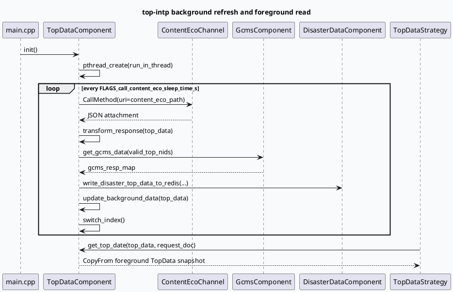

# 2026-07-10 周五代码理解：top-intp 双 Buffer 内容干预缓存架构

> 本文基于本地 `top-intp` 代码阅读生成；未获得可直接读取的 KU 背景文档，运营策略、上线实验和收益口径需人工补充。

## 1. 架构全景图：brpc 前台请求与后台 ContentEco 拉取解耦

<style>.arch-wrap{font-family:-apple-system,BlinkMacSystemFont,"Segoe UI",sans-serif;background:#f8fafc;border:1px solid #d9e2ec;border-radius:14px;padding:18px;margin:16px 0;color:#243b53}.arch-title{font-size:22px;font-weight:850;margin-bottom:12px;color:#102a43}.arch-grid{display:grid;grid-template-columns:1fr 1.15fr 1fr;gap:12px}.arch-layer{background:#fff;border:1px solid #d9e2ec;border-radius:12px;padding:12px}.arch-layer h3{margin:0 0 10px;font-size:15px;color:#334e68}.arch-box{border-left:4px solid #3d5a80;background:#eef4fb;border-radius:10px;padding:10px;margin:8px 0;font-size:13px;line-height:1.45}.arch-box.hot{background:#fff4e6;border-left-color:#c05621}.arch-box.ok{background:#ecfdf5;border-left-color:#2d6a4f}.arch-foot{font-size:12px;color:#627d98;margin-top:10px}</style><div class="arch-wrap"><div class="arch-title">top-intp 双路径架构：后台预热 + 前台轻量召回</div><div class="arch-grid"><div class="arch-layer"><h3>启动与服务入口</h3><div class="arch-box">main.cpp 初始化日志、MBvar、GlobalInitializer、TopDataComponent</div><div class="arch-box hot">brpc Server 注册 TopServicePbImpl</div><div class="arch-box">handle() 解析 FeedRequest、构造 SessionContext</div></div><div class="arch-layer"><h3>后台缓存刷新</h3><div class="arch-box hot">TopDataComponent 独立 pthread 循环调用 ContentEco</div><div class="arch-box">transform_response 按 is_top 拆成 first/second/third/fourth_more</div><div class="arch-box ok">GcmsComponent 同步补元数据，DisasterDataComponent 写灾备 Redis</div><div class="arch-box hot">update_background_data + switch_index 完成双 Buffer 切换</div></div><div class="arch-layer"><h3>前台请求消费</h3><div class="arch-box">TopDataStrategy 先判断是否需要置顶</div><div class="arch-box">RedAutoData 决定请求需要几条 top</div><div class="arch-box hot">get_top_date 从当前 foreground buffer CopyFrom 快照</div><div class="arch-box ok">fill_feed_resp_pb 输出 key=toplist 的 FeedResponse</div></div></div><div class="arch-foot">核心设计：ContentEco/GCMS/Redis 等慢依赖不在每次 RPC 请求中串行执行，而是由后台线程维护内存快照；前台只做条件判断、过滤、选择和 PB/JSON 输出。</div></div>

## 2. 启动链与模块职责

`src/main.cpp:29-67` 是入口：解析 gflags 后加载 comlog，初始化 `MBvarRecord`、`GlobalInitializer`、`TopDataComponent`，随后创建 `baidu::rpc::Server` 并注册 `TopServicePbImpl`。这说明 top-intp 本质上是一个 brpc 服务，业务逻辑入口不是随机工具函数，而是 `TopServicePbImpl::handle()`。

`src/service/top_service_pb.cc:12-56` 的 `handle()` 做三件关键事：

1. 从 brpc context 中读取 `source` tag，用于后续 MBvar 和日志归因；
2. 构造 `SessionContext` 并调用 `parse_param()` 把 `TopRequest.feed_req()` 里的 `common_info`、`strategy_info`、`device_info`、`refresh_info` 折叠到 `FeedReq`；
3. 创建 `TopIntpClosure` 并调用 `get_top_data(begin_ms)`，进入策略和响应组装。

## 3. 双 Buffer 生命周期时序图



`src/component/top_data_component.cc:60-70` 中后台线程循环执行 `call_content_eco()`；只有拉取和转换成功时才 `switch_index()`。`src/component/top_data_component.h:101-118` 显示写入发生在 `(foreground_index + 1) % 2` 的后台槽位，随后 `_index.store(background_index)` 把新快照切到前台。`src/component/top_data_component.h:56-74` 的 `get_top_date()` 会从当前 `_index` 指向的快照复制 first/second/third/fourth_more 列表和 `gcms_resp_map`，避免前台请求直接读写正在更新的对象。

## 4. 配置结构信息图

```infographic
infographic list-grid-badge-card
data
  title top-intp 关键运行配置
  desc 后台拉取频率、下游通道、GCMS 批量参数共同决定置顶池新鲜度和补元数据稳定性
  items
    - label port
      desc gflags.conf.template:1，服务端口默认模板为 6688
      icon mdi/lan-connect
    - label call_content_eco_sleep_time_s
      desc top_data_component.cc:18，后台轮询间隔默认 5 秒
      icon mdi/timer-refresh
    - label ContentEcoChannel
      desc channels.conf.template:16-25，HTTP rr，timeout 1000ms，backup 500ms
      icon mdi/cloud-sync
    - label gcms req_batch_size
      desc gcms_plugin_pb.conf:8，批量大小 10
      icon mdi/package-variant
    - label gcms req_max_concurrency
      desc gcms_plugin_pb.conf:9，并发上限 100
      icon mdi/source-branch-sync
    - label gcms ttl_sec
      desc gcms_plugin_pb.conf:17，本地缓存 TTL 1200 秒
      icon mdi/database-clock
theme
  palette #3D5A80 #2D6A4F #C05621
```

`conf/channels.conf.template:16-25` 把 `ContentEcoChannel` 配成 HTTP pooled 连接，`timeout_ms: 1000`、`backup_timeout_ms: 500`；`conf/common_component/gcms_plugin_pb.conf:3-17` 则声明 service_name 为 `topintp`，GCMS 批量、并发、超时、TTL 等参数。前台请求实际不直接访问 ContentEco；因此后台通道的失败表现会滞后地体现为缓存不刷新，而不是单次 RPC 全链路超时。

## 5. 关键结构：TopData / SessionContext / Closure

```infographic
infographic hierarchy-structure
data
  title 请求与缓存数据结构
  desc TopData 是后台快照容器；SessionContext 是单次请求上下文；Closure 连接 brpc done 与响应组装
  items
    - label TopData
      desc first_top_vec / second_top_vec / third_top_vec / fourth_more_top_map / gcms_resp_map
      children
        - label foreground buffer
          desc get_top_date CopyFrom 当前快照
        - label background buffer
          desc update_background_data 写入后 switch_index
    - label SessionContext
      desc logid/cuid/source + FeedReq + result_items + topdata2str_pb
      children
        - label FeedReq
          desc product/channel/osbranch/refresh_state/history lists
        - label FeedResponse
          desc content key=toplist
    - label TopIntpClosure
      desc 持有 response/done，执行 TopDataStrategy 后 fill_resp_pb
theme
  palette #3D5A80 #2D6A4F #C05621
```

`src/component/top_data_component.h:26-44` 定义 `TopData`：除了按位置拆分的 `first_top_vec`、`second_top_vec`、`third_top_vec`、`fourth_more_top_map`，还包含 `gcms_resp_map`。`src/common/session_context.h:82-111` 定义 `SessionContext`：它同时保存请求字段、历史列表、策略结果和中间 `FeedResponse`。`src/service/top_service.h:23-83` 的 `TopIntpClosure` 则持有 brpc 的 response/done，并在 `src/service/top_service.cc:42-64` 中调用 `TopDataStrategy`、`fill_resp_pb()` 和日志上报。

## 6. Pitfalls 卡片

<style>.card-frame{font-family:-apple-system,BlinkMacSystemFont,"Segoe UI",sans-serif;margin:18px 0}.pit-card{background:#fffaf0;border:1px solid #f6d6ad;border-radius:14px;padding:18px;color:#2d3748}.pit-meta{font-size:12px;font-weight:800;color:#9c4221;text-transform:uppercase;letter-spacing:.04em}.pit-title{font-size:24px;font-weight:850;margin:6px 0 10px;color:#1a202c}.pit-grid{display:grid;grid-template-columns:1.3fr 1fr;gap:12px}.pit-panel{background:#fff;border-left:4px solid #c05621;border-radius:10px;padding:12px;font-size:13px;line-height:1.65}.pit-end{margin-top:10px;font-weight:800;color:#7b341e}</style><div class="card-frame"><div class="pit-card"><div class="pit-meta">Architecture Pitfall</div><div class="pit-title">不要把“本次请求没置顶”直接归因到 ContentEco</div><div class="pit-grid"><div class="pit-panel"><b>真正链路分层：</b>ContentEco 只负责后台池子刷新；一次 RPC 请求是否返回置顶，还会被产品线、频道、osbranch、refresh_state、Redis top 数、历史列表和候选池位置共同决定。</div><div class="pit-panel"><b>先分辨故障域：</b>后台刷新失败看 call_content_eco / transform / GCMS / Redis 灾备；前台不返回看 TopDataStrategy 的 is_need、required_num、filter、select、fill_resp。</div></div><div class="pit-end">排查关键词：call_content_eco succ + switch index、top_vec size、num_of_top_data_required、num_of_top_data_issued。</div></div></div>

## 7. 调试 checklist

```infographic
infographic list-column-done-list
data
  title top-intp 架构层排查 checklist
  desc 适用于置顶池不刷新、RPC 无置顶、GCMS 元数据缺失、灾备 Redis 写入异常
  items
    - label 确认服务启动链完整
      desc main.cpp:43-56，MBvar、GlobalInitializer、TopDataComponent、TopServicePbImpl 都需初始化成功
      done false
    - label 确认后台轮询成功
      desc top_data_component.cc:60-70，失败时不会 switch_index
      done false
    - label 检查 ContentEco 响应结构
      desc top_data_component.cc:117-132，必须有 data 数组且 status=0
      done false
    - label 检查双 Buffer 是否更新
      desc top_data_component.h:101-118，update_background_data 后才切 index
      done false
    - label 检查 GCMS 补元数据
      desc gcms_component.cc:18-54，plugin 为空或 get_sync 非 0 都会导致 gcms_resp_map 缺失
      done false
    - label 区分前台策略失败和后台池失败
      desc top_data_strategy.cc:69-175 是前台门控和 top 数逻辑
      done false
theme
  palette #3D5A80 #2D6A4F #C05621
```

## 8. 证据来源

- `src/main.cpp:29-67`：启动、初始化组件、注册 `TopServicePbImpl`。
- `src/service/top_service_pb.cc:12-56`：PB RPC 入口、解析参数、创建 Closure。
- `src/service/top_service_pb.cc:64-159`：从 `TopRequest.feed_req()` 提取请求字段和历史列表。
- `src/component/top_data_component.cc:60-141`：后台线程调用 ContentEco、处理失败、解析响应。
- `src/component/top_data_component.cc:144-246`：按 `is_top` 拆分候选池、补 GCMS、写灾备 Redis、更新后台数据。
- `src/component/top_data_component.h:56-74`：前台从当前 buffer 复制快照。
- `src/component/top_data_component.h:101-118`：双 Buffer 写入与索引切换。
- `src/component/gcms_component.cc:18-54`：GCMS plugin 获取与 `get_sync` 调用。
- `conf/channels.conf.template:16-25`：ContentEco 下游通道配置。
- `conf/common_component/gcms_plugin_pb.conf:3-17`：GCMS service、batch、concurrency、timeout、TTL 配置。

---

## 七、业务代码库适配分析
> **分析时间**：2026-07-20T19:10:52.008963
> **目标代码库**：feeda-mv-grg（序列生成）、feeda-mv-grc（召回汇聚）

# 业务代码库适配分析报告：top-intp 双 Buffer 内容干预缓存架构

## 1. 分析摘要

- 从架构特征看，`top-intp` 的核心价值是把**慢依赖拉取**（ContentEco、GCMS、Redis 灾备）从**前台请求路径**中剥离出来，通过**后台刷新 + 前台只读快照**的双 Buffer 模式，降低 RPC 延迟并减少请求链路抖动。
- 在业务代码库中，这种模式对**读多写少、配置/特征/规则需要周期刷新**的场景很适合，尤其是召回、过滤、打分、规则引擎这类“每次请求都要查一堆状态”的模块。  
  从扫描结果看，`feeda-mv-grc` 的相关接入面更广，迁移潜力明显高于 `feeda-mv-grg`；`feeda-mv-grg` 目前只在 1 个文件出现目标库使用，更像是局部试点。

---

## 2. 代码库详情

### 2.1 `feeda-mv-grg`：序列生成服务

- **目标库使用情况**
  - 仅发现 1 个文件使用：
    - `strategy/diversity/rule/low_clarity_diversity_rule.cpp`
- **现有代码特征**
  - `std::vector` 使用量很高：**1969 次 / 356 个文件**
  - `std::string` 使用量很高：**2443 次 / 425 个文件**
  - `std::unordered_map` 使用较多：**734 次 / 205 个文件**
- **典型参考代码**
  - `model/model.h:9`
  - `model/paddle_model.h:103`
  - `model/paddle_model.h:107`
- **判断**
  - 这个代码库已经大量依赖容器和字符串处理，说明**内存快照、候选列表、配置缓存**这类数据结构并不陌生。
  - 但从目标库使用面看，当前更像是**单点接入**，适合从 `low_clarity_diversity_rule.cpp` 做小范围试点，而不是一口气全链路改造。

### 2.2 `feeda-mv-grc`：召回汇聚服务

- **目标库使用情况**
  - 发现 9 个文件使用，涉及面更广：
    - `processor/multi_factor/ltr_factor_gen_scene.cpp`
    - `processor/new_adjust/precise_score_init.cpp`
    - `processor/new_adjust/precise_score_init_first_refresh.cpp`
    - `processor/filter/low_agile_goodrate_filter_operator.cc`
    - `processor/multi_factor/session_ltr_dibar_factor_gen.cpp`
    - 其余 4 个文件未在摘要里展开，但说明覆盖了多个 processor 链路
- **现有代码特征**
  - `std::vector` 使用量非常高：**8442 次 / 1279 个文件**
  - `std::string` 使用量很高：**7170 次 / 1234 个文件**
  - `std::unordered_map` 使用广泛：**2834 次 / 639 个文件**
- **典型参考代码**
  - `service/grc_http_service.cpp:62`
  - `service/grc_http_service.cpp:81`
  - `service/grc_http_service.cpp:152`
- **判断**
  - 召回汇聚服务天然存在**请求级组合逻辑多、特征/规则/依赖多**的问题，适合引入“后台更新、前台只读”的缓存结构。
  - 由于多个 processor 已经接触到类似逻辑，说明这里更适合做**分阶段迁移**，收益也更可能体现在**整体 P99 和稳定性**上。

---

## 3. 💡 适用性评估与建议

- **建议 1：先在 `feeda-mv-grg/strategy/diversity/rule/low_clarity_diversity_rule.cpp` 做双 Buffer 试点**
  - 如果该规则依赖外部配置、统计结果或候选池状态，建议改成：
    - 后台线程定时刷新规则参数/统计快照
    - 前台请求只读取当前 buffer 的只读快照
  - 适合场景：低清晰度规则判断、候选过滤、阈值配置更新
  - 价值：减少每次请求对共享状态的锁竞争，降低规则更新带来的抖动

- **建议 2：在 `feeda-mv-grc/processor/new_adjust/precise_score_init.cpp` 和 `precise_score_init_first_refresh.cpp` 优先落地**
  - 这两个文件名本身就带有 `init`、`refresh` 语义，非常贴合“双 Buffer + 切换索引”的模式
  - 建议把初始化阶段的重依赖数据拆成：
    - 后台构建 `background buffer`
    - 构建完成后原子切换到 `foreground buffer`
  - 适合场景：精排/召回初始分、首刷配置、模型参数初始化
  - 价值：把“首次刷新慢”的问题从请求线程剥离出去

- **建议 3：在 `feeda-mv-grc/processor/multi_factor/ltr_factor_gen_scene.cpp` 和 `session_ltr_dibar_factor_gen.cpp` 评估快照化**
  - 这类多因子生成逻辑通常会读取很多上下文和依赖，建议把**稳定、可周期刷新**的部分沉到后台：
    - 规则表
    - 映射表
    - 统计聚合结果
  - 前台只保留 request 级字段和轻量计算
  - 价值：减少多因子生成链路上的 I/O 和共享状态访问

- **建议 4：在 `feeda-mv-grc/processor/filter/low_agile_goodrate_filter_operator.cc` 适合做“白名单/黑名单/阈值池”双 Buffer**
  - 过滤器类逻辑通常依赖一些可热更新的集合：
    - goodrate 阈值
    - 过滤名单
    - 风险标签映射
  - 可以把这些集合做成只读快照，后台周期性更新
  - 价值：过滤链路通常在请求核心路径上，双 Buffer 能明显降低锁和共享容器风险

- **建议 5：参考 `service/grc_http_service.cpp` 的请求组织方式，但把“重状态读取”移出主线程**
  - 当前 `grc_http_service.cpp` 已经大量使用 `std::unordered_map`、`std::vector`、`std::string` 组织请求和响应，说明它很适合承接快照式数据结构
  - 可将：
    - 查询参数解析
    - 结果拼装
    - 快照读取
    统一收敛到轻量 request path
  - 价值：保留现有接口形态，减少侵入式改造

---

## 4. ⚠️ 引入风险与限制

- **风险 1：快照一致性和更新时机要定义清楚**
  - 双 Buffer 的核心不是“更新更快”，而是“前台只读稳定快照”
  - 如果后台刷新只成功一半就切换 index，可能会出现候选池不完整、规则缺失、元数据不全的问题

- **风险 2：后台刷新失败不能直接影响前台请求，但会导致数据变旧**
  - 这类架构会把故障从“请求超时”变成“数据陈旧”
  - 所以必须配套：
    - 刷新成功率监控
    - buffer 年龄监控
    - 切换次数监控
    - 回退机制

- **风险 3：线程模型和生命周期管理复杂度会上升**
  - 一旦引入后台刷新线程，就要处理：
    - 线程退出
    - 资源释放
    - 周期任务异常恢复
    - 原子切换和内存可见性
  - 在 `feeda-mv-grg` 这种当前只看到单点使用的库里，先小范围验证更稳妥

- **风险 4：不适合所有请求都缓存**
  - 对强实时、强个性化、每次都必须实时计算的逻辑，双 Buffer 可能收益有限
  - 如果 `processor` 里的某些步骤高度依赖请求上下文而非公共状态，就不建议硬迁移

---

## 结论

- **`feeda-mv-grg`**：适合从 `strategy/diversity/rule/low_clarity_diversity_rule.cpp` 做**局部试点**，验证双 Buffer 对规则类逻辑的收益。
- **`feeda-mv-grc`**：更适合做**分模块迁移**，优先放在 `precise_score_init*.cpp`、`session_ltr_dibar_factor_gen.cpp`、`low_agile_goodrate_filter_operator.cc` 这类“配置/特征/过滤状态”明显的链路上。
- 从整体规模看，两库都大量使用 `std::vector`、`std::string`、`std::unordered_map`，说明它们具备承载快照式结构的基础；真正的关键是**把慢依赖从前台请求中拆出去**，而不是简单替换容器。

---
*本章节由 Hermes Agent 自动分析生成，基于代码库静态扫描结果。*
