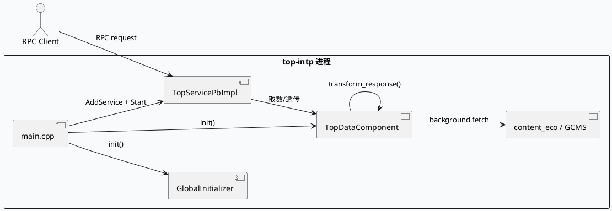
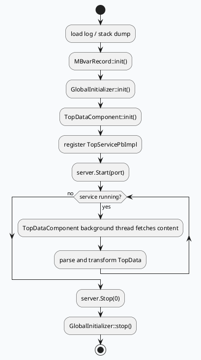

# 2026-08-18 周二代码理解：top-intp 启动引导与 TopData 生命周期

> 日期：2026-08-18  
> 主题来源：2026-08-18 daily-plan 文件未找到，按历史未覆盖主题 fallback 到 `top-intp` 的启动引导 + TopData 生命周期链路；KU/业务背景需人工补充。  
> 范围：只分析 `src/main.cpp`、`src/component/top_data_component.cc`、`src/component/gcms_component.h`、`src/common/gcms_data.h`、`conf/common_component/gcms_plugin_pb.conf`、`conf/ns_plugin.conf`，关注服务启动、后台拉取、响应转换与 GCMS 结构边界，不展开完整业务策略。

---

## 0. 架构全景图
<div style="font-family:system-ui,-apple-system,BlinkMacSystemFont,'Segoe UI',Roboto,sans-serif;background:#f8fafc;border:1px solid #d9e2ec;border-radius:14px;padding:18px;margin:16px 0;color:#243b53"><div style="font-size:22px;font-weight:800;margin-bottom:12px;color:#102a43">top-intp 启动到 TopData 拉取的基础链路</div><div style="display:grid;grid-template-columns:1.1fr 1.2fr 1fr;gap:12px"><div style="background:#fff;border:1px solid #d9e2ec;border-radius:10px;padding:12px"><div style="font-weight:700;margin-bottom:8px;color:#1d4e89">启动层</div><div>• `com_loadlog` 装载日志</div><div>• `StackDump::init()` 初始化崩溃栈</div><div>• `MBvarRecord::init()` 打点注册</div><div>• `GlobalInitializer::init()` 拉起全局组件</div><div>• `TopDataComponent::init()` 启动后台线程</div></div><div style="background:#fff;border:1px solid #d9e2ec;border-radius:10px;padding:12px"><div style="font-weight:700;margin-bottom:8px;color:#1d4e89">服务层</div><div>• `baidu::rpc::Server` 提供 RPC 入口</div><div>• `TopServicePbImpl` 绑定服务实现</div><div>• `server.Start(FLAGS_port, &amp;options)` 进入运行态</div><div>• 退出前调用 `server.Stop(0)` 与 `GlobalInitializer::stop()`</div></div><div style="background:#fff;border:1px solid #d9e2ec;border-radius:10px;padding:12px"><div style="font-weight:700;margin-bottom:8px;color:#1d4e89">数据层</div><div>• `content_eco` HTTP/Channel 拉取</div><div>• GCMS 插件配置驱动请求批量与超时</div><div>• `TopData` / `SmfwGcmsRespItem` 承载结构化结果</div><div>• `transform_response()` 把外部响应转回内部对象</div></div></div><div style="margin-top:12px;background:#eef4f9;border:1px dashed #b6c6d6;border-radius:10px;padding:10px 12px;font-size:13px;line-height:1.55">基础判断：`main.cpp` 负责把日志、全局初始化、后台数据组件和 RPC 服务拼成完整进程；真正的数据变化不在入口里展开，而是在 `TopDataComponent` 的后台线程与响应转换逻辑里完成。</div></div>

## 1. 入口链路
`src/main.cpp` 先装载日志和栈追踪，再初始化 `MBvarRecord`、`GlobalInitializer` 和 `TopDataComponent`，最后把 `TopServicePbImpl` 注册到 `baidu::rpc::Server` 并启动服务。它的职责不是处理请求细节，而是把进程生命周期和服务生命周期串起来。

### 关键路径
- `src/main.cpp:37-46`：日志、栈追踪、MBvar、全局初始化、TopDataComponent 初始化
- `src/main.cpp:48-61`：构建 `baidu::rpc::Server`，注册 `TopServicePbImpl`，`server.Start(...)`
- `src/main.cpp:63-69`：优雅退出时停服务并释放全局资源

## 2. 核心流程图


### 生命周期活动图


## 3. 配置/结构信息图
```infographic
infographic list-grid-badge-card
 data
  title top-intp 关键配置面
  desc 进程启动后依赖的日志、RPC、GCMS 相关配置
  items
   - label service_name
     desc topintp
     value 1
     icon mdi/server
   - label gcms_srv_addr
     desc rns://group.smartbns-from_product=gcms-sdk-srv-utf8%group.flow-gcms-pb-sdk-srv-multishard.SUPERPAGE.all|bns
     value 1
     icon mdi/database-search
   - label req_batch_size
     desc 10
     value 10
     icon mdi/view-grid
   - label req_max_concurrency
     desc 100
     value 100
     icon mdi/arrow-expand-all
   - label req_type
     desc 2
     value 2
     icon mdi/source-branch
   - label timeoutms
     desc 100
     value 100
     icon mdi-timer-outline
 theme
  palette #2563eb #0f766e #f59e0b
```

## 4. 组件边界
`TopDataComponent` 的职责更像一个基础库式的调度器：`init()` 拉起依赖通道，`run()` 在后台周期性调用 `call_content_eco()`，`transform_response()` 把返回体转换为内部 `TopData`，`parse_one_item()` 则做细粒度字段解析。`gcms_component.h` 和 `gcms_data.h` 负责把 GCMS 响应结构收进统一数据模型，避免入口层直接碰外部协议细节。

### 证据来源
- `src/main.cpp:37-46`
- `src/main.cpp:48-69`
- `src/component/top_data_component.cc:15-18`
- `src/component/top_data_component.cc:30-33`
- `src/component/top_data_component.cc:49-60`
- `src/component/top_data_component.cc:73-77`
- `src/component/top_data_component.cc:144-249`
- `src/component/gcms_component.h:17-21`
- `src/common/gcms_data.h:17-29`
- `conf/common_component/gcms_plugin_pb.conf:3-17`
- `conf/ns_plugin.conf:1-11`

## 5. Pitfalls
<div style="display:grid;grid-template-columns:1fr;gap:10px;margin:14px 0"><div style="background:#fff7ed;border:1px solid #fdba74;border-radius:10px;padding:12px 14px"><div style="font-weight:800;color:#9a3412;margin-bottom:4px">配置通道为空</div><div style="color:#7c2d12;line-height:1.55">`TopDataComponent::init()` 会直接依赖 `content_eco` channel。若 `ChannelComponent::get_instance().get(...)` 为空，进程在启动阶段就会失败，不会等到首个请求才暴露问题。</div></div><div style="background:#eff6ff;border:1px solid #93c5fd;border-radius:10px;padding:12px 14px"><div style="font-weight:800;color:#1d4ed8;margin-bottom:4px">后台线程生命周期</div><div style="color:#1e3a8a;line-height:1.55">`run()` 是长期后台任务，退出时必须和 `stop()` 对齐。只看 RPC 启停不够，真正的资源释放在组件停止路径里。</div></div><div style="background:#f0fdf4;border:1px solid #86efac;border-radius:10px;padding:12px 14px"><div style="font-weight:800;color:#166534;margin-bottom:4px">GCMS 配置与代码分离</div><div style="color:#14532d;line-height:1.55">`gcms_plugin_pb.conf` 决定服务地址、并发、超时和分片参数，但字段语义在代码里才真正落地。只看配置会漏掉 `transform_response()` 的实际转换规则。</div></div></div>

## 6. 调试 checklist
```infographic
infographic list-column-done-list
 data
  title 调试 checklist
  items
   - label main.cpp 是否成功进入 server.Start
     done true
   - label GlobalInitializer 和 TopDataComponent 是否在启动阶段完成 init
     done true
   - label content_eco channel 是否可取到
     done true
   - label TopDataComponent 是否在后台线程中持续 run
     done true
   - label transform_response 是否能把外部返回转换成 TopData
     done true
   - label gcms_plugin_pb.conf 是否与代码预期一致
     done true
 theme
  palette #2563eb #10b981 #f59e0b
```

## 7. 结论
`top-intp` 的基础层不是复杂业务逻辑，而是把进程、RPC、后台数据拉取和 GCMS 结构收束成一个可运行系统。读 `main.cpp` 的正确方式是先看生命周期边界，再顺着 `TopDataComponent` 去看外部依赖和内部转换，不要把入口文件当成业务策略本体。

---

## 七、业务代码库适配分析
> **分析时间**：2026-08-19T19:03:27.828952
> **目标代码库**：feeda-mv-grg（序列生成）、feeda-mv-grc（召回汇聚）

## 业务代码库适配分析

### 1. 分析摘要

- 从扫描结果看，目标技术/目标库已经在两个业务代码库中出现，但覆盖面仍然较低：`feeda-mv-grg` 仅发现 1 个文件使用，`feeda-mv-grc` 发现 10 个文件使用。相比之下，两个代码库中 `std::vector`、`std::string`、`std::unordered_map` 的使用规模非常大，说明如果该技术用于替代或优化常见 STL 容器/字符串/哈希表场景，具备较大的潜在迁移空间。

- 迁移策略上，不建议一次性全量替换。当前更适合采用“参考已有使用点 + 选择热点路径试点 + 保持接口边界稳定”的方式推进。优先关注请求链路、召回汇聚、队列调整、因子生成、模型预测等高频路径中的临时容器、字符串拼接、哈希查找场景，并结合压测验证 CPU、内存分配次数、尾延迟收益。

---

### 2. 代码库详情

#### feeda-mv-grg：序列生成服务

- **目标库使用现状**
  - 已发现目标库使用：1 个文件
    - `strategy/diversity/rule/low_clarity_diversity_rule.cpp`
  - 该文件可以作为 `feeda-mv-grg` 内部引入该技术的首个参考点，后续迁移时应优先查看其 include 方式、命名空间、构造/析构习惯、与现有业务对象的交互方式。

- **现有 std 等价物使用规模**
  - `std::vector`：1969 次，分布在 356 个文件
  - `std::string`：2443 次，分布在 425 个文件
  - `std::unordered_map`：734 次，分布在 205 个文件

- **典型候选场景**
  - `model/model.h`
    ```cpp
    virtual int predict(std::vector<RidTmpInfoPtr>& candidate_vec, uint32_t pos) = 0;
    ```
    - `candidate_vec` 是模型预测链路上的核心候选集合，通常具有高频访问、遍历、过滤、打分等特点。
    - 如果该技术涉及容器性能优化，可以考虑在模型内部实现或临时处理中试点，但不建议直接修改虚函数接口，避免影响所有派生类。

  - `model/paddle_model.h`
    ```cpp
    virtual int predict(std::vector<RidTmpInfoPtr>& candidate_vec, uint32_t pos) {
        return 0;
    }
    ```
    ```cpp
    int predict_with_tensor_input(std::vector<RidTmpInfoPtr>& candidate_vec,
                general_predict::PredictSample* predict_sample = nullptr,
                bool is_from_cube = true) const {
        return predict<ModelDependInput>(candidate_vec, predict_sample, is_from_cube);
    }
    ```
    - `predict_with_tensor_input` 可能位于模型推理前的数据准备路径，如果存在大量临时 `vector`、字符串 key、特征 map 构造，可作为性能优化试点。
    - 建议先保持入参 `std::vector<RidTmpInfoPtr>&` 不变，在函数内部引入目标库结构承载中间结果，降低接口迁移成本。

#### feeda-mv-grc：召回汇聚服务

- **目标库使用现状**
  - 已发现目标库使用：10 个文件，扫描结果中展示的包括：
    - `processor/multi_factor/session_ltr_dibar_factor_gen.cpp`
    - `operator/adjuster/function_queue/youzhi_queue_adjust.cpp`
    - `processor/new_adjust/precise_score_init.cpp`
    - `processor/new_adjust/precise_score_init_first_refresh.cpp`
    - `operator/adjuster/sketchy/ltv_factor_cp_opt.cpp`
  - 这些文件可作为 `feeda-mv-grc` 内部参考代码，尤其适合观察该技术在因子生成、队列调整、精排初始化、CP/LTV 调整等业务路径中的实际使用方式。

- **现有 std 等价物使用规模**
  - `std::vector`：8520 次，分布在 1290 个文件
  - `std::string`：7267 次，分布在 1247 个文件
  - `std::unordered_map`：2860 次，分布在 646 个文件

- **典型候选场景**
  - `service/grc_http_service.cpp`
    ```cpp
    std::unordered_map<std::string, std::vector<int>> depend_map;
    auto &all_vertex = graph_engine->get_vertexs_message(graph_name);
    for (int i = 0; i < all_vertex.size(); ++i) {
        for (auto &depend : all_vertex[i].depends) {
    ```
    - 这里存在 `std::unordered_map<std::string, std::vector<int>>` 的组合结构，涉及字符串 key、哈希查找和 vector 聚合。
    - 如果该接口位于调试 HTTP、图依赖展示或低频管理接口，迁移收益可能有限；如果在高频请求路径复用，则具备优化空间。
    - 建议先确认调用频率，再决定是否替换。

  - `service/grc_http_service.cpp`
    ```cpp
    static std::vector<std::string> colors{
        "#FFB6C1", "#DC143C", "#DB7093", "#FF1493", ...
    };
    ```
    - 这是静态颜色表，属于典型低频、只读、初始化后不频繁修改的场景。
    - 不建议作为优先迁移点，因为性能收益有限，迁移后反而可能增加理解成本。

  - `service/grc_http_service.cpp`
    ```cpp
    std::string resp_str;

    std::vector<std::string> sub_access_off_vec;
    std::vector<std::string> sub_access_on_vec;
    const std::string *sub_access_off_vec_str = cntl->http_request().uri().GetQuery("off");
    const std::string *sub_access_on_vec_str = cntl->http_request().uri().GetQuery("on");
    ```
    - 存在 HTTP 参数解析、字符串切分、响应字符串构造等逻辑。
    - 如果该接口 QPS 较高，可以关注字符串临时对象、vector 扩容、拼接过程中的内存分配。
    - 如果只是运维/调试入口，则不建议优先迁移。

---

### 3. 💡 适用性评估与建议

- **建议一：优先以 `feeda-mv-grc` 中已有使用文件作为迁移参考**
  - 推荐参考文件：
    - `processor/multi_factor/session_ltr_dibar_factor_gen.cpp`
    - `operator/adjuster/function_queue/youzhi_queue_adjust.cpp`
    - `processor/new_adjust/precise_score_init.cpp`
    - `processor/new_adjust/precise_score_init_first_refresh.cpp`
    - `operator/adjuster/sketchy/ltv_factor_cp_opt.cpp`
  - 这些文件已经存在目标库使用经验，适合作为团队内统一写法的样例。
  - 后续新增迁移点时，建议统一：
    - include 路径
    - 命名空间写法
    - 容器初始化方式
    - 与 `std` 容器互转方式
    - 是否允许跨函数接口传递目标库类型

- **建议二：`feeda-mv-grg` 先从模型预测内部临时结构试点，不直接改接口**
  - 候选文件：
    - `model/model.h`
    - `model/paddle_model.h`
  - 当前接口大量使用：
    ```cpp
    std::vector<RidTmpInfoPtr>& candidate_vec
    ```
  - 该结构很可能处于模型预测、候选集遍历、特征抽取等核心链路。
  - 但由于 `model/model.h` 定义的是虚函数接口，直接替换 `std::vector` 会影响所有实现类，风险较高。
  - 建议迁移方式：
    - 保持函数签名不变；
    - 在 `predict` 或 `predict_with_tensor_input` 内部，对临时特征列表、临时排序结果、临时过滤结果使用目标库结构；
    - 通过压测对比内存分配次数、预测耗时、P99 延迟；
    - 收益明确后，再评估是否有必要引入新的内部 adapter。

- **建议三：`service/grc_http_service.cpp` 中的哈希聚合结构可作为局部替换候选**
  - 候选代码：
    ```cpp
    std::unordered_map<std::string, std::vector<int>> depend_map;
    ```
  - 适用条件：
    - `depend_map` 构建频率较高；
    - key 数量较大；
    - `std::string` key 存在大量复制；
    - `std::vector<int>` 频繁扩容；
    - 该逻辑不只是低频调试接口。
  - 优化方向：
    - 对哈希表提前 `reserve`；
    - 对 value vector 提前预估容量；
    - 如果目标库提供更低分配成本的 map/string/vector，可在该局部作用域内替换；
    - 保持对外 HTTP 逻辑和返回格式不变。

- **建议四：低频静态数据不建议优先迁移**
  - 候选文件：
    - `service/grc_http_service.cpp`
  - 示例：
    ```cpp
    static std::vector<std::string> colors{...};
    ```
  - 该结构属于静态只读配置，运行时开销很低。
  - 即使替换为目标库结构，收益也有限。
  - 建议保持现状，除非团队希望统一代码风格，或该技术对静态初始化成本有明确收益。

- **建议五：`feeda-mv-grc` 的因子生成和调整链路更适合做性能收益验证**
  - 候选文件：
    - `processor/multi_factor/session_ltr_dibar_factor_gen.cpp`
    - `operator/adjuster/function_queue/youzhi_queue_adjust.cpp`
    - `processor/new_adjust/precise_score_init.cpp`
    - `processor/new_adjust/precise_score_init_first_refresh.cpp`
    - `operator/adjuster/sketchy/ltv_factor_cp_opt.cpp`
  - 这些路径通常具有以下特点：
    - 请求级执行；
    - 候选 item 数量较多；
    - 因子、特征、分数、队列调整中存在大量容器读写；
    - 对延迟和 CPU 敏感。
  - 建议将这些文件作为第一批 benchmark 对象，对比迁移前后的：
    - 单请求耗时；
    - CPU 使用率；
    - 内存分配次数；
    - 峰值 RSS；
    - P95/P99 延迟；
    - 结果一致性。

---

### 4. ⚠️ 引入风险与限制

- **接口扩散风险**
  - `model/model.h` 这类基础接口一旦从 `std::vector` 改为目标库类型，会影响所有实现类和调用方。
  - 建议优先在函数内部使用目标库，避免直接污染公共接口。
  - 如果确实需要修改接口，应提供 adapter 或重载版本，并分阶段迁移。

- **与现有 STL 生态互操作成本**
  - 两个代码库中 `std::vector`、`std::string`、`std::unordered_map` 使用规模都非常大：
    - `feeda-mv-grg`：`std::vector` 1969 次、`std::string` 2443 次、`std::unordered_map` 734 次；
    - `feeda-mv-grc`：`std::vector` 8520 次、`std::string` 7267 次、`std::unordered_map` 2860 次。
  - 如果目标库类型需要频繁和 STL 类型互转，可能引入额外拷贝，抵消性能收益。
  - 迁移前需要明确对象所有权、生命周期和转换边界。

- **低频代码迁移收益有限**
  - 例如 `service/grc_http_service.cpp` 中的静态颜色表、调试 HTTP 参数解析等，如果不在主请求链路上，迁移收益较小。
  - 对这类代码，优先级应低于模型预测、召回汇聚、因子生成、队列调整等高频路径。

- **需要结果一致性和性能双重验证**
  - 容器或字符串替换可能改变：
    - 遍历顺序；
    - hash 行为；
    - 内存布局；
    - 迭代器失效规则；
    - 默认初始化行为；
    - 异常/错误处理方式。
  - 对召回、排序、打分链路，迁移后必须增加结果 diff 校验，避免性能优化引入排序抖动或业务指标波动。

---
*本章节由 Hermes Agent 自动分析生成，基于代码库静态扫描结果。*
