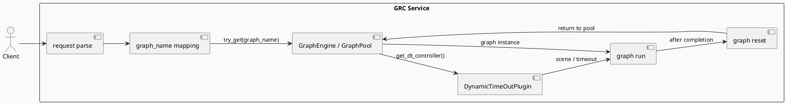

# 2026-08-20 周四代码理解：GraphPool 复用与动态超时绑定

> 日期：2026-08-20  
> 主题来源：2026-06-01 daily-plan 文件没有可直接执行的当日计划，按历史未覆盖主题 fallback 到 `GraphPool` 对象池复用与 `DynamicTimeOutPlugin` 的注入链路；KU/业务背景需人工补充。  
> 范围：只分析 `src/service/grc_service.cpp`，聚焦 `GraphEngine` 取图、`GraphPool::try_get`、图名映射、动态超时控制器获取、`graph->run()` 与 `graph->reset()` 的生命周期。

---

## 0. 架构全景图
<div style="font-family:system-ui,-apple-system,BlinkMacSystemFont,'Segoe UI',sans-serif;border:1px solid #d0d7de;border-radius:8px;padding:14px;background:#f8fafc;line-height:1.45;">
  <div style="display:grid;grid-template-columns:1.2fr 1.2fr 1fr;gap:12px;align-items:stretch;">
    <div style="border:1px solid #cbd5e1;border-radius:8px;padding:12px;background:#fff;">
      <div style="font-size:12px;color:#475569;font-weight:700;letter-spacing:0;text-transform:uppercase;">入口层</div>
      <div style="margin-top:8px;font-size:16px;font-weight:700;color:#111827;">GRC RPC Handler</div>
      <div style="margin-top:8px;color:#334155;">接收请求、解析 UA、准备 request/response 上下文，并决定后续图实例与控制器策略。</div>
    </div>
    <div style="border:1px solid #cbd5e1;border-radius:8px;padding:12px;background:#fff;">
      <div style="font-size:12px;color:#475569;font-weight:700;letter-spacing:0;text-transform:uppercase;">运行层</div>
      <div style="margin-top:8px;font-size:16px;font-weight:700;color:#111827;">GraphEngine + GraphPool</div>
      <div style="margin-top:8px;color:#334155;">按 `graph_name` 借出图实例，执行业务图，再在结束后归还并 reset，避免状态串用。</div>
    </div>
    <div style="border:1px solid #cbd5e1;border-radius:8px;padding:12px;background:#fff;">
      <div style="font-size:12px;color:#475569;font-weight:700;letter-spacing:0;text-transform:uppercase;">控制层</div>
      <div style="margin-top:8px;font-size:16px;font-weight:700;color:#111827;">DynamicTimeOutPlugin</div>
      <div style="margin-top:8px;color:#334155;">从应用上下文获取动态超时控制器，把 scene / timeout 写回执行上下文，约束整条调用链的时延。</div>
    </div>
  </div>
  <div style="margin-top:12px;border-top:1px solid #dbe3eb;padding-top:12px;color:#334155;">
    <strong>关键关系：</strong> `request -> graph_name 选择 -> GraphPool::try_get -> dt_controller -> graph->run() -> graph->reset()`
  </div>
</div>

## 1. 核心流程图


## 2. 结构信息图
```infographic
infographic sequence-ascending-steps
data
  title GRC 处理链路的 4 个稳定节点
  items
    - label 图名选择
      desc `ua` 驱动 `graph_name`，决定进入哪条业务图
      value 1
      icon mdi/cursor-default-click
    - label 图实例借出
      desc `graph_engine->try_get(graph_name)` 从池中取图
      value 2
      icon mdi/database-outline
    - label 动态超时注入
      desc `get_dt_controller()` 后把控制器绑定到执行上下文
      value 3
      icon mdi/timer-cog-outline
    - label 归还与 reset
      desc `graph->reset()` 清理图状态，避免下次请求污染
      value 4
      icon mdi/restore
```

## 3. 代码证据
- `src/service/grc_service.cpp:172-176`：取出 `GraphEngine`，初始化 `GraphPool::PooledObject` 和默认 `graph_name`
- `src/service/grc_service.cpp:179-196`：按 UA 映射到 `dibar_reddot`、`video_immersion`、`searchc_related`、`searchc_immersive_related`、`news_updates_dibar`、`interest_card`、`auto_play`、`default`
- `src/service/grc_service.cpp:196-217`：`try_get()` 借图，调用 `run(...)`，最后 `graph->reset()`
- `src/service/grc_service.cpp:55-64`：从 `ApplicationContext` 获取 `DynamicTimeOutPlugin`，再拿动态超时控制器

## 4. Pitfalls
<div style="display:grid;grid-template-columns:1fr 1fr;gap:12px;">
  <div style="border:1px solid #cbd5e1;border-radius:8px;padding:12px;background:#fff;">
    <div style="font-weight:700;color:#111827;">控制器为空会直接失败</div>
    <div style="margin-top:6px;color:#334155;">`_dynamic_timeout_plugin` 或 `dynamic_timeout_cntl` 为空时直接走 fatal / error 分支，说明该链路把超时配置当成运行前置条件。</div>
  </div>
  <div style="border:1px solid #cbd5e1;border-radius:8px;padding:12px;background:#fff;">
    <div style="font-weight:700;color:#111827;">图对象必须显式 reset</div>
    <div style="margin-top:6px;color:#334155;">`GraphPool` 复用带来性能收益，但也要求每次执行结束都 reset，否则请求状态会泄漏到下一次复用。</div>
  </div>
</div>

## 5. 调试 Checklist
```infographic
infographic list-column-done-list
data
  title GRC 链路排查清单
  items
    - label 确认 `graph_name` 命中
      done true
      desc 检查 UA 到图名的映射是否覆盖目标场景
      icon mdi/map-marker-path
    - label 确认控制器已注入
      done true
      desc 观察 `DynamicTimeOutPlugin` 是否可从上下文获取
      icon mdi/cog-transfer-outline
    - label 确认图实例可借出
      done true
      desc `try_get()` 是否返回有效对象，是否存在池耗尽
      icon mdi/pool
    - label 确认执行后 reset
      done true
      desc 每次调用结束都要看到 reset 路径被走到
      icon mdi/backup-restore
```

## 6. 证据来源
- `src/service/grc_service.cpp:55-64`
- `src/service/grc_service.cpp:172-217`

> 备注：KU 业务背景未逐篇读取正文，需人工补充。

---

## 七、业务代码库适配分析
> **分析时间**：2026-08-21T19:02:00.151519
> **目标代码库**：feeda-mv-grg（序列生成）、feeda-mv-grc（召回汇聚）

## 1. 分析摘要

本次技术点（`GraphPool` 复用 + `DynamicTimeOutPlugin` 动态超时绑定）更适合**服务编排层、图执行层**，而不是纯模型计算层。它的核心价值不在于替换 `std::vector / std::string / std::unordered_map`，而在于把**图实例生命周期**和**超时控制**从业务逻辑中剥离出来：通过 `graph_name -> try_get -> dt_controller -> run -> reset` 的链路，减少对象反复构造、降低状态串用风险，并让时延治理前置化。

从扫描结果看，`feeda-mv-grc` 的适配潜力明显高于 `feeda-mv-grg`：前者已经存在图相关服务代码与多处业务场景落点，适合围绕 `GraphEngine / GraphPool / DynamicTimeOutPlugin` 做统一接入；后者目前仅发现 1 个相关文件，且整体更偏规则/模型/预测链路，适合局部引入复用机制，但不建议大范围迁移。

---

## 2. 代码库详情

### `feeda-mv-grg`（序列生成服务）

- 已发现目标库使用：**1 个文件**
  - `strategy/diversity/rule/low_clarity_diversity_rule.cpp`
- 现有 `std` 等价物使用规模：
  - `std::vector`：**1969 次**，分布在 **356 个文件**
  - `std::string`：**2443 次**，分布在 **425 个文件**
  - `std::unordered_map`：**734 次**，分布在 **205 个文件**
- 典型参考代码：
  - `model/model.h`
  - `model/paddle_model.h`
- 结论：
  - 该库当前更像是**算法/模型/规则计算型**代码库，容器使用很多，但图对象复用与动态超时绑定的直接落点较少。
  - 由于仅发现 1 处相关使用，说明该技术在此库中**尚未形成工程化复用经验**，迁移应保持谨慎，优先在热点规则或编排层试点。

### `feeda-mv-grc`（召回汇聚服务）

- 已发现目标库使用：**10 个文件**
  - `processor/multi_factor/ltr_factor_gen_scene.cpp`
  - `processor/new_adjust/precise_score_init.cpp`
  - `processor/multi_factor/session_ltr_dibar_factor_gen.cpp`
  - `processor/new_adjust/precise_score_init_first_refresh.cpp`
  - `operator/adjuster/sketchy/ltv_factor_cp_opt.cpp`
- 现有 `std` 等价物使用规模：
  - `std::vector`：**8520 次**，分布在 **1290 个文件**
  - `std::string`：**7267 次**，分布在 **1247 个文件**
  - `std::unordered_map`：**2860 次**，分布在 **646 个文件**
- 典型参考代码：
  - `service/grc_http_service.cpp:62`
  - `service/grc_http_service.cpp:81`
  - `service/grc_http_service.cpp:152`
- 结论：
  - 该库已有明显的**服务编排 + 图/依赖处理**特征，和 `src/service/grc_service.cpp` 的流程非常接近。
  - 这里更适合落地 `GraphPool` 复用和动态超时绑定，尤其是**图执行入口、场景初始化、HTTP 服务封装层**。

---

## 3. 💡 适用性评估与建议

- **优先在 `feeda-mv-grc/src/service/grc_service.cpp` 统一图生命周期管理**
  - 建议把 `GraphEngine::try_get(graph_name)`、`graph->run(...)`、`graph->reset()` 封装成一个统一执行入口，最好用 RAII 或作用域 guard 保证异常/早退时也能 reset。
  - 适用场景：所有 `graph_name` 驱动的服务请求，尤其是高 QPS 场景。
  - 价值：避免图状态泄漏，降低人为遗漏 `reset()` 的风险。

- **在 `feeda-mv-grc/service/grc_http_service.cpp` 复用 `graph_name` 映射逻辑**
  - 该文件已经有 `graph_engine->get_vertexs_message(graph_name)` 一类图驱动逻辑，建议把 UA 到 `graph_name` 的映射与 `src/service/grc_service.cpp` 对齐，抽成公共配置或工具函数。
  - 适用场景：`dibar`、`video_immersion`、`searchc_related`、`news_updates_dibar` 等多图分发逻辑。
  - 价值：减少分支散落，便于后续接入 `GraphPool` 和统一超时策略。

- **在 `feeda-mv-grc/src/service/grc_service.cpp` 提前注入 `DynamicTimeOutPlugin`**
  - 建议把 `ApplicationContext` 获取 `DynamicTimeOutPlugin` 的动作前移到服务启动阶段，并在初始化时做空值校验。
  - 适用场景：动态超时是前置条件的图执行链路。
  - 价值：避免运行时才发现控制器为空，提升故障发现速度。

- **在 `feeda-mv-grc/processor/new_adjust/precise_score_init.cpp` 与 `precise_score_init_first_refresh.cpp` 试点动态超时绑定**
  - 这类初始化/首刷场景通常对时延更敏感，适合按 `scene` 注入超时控制器，而不是依赖默认超时。
  - 适用场景：首刷、精排初始化、强时效路径。
  - 价值：更容易定位慢请求，也方便按业务场景做 SLA 分层。

- **在 `feeda-mv-grg/strategy/diversity/rule/low_clarity_diversity_rule.cpp` 只做局部试点，不建议全量引入**
  - 该库目前只有 1 个相关文件，说明缺少成熟的图复用经验。
  - 如果该规则内部只是短生命周期容器运算，优先用 `reserve()`、局部对象复用、减少拷贝即可；只有当它确实承担“图式编排/状态复用”职责时，再考虑引入类似 `GraphPool` 的机制。
  - 适用场景：规则链很长、对象构造昂贵、且需要重复执行的热点路径。
  - 价值：避免在纯计算逻辑里引入过重的生命周期管理复杂度。

---

## 4. ⚠️ 引入风险与限制

- **状态泄漏风险**
  - `GraphPool` 的收益依赖严格的 `reset()` 约束。
  - 一旦在异常分支、提前返回分支遗漏 reset，下一次借出的图可能携带上一次请求状态，导致结果污染。

- **动态超时依赖过强**
  - `DynamicTimeOutPlugin` 或 `dynamic_timeout_cntl` 为空时，链路会直接失败。
  - 这意味着它不是“可选优化”，而是**运行前置条件**，必须在启动阶段完成校验和兜底策略设计。

- **线程安全与池耗尽问题**
  - `GraphPool::try_get` 在高并发下可能出现池耗尽、等待放大或借出失败。
  - 如果图对象内部不是完全无状态，复用还可能引入并发安全问题，需要压测验证。

- **迁移收益在 `feeda-mv-grg` 中可能偏弱**
  - `feeda-mv-grg` 的代码更偏模型和规则计算，虽然 `std::vector/string/unordered_map` 使用很多，但这不等于适合图对象池化。
  - 若强行迁移，可能只增加复杂度，收益不如在 `feeda-mv-grc` 的服务编排层明显。

如果你愿意，我可以继续把这份内容整理成你笔记中可直接粘贴的 **“业务代码库适配分析”标准模板**，统一成和前文章节风格一致的版本。

---
*本章节由 Hermes Agent 自动分析生成，基于代码库静态扫描结果。*
