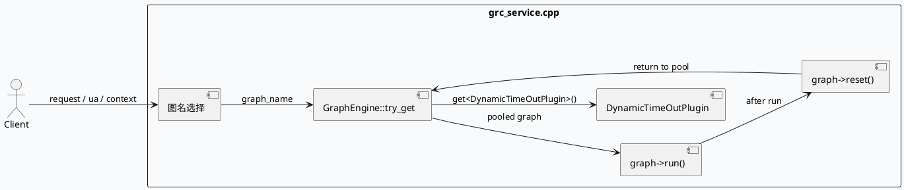

# 2026-08-22 周六代码理解：GraphPool 复用与 reset 生命周期

> 日期：2026-08-22  
> 主题来源：`notes/weekly-topic-selection/daily-plan-20260529.json` 的历史候选项回退；本次 cron 没有可直接执行的当日 daily-plan，KU/业务背景需人工补充。  
> 范围：只分析 `src/service/grc_service.cpp` 中的 `GraphPool::try_get`、图名选择、`graph->run()`、`graph->reset()` 与 `DynamicTimeOutPlugin` 获取链路。

---

## 0. 架构全景图
<div style="font-family:system-ui,-apple-system,BlinkMacSystemFont,'Segoe UI',sans-serif;border:1px solid #d0d7de;border-radius:8px;padding:14px;background:#f8fafc;line-height:1.45;">
  <div style="display:grid;grid-template-columns:1.1fr 1.2fr 1.1fr;gap:12px;align-items:stretch;">
    <div style="background:#ffffff;border:1px solid #cbd5e1;border-radius:8px;padding:12px;">
      <div style="font-size:12px;font-weight:700;color:#475569;text-transform:uppercase;letter-spacing:.04em;">入口层</div>
      <div style="margin-top:8px;font-size:14px;color:#1f2937;">`grc_service.cpp` 请求入口</div>
      <div style="margin-top:8px;font-size:12px;color:#475569;">选择 `graph_name`、装配上下文、触发执行与回收</div>
    </div>
    <div style="background:#eef6ff;border:1px solid #bfdbfe;border-radius:8px;padding:12px;">
      <div style="font-size:12px;font-weight:700;color:#1d4ed8;text-transform:uppercase;letter-spacing:.04em;">核心中枢</div>
      <div style="margin-top:8px;font-size:14px;color:#1e3a8a;">`GraphEngine::try_get()` + `GraphPool`</div>
      <div style="margin-top:8px;font-size:12px;color:#1e40af;">复用图对象，避免重复构造；执行后必须 `reset()`</div>
    </div>
    <div style="background:#fff7ed;border:1px solid #fed7aa;border-radius:8px;padding:12px;">
      <div style="font-size:12px;font-weight:700;color:#c2410c;text-transform:uppercase;letter-spacing:.04em;">控制层</div>
      <div style="margin-top:8px;font-size:14px;color:#7c2d12;">`DynamicTimeOutPlugin`</div>
      <div style="margin-top:8px;font-size:12px;color:#9a3412;">从应用上下文读取超时控制器，影响整条图执行路径</div>
    </div>
  </div>
  <div style="margin-top:12px;display:grid;grid-template-columns:1fr 70px 1fr 70px 1fr;gap:10px;align-items:center;">
    <div style="background:#fff;border:1px solid #cbd5e1;border-radius:8px;padding:10px;text-align:center;">请求上下文<br><span style="font-size:12px;color:#64748b;">`ua` / `res_cnt` / `cntl`</span></div>
    <div style="text-align:center;color:#64748b;font-size:18px;">→</div>
    <div style="background:#fff;border:1px solid #cbd5e1;border-radius:8px;padding:10px;text-align:center;">图名映射<br><span style="font-size:12px;color:#64748b;">`news_updates_dibar` 等</span></div>
    <div style="text-align:center;color:#64748b;font-size:18px;">→</div>
    <div style="background:#fff;border:1px solid #cbd5e1;border-radius:8px;padding:10px;text-align:center;">复用执行<br><span style="font-size:12px;color:#64748b;">`try_get` → `run` → `reset`</span></div>
  </div>
</div>

## 1. 核心调用链


## 2. 执行信息图
```infographic
infographic sequence-timeline-simple
data
  title GraphPool 生命周期
  desc 图对象从获取、执行到回收的最短闭环
  items
    - time 1
      label 选择图名
      desc 由 `ua` 映射到 `graph_name`
      icon mdi:swap-horizontal
    - time 2
      label 从池中取图
      desc `GraphEngine::try_get(graph_name)`
      icon mdi:cached
    - time 3
      label 执行图
      desc `run(graph, graph_name, sctx, done, cntl, res_cnt)`
      icon mdi:play
    - time 4
      label 清理状态
      desc `graph->reset()`，避免脏状态下次复用
      icon mdi:broom
```

```infographic
infographic list-grid-badge-card
data
  title 图名映射要点
  desc 业务图名不是固定常量，而是由请求属性决定
  items
    - label `ua == 97`
      desc `dibar_reddot`
      value 1
    - label `ua == 85`
      desc `video_immersion`
      value 1
    - label `ua == 155/156`
      desc `searchc_related`
      value 2
    - label `ua == 123`
      desc `searchc_immersive_related`
      value 1
    - label `ua == 102`
      desc `news_updates_dibar`
      value 1
    - label `ua == 110`
      desc `interest_card`
      value 1
```

## 3. 关键结论
<div style="font-family:system-ui,-apple-system,BlinkMacSystemFont,'Segoe UI',sans-serif;border:1px solid #cbd5e1;border-left:4px solid #2563eb;border-radius:8px;padding:14px;background:#ffffff;margin:14px 0;">
  <div style="font-size:13px;font-weight:700;color:#1e3a8a;margin-bottom:6px;">结论 1</div>
  <div style="font-size:14px;color:#1f2937;">`GraphPool` 的价值在于复用图实例，但复用前后必须维持严格的 `run -> reset` 顺序，否则会把上一次请求的状态泄漏到下一次执行。</div>
</div>
<div style="font-family:system-ui,-apple-system,BlinkMacSystemFont,'Segoe UI',sans-serif;border:1px solid #cbd5e1;border-left:4px solid #ea580c;border-radius:8px;padding:14px;background:#ffffff;margin:14px 0;">
  <div style="font-size:13px;font-weight:700;color:#9a3412;margin-bottom:6px;">结论 2</div>
  <div style="font-size:14px;color:#1f2937;">动态超时插件不是独立流程，它和取图同一条执行链绑定在一起，说明控制策略必须在图执行之前就准备好。</div>
</div>

## 4. Pitfalls
<div style="font-family:system-ui,-apple-system,BlinkMacSystemFont,'Segoe UI',sans-serif;border:1px solid #e2e8f0;border-radius:8px;padding:14px;background:#f8fafc;">
  <div style="font-size:13px;font-weight:700;color:#334155;margin-bottom:8px;">常见坑</div>
  <div style="font-size:14px;color:#1f2937;">1. 只看 `try_get` 不看 `reset`，会误判对象池“无副作用”。</div>
  <div style="font-size:14px;color:#1f2937;margin-top:6px;">2. 把 `graph_name` 当成静态配置，忽略了 `ua` 驱动的分流逻辑。</div>
  <div style="font-size:14px;color:#1f2937;margin-top:6px;">3. 认为超时控制和图执行无关，实际上它在上下文获取阶段就参与了整条链路。</div>
</div>

```infographic
infographic list-column-done-list
data
  title 调试 checklist
  items
    - label 确认 `ua` 到 `graph_name` 的映射是否命中预期分支
      done true
    - label 确认 `GraphEngine::try_get()` 返回的是池中复用对象而不是新构造对象
      done true
    - label 检查 `graph->run()` 后是否总是执行 `graph->reset()`
      done true
    - label 核对 `DynamicTimeOutPlugin` 是否在上下文中成功获取
      done true
    - label 验证异常路径是否会跳过回收
      done true
```

## 5. 证据来源
- `src/service/grc_service.cpp:56-57`
- `src/service/grc_service.cpp:180-220`
- `src/service/grc_service.cpp:228-233`

> 需人工补充：KU/业务背景未逐篇读取正文，仅使用日计划候选与源码证据。

---

## 七、业务代码库适配分析
> **分析时间**：2026-08-23T19:05:40.690302
> **目标代码库**：feeda-mv-grg（序列生成）、feeda-mv-grc（召回汇聚）

# 业务代码库适配分析报告：GraphPool 复用与 reset 生命周期

## 1. 分析摘要

- 这项技术的核心价值不是“多一个池”，而是把**图对象的构造、执行、清理**变成一条可控链路：`try_get -> run -> reset`。从技术笔记看，`DynamicTimeOutPlugin` 也绑定在同一执行链上，说明它更适合**请求驱动、重复执行、对象构造成本较高**的业务场景。
- 在两个代码库里，`feeda-mv-grc` 的适配潜力明显更高：它已经存在 `grc_service.cpp`、`grc_http_service.cpp` 这类图相关入口，且扫描到 10 个相关文件，说明这条链路更像是“主干能力”。`feeda-mv-grg` 仅发现 1 个相关文件，适合做局部试点，不建议一开始全量迁移。

---

## 2. 代码库详情

### feeda-mv-grg

- 扫描到的目标相关文件只有 1 个：
  - `strategy/diversity/rule/low_clarity_diversity_rule.cpp`
- 现有 `std` 等价物使用规模：
  - `std::vector`：1969 次，356 个文件
  - `std::string`：2443 次，425 个文件
  - `std::unordered_map`：734 次，205 个文件
- 适配判断：
  - 这个库的代码形态以**策略/规则 + 容器处理**为主，说明业务逻辑分散但不一定有统一的图执行框架。
  - 仅有 1 个相关文件，意味着这项技术在这里**尚未形成平台级复用模式**，更适合在单文件或单规则链路中做试点。
- 可作为参考的现有代码：
  - `strategy/diversity/rule/low_clarity_diversity_rule.cpp`
- 结论：
  - 迁移收益中等偏低，主要看该规则是否存在**重复构图、重复初始化、重复清理**问题。
  - 如果只是一次性执行，GraphPool 的收益可能不足以覆盖改造成本。

### feeda-mv-grc

- 扫描到的目标相关文件有 10 个，覆盖面明显更广：
  - `operator/adjuster/sketchy/duanju_adjuster.cpp`
  - `operator/adjuster/sketchy/ltv_factor_cp_opt.cpp`
  - `processor/multi_factor/subcate_future_factor_gen.cpp`
  - `processor/multi_factor/session_ltr_dibar_factor_gen.cpp`
  - `processor/multi_factor/ltr_factor_gen_scene.cpp`
  - 以及其他 5 个相关文件
- 现有 `std` 等价物使用规模：
  - `std::vector`：8520 次，1290 个文件
  - `std::string`：7267 次，1247 个文件
  - `std::unordered_map`：2860 次，646 个文件
- 适配判断：
  - 这是一个**高规模、强复用、强数据流**的代码库，且已经存在 `grc_service.cpp` / `grc_http_service.cpp` 这样的服务入口，非常适合引入“图对象池 + reset 生命周期”模式。
  - 容器使用量很大，说明业务链路中存在大量中间状态和上下文传递；如果图对象构造昂贵，复用收益会比较明显。
- 可作为参考的现有代码：
  - `service/grc_http_service.cpp`
  - `service/grc_service.cpp`（技术笔记中已明确涉及 `graph_name`、`graph->run()`、`graph->reset()`、`DynamicTimeOutPlugin`）
- 结论：
  - 迁移潜力高，建议优先在服务入口层和统一执行链路上落地，避免在多个业务模块里重复实现“获取-执行-清理”逻辑。

---

## 3. 💡 适用性评估与建议

- **优先在 `feeda-mv-grc/service/grc_service.cpp` 和 `service/grc_http_service.cpp` 做统一封装**
  - 建议把 `GraphEngine::try_get()`、`graph->run()`、`graph->reset()` 封装成一个 RAII 风格的执行助手，避免调用方手工管理生命周期。
  - 场景：请求入口根据 `ua` 选择 `graph_name`，再进入执行链路时统一保证 reset。
  - 价值：减少异常路径漏清理、提前 return 漏 reset 的风险。

- **把 `DynamicTimeOutPlugin` 的获取前置到图执行前的统一上下文装配层**
  - 建议在 `feeda-mv-grc/service/grc_service.cpp` 中保持“先拿插件、再执行图”的顺序，不要让业务子模块自行临时获取。
  - 场景：超时策略依赖请求上下文，且会影响整条图链路。
  - 价值：避免不同调用点出现超时策略不一致的问题。

- **在 `feeda-mv-grc/operator/adjuster/sketchy/duanju_adjuster.cpp`、`ltv_factor_cp_opt.cpp` 中复用同一套图执行生命周期**
  - 如果这两个 adjuster 里存在重复的初始化/释放逻辑，建议改成从图池取对象，而不是每次新建执行上下文。
  - 场景：高频调整、反复触发的业务请求。
  - 价值：降低对象构造和销毁成本，减少碎片化实现。

- **在 `feeda-mv-grc/processor/multi_factor/subcate_future_factor_gen.cpp`、`session_ltr_dibar_factor_gen.cpp`、`ltr_factor_gen_scene.cpp` 中试点“按 scene 复用图实例”**
  - 这些文件更像是批处理或阶段式生成逻辑，适合按场景维度缓存图实例。
  - 场景：同一 scene 下多次执行拓扑一致，只更新输入上下文。
  - 价值：如果图结构稳定，复用收益会比纯函数式重建更高。

- **`feeda-mv-grg/strategy/diversity/rule/low_clarity_diversity_rule.cpp` 适合做局部试点，不建议全局推广**
  - 这个库只发现 1 个相关文件，说明技术覆盖面很窄。
  - 建议先观察该规则是否存在重复构图、重复依赖初始化、重复资源释放，再决定是否引入池化。
  - 价值：先用低风险改造验证“复用 + reset”是否能真正降低成本。

---

## 4. ⚠️ 引入风险与限制

- **reset 漏调用会造成跨请求状态污染**
  - 这是最关键的风险。
  - 一旦 `graph->run()` 后没有严格执行 `graph->reset()`，上一次请求的上下文、缓存、临时节点都可能污染下一次执行。

- **异常路径和早返回路径最容易破坏生命周期**
  - 比如 `run()` 抛异常、超时中断、参数校验失败后提前 return。
  - 如果没有 RAII 或统一收尾，池化对象会留下脏状态。

- **`ua -> graph_name` 映射不是静态配置，迁移时要防止分流逻辑被改坏**
  - 技术笔记已经明确 `graph_name` 是由请求属性驱动的。
  - 如果图池 key 设计和路由规则不一致，可能出现“取到错误图”的问题。

- **线程安全和池竞争需要单独评估**
  - `GraphPool` 如果被多请求共享，必须确认锁粒度、并发访问、对象归还策略。
  - 在高并发服务里，池本身可能成为瓶颈，抵消部分收益。

---

## 总体建议

- **`feeda-mv-grc`：建议优先落地**
  - 以 `service/grc_service.cpp`、`service/grc_http_service.cpp` 为入口做统一生命周期封装。
  - 先解决“图复用 + reset 保障 + 超时插件前置”三件事。

- **`feeda-mv-grg`：建议谨慎试点**
  - 先在 `strategy/diversity/rule/low_clarity_diversity_rule.cpp` 单点验证。
  - 如果没有明显的重复构图和执行成本，不建议强行引入复杂池化机制。

---
*本章节由 Hermes Agent 自动分析生成，基于代码库静态扫描结果。*
