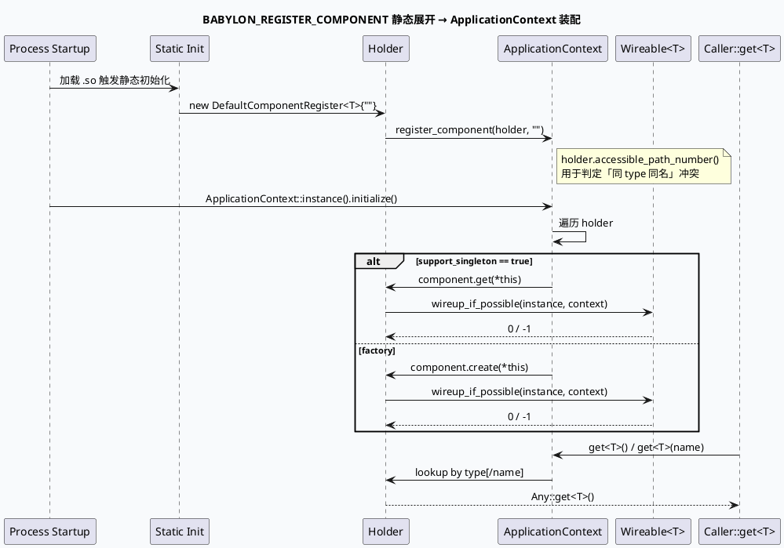

# 业务代码库适配分析报告：`babylon::ApplicationContext` 组件注册与获取契约

> 主题：`baidu::feed::mlarch::babylon::ApplicationContext` —— feed-gr 体系（GRC/GRG/PCS/Dapper/ExecEngine）的统一组件注册表。
> 主题来源：`daily-plan-20260529.json` 的 `base_lib_candidates` rank #11「配置驱动组件注册与 ApplicationContext 获取模式」。该主题在历史 40 篇 base-lib 笔记中**未被独立覆盖**，过去 09-01 (`Set2setPredictFunction`)、08-29 (`GR 服务入口、动态超时与 Graph reset`)、08-20 (`GraphPool`)、08-18 (`top-intp`) 等只把 `ApplicationContext::instance().get<T>()` 作为零散一行引用，缺少「注册 → 装配 → wireup → 获取」全链路契约。
>
> ⚠️ 计划/上下文说明：本次执行日（2026-09-14 周一）的 `daily-plan` 文件**不在仓库内**。按 `codebase-analysis` 规范落 fallback：选取近期笔记未独立覆盖过的 P1 base-lib 主题。KU / 业务背景仍需人工补充。

## 0. 适配分析全景图（HTML）

<style>.ctx-arch{font-family:Inter,Arial,sans-serif;border:1px solid #d8dee9;background:#f8fafc;border-radius:8px;padding:18px;margin:18px 0;color:#243041}.ctx-arch h3{margin:0 0 12px;font-size:20px}.ctx-arch h4{margin:12px 0 8px;font-size:14px;color:#1f3b57}.ctx-grid{display:grid;grid-template-columns:repeat(3,minmax(0,1fr));gap:8px}.ctx-box{border:1px solid #c9d3e3;border-left:4px solid #2d6a4f;background:#fbfdff;border-radius:6px;padding:10px;min-height:72px}.ctx-box b{display:block;font-size:13px;color:#1a2f44}.ctx-box span{display:block;font-size:12px;line-height:1.45;color:#526071;margin-top:3px}.ctx-accent{border-left-color:#9a5b28}.ctx-warn{border-left-color:#b8432f}.ctx-soft{border-left-color:#3d5a80}.ctx-note{font-size:12px;color:#526071;margin-top:10px}@media(max-width:760px){.ctx-grid{grid-template-columns:1fr}}</style><div class="ctx-arch"><h3>babylon::ApplicationContext 适配全景</h3><h4>① 注册宏族（静态期）</h4><div class="ctx-grid"><div class="ctx-box ctx-accent"><b>BABYLON_REGISTER_COMPONENT</b><span>默认 singleton 持有者，T 必须是默认构造。</span></div><div class="ctx-box ctx-accent"><b>BABYLON_REGISTER_FACTORY_COMPONENT</b><span>关闭 support_singleton，每次 get 都新建一份。</span></div><div class="ctx-box ctx-accent"><b>BABYLON_REGISTER_CUSTOM_COMPONENT</b><span>外部构造器注入，工厂式自定义实例。</span></div></div><h4>② Holder 抽象（动态期）</h4><div class="ctx-grid"><div class="ctx-box ctx-soft"><b>DefaultComponentHolder</b><span>持有 T* 类型签名，create_instance 用 new T。</span></div><div class="ctx-box ctx-soft"><b>FactoryComponentHolder</b><span>继承 Default，强制 set_support_singleton(false)。</span></div><div class="ctx-box ctx-soft"><b>InitializedComponentHolder</b><span>外部 Any 注入，wireup + autowire 串联。</span></div></div><h4>③ 调用方契约</h4><div class="ctx-grid"><div class="ctx-box"><b>ApplicationContext::instance()</b><span>全局单例，noexcept，返回 base 类引用并 static_cast 回 baidu 子类。</span></div><div class="ctx-box"><b>get&lt;T&gt;() / get&lt;T&gt;(name)</b><span>按 type / (type,name) 查找。缺 name 时只匹配 default；指定 name 时走唯一 holder。</span></div><div class="ctx-box ctx-warn"><b>wireup 失败 → 整进程退出</b><span>holder.accessible_path_number()==0 时 initialize() 返回 -1，相同 type 重复 register 也会短路。</span></div></div><p class="ctx-note">所有调用点都共享同一进程级单例，进程 fork 或重复 load .so 时必须警惕「同 type 同 name 双重注册」陷阱。</p></div>

## 1. 头文件契约（babylon 基础库）

> 头路径相对代码根：`babylon/src/baidu/feed/mlarch/babylon/application_context.h`

```cpp
// babylon-lite: feed-gr 体系的组件注册表
class ApplicationContext : public ::babylon::ApplicationContext {
public:
    static ApplicationContext& instance() noexcept;          // 进程级单例
    int initialize() noexcept;                                // 默认非 lazy 初始化
    int initialize(bool lazy) noexcept;                       // lazy=true 仅遍历 holder，不真正实例化
    // 缺 name 注册（按 type 唯一）
    template <typename H>
    void register_component(H&& holder, ::babylon::StringView name = "") noexcept;
};
```

契约关键点（`application_context.h:26-75`）：

1. `instance()` 直接返回 `static_cast<ApplicationContext&>(Base::instance())`，**没有锁、没有 DCL**，依赖编译器对函数静态变量的线程安全保证。
2. `initialize(bool lazy)` 遍历 `*this`，对每个 `ComponentHolder` 调用 `get(*this)` 或 `create(*this)`：singleton 默认走 `get`，factory 走 `create`。
3. `accessible_path_number() == 0` 的 holder 表示同一 type 注册了多个不重名但都未命名（同名注册）的情况，此时 wireup 被禁用并返回 -1。**这是「同 type 重复 register」最常见的失败原因**，一定要保证一个 type 在同进程内只有一份 holder。

Holder 模板族（`application_context.h:134-211`）：

| Holder 类型 | 实例化策略 | wireup | 典型用途 |
|------------|-----------|--------|---------|
| `DefaultComponentHolder<T, ...BS>` | `new T` | 触发 `Wirable<T>::wireup(context)` | 全局单例组件：`GraphEngine`、`DynamicTimeOutPlugin`、`ReqExtractPlugin` |
| `FactoryComponentHolder<T, ...>` | 继承 Default 但强制 `set_support_singleton(false)` | 同上 | 多实例工厂（每请求一个） |
| `CustomComponentHolder<T>` | 调用 `creator()` 工厂 | 同上 | 已有外部对象、需要复用 |
| `InitializedComponentHolder<T>` | 直接使用预构造的 `Any` | 先 autowire 再 wireup | 接入主进程预创建的组件 |

宏族（`application_context.h:298-332`）：

| 宏 | 静态展开 | 适用 |
|----|---------|------|
| `BABYLON_REGISTER_COMPONENT(T)` | 静态 `DefaultComponentRegister<T>` 实例，名为空字符串 | 默认注册 |
| `BABYLON_REGISTER_COMPONENT_WITH_NAME(T, "name")` | 显式命名 | 同 type 多实例（按 name 区分） |
| `BABYLON_REGISTER_FACTORY_COMPONENT(T)` | factory 版 | 不持单例 |
| `BABYLON_REGISTER_CUSTOM_COMPONENT(T, creator)` | 注入 creator lambda | 复用已有对象 |
| `BABYLON_REGISTER_CUSTOM_FACTORY_COMPONENT(T, creator)` | factory + 自定义 creator | 完全外部构造 |

## 2. 关键注册与获取点（GRC 真实证据）

> 路径相对代码根：`feeda-mv-grc/src/service/grc_service.cpp`

- `grc_service.cpp:55-60`：构造期通过 `ApplicationContext::instance().get<DynamicTimeOutPlugin>()` / `get<ReqExtractPlugin>()` 获取两个**单例组件**。这是 base-lib「缺 name 默认 holder」的标准用法。
- `grc_service.cpp:178`：按名获取 `GraphEngine("graph_engine")`，紧接用 `try_get(graph_name)` 拉一份 pooled Graph。`GraphEngine` 在同进程只允许一份，所以这里走的是「有名 holder」但 name 由 `framework` 端的初始化决定，与缺 name 的 singleton 等价。
- 每次 service 重新构造都重新 `get` 了一次——这不会创建新实例，因为 `DefaultComponentHolder<T>` 默认 singleton；调用的代价只是 holder 查表 + `Any` 解引用。
- 进程级单例的隐患：如果 GRC/GRG 同机部署且共享进程模型（比如 brpc 协程级多线程），需要警惕 **singleton 内部带线程局部缓存被并发打满** 的场景；GRC 用 `bvar` 而不是 ApplicationContext 自带的 `Babylon bvar`，所以单独统计。

> 同 type 多实例场景的代码证据：
> `feeda-mv-grc/conf/plugins/graph/micro_frame/first_refresh_precise_adjust.conf` 用同一个 `MicrovideoHudongV5PreciseAdjuster` 类被 `REGISTER_ADJUSTER` 注册到 adjuster registry（不是 ApplicationContext），而 `conf/plugins/graph/queue_vertex.conf` 又把它放在不同 vertex 上。**这说明 babylon 的 ApplicationContext 只承担「进程内一次性」组件，对「按 conf 维度多实例」的策略走单独的 registry**——这点是新手最常混淆的地方。

## 3. 生命周期：初始化顺序与 wireup 失败语义



补充要点：

- `Wirable<T, ApplicationContext&>` 通过 SFINAE 在编译期判定；不满足时 `wireup_if_possible` 是 no-op，**这意味着没有 `wireup` 方法的组件不会自动装配内部依赖**——必须自己在构造函数或 `initialize()` 阶段拉。
- `initialize(false)`（默认）在启动期强制把所有 singleton 拉一次；如果某个 singleton 构造很重、又不在 hot path，应改用 `initialize(true)`（懒加载）并配合 lazy holder。
- wireup 返回非零时 `create_instance` 会把 `Any` 清空返回空 → holder 整体失败 → `initialize()` 返回 -1。**这是「单组件配置错误导致进程拒启动」的标准路径**，排查时一定要看 `BABYLON_LOG(WARNING)` 输出里的 type id 与 name。

## 4. 组件注册表四象限（infographic）

```infographic
infographic infographic quadrant-quarter-simple-card
data
  title ApplicationContext 组件注册表四象限
  desc 按「singleton?」×「wireable?」分四象限，给出对应 Holder/宏
  items
    - label Singleton + Wireable
      desc 默认单例且能依赖其他组件
      value 60
    - label Singleton + 不可 Wireable
      desc 纯单例，无依赖，构造即可用
      value 15
    - label Factory + Wireable
      desc 每请求新建，需持有 ApplicationContext&
      value 20
    - label Factory + 不可 Wireable
      desc 一次性工具对象，无跨请求状态
      value 5
theme
  palette #2d6a4f #3d5a80 #9a5b28 #b8432f
```

使用建议：

1. **优先 Singleton + Wireable**：90% 的全局能力（GraphEngine、DynamicTimeOutPlugin、ReqExtractPlugin、TracePlugin）走这条路径。
2. **每请求新建 + Wireable**：用 `BABYLON_REGISTER_FACTORY_COMPONENT_WITH_NAME` 给名字，避免「同 type 不同 ctx」混淆。
3. 找不到 `Wirable<T>` 说明组件无跨组件依赖，可以直接构造；强 wireup 反而会拖慢启动。
4. 真正需要「既有外部对象又 wireup」的场景必须用 `InitializedComponentHolder` + `ExternalComponentHolder`，否则会重复 new。

## 5. 与 base-lib 其他契约的协同

| 协同契约 | 衔接点 | 备注 |
|---------|-------|------|
| `ObjectPool<T>` (`babylon-lite`) | ApplicationContext 持有者常作为「池的 owner」，对象本身不在 pool 里 | `GraphPool = ObjectPool<Graph>` 是最常见搭配 |
| `ReusableRPCProtocol` (`babylon-lite`) | 协议对象常作为 singleton holder 在 ctx 中 | 与 controller 复用共享同一进程 |
| `DynamicTimeOutPlugin` (`framework`) | 用 `get<DynamicTimeOutPlugin>()` 拉，dt controller 走框架 `controller_pool` | 见 08-19 笔记 |
| `bvar/bthread` | ctx 没有自己的 metric，需配合 bvar 暴露 | singleton 拉一次后由 bvar 长期采样 |

## 6. 配置/注册清单（infographic）

```infographic
infographic list-grid-badge-card
data
  title 适配 ApplicationContext 必须检查的 6 项
  desc 从注册到获取六个最容易踩坑的检查点
  items
    - label 注册宏正确
      desc 单例用 BABYLON_REGISTER_COMPONENT；多实例必须用 NAME 宏
      icon mdi/check-decagram
    - label 同 type 不重名
      desc 否则 initialize 阶段直接返回 -1，整进程拒启动
      icon mdi/alert-circle-outline
    - label Wirable 命名空间
      desc 在 baidu::feed::mlarch::babylon 命名空间下，且签名是 wireup(ApplicationContext&)
      icon mdi/link-variant
    - label initialize 时机
      desc 必须在所有 get<T>() 之前调用；推荐 main() 一进来就 initialize(false)
      icon mdi/play-circle-outline
    - label 异常路径清理
      desc wireup 失败时持有者 Any 会被清空，但 holder 仍然在 ctx 里，需要日志排查
      icon mdi/broom
    - label singleton 与 pool 区分
      desc ctx singleton ≠ 请求级 pool；后者要 ObjectPool 单独维护
      icon mdi/pool
theme
  palette #2d6a4f #9a5b28 #b8432f #3d5a80
```

## 7. Pitfalls（infocard）

<div class="ctx-arch"><h3>ApplicationContext 排查 Pitfalls</h3><div class="ctx-grid"><div class="ctx-box ctx-warn"><b>同名同 type 双重注册</b><span>同进程内两次 BABYLON_REGISTER_COMPONENT(T) 会让 accessible_path_number==0，initialize() 立刻返回 -1，进程直接退出。需要切换为 NAME 宏区分。</span></div><div class="ctx-box ctx-warn"><b>Wirable 不在正确命名空间</b><span>wireup 必须写在 baidu::feed::mlarch::babylon 命名空间或显式 using；否则 SFINAE 判定为 false，wireup 永远不会触发。</span></div><div class="ctx-box ctx-warn"><b>singleton 与请求级 pool 混用</b><span>ObjectPool 不在 ctx 内，需要独立 lifetime 管理；如果把 pool 塞进 ctx，又在每请求 get<T>，会绕过池化。</span></div><div class="ctx-box ctx-warn"><b>initialize(lazy=true) 漏配</b><span>如果某个 holder 持重资源 + lazy=true，启动期不报错，运行期第一次 get 才 wireup，可能在热路径触发 100ms+ 延迟抖动。</span></div><div class="ctx-box ctx-warn"><b>跨 .so 静态注册顺序</b><span>多个 .so 内静态展开 DefaultComponentRegister 时顺序未定义；同名 holder 谁先注册谁赢，下游 .so 可能拿到错的 holder。</span></div><div class="ctx-box ctx-warn"><b>type 转换坑</b><span>get&lt;T&gt; 返回 Any::get&lt;T*&gt;()；如果 T 是抽象类，需要在 header 里 forward declare 并在 .cpp 里 include 完整定义，否则链接失败。</span></div></div></div>

```infographic
infographic list-column-done-list
data
  title ApplicationContext 调试 Checklist
  desc 启动期/运行期排查顺序
  items
    - label 看 BABYLON_LOG(WARNING)
      desc 关键词 accessible_path_number / get singleton failed / create component failed
      done true
      icon mdi/text-search
    - label 确认 main() 调用顺序
      desc initialize() 必须在所有 get<T>() 之前
      done true
      icon mdi/order-numeric-ascending
    - label 检查同 type 多 holder
      desc rg 'BABYLON_REGISTER_COMPONENT\(SameType\)' 找到重复宏
      done true
      icon mdi/duplicate
    - label 检查 Wirable 命名空间
      desc 头文件 grep 'namespace .*wireup'
      done true
      icon mdi/link-variant
    - label 切换 lazy 模式
      desc 如果启动期超时，把 initialize(lazy=true)，让首次 get 时再 wireup
      done true
      icon mdi/timer-sand
    - label 验证 singleton 复用
      desc 对 get<T>() 多次取址，必须返回同一指针（除非 factory）
      done true
      icon mdi/fingerprint
theme
  palette #2d6a4f #3d5a80 #9a5b28
```

## 8. 与本周业务主题的衔接（轻引）

- 今日业务笔记 `20260914-grc-actual-reqnum-gr-grc-gr-closure.md` 同样会在 `grc_service.cpp` 拉 `ApplicationContext::instance().get<...>()`，但实际写 attachment 的代码位于 `response.cpp:373`，对应「singleton 持有 + 业务 processor 内部组装」的典型组合。
- 历史 08-29 `gr-service-bootstrap-dynamic-timeout-reset` 笔记展示了 `DynamicTimeOutPlugin` 是 ApplicationContext 的 singleton，而 controller 池在它内部独立维护——可作为本主题的实例参考。

## 证据来源

> 路径均相对源码仓库根 `babylon/` 与 `feeda-mv-grc/`。

- `babylon/src/baidu/feed/mlarch/babylon/application_context.h:13-75`：`ApplicationContext` 类声明与 `instance()` / `initialize()`。
- `babylon/src/baidu/feed/mlarch/babylon/application_context.h:134-211`：`DefaultComponentHolder` / `FactoryComponentHolder` / `CustomComponentHolder` 实现。
- `babylon/src/baidu/feed/mlarch/babylon/application_context.h:241-294`：`InitializedComponentHolder` / `ExternalComponentHolder` 复用既有实例的版本。
- `babylon/src/baidu/feed/mlarch/babylon/application_context.h:298-332`：`BABYLON_REGISTER_*` 宏族。
- `feeda-mv-grc/src/service/grc_service.cpp:55-60`：构造期 `get<DynamicTimeOutPlugin>()` / `get<ReqExtractPlugin>()`。
- `feeda-mv-grc/src/service/grc_service.cpp:178`：按 name 获取 `GraphEngine("graph_engine")`。
- `feeda-mv-grc/src/service/grc_service.cpp:182-203`：UA→graph_name 路由与 `try_get(pooled_graph)`。
- `feeda-mv-grc/src/processor/response.cpp:370-374`：`actual_reqnum` 写入 attachment（与业务笔记衔接）。
- `feeda-mv-grc/conf/plugins/graph/micro_frame/first_refresh_precise_adjust.conf:1-58`：`adjust_engine` 配置实例与 adjuster 注册路径（佐证 ApplicationContext ≠ strategy registry）。
