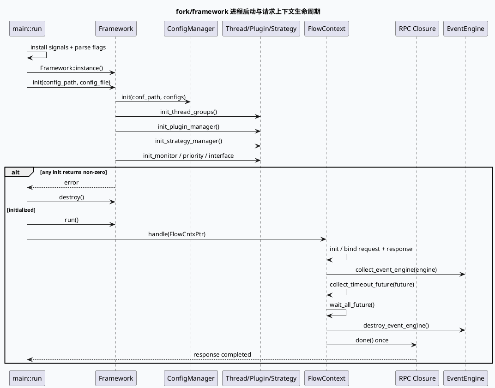

# 基础库代码理解：`fork::Framework` 初始化与 `FlowContext` 生命周期契约

> 主题：`rec::fork` 框架如何把配置初始化、线程执行环境、RPC 请求上下文、Future 等待和事件引擎回收串成一条生命周期。
> 主题选择说明：仓库内唯一的 daily-plan 是 `daily-plan-20260529.json`，已明显早于本次执行日 2026-09-24；其中 GraphPool、DynamicTimeOut、PipelineGraphFunction、序列化等高优先级候选在近期笔记中已有覆盖。本次按 fallback 规则选择计划候选池外仍未独立覆盖的 `fork/framework` 基础契约。KU/业务上下文未逐篇读取，需人工补充；以下结论以源码证据为主。

## 0. 架构全景图

<style>.fork-arch{font-family:Inter,Arial,sans-serif;border:1px solid #d8dee9;background:#f8fafc;border-radius:8px;padding:18px;margin:18px 0;color:#243041}.fork-arch h3{margin:0 0 12px;font-size:20px}.fork-arch h4{margin:14px 0 8px;font-size:14px;color:#1f3b57}.fork-grid{display:grid;grid-template-columns:2fr 1fr;gap:10px}.fork-box{border:1px solid #c9d3e3;border-left:4px solid #2d6a4f;background:#fff;padding:11px;min-height:72px;border-radius:6px}.fork-box b{display:block;font-size:13px;color:#1a2f44}.fork-box span{display:block;font-size:12px;line-height:1.5;color:#526071;margin-top:4px}.fork-init{border-left-color:#3d5a80}.fork-life{border-left-color:#9a5b28}.fork-risk{border-left-color:#b8432f}.fork-note{font-size:12px;line-height:1.5;color:#526071;margin-top:10px}@media(max-width:760px){.fork-grid{grid-template-columns:1fr}}</style><div class="fork-arch"><h3>fork/framework 运行时分层</h3><h4>进程启动与框架装配</h4><div class="fork-grid"><div class="fork-box fork-init"><b>main.cpp::run</b><span>安装信号处理器、解析 flags、初始化 perf 与 bthread 栈参数，然后取得 Framework 单例。</span></div><div class="fork-box fork-init"><b>Framework::init</b><span>读取配置，依次创建线程组、插件、策略、监控、优先级与 InterfaceClub。</span></div></div><h4>请求级上下文</h4><div class="fork-grid"><div class="fork-box"><b>FlowContext</b><span>集中保存 request/response protobuf、brpc Controller、Closure、FlowEnv、Future tomb 与 EventEngine。</span></div><div class="fork-box fork-life"><b>GeneralFlowContext</b><span>在 pack_response/done 阶段写 attachment 并保证 Closure 只执行一次。</span></div></div><h4>跨请求共享与回收</h4><div class="fork-grid"><div class="fork-box fork-life"><b>FlowEnv / EventEngine</b><span>FlowEnv 与 DAG 同生命周期；EventEngine 由 context 持有，完成后显式 destroy。</span></div><div class="fork-box fork-risk"><b>future_tomb</b><span>异步任务必须登记，wait_all_future() 等待并清空，否则 reset/done 可能早于后台任务。</span></div></div><div class="fork-note">核心边界：Framework 管进程级装配，FlowContext 管请求级资源；二者不能用“全局单例”方式替代彼此的生命周期。</div></div>

## 1. 入口链：`run → init → run_until_asked_to_quit`

`src/main.cpp:74-114` 显示启动顺序：先安装信号处理与 perf，再设置普通 bthread 栈大小，调用 `Framework::init`，成功后进入 `Framework::run`，最后等待退出、stop、join。初始化失败和运行失败都会先 `destroy()` 再返回错误码，因此 `init` 的返回值是进程启动闸门，而不是可忽略的 warning。

`src/framework.h:34-67` 将 Framework 暴露为进程级入口：`instance()` 返回单例，`init()` 负责装配，`handle(FlowCntxPtr)` 负责进入请求处理，`run/stop/join` 管理服务运行窗口；`engine()` 则是旧异步接口到新 Engine 的桥接点。



## 2. `Framework::init` 的配置装配顺序

`src/framework.cpp:200-404` 是实际初始化骨架。它先加载日志并决定 `non_io_cost_enable`，再初始化 thread-local key 与 `ConfigManager`；之后读取默认 worker 类型，创建线程组，继续装配 dict、plugin、strategy、smfw、commander、monitor、priority、interface club、dataframe device manager、coach 和 meta manager。每个阶段都检查返回码，失败立即返回，避免服务以半初始化状态接受请求。

这里有两个重要契约：

1. `threading.default_workers_type` 只接受 `pthread` 或 `bthread` 对应的枚举分支；未知值走 fatal/error 返回，不会静默落到默认值。
2. 配置项不是平铺读取，而是按 `threading`、`configs`、`plugin`、`strategy`、`monitor` 等 section 分层传入各 manager。排查时应先确认 section 路径，再看具体插件配置。

`src/framework.h:114-127` 进一步说明运行时持有 `_sync_proc_group`、`_cmd_proc_group`、`_engine`、`_binited` 和默认 worker 类型。`_binited` 是框架是否完成初始化的状态位，不能由业务请求自行修改。

```infographic
infographic sequence-ascending-steps
data
  title Framework 初始化流水线
  desc 从进程入口到可接收请求的严格顺序
  items
    - label 1. 解析启动参数
      desc main.cpp 读取 config_path 和 config_file，并设置信号与 bthread 栈参数
      icon mdi/flag-outline
    - label 2. 初始化日志与本地存储
      desc 加载 comlog，初始化 bthread key 和 thread context key
      icon mdi/file-cog-outline
    - label 3. 初始化 ConfigManager
      desc 把 configs section 交给统一配置管理器
      icon mdi/database-cog-outline
    - label 4. 创建线程执行环境
      desc 读取 default_workers_type，创建 sync/cmd thread groups
      icon mdi/lan-connect
    - label 5. 装配扩展组件
      desc dict/plugin/strategy/smfw/monitor/priority/interface 依次初始化
      icon mdi/puzzle-outline
    - label 6. 进入服务循环
      desc Framework::run 成功后才允许 handle FlowContext
      icon mdi/play-circle-outline
    - label 7. 退出时回收
      desc stop 后 join；初始化或运行失败先 destroy
      icon mdi/stop-circle-outline
 theme
  palette #2d6a4f #3d5a80 #9a5b28 #b8432f
```

## 3. `FlowContext`：请求资源的统一容器

`src/common/flow_context.h:43-190` 把一条请求需要的跨层对象集中在同一个 context：

- `_resp`、`_general_resp_pb`、`_general_req_pb` 和 `_resp_pb` 分别指向框架接口及用户服务的 protobuf 请求/响应。
- `_done` 是 Closure 基类指针，`_cntl` 是 brpc Controller；二者生命周期由 RPC 框架管理，FlowContext 只保存借用指针。
- `_flow_env` 与 DAG 同生命周期，注释明确它应在最后一个请求结束后销毁。
- `future_tomb` 保存待等待的异步 Future；`collect_timeout_future()` 加锁登记，`wait_all_future()` 逐个 wait 后清空。
- `_event_engine` 由 `collect_event_engine()` 移入 context，`destroy_event_engine()` 显式调用 destroy 并在失败时 fatal。
- `_node_cntx_map` 受独立 mutex 保护；不要把它与 `_status_mutex` 混为同一状态域。

`reset()` 只重置 flow info、done 标志、染色 context 与 FlowEnv，不会自动替调用方等待 Future，也不会自动销毁 EventEngine。因此复用 context 前必须执行框架规定的等待与回收阶段。

`copy()` 只复制请求/响应指针、Closure、Controller、BaseContext、Document 等浅层句柄，不复制 `future_tomb`、mutex、node map 和 event engine。它适合派生上下文复制请求视图，不适合当作完整深拷贝。

## 4. `GeneralFlowContext` 的响应收尾契约

`src/common/general_flow_context.h:28-68` 给出了通用 RPC context 的两个关键动作：

- `pack_response()` 如果 `_is_done` 已经为真则直接跳过；否则检查 `_cntl`，从当前线程环境取 `RuntimeCntx`，在非 HTTP 协议下把 node statistics 序列化到 response attachment。
- `done()` 只有在 `_is_done == false` 时才调用 `_done->Run()`，然后设置 `_is_done = true`。这是 Closure 单次执行的防重入门闩。

因此业务 processor 如果同时有同步完成、超时 Future 回调和事件引擎后置任务，所有路径都必须汇聚到同一个 `done()` 语义，不能直接重复调用 `_done->Run()`。

## 5. 复用与异步安全边界

```infographic
infographic compare-binary-horizontal-underline-text-vs
data
  title 请求上下文复用：可复制与不可复制
  desc FlowContext::copy 的实际语义不是完整深拷贝
  items
    - label 可复制的请求视图
      desc protobuf 指针、Controller 指针、Closure 指针、BaseContext 和已解析 Document 句柄
      icon mdi/content-copy
    - label 不应复制的运行时资源
      desc future_tomb、EventEngine、mutex、node context map、done 状态的并发控制
      icon mdi/shield-lock-outline
 theme
  palette #2d6a4f #b8432f
```

实践上，派生 context 可以复用请求指针和统计视图，但必须重新决定异步 Future 的登记归属。一个 Future 如果被两个 context 同时持有并等待，容易出现重复回收或提前 reset；一个 Future 如果未登记，则 `done()` 可能先于后台任务结束。

## 6. Pitfalls

<div class="fork-arch"><h3>fork/framework 排查卡片</h3><div class="fork-grid"><div class="fork-box fork-risk"><b>初始化半成功</b><span>某个 manager 返回错误后仍继续 run，会造成线程组、插件或 strategy 不完整。检查每个 init 阶段的返回值与对应 section。</span></div><div class="fork-box fork-risk"><b>未知 worker 类型</b><span>default_workers_type 只接受已实现分支；拼写或配置值错误应视为启动失败，不要靠默认线程模型掩盖。</span></div><div class="fork-box fork-risk"><b>copy 被误当深拷贝</b><span>copy() 不复制 Future、EventEngine、mutex 和 node context map。派生 context 只获得浅层请求视图。</span></div><div class="fork-box fork-risk"><b>Future 未登记</b><span>所有需要在请求结束前完成的异步任务都应进入 future_tomb，并在收尾路径 wait_all_future()。</span></div><div class="fork-box fork-life"><b>EventEngine 只 move 不 destroy</b><span>collect_event_engine() 只是转移所有权；必须在请求结束阶段调用 destroy_event_engine()。</span></div><div class="fork-box fork-life"><b>Closure 重复执行</b><span>同步完成、超时回调和后置事件都可能触发收尾，必须统一经过 done() 的 _is_done 门闩。</span></div></div></div>

```infographic
infographic list-column-done-list
data
  title fork/framework 调试 Checklist
  desc 从进程启动到请求结束依次核对
  items
    - label 检查 main.cpp 启动顺序
      desc init 成功后才进入 run，失败路径必须 destroy
      done true
      icon mdi/order-numeric-ascending
    - label 检查配置 section
      desc threading/configs/plugin/strategy/monitor 等 section 是否来自同一份配置
      done true
      icon mdi/file-tree
    - label 确认 worker 类型
      desc default_workers_type 必须映射到 PThreadWorkers 或 BThreadWorkers
      done true
      icon mdi/lan
    - label 追踪 Future 登记
      desc 搜索 collect_timeout_future 与 wait_all_future 是否覆盖所有异步分支
      done true
      icon mdi/clock-check-outline
    - label 追踪 EventEngine 所有权
      desc collect 后必须在收尾调用 destroy_event_engine
      done true
      icon mdi/engine
    - label 追踪 Closure 单次完成
      desc 所有完成路径统一调用 GeneralFlowContext::done
      done true
      icon mdi/check-circle-outline
 theme
  palette #2d6a4f #3d5a80 #b8432f
```

## 证据来源

- `baidu/fork/framework/src/main.cpp:74-114`：进程启动、Framework 初始化、运行与退出顺序。
- `baidu/fork/framework/src/framework.h:34-67`：Framework 公共生命周期接口。
- `baidu/fork/framework/src/framework.h:114-145`：线程组、Engine、初始化状态与兼容 Future 类型。
- `baidu/fork/framework/src/framework.cpp:200-404`：配置、线程组、插件、策略、监控、优先级和接口组件初始化顺序。
- `baidu/fork/framework/src/common/flow_context.h:43-190`：FlowContext 字段、reset/copy、Future 与 EventEngine 管理。
- `baidu/fork/framework/src/common/general_flow_context.h:28-68`：响应 attachment、pack_response 与 Closure 单次 done。

---

## 七、业务代码库适配分析
> **分析时间**：2026-09-25T19:01:29.906892
> **目标代码库**：feeda-mv-grg（序列生成）、feeda-mv-grc（召回汇聚）

# 业务代码库适配分析

## 1. 分析摘要

两个业务代码库目前均未发现 `fork::Framework`、`FlowContext` 或 `GeneralFlowContext` 的直接使用，也没有现成的业务侧迁移样例。因此，该技术在当前代码库中不适合作为 `std::vector`、`std::string` 或 `std::unordered_map` 的直接替代品，其主要价值应定位为 **进程级服务初始化、RPC 请求上下文管理和异步任务生命周期治理**。

从代码规模看，`feeda-mv-grc` 和 `feeda-mv-grg` 中标准容器使用非常广泛，但容器本身与 `FlowContext` 不属于同一抽象层。直接将容器替换为框架对象的收益较低，且会引入较强的框架耦合。更合理的迁移方向是：在 RPC/HTTP 服务入口引入 `Framework` 和请求级 `FlowContext`，保持模型层、图计算层现有 STL 数据结构不变，仅在请求编排和异步收尾边界接入生命周期管理。

---

## 2. 代码库详情

### 2.1 `feeda-mv-grg`：序列生成服务

- 当前尚未发现 `fork::Framework`、`FlowContext`、`GeneralFlowContext` 或相关 EventEngine/Future 生命周期管理代码。
- 现有代码大量使用标准容器：
  - `std::vector`：约 1969 次，分布在 356 个文件。
  - `std::string`：约 2443 次，分布在 425 个文件。
  - `std::unordered_map`：约 734 次，分布在 205 个文件。
- `model/model.h:9` 中的模型接口直接以 `std::vector<RidTmpInfoPtr>&` 作为预测输入：

  ```cpp
  class Model {
  public:
    virtual int predict(std::vector<RidTmpInfoPtr>& candidate_vec, uint32_t pos) = 0;
  };
  ```

- `model/paddle_model.h:103` 和 `model/paddle_model.h:107` 中，具体模型实现及 `predict_with_tensor_input()` 继续沿用 `std::vector` 作为候选数据容器。
- 这些代码体现的是模型推理层的数据接口，不属于 RPC 请求上下文或服务生命周期管理。因此目前没有证据表明应将 `FlowContext` 传入 `Model::predict()`，也不建议为了接入框架而修改现有模型抽象。

**适配判断：**

- 适合在服务入口或请求编排层接入 `FlowContext`。
- 不适合在 `model/model.h`、`model/paddle_model.h` 中直接引入 `FlowContext`，否则会让模型层依赖 RPC 和框架生命周期。
- 如果序列生成过程后续引入异步预测、超时控制或多阶段后处理，可以考虑由上层 context 统一登记 Future，而不是由每个模型类自行管理请求完成逻辑。

---

### 2.2 `feeda-mv-grc`：召回汇聚服务

- 当前尚未发现目标框架的直接使用。
- 现有标准容器规模更大：
  - `std::vector`：约 8520 次，分布在 1290 个文件。
  - `std::string`：约 7267 次，分布在 1247 个文件。
  - `std::unordered_map`：约 2860 次，分布在 646 个文件。
- `service/grc_http_service.cpp:62` 使用：

  ```cpp
  std::unordered_map<std::string, std::vector<int>> depend_map;
  auto& all_vertex = graph_engine->get_vertexs_message(graph_name);
  ```

  这里的 `depend_map` 和图顶点遍历属于请求处理过程中的临时业务数据，不应直接由 `FlowContext` 替代。
- `service/grc_http_service.cpp:81` 使用 `std::set` 和静态颜色表，主要服务于图结构或调试展示逻辑，与请求上下文生命周期没有直接关系。
- `service/grc_http_service.cpp:152` 通过 `brpc::Controller` 获取 HTTP query 参数，并构造多个 `std::vector<std::string>`：

  ```cpp
  std::string resp_str;

  std::vector<std::string> sub_access_off_vec;
  std::vector<std::string> sub_access_on_vec;
  const std::string* sub_access_off_vec_str =
      cntl->http_request().uri().GetQuery("off");
  ```

  该位置是当前最接近 `FlowContext` 接入边界的代码：它已经能够获得 `brpc::Controller`，并承担请求解析和响应生成职责。

**适配判断：**

- `service/grc_http_service.cpp` 可以作为引入 `GeneralFlowContext` 的优先试点。
- 图计算、召回汇聚和 query 参数解析仍应继续使用现有 STL 容器。
- 如果 `graph_engine` 或下游召回模块存在异步调用，应重点检查异步任务是否在 HTTP response 返回前完成，而不是只关注容器替换。

---

## 3. 💡 适用性评估与建议

- **优先在 `feeda-mv-grc/service/grc_http_service.cpp` 的 HTTP 请求入口接入请求级 Context**

  - `service/grc_http_service.cpp:152` 已经直接使用 `brpc::Controller`，可以在请求处理函数入口创建或绑定 `GeneralFlowContext`。
  - Context 可以统一保存：
    - `brpc::Controller*`
    - 请求和响应 protobuf
    - RPC Closure
    - 请求级 FlowEnv
    - 异步 Future 登记表
  - 现有 `sub_access_off_vec`、`sub_access_on_vec`、`depend_map` 等业务容器继续保留，不需要改写成框架类型。
  - 响应输出应统一经过 `pack_response()` 和 `done()`，避免同步返回、超时回调、异步后置任务分别调用 Closure。

- **将 `FlowContext` 限制在服务编排层，不要下沉到模型接口**

  - `feeda-mv-grg/model/model.h:9` 的 `Model::predict()` 是相对稳定的模型抽象，输入是候选列表和位置参数。
  - `feeda-mv-grg/model/paddle_model.h:103`、`model/paddle_model.h:107` 也只是围绕模型推理和 Tensor 输入进行封装。
  - 建议保持如下分层：
    - 服务层：持有 `FlowContext`，负责请求、超时、Future 和响应收尾。
    - 编排层：从 Context 提取必要的业务参数，调用模型接口。
    - 模型层：继续接收 `std::vector<RidTmpInfoPtr>&` 等纯业务数据。
  - 这样可以避免模型代码依赖 brpc、Closure、EventEngine，降低后续离线推理和单元测试的迁移成本。

- **如果 `grc` 存在异步图计算或召回任务，应以 `future_tomb` 统一管理异步收尾**

  - 以 `service/grc_http_service.cpp` 中的图查询和召回流程为切入点，排查 `graph_engine`、下游召回 RPC 或线程池任务是否存在异步执行。
  - 所有必须在响应返回前完成的 Future，都应通过 `collect_timeout_future()` 登记，并在最终响应前执行 `wait_all_future()`。
  - 不建议让每个图节点或召回模块独立决定何时返回 HTTP response，否则容易出现：
    - HTTP response 已返回，但后台任务仍访问请求数据。
    - 某个超时分支提前执行 Closure。
    - 多个异步回调重复释放或重复写响应。
  - 现有 `depend_map`、`std::vector<int>` 等仅保存图数据，不承担 Future 所有权，不需要修改其类型。

- **将 EventEngine 作为请求级资源试点，而不是全局服务状态**

  - 如果 `feeda-mv-grc` 的图执行流程需要事件驱动调度，可以在请求进入图执行阶段时将 EventEngine 交给 `FlowContext` 管理。
  - 必须明确：
    - `collect_event_engine()` 只是转移所有权。
    - 请求完成时必须调用 `destroy_event_engine()`。
    - `FlowContext::reset()` 不会自动等待 Future，也不会自动销毁 EventEngine。
  - 推荐先选择一个具有明确请求边界的 HTTP 接口进行试点，并增加正常返回、超时返回、异常返回三类测试。

- **容器优化与框架生命周期改造应分开推进**

  - 两个代码库中 `std::vector`、`std::string` 和 `std::unordered_map` 使用量很大，但这并不意味着需要迁移到 `FlowContext`。
  - 对 `feeda-mv-grc/service/grc_http_service.cpp:62` 的 `depend_map`，可以单独评估：
    - 是否能够预估容量并调用 `reserve()`。
    - `std::vector<int>` 是否存在频繁扩容。
    - 图顶点遍历是否应使用 `const auto&`。
  - 对 `feeda-mv-grc/service/grc_http_service.cpp:152` 的多个字符串 Vector，可以评估解析过程中的临时对象和重复拷贝。
  - 这些属于数据结构和内存分配优化，与 `Framework`/`FlowContext` 引入应分成两个独立变更，避免无法区分收益来源。

---

## 4. ⚠️ 引入风险与限制

- **当前业务代码没有目标框架使用经验，接入成本可能高于直接收益**

  - 两个仓库均未发现 `Framework::init()`、`FlowContext::collect_timeout_future()`、`destroy_event_engine()` 等调用。
  - 引入前需要补齐配置 section、线程组、插件、策略和服务启动流程，否则可能出现框架只完成部分初始化就开始接收请求的问题。
  - 不建议直接在大量业务文件中批量添加 Context 参数，应先选取单个 HTTP/RPC 入口完成闭环验证。

- **`FlowContext` 不是深拷贝对象，不能随意跨线程或跨请求复用**

  - `FlowContext::copy()` 只复制请求、响应、Controller、Closure 等浅层句柄，不复制 Future、EventEngine、mutex 和 node context map。
  - 如果将 context 复制给图节点、模型线程或后台任务，需要明确其生命周期和所有权。
  - 尤其不能在请求结束或 `reset()` 后继续使用从 context 中借出的 Controller、protobuf 或 Document 指针。

- **异步任务可能导致响应提前完成或 Closure 重复执行**

  - 业务代码中如果同时存在同步路径、超时路径和异步回调，必须统一通过 `GeneralFlowContext::done()` 完成请求。
  - 不能在业务代码中直接多次调用 `_done->Run()`。
  - 所有需要影响最终响应的 Future，都必须在 `wait_all_future()` 覆盖范围内；未登记的后台任务可能在 response 返回后继续访问已失效资源。

- **EventEngine 的显式销毁要求容易造成资源泄漏或异常退出**

  - `collect_event_engine()` 不等于资源已经完成回收。
  - 如果在 `service/grc_http_service.cpp` 的异常、超时或提前返回分支中遗漏 `destroy_event_engine()`，可能造成线程、事件循环或其他请求级资源泄漏。
  - 建议在接入阶段为正常完成、请求超时、下游 RPC 失败和框架初始化失败分别增加生命周期测试。

---

## 总体结论

- `feeda-mv-grg` 和 `feeda-mv-grc` 当前都不适合进行“用 `FlowContext` 替换 STL 容器”的迁移。
- `FlowContext` 的主要适配点应是服务入口和异步请求编排层，其中 `feeda-mv-grc/service/grc_http_service.cpp` 比 `feeda-mv-grg/model/model.h`、`model/paddle_model.h` 更适合作为首个试点。
- 推荐迁移顺序为：

  1. 选择一个 `grc` HTTP 接口。
  2. 接入 `GeneralFlowContext`，绑定 Controller、请求和响应。
  3. 统一 Future 登记、等待和 Closure 完成。
  4. 如确有事件驱动需求，再引入 EventEngine 并验证销毁路径。
  5. 保持模型层和图数据层的 STL 接口不变。
  6. 通过请求延迟、异常率、资源泄漏和线程占用数据评估实际收益。

---
*本章节由 Hermes Agent 自动分析生成，基于代码库静态扫描结果。*
