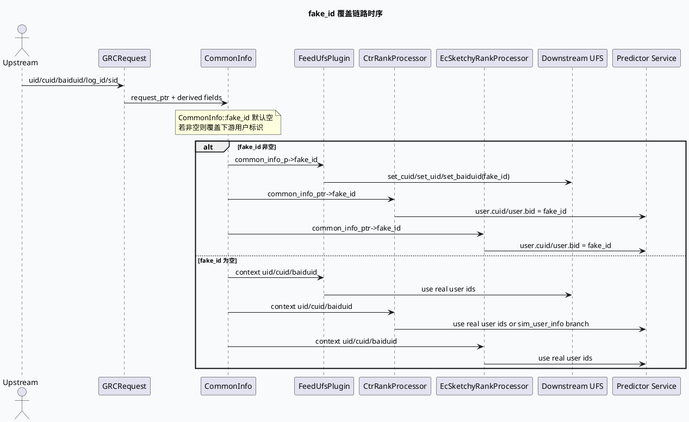
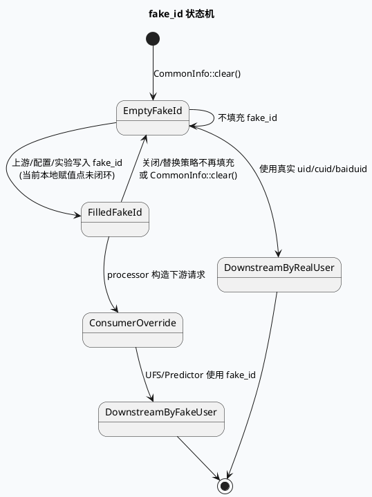

# GRC fake_id 关闭/替换链路

> 日期：2026-05-30  
> 主题来源：`notes/weekly-topic-selection/daily-plan-20260529.json` 的 `sat.business` 计划项  
> 服务：`feeda-mv-grc`  
> 范围：`CommonInfo::fake_id` 在 UFS、粗排/精排/二跳 rank 请求中的用户标识覆盖逻辑；结合代码检索说明“关闭/替换链路”的可观测边界。  
> 内网文档：今日计划未提供 `business_doc_urls`，且 `ku-doc-manage` CLI 当前无全站 search 子命令；本文未读取 KU 正文，业务背景需人工补充。

---

## 0. 架构全景图

<div class="arch-wrapper fake-arch"><style scoped>.fake-arch{font-family:-apple-system,BlinkMacSystemFont,'Segoe UI',Roboto,sans-serif;background:#f8fafc;border:1px solid #d7e2ef;border-radius:14px;padding:22px;margin:16px 0;color:#172033}.fake-arch .arch-title{font-size:18px;font-weight:900;margin-bottom:14px}.fake-arch .arch-layer{border-radius:10px;padding:14px;margin:10px 0}.fake-arch .user{background:#dbeafe;border-left:5px solid #2563eb}.fake-arch .application{background:#dcfce7;border-left:5px solid #16a34a}.fake-arch .ai{background:#fef3c7;border-left:5px solid #d97706}.fake-arch .data{background:#fce7f3;border-left:5px solid #db2777}.fake-arch .external{background:#f1f5f9;border:1px dashed #64748b;border-left:5px solid #64748b}.fake-arch .arch-layer-title{font-size:13px;font-weight:800;margin-bottom:8px}.fake-arch .arch-grid{display:grid;grid-template-columns:repeat(4,minmax(0,1fr));gap:8px}.fake-arch .arch-box{background:rgba(255,255,255,.86);border:1px solid rgba(15,23,42,.08);border-radius:8px;padding:9px;font-size:12px;line-height:1.35}.fake-arch .arch-box.highlight{border:2px solid #d97706;background:#fff7ed;font-weight:800}.fake-arch small{display:block;color:#64748b;margin-top:3px}</style><div class="arch-title">fake_id 在 GRC 请求链路中的覆盖位置</div><div class="arch-layer user"><div class="arch-layer-title">① Upstream Request / Session</div><div class="arch-grid"><div class="arch-box">真实 uid/cuid/baiduid<small>来自 GRCRequest.common_info</small></div><div class="arch-box">log_id<small>参与 hash fake id 的候选输入</small></div><div class="arch-box">sim_user_info<small>部分实验使用相似用户</small></div><div class="arch-box">SID / ABTest<small>控制是否走替换分支</small></div></div></div><div class="arch-layer application"><div class="arch-layer-title">② CommonInfo / Context Layer</div><div class="arch-grid"><div class="arch-box highlight">CommonInfo::fake_id<small>默认空字符串</small></div><div class="arch-box">Context::get_uid/cuid/baiduid<small>真实用户标识</small></div><div class="arch-box">SidInfo / RequestType<small>rank 分支判断</small></div><div class="arch-box">custom_context<small>各 processor 取 CommonInfo</small></div></div></div><div class="arch-layer ai"><div class="arch-layer-title">③ Processor Override Points</div><div class="arch-grid"><div class="arch-box highlight">FeedUfsPlugin<small>fork_request cuid/uid/baiduid</small></div><div class="arch-box highlight">CtrRankProcessor<small>PredictorUser cuid/bid</small></div><div class="arch-box">EcSketchyRankProcessor<small>二跳 CVR/粗排请求</small></div><div class="arch-box">CtrRerank / SketchyRPC / ParallelCtrRank<small>同类覆盖点</small></div></div></div><div class="arch-layer data"><div class="arch-layer-title">④ Downstream Request Layer</div><div class="arch-grid"><div class="arch-box">rec::fork::ForkRequest<small>UFS 用户特征</small></div><div class="arch-box">mlarch::PredictorRequest<small>粗排/精排模型</small></div><div class="arch-box">RecommendFeature / LibField<small>候选与队列信息</small></div><div class="arch-box">SIA / DEBUG log<small>fake_id_size / is_fake_user</small></div></div></div><div class="arch-layer external"><div class="arch-layer-title">⑤ 当前代码检索边界</div><div class="arch-grid"><div class="arch-box">hash_userid / caculate_fake_id<small>存在工具函数</small></div><div class="arch-box">赋值点未在本地 src 命中<small>需补充上游/配置链路</small></div><div class="arch-box">fake_id 为空即关闭覆盖<small>回退真实用户标识</small></div><div class="arch-box highlight">关闭语义 = 不再填充 fake_id<small>从消费点反推</small></div></div></div></div>

---

## 1. Role and Purpose

`fake_id` 是 GRC 内部 `CommonInfo` 上的一个可选用户标识覆盖字段。只要 `CommonInfo::fake_id` 非空，多处下游请求构造会用它替换真实 `cuid/uid/baiduid/bid`，让 UFS 或模型请求以“替身用户”身份取特征/打分；当 `fake_id` 为空时，这些 processor 全部回退真实用户标识。因此，从当前代码看，“fake_id 关闭”最直接的可观测效果不是删除某个 processor，而是让 `common_info.fake_id.size() > 0` 分支不再命中。

当前仓库中能确认两类事实：

- **消费点非常明确**：UFS、CTR rank、EC sketchy rank、rerank、video_launch rank 等请求构造都会检查 `fake_id`。
- **生成/赋值点不在本地可见链路中闭环**：存在 `hash_userid()` / `Util::caculate_fake_id()` 工具函数，但对 `CommonInfo::fake_id` 的赋值点未在本地 `src/` 检索中命中；这意味着生成可能在上游、配置生成代码、宏展开、或未纳入当前 checkout 的分支中。

---

## 2. 数据流图



---

## 3. 核心消费点与替换规则

```infographic
infographic list-grid-badge-card
data
  title fake_id 消费点速览
  desc 非空 fake_id 会覆盖下游请求中的用户身份字段
  items
    - label FeedUfsPlugin
      desc fork_request.cuid uid baiduid 全部写 fake_id
    - label CtrRankProcessor
      desc PredictorUser.cuid bid 写 fake_id 并跳过真实 uid 分支
    - label EcSketchyRankProcessor
      desc 二跳/EC 粗排 PredictorUser.cuid bid 写 fake_id
    - label CtrRerankProcessor
      desc rerank 请求同样检查 fake_id
    - label SketchyRPC / ParallelCtrRank
      desc 多个粗排并行请求复用相同覆盖模式
    - label video_launch rank
      desc video_launch ctr/sketchy 配置内也检查 _common_info->fake_id
```

### 3.1 UFS 请求覆盖

`FeedUfsPlugin::gen_request()` 在构造 `rec::fork::ForkRequest` 时优先检查 `common_info_p->fake_id`。非空时将 `cuid`、`uid`、`baiduid` 三个字段全部写成 fake_id；否则才从 `Context` 取真实 `cuid/uid/baiduid`（`src/plugin/feed_ufs_plugin.cpp:106-123`）。这说明 fake_id 对 UFS 特征查询是“全用户标识覆盖”，不是只改一个 id 字段。

### 3.2 CTR Rank 请求覆盖

`CtrRankProcessor::gen_request()` 中先读取真实 `uid/cuid/baiduid`，随后拿 `CommonInfo` 和 `RequestType/SidInfo`。核心分支是：如果 `common_info_ptr->fake_id.size() > 0`，则 `PredictorUser` 的 `cuid` 和 `bid` 都写 fake_id；否则才进入相似用户实验分支或真实用户分支（`src/processor/ctr_rank.cpp:572-640`）。

值得注意的是，fake_id 分支优先级高于 `sim_user_info` 分支：只要 fake_id 非空，即使请求里有相似用户信息，也不会走 `sim_cuid/sim_uid` 的替换逻辑（`src/processor/ctr_rank.cpp:609-632`）。

### 3.3 EC / 二跳粗排覆盖

`EcSketchyRankProcessor::gen_request()` 采用相同模式：非空 fake_id 覆盖 `PredictorUser.cuid/bid`，否则使用真实 `cuid/baiduid` 并在 `uid` 非空时写数值 uid（`src/processor/ec_sketchy_rank.cpp:210-236`）。这与计划中的“fake_id 在二跳请求下游处覆盖”相吻合。

### 3.4 其他同构消费点

代码检索还命中多个同构消费点：`ctr_rerank.cpp`、`sketchy_rpc.cpp`、`ec_cvr_rank.cpp`、`parallel_ctr_rank.cpp`、`video_launch/sketchy_rpc_pipeline.cpp`、`video_launch/ctr_rank_function.cpp`、`video_launch/sketchy_rpc_config.cpp` 等都存在 `fake_id.size() > 0` 后写 `cuid/bid` 的模式。这说明 fake_id 不是单点逻辑，而是 GRC 请求模型服务时的横切身份覆盖约定。

---

## 4. 状态机：fake_id 开关语义



---

## 5. “关闭/替换”链路的代码级解释

从消费点反推，fake_id 关闭并不需要每个下游 processor 各自加开关；只要在 `CommonInfo` 填充阶段不再写 `fake_id`，所有消费点都会自然回退真实用户标识。也就是说：

```text
关闭前：CommonInfo.fake_id = hash/替身 ID
  -> UFS fork_request 使用 fake_id
  -> CTR / EC / rerank PredictorUser 使用 fake_id

关闭后：CommonInfo.fake_id = ""
  -> UFS fork_request 使用 context uid/cuid/baiduid
  -> CTR / EC / rerank PredictorUser 使用真实用户或 sim_user_info 实验分支
```

本地检索发现两个可能与生成相关的工具函数：

| 函数 | 证据 | 作用 |
|---|---|---|
| `Util::caculate_fake_id(uid, cuid, bid, logid, fake_id)` | `src/util/util.hpp:4134-4140` | 将 uid/cuid/bid/logid 拼接后 hash 成字符串 fake_id。 |
| `hash_userid(uid, cuid, baiduid, logid, fake_id)` | `src/parser/recall_parser_new.cpp:107-117` | 类似 hash 逻辑，生成 fake_id 字符串。 |

但在当前本地 `src/` 检索中，没有找到对 `CommonInfo::fake_id` 的直接赋值点。这是本文最重要的边界：**消费链路可确认，生产链路需补充上游或配置证据**。

---

## 6. Pitfalls 卡片

<div class="card-frame fake-card"><style scoped>.fake-card{font-family:-apple-system,BlinkMacSystemFont,'Segoe UI',Roboto,sans-serif;margin:18px 0}.fake-card .card{background:#f5f7fa;border:1px solid #cbd5e1;border-radius:16px;padding:28px;color:#263244;box-shadow:0 10px 24px rgba(15,23,42,.06)}.fake-card .card-meta{font-size:11px;font-weight:800;letter-spacing:.12em;text-transform:uppercase;color:#3d5a80}.fake-card .card-title{font-size:30px;line-height:1.1;font-weight:900;letter-spacing:-.02em;margin:8px 0 12px}.fake-card .card-subtitle{font-size:15px;line-height:1.6;color:#475569;max-width:790px}.fake-card .card-grid{display:grid;grid-template-columns:2fr 1fr;gap:16px;margin-top:18px}.fake-card .card-panel{background:rgba(255,255,255,.72);border-top:5px solid #3d5a80;border-radius:10px;padding:16px}.fake-card .card-panel.light{border-top-width:2px;background:#eef2f7}.fake-card .card-panel-title{font-size:12px;font-weight:900;text-transform:uppercase;letter-spacing:.08em;color:#263244;margin-bottom:8px}.fake-card .card-panel-text{font-size:14px;line-height:1.65;color:#334155;margin:0}.fake-card .card-highlight{border-left:5px solid #3d5a80;padding-left:12px;font-size:18px;font-weight:800;color:#1e293b;margin:12px 0}.fake-card code{background:#e2e8f0;border-radius:4px;padding:1px 4px}</style><div class="card"><div class="card-meta">Pitfall / Identity Override</div><div class="card-title">不要只查一个 processor</div><div class="card-subtitle">fake_id 是横切身份覆盖字段。UFS、粗排、精排、二跳 rank 都有自己的请求构造函数；如果只修一个调用点，其他下游仍可能继续用 fake_id 取特征或打分。</div><div class="card-grid"><div class="card-panel"><div class="card-panel-title">排查原则</div><p class="card-panel-text">先定位 <code>CommonInfo::fake_id</code> 是否被填充，再看所有 <code>fake_id.size() &gt; 0</code> 消费点。关闭策略应尽量在生产端完成，而不是在每个消费点局部绕过。</p><p class="card-highlight">生产端关闭，消费端自然回退</p></div><div class="card-panel light"><div class="card-panel-title">当前缺口</div><p class="card-panel-text">本次本地代码未闭环找到 fake_id 赋值点。若要确认具体“关闭提交”，需要补充 git diff、上游 CommonInfo 填充代码或内部文档。</p></div></div></div></div>

---

## 7. 调试 Checklist

```infographic
infographic list-column-done-list
data
  title fake_id 调试 Checklist
  items
    - label 在日志中确认 fake_id_size 是否大于 0
      done true
    - label 检查 CommonInfo::fake_id 默认 clear 为空
      done true
    - label 检查 UFS fork_request 是否被 fake_id 覆盖
      done true
    - label 检查 CTR / rerank / sketchy rank PredictorUser 是否被 fake_id 覆盖
      done true
    - label 检查 fake_id 是否优先于 sim_user_info 分支
      done true
    - label 找到 CommonInfo::fake_id 的真实赋值点
      done false
    - label 补充关闭/替换提交 diff 或 KU 文档说明业务背景
      done false
```

---

## 8. 证据来源

- `src/data/base.h:121-127`：`CommonInfo` 定义 `fake_id`，默认空字符串。
- `src/data/base.h:158-163`：`CommonInfo::clear()` 将 `fake_id` 重置为空。
- `src/plugin/feed_ufs_plugin.cpp:106-123`：UFS 请求中 fake_id 覆盖 `cuid/uid/baiduid`。
- `src/processor/ctr_rank.cpp:572-640`：CTR rank 请求中 fake_id 优先覆盖 `PredictorUser.cuid/bid`。
- `src/processor/ctr_rank.cpp:609-632`：fake_id 分支优先于 `sim_user_info` 实验分支。
- `src/processor/ctr_rank.cpp:850`：SIA 打点记录 `is_fake_user`。
- `src/processor/ctr_rank.cpp:1549-1554`：KOL predictor response 中 `is_fake_user` 会写入 `is_fake_kol`。
- `src/processor/ec_sketchy_rank.cpp:210-236`：EC/二跳粗排请求中 fake_id 覆盖 `cuid/bid`。
- `src/util/util.hpp:4134-4140`：`Util::caculate_fake_id()` hash 生成工具函数。
- `src/parser/recall_parser_new.cpp:107-117`：`hash_userid()` hash 生成工具函数。

---

## 9. 需人工补充

- 当前本地代码能证明 fake_id 的消费链路，但未找到 `CommonInfo::fake_id` 的赋值闭环。需要补充：最近提交 `feed-arch-37113` 的 diff、上游 CommonInfo 填充模块、或内部文档，才能完整说明“关闭/替换”的业务触发条件与 rollout 范围。
- 如果目标是验证线上已关闭，应结合日志字段 `fake_id_size`、UFS fork request、PredictorUser uid/cuid/bid 抽样，而不是只看代码中是否仍保留 fake_id 分支。