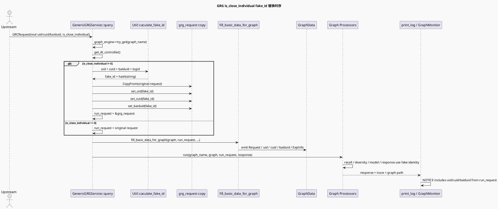

# GRG 个性化推荐关闭开关 fakeid 兼容

> 日期：2026-05-31  
> 主题来源：`notes/weekly-topic-selection/daily-plan-20260529.json` 的 `sun.business` 计划项  
> 服务：`feeda-mv-grg`  
> 范围：最近提交 `feed-arch-37111` 在 GRG 服务入口识别 `CommonInfo::is_close_individual()` 后，用 `fake_id` 替换 `uid/cuid/baiduid`，并把替换后的请求贯穿 GraphData、召回、融合、日志链路。  
> 内网文档：今日计划未提供 `business_doc_urls`；本文未读取 KU 正文，业务背景需人工补充。

---

## 0. 架构全景图

<div class="arch-wrapper fakeid-arch"><style scoped>.fakeid-arch{font-family:-apple-system,BlinkMacSystemFont,'Segoe UI',Roboto,sans-serif;background:#f8fafc;border:1px solid #d7e2ef;border-radius:14px;padding:22px;margin:16px 0;color:#172033}.fakeid-arch .arch-title{font-size:18px;font-weight:900;margin-bottom:14px}.fakeid-arch .arch-layer{border-radius:10px;padding:14px;margin:10px 0}.fakeid-arch .user{background:#dbeafe;border-left:5px solid #2563eb}.fakeid-arch .application{background:#dcfce7;border-left:5px solid #16a34a}.fakeid-arch .ai{background:#fef3c7;border-left:5px solid #d97706}.fakeid-arch .data{background:#fce7f3;border-left:5px solid #db2777}.fakeid-arch .external{background:#f1f5f9;border:1px dashed #64748b;border-left:5px solid #64748b}.fakeid-arch .arch-layer-title{font-size:13px;font-weight:800;margin-bottom:8px}.fakeid-arch .arch-grid{display:grid;grid-template-columns:repeat(4,minmax(0,1fr));gap:8px}.fakeid-arch .arch-box{background:rgba(255,255,255,.86);border:1px solid rgba(15,23,42,.08);border-radius:8px;padding:9px;font-size:12px;line-height:1.35}.fakeid-arch .arch-box.highlight{border:2px solid #d97706;background:#fff7ed;font-weight:800}.fakeid-arch small{display:block;color:#64748b;margin-top:3px}</style><div class="arch-title">GRG 个性化关闭：入口 fake_id 替换架构</div><div class="arch-layer user"><div class="arch-layer-title">① Upstream Request</div><div class="arch-grid"><div class="arch-box">真实 `uid`<small>common_info.uid()</small></div><div class="arch-box">真实 `cuid`<small>common_info.cuid()</small></div><div class="arch-box">真实 `baiduid`<small>common_info.baiduid()</small></div><div class="arch-box highlight">`is_close_individual`<small>关闭个性化推荐开关</small></div></div></div><div class="arch-layer application"><div class="arch-layer-title">② GRG Service Entry</div><div class="arch-grid"><div class="arch-box">`query()`<small>先取 graph 与 dt controller</small></div><div class="arch-box highlight">`Util::caculate_fake_id()`<small>uid/cuid/bid/logid → hash</small></div><div class="arch-box">`grg_request.CopyFrom()`<small>只改本地副本</small></div><div class="arch-box">`run_request` 指针切换<small>后续统一用替换请求</small></div></div></div><div class="arch-layer ai"><div class="arch-layer-title">③ Graph Data / Recommendation Pipeline</div><div class="arch-grid"><div class="arch-box highlight">`fill_basic_data_for_graph()`<small>uid/cuid/baiduid 注入 fake_id</small></div><div class="arch-box">GRC Recall<small>透传替换后的请求</small></div><div class="arch-box">Diversity / Rank<small>读取 context 用户标识</small></div><div class="arch-box">Response / Logs<small>print_log 看到 fake_id</small></div></div></div><div class="arch-layer data"><div class="arch-layer-title">④ Observability / Risk Boundary</div><div class="arch-grid"><div class="arch-box">NOTICE 日志<small>old ids + fake_id</small></div><div class="arch-box">VIP 判定<small>基于替换后的 cuid/uid</small></div><div class="arch-box">GraphMonitor<small>fake_id 作为 cuid 初始化</small></div><div class="arch-box highlight">隐私边界<small>真实身份不进入图内个性化链路</small></div></div></div></div>

---

## 1. Role and Purpose

`feed-arch-37111` 的核心改动很小，但位置非常关键：它没有在每个召回/模型/融合 processor 内部分散判断“关闭个性化”，而是在 **GRG 服务入口** 复制一份请求，把 `common_info.uid/cuid/baiduid` 一次性替换成 `fake_id`，之后 `fill_basic_data_for_graph()`、`run()`、日志、Graph processors 都只看到替换后的 `run_request`。

这相当于把“关闭个性化推荐”降维成“请求身份匿名化/稳定伪造化”问题：下游仍按原来的用户标识字段工作，但拿到的是 fake id，而不是真实用户 id。

---

## 2. 核心流程图



---

## 3. 配置/结构信息图

```infographic
infographic compare-binary-horizontal-underline-text-vs
data
  title 原始请求 vs 关闭个性化请求
  desc 入口替换后，下游 processor 不需要感知开关细节
  left
    label Normal Request
    desc uid/cuid/baiduid 保持真实值；VIP、GraphMonitor、召回、融合均按真实用户上下文执行
  right
    label Close Individual Request
    desc 复制请求并将 uid/cuid/baiduid 全部替换为 fake_id；Graph 内个性化链路只见伪身份
```

```infographic
infographic list-grid-badge-card
data
  title fake_id 兼容改动清单
  desc commit 8ed39c0 涉及三个文件
  items
    - label grg_service.cpp
      desc 新增 run_request 分支；关闭个性化时 CopyFrom 并替换三类用户标识
      icon mdi/source-branch
    - label util.cpp
      desc 新增 caculate_fake_id，按 uid/cuid/bid/logid 计算 std::hash
      icon mdi/function-variant
    - label util.h
      desc 声明 caculate_fake_id 静态工具函数
      icon mdi/file-code
    - label log evidence
      desc NOTICE 打印 old ids 与 fake_id，便于单 logid 回溯
      icon mdi/text-search
```

---

## 4. 关键代码路径

### 4.1 服务入口替换点

`src/service/grg_service.cpp:64-89` 是整个链路的控制面。最近提交在 graph 获取和 controller 获取之后，插入了以下逻辑：

- 创建本地 `feed::grc::GRCRequest grg_request`。
- 默认 `run_request = request`。
- 如果 `request->has_common_info()` 且 `common_info().is_close_individual() != 0`：
  - 调用 `Util::caculate_fake_id(uid, cuid, baiduid, logid, fake_id)`。
  - `grg_request.CopyFrom(*request)`。
  - 将 `uid/cuid/baiduid` 全部设为 `fake_id`。
  - `run_request = &grg_request`。
- 后续 `fill_basic_data_for_graph()` 和 `run()` 全部传入 `run_request`。

这个位置的优点是 **影响面集中**：所有依赖 `Request` 或图上 `uid/cuid/baiduid` 的下游逻辑天然兼容。

### 4.2 fake_id 生成方式

`src/util/util.cpp` 新增 `Util::caculate_fake_id()`：拼接 `uid_cuid_bid_logid` 后使用 `std::hash<std::string>`，再转成十进制字符串。

这意味着 fake_id 与 `logid` 绑定：同一个用户在不同请求 logid 下会产生不同 fake id。这样能降低跨请求串联真实用户行为的风险，但也意味着如果某些下游期望稳定用户画像，关闭个性化场景下不会获得稳定画像。

### 4.3 GraphData 注入边界

`src/service/grg_service.cpp:121-200` 的 `fill_basic_data_for_graph()` 从 `request->common_info()` 读取 `uid/cuid/baiduid` 并以 `ref()` 方式注入 GraphData。由于传入的是 `run_request`，关闭个性化时图内 `uid/cuid/baiduid` 都引用 `grg_request` 副本中的 fake id。

需要注意：`grg_request` 是 `query()` 栈上的局部变量，但 `run()` 和 `closure.get()/wait()` 都在 `query()` 返回前完成，因此当前同步等待模型下引用生命周期是闭合的。如果未来把 graph run 改成真正异步返回，需要重新审查该引用生命周期。

---

## 5. 业务影响面

| 层级 | 影响 | 证据 |
|---|---|---|
| Graph 基础数据 | `uid/cuid/baiduid` 被 fake_id 替换 | `src/service/grg_service.cpp:127-140` |
| VIP 判断 | `is_hit_vip()` 读替换后的 cuid/uid，真实 VIP 可能不再命中 | `src/service/grg_service.cpp:153-154`, `src/service/grg_service.cpp:361-374` |
| 日志打印 | `print_log()` 中 common_info 来源为 `run_request`，会打印 fake_id | `src/service/grg_service.cpp:281-293` |
| GraphMonitor | `graph_monitor.init(common_info.cuid(), logid)` 使用 fake cuid | `src/service/grg_service.cpp:326-328` |
| GRC Recall | GRC 子请求从当前 request 拷贝，关闭个性化后会继续透传 fake id | `src/process/grc_recall_function.cpp:153-162` |

---

## 6. Pitfalls 卡片

<div class="card-frame fakeid-card"><style scoped>.fakeid-card{font-family:-apple-system,BlinkMacSystemFont,'Segoe UI',Roboto,sans-serif;margin:18px 0}.fakeid-card .card{background:#f5f7fa;border:1px solid #d8e0ea;border-radius:18px;padding:24px;color:#1f2937}.fakeid-card .card-meta{font-size:12px;letter-spacing:.08em;text-transform:uppercase;color:#3d5a80;font-weight:800}.fakeid-card .card-title{font-size:28px;line-height:1.1;font-weight:900;margin:8px 0 12px}.fakeid-card .card-grid{display:grid;grid-template-columns:2fr 1fr;gap:14px}.fakeid-card .card-panel{background:rgba(255,255,255,.78);border-top:4px solid #3d5a80;border-radius:10px;padding:14px;font-size:14px;line-height:1.65}.fakeid-card .card-panel strong{color:#172033}.fakeid-card .card-tag{display:inline-block;background:#e0e7ff;color:#3730a3;border-radius:999px;padding:3px 8px;margin:3px;font-size:12px;font-weight:700}</style><div class="card"><div class="card-meta">Pitfalls · Close Individual</div><div class="card-title">入口替换很干净，但要盯住“引用生命周期”和“日志语义”</div><div class="card-grid"><div class="card-panel"><strong>生命周期：</strong>`fill_basic_data_for_graph()` 对请求字段使用 `ref()`，当前 `run()` 同步等待闭环可行；若未来异步化，栈上 `grg_request` 会成为风险点。<br><strong>稳定性：</strong>fake_id 包含 logid，同一用户跨请求不稳定；这符合关闭个性化语义，但会影响依赖稳定用户画像的缓存/模型命中。<br><strong>排查：</strong>关闭个性化后日志里的 uid/cuid/baiduid 可能是 fake_id，不要直接当真实用户标识使用。</div><div class="card-panel"><span class="card-tag">ref lifetime</span><span class="card-tag">logid salt</span><span class="card-tag">VIP mismatch</span><span class="card-tag">fake cuid logs</span></div></div></div></div>

---

## 7. 调试 checklist

```infographic
infographic list-column-done-list
data
  title fake_id 兼容排查 checklist
  desc 遇到关闭个性化请求异常时按顺序确认
  items
    - label 确认请求是否携带 is_close_individual
      desc 只有非 0 才触发入口替换
      done true
    - label 用 logid 搜 NOTICE 替换日志
      desc 关注 old_uid/old_cuid/old_baiduid/fake_id 是否打印
      done true
    - label 检查 fill_basic_data_for_graph 入参
      desc 确认传入的是 run_request 而不是原始 request
      done true
    - label 检查 GraphData uid/cuid/baiduid
      desc 下游 processor 应看到 fake_id
      done false
    - label 检查 GRC Recall 子请求
      desc grc_req = *_request 会继续携带 fake_id
      done false
    - label 检查 VIP/GraphMonitor/日志口径
      desc fake_id 会改变 VIP 命中和按 cuid 检索日志的方式
      done false
```

---

## 8. 证据来源

- `src/service/grg_service.cpp:35-91`：GRG 服务入口主流程；`feed-arch-37111` 在此插入 `run_request` 替换逻辑。
- `src/service/grg_service.cpp:64-89`：graph 选择、controller 获取、fill/run 调用边界。
- `src/service/grg_service.cpp:121-200`：`fill_basic_data_for_graph()` 注入 `Request`、`uid`、`cuid`、`baiduid`、`is_vip_cuid`、`is_debug`。
- `src/service/grg_service.cpp:203-264`：`run()` 执行 graph、Swap response、send_response、日志打印与 release。
- `src/service/grg_service.cpp:281-293`：NOTICE 日志打印 uid/cuid/baiduid 和 graph_name。
- `src/service/grg_service.cpp:326-328`：GraphMonitor 使用 `common_info.cuid()` 初始化。
- `src/service/grg_service.cpp:361-374`：VIP 命中读取 `d_target_cuid`。
- `src/util/util.cpp`：新增 `Util::caculate_fake_id()`，由 `uid/cuid/bid/logid` 计算 fake id。
- `src/util/util.h`：声明 `caculate_fake_id()`。
- `src/process/grc_recall_function.cpp:153-162`：GRG 内部调用 GRC 时从当前 request 拷贝并设置 `is_grg_request`。
- `git show 8ed39c0`：提交 `feed-arch-37111 [Story] 【架构】grg 兼容关闭个性化推荐关闭开关_fakeid 代替 cuid`，涉及 `grg_service.cpp`、`util.cpp`、`util.h`。
