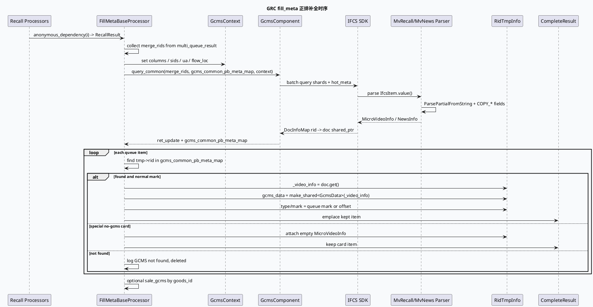
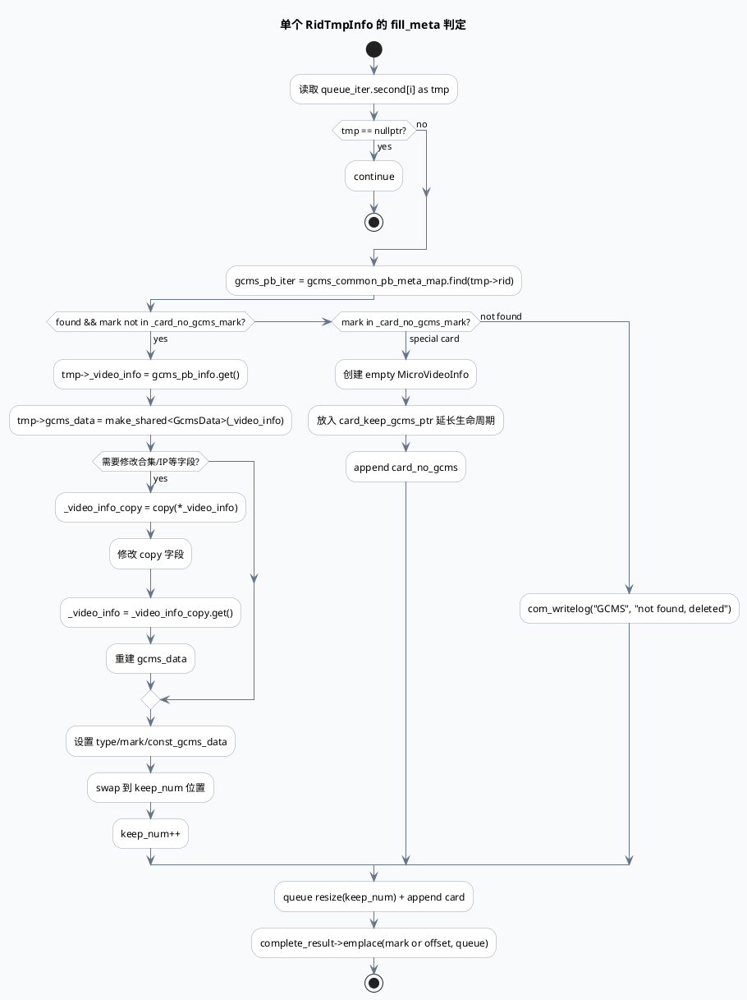

# GRC 正排 GCMS / IFCS fill_meta 链路

> 日期：2026-06-01  
> 主题来源：`notes/weekly-topic-selection/daily-plan-20260529.json` 的 `mon.business` 计划项  
> 服务：`feeda-mv-grc`  
> 范围：`FillMetaBaseProcessor` 从召回结果收集 rid，经 `GcmsComponent::query_common()` 查询正排，落到 `RidTmpInfo` 的 `MicroVideoInfo/GcmsData`，并由 IFCS parser/SDK 支撑多级缓存与字段解析。  
> 内网文档：计划项提到 KU《正排字段添加指南-IFCS版》《IFCS多级缓存介绍》《IFCS-热点缓存》，但当前环境未发现可用 `ku` CLI；本文以代码库结果替代，字段治理细节需人工补充。

---

## 0. 架构全景图

<div class="arch-wrapper fillmeta-arch"><style scoped>.fillmeta-arch{font-family:-apple-system,BlinkMacSystemFont,'Segoe UI',Roboto,sans-serif;background:#f8fafc;border:1px solid #dbe4ee;border-radius:14px;padding:22px;margin:16px 0;color:#172033}.fillmeta-arch .arch-title{font-size:18px;font-weight:900;margin-bottom:14px}.fillmeta-arch .arch-layer{border-radius:10px;padding:14px;margin:10px 0}.fillmeta-arch .user{background:#dbeafe;border-left:5px solid #2563eb}.fillmeta-arch .application{background:#dcfce7;border-left:5px solid #16a34a}.fillmeta-arch .ai{background:#fef3c7;border-left:5px solid #d97706}.fillmeta-arch .data{background:#fce7f3;border-left:5px solid #db2777}.fillmeta-arch .infra{background:#ede9fe;border-left:5px solid #7c3aed}.fillmeta-arch .arch-layer-title{font-size:13px;font-weight:800;margin-bottom:8px}.fillmeta-arch .arch-grid{display:grid;grid-template-columns:repeat(4,minmax(0,1fr));gap:8px}.fillmeta-arch .arch-box{background:rgba(255,255,255,.86);border:1px solid rgba(15,23,42,.08);border-radius:8px;padding:9px;font-size:12px;line-height:1.35}.fillmeta-arch .arch-box.highlight{border:2px solid #d97706;background:#fff7ed;font-weight:800}.fillmeta-arch small{display:block;color:#64748b;margin-top:3px}</style><div class="arch-title">GRC fill_meta：召回 rid 到可排序内容对象</div><div class="arch-layer user"><div class="arch-layer-title">① Upstream Graph Dependencies</div><div class="arch-grid"><div class="arch-box">RecallResult<small>multi_queue_result: mark → RidTmpInfoPtr[]</small></div><div class="arch-box">SID / small flow<small>决定 SMFW 字段合并</small></div><div class="arch-box">UA / flow_loc<small>写入 GcmsContext condition</small></div><div class="arch-box">handle_name<small>区分好看、频道、普通召回 fork</small></div></div></div><div class="arch-layer application"><div class="arch-layer-title">② FillMetaBaseProcessor</div><div class="arch-grid"><div class="arch-box highlight">收集 `merge_rids`<small>批量查询正排，避免逐条 RPC</small></div><div class="arch-box highlight">`GcmsComponent::query_common`<small>查询 GCMS/IFCS common pb meta map</small></div><div class="arch-box">`gcms_common_pb_meta_map`<small>rid → MicroVideoInfo shared_ptr</small></div><div class="arch-box">队列内过滤/保留<small>not found 删除；特殊 card 允许空正排</small></div></div></div><div class="arch-layer ai"><div class="arch-layer-title">③ IFCS Parser / Merger</div><div class="arch-grid"><div class="arch-box">`MvRecallDocParser`<small>scene 0/3，MicroVideoInfo 字段解析</small></div><div class="arch-box">`MvNewsDocParser`<small>scene 1，NewsInfo 字段解析</small></div><div class="arch-box">SMFW merge<small>hit_sids 命中时合并小流量字段</small></div><div class="arch-box highlight">ObjectPool&lt;MVGcmsItem&gt;<small>ParsePartialFromString 复用 pb 对象</small></div></div></div><div class="arch-layer data"><div class="arch-layer-title">④ Downstream Data Shape</div><div class="arch-grid"><div class="arch-box highlight">`tmp->_video_info`<small>指向正排对象或 copy</small></div><div class="arch-box">`tmp->gcms_data`<small>包装 GcmsData 给策略读取</small></div><div class="arch-box">`tmp->const_gcms_data`<small>稳定 const 指针</small></div><div class="arch-box">`complete_result`<small>按 mark/offset 写回融合输入</small></div></div></div><div class="arch-layer infra"><div class="arch-layer-title">⑤ IFCS Config</div><div class="arch-grid"><div class="arch-box">10 shards<small>IfcsShard0..9 + HotMetaShard0..9</small></div><div class="arch-box">freq_update_queue<small>batch=1024, concurrent=5, queue=1024</small></div><div class="arch-box">hot_cache<small>recall/news 600000，search 60000</small></div><div class="arch-box">ring_cache<small>当前 enable=0</small></div></div></div></div>

---

## 1. 关键结论

1. **fill_meta 是召回结果进入排序/融合前的“内容对象补全关口”**：召回链路给出的是 `rid/type/mark` 等轻量结果，`FillMetaBaseProcessor` 通过正排查询补齐 `MicroVideoInfo`，没查到的普通内容会被剔除。
2. **GCMS 与 IFCS 在代码中形成双层语义**：业务处理器调用 `GcmsComponent::query_common()` 得到 `gcms_common_pb_meta_map`；底层字段解析与缓存能力由 IFCS parser 和 `ifcs_sdk.conf` 中的 accessor/shard/hot_cache 配置支撑。
3. **字段解析成本非常集中**：`MvRecallDocParser` / `MvNewsDocParser` 对 `mv_grc_item_gcms_info` 执行大量 `COPY_*` 宏、repeated reserve、map emplace；字段新增必须关注解析成本和默认值语义。
4. **生命周期边界靠 shared_ptr/copy 兜底**：`tmp->_video_info` 指向 map 中 shared_ptr 管理的对象；需要修改字段时会创建 `_video_info_copy`，再重建 `gcms_data`，避免改动共享正排对象。

---

## 2. 核心流程图



---

## 3. 配置/结构信息图

```infographic
infographic hierarchy-structure
data
  title ifcs_sdk.conf accessor 结构
  desc 三个 accessor 共享 10 分片 + hot_meta 模式，parser 决定落到 MicroVideoInfo 或 NewsInfo
  items
    - label recall
      desc scene=0, parser=MvRecallDocParser, hot_cache.max_cache_size=600000
      children
        - label channel shards
          desc IfcsShard0..9 + IfcsHotMetaShard0..9
        - label freq_update_queue
          desc req_batch_size=1024, max_concurrent_rpc_num=5
    - label search
      desc scene=3, parser=MvRecallDocParser, hot_cache.max_cache_size=60000
      children
        - label channel shards
          desc IfcsShard0..9 + IfcsHotMetaShard0..9
        - label ring_cache
          desc enable=0, bucket_count=30
    - label news
      desc scene=1, parser=MvNewsDocParser, hot_cache.max_cache_size=600000
      children
        - label channel shards
          desc IfcsShard0..9 + IfcsHotMetaShard0..9
        - label sid_conf
          desc update_time_ms=30000
```

### 关键数据结构

| 数据结构 | 位置 | 作用 | 风险点 |
|---|---|---|---|
| `FillMetaBaseContext::merge_rids` | `src/processor/fill_meta.h:22-36` | 聚合本次批量正排查询的 rid | 未清理会串请求；依赖 processor reset |
| `gcms_common_pb_meta_map` | `src/processor/fill_meta.h:35`, `src/processor/fill_meta.cpp:237-245` | 正排查询结果，rid → 正排对象 | 指针只在上下文生命周期内安全 |
| `RidTmpInfo::_video_info` | `src/processor/fill_meta.cpp:310-317` | 下游策略读取的内容字段入口 | copy/共享对象混用时要注意所有权 |
| `GcmsData` | `src/processor/fill_meta.cpp:315-317`, `src/processor/fill_meta.cpp:585` | 包装正排对象供统一接口访问 | `_video_info` 变更后要同步重建 |
| `ObjectPool<MVGcmsItem>` | `src/plugin/ifcs_component.cpp:90-94` | parser 复用 protobuf 对象减少分配 | Parse 失败要返回 nullptr，避免脏 pb |

---

## 4. 字段流转与删除逻辑



---

## 5. Pitfalls 卡片

<div class="card-frame fillmeta-card"><style scoped>.fillmeta-card{font-family:-apple-system,BlinkMacSystemFont,'Segoe UI',Roboto,sans-serif;margin:18px 0}.fillmeta-card .card{background:#f4f8f6;border:1px solid #b7d9c8;border-radius:16px;padding:22px;color:#1f2937;box-shadow:0 8px 24px rgba(15,23,42,.06)}.fillmeta-card .card-meta{font-size:12px;font-weight:800;letter-spacing:.08em;text-transform:uppercase;color:#2d6a4f}.fillmeta-card .card-title{font-size:28px;font-weight:900;letter-spacing:-.02em;margin:6px 0 12px}.fillmeta-card .card-grid{display:grid;grid-template-columns:2fr 1fr;gap:14px}.fillmeta-card .card-panel{background:rgba(255,255,255,.76);border-top:4px solid #2d6a4f;border-radius:10px;padding:13px;font-size:14px;line-height:1.65}.fillmeta-card .card-highlight{border-left:5px solid #2d6a4f;padding-left:12px;font-weight:800}.fillmeta-card code{background:#dff3e8;border-radius:4px;padding:1px 4px}</style><div class="card"><div class="card-meta">PITFALLS · GCMS / IFCS</div><div class="card-title">正排字段不是“加个字段”这么简单</div><div class="card-grid"><div class="card-panel"><div class="card-highlight">字段从 IFCS pb 到策略可见，至少经过 parser、SMFW merge、GcmsData 包装、fill_meta 过滤四道门。</div><p>新增字段只改 proto 或只改策略读取都不够：parser 未 COPY 时字段永远不可见；repeated 字段未 reserve 容易放大 CPU/内存；命中小流量字段时还要确认 merge 逻辑不会覆盖默认值。</p></div><div class="card-panel"><b>高危信号</b><br>① not found, deleted 激增<br>② fill_meta_gcms_pb_rpc 耗时抖动<br>③ hot_cache size 接近上限<br>④ `_video_info_copy` 改字段后未重建 `gcms_data`</div></div></div></div>

---

## 6. 调试 checklist

```infographic
infographic list-column-done-list
data
  title fill_meta 排障 checklist
  desc 从“内容少了/字段没生效/耗时变高”三个常见问题反推
  items
    - label 确认 rid 是否进入 merge_rids
      desc 召回结果为空或匿名依赖未接上时，GCMS 根本不会被查询
      done false
    - label 确认 query_common ret_update
      desc 非 0 会直接返回 -1；关注 `fill_meta_gcms_pb_rpc` SIA
      done false
    - label 确认 gcms_common_pb_meta_map 命中率
      desc map size 明显小于 merge_rids 时，普通内容会被 `not found, deleted`
      done false
    - label 确认 parser 注册名
      desc `ifcs_sdk.conf` 的 parser 必须匹配 `BABYLON_REGISTER_COMPONENT_WITH_TYPE_NAME`
      done false
    - label 确认字段 COPY 宏
      desc 新字段需在 `MvRecallDocParser` 或 `MvNewsDocParser` 中显式 COPY/merge
      done false
    - label 确认 shared_ptr 生命周期
      desc `_video_info` 裸指针依赖 map/shared_ptr 或 `_video_info_copy` 存活
      done false
    - label 确认 special card 白名单
      desc `_card_no_gcms_mark` 允许无正排保留，否则没查到即删除
      done false
```

---

## 7. 证据来源

- `src/processor/fill_meta.h:22-36`：`FillMetaBaseContext` 保存 `merge_rids`、依赖、`gcms_common_pb_meta_map`。
- `src/processor/fill_meta.cpp:231-245`：设置 `GcmsContext` 条件并调用 `GcmsComponent::get_instance().query_common()`。
- `src/processor/fill_meta.cpp:296-317`：遍历召回队列，用 rid 命中正排 map 并设置 `_video_info/gcms_data`。
- `src/processor/fill_meta.cpp:567-629`：goods_id 收集、mark offset、`complete_result->emplace()` 写回。
- `src/processor/fill_meta.cpp:691-699`：processor reset 清理 `gcms_common_pb_meta_map`。
- `src/plugin/ifcs_component.cpp:60-99`：`MvNewsDocParser` merge/parse 与 `ParsePartialFromString`。
- `src/plugin/ifcs_component.cpp:700-816`：`MvRecallDocParser` 中大量字段 COPY、reserve 与复杂结构解析。
- `src/plugin/ifcs_component.cpp:827-835`：IFCS parser 组件注册。
- `conf/ifcs_sdk.conf:6-154`：recall/search/news accessor、shard、freq_update_queue、hot_cache 配置。

---

## 七、业务代码库适配分析
> **分析时间**：2026-07-20T19:24:33.356914
> **目标代码库**：feeda-mv-grg（序列生成）、feeda-mv-grc（召回汇聚）

# 业务代码库适配分析：GRC 正排 GCMS / IFCS fill_meta 链路

## 1. 分析摘要

- 从技术形态看，`fill_meta` 更适合落在**召回汇聚 / 排序前补全**这一层：它解决的是“召回结果只有 `rid/type/mark`，但后续策略需要完整内容对象”的问题，核心价值是**批量正排补全、减少逐条查询、统一字段解析**。
- 结合当前扫描结果，`feeda-mv-grc` 的适配潜力明显高于 `feeda-mv-grg`：前者是召回汇聚服务，更贴近 `FillMetaBaseProcessor` 的职责边界；后者是序列生成服务，更多是消费候选结果，若没有显式正排补全需求，迁移收益偏间接。

- 代码规模上，两边都已经有大量容器和字符串处理逻辑，说明业务链路本身是“候选对象重组型”而不是简单透传型：
  - `feeda-mv-grg`：`std::vector` 1969 次、`std::string` 2443 次、`std::unordered_map` 734 次。
  - `feeda-mv-grc`：`std::vector` 8442 次、`std::string` 7170 次、`std::unordered_map` 2834 次。
- 这意味着如果引入 `fill_meta`，最可能的收益点是：
  - 合并重复的内容查询；
  - 统一候选对象的内容补全入口；
  - 让后续规则直接读 `MicroVideoInfo/GcmsData`，减少散落在各处的字段拼装逻辑。

---

## 2. 代码库详情

### feeda-mv-grg：序列生成服务

- 扫描到的相关文件共 10 个，说明已有一定的候选处理和规则消费入口，但**未发现 `FillMetaBaseProcessor` / IFCS parser 的直接实现**，暂时没有现成的 fill_meta 经验可以复用。
- 已发现的目标文件里，最值得关注的接入点是：
  - `plugin/grc.h`
  - `process/msv_readlist_parse_function.cpp`
  - `operator/diversity/douyin_popular_soft_rule_v2.cpp`
  - `operator/diversity/yitushibie_v2_soft_rule.cpp`
  - `operator/diversity/mv_attn_dislike_factor.cpp`

- 结合现有代码风格，`grg` 更像是“消费候选、做规则变换”的链路：
  - `model/model.h`
  - `model/paddle_model.h`
  - 示例里 `predict(std::vector<RidTmpInfoPtr>& candidate_vec, uint32_t pos)` 说明它已经有**候选向量驱动**的接口形态。
- 适配判断：
  - 如果 `grg` 的规则仅依赖轻量特征，`fill_meta` 的收益有限；
  - 如果 `msv_readlist_parse_function.cpp` 这一类入口需要从候选恢复更完整的内容对象，那么可以作为“二次补全”接入点。

### feeda-mv-grc：召回汇聚服务

- 扫描到的相关文件共 10 个，和 `fill_meta` 的职责更加贴近。
- 已发现的目标文件：
  - `processor/ctr_rank.h`
  - `processor/compute_duanju_filter_lcn_info_new.h`
  - `strategy/diversity/baoliang_rule/subcate_diversity_rule.cpp`
  - `operator/adjuster/precise/searchc_immersion_related/searchc_duanju_video_adjust.cpp`
  - `processor/response_with_set2set.cpp`

- 从代码形态看，`grc` 更接近“召回融合 + 排序前加工”：
  - `service/grc_http_service.cpp` 中已经有依赖图、请求参数和响应拼装逻辑；
  - 大量 `vector/string/unordered_map` 的使用，说明候选合并、属性补全、结果重排很常见。
- 这类服务非常适合引入 `fill_meta` 的批量补全模式：
  - 先聚合 `rid`；
  - 再统一查询正排；
  - 最后把 `GcmsData/MicroVideoInfo` 挂到候选对象上供策略读取。
- 适配判断：
  - `grc` 是更优先的迁移对象；
  - 尤其适合在 `processor/response_with_set2set.cpp`、`processor/ctr_rank.h` 这类“结果整形/排序前处理”位置接入。

- 可作为参考的现有代码形态：
  - `service/grc_http_service.cpp`：已体现依赖聚合和响应组装模式；
  - `model/model.h`、`model/paddle_model.h`（来自 `grg`）：体现候选向量接口风格，可参考其对象传递方式。

---

## 3. 💡 适用性评估与建议

- **建议 1：优先在 `feeda-mv-grc` 落地批量正排补全，而不是在 `grg` 里直接铺开**
  - 推荐文件：`processor/response_with_set2set.cpp`、`processor/ctr_rank.h`
  - 场景：候选已经汇聚完成，后续需要统一补齐 `MicroVideoInfo/GcmsData`
  - 理由：这里最接近 `FillMetaBaseProcessor -> GcmsComponent::query_common()` 的链路，能直接复用“批量 `rid` 查询 + 过滤 not found”的模式。

- **建议 2：在 `processor/compute_duanju_filter_lcn_info_new.h`、`operator/adjuster/precise/searchc_immersion_related/searchc_duanju_video_adjust.cpp` 中优先改造“读字段方式”，不要先改业务规则**
  - 场景：规则本身只依赖少量字段，但字段来源目前散落在多个对象里
  - 建议：将读取入口统一切到 `GcmsData` 或其 const 包装，避免规则代码直接依赖零散结构体成员
  - 好处：后续加字段时只需要补 parser 和包装层，规则层改动更小。

- **建议 3：`feeda-mv-grg` 先在 `process/msv_readlist_parse_function.cpp` 做“小范围试点”**
  - 场景：读取读书单/候选列表后，需要少量内容字段参与后续规则
  - 建议：仅对需要的候选做正排补全，不要把完整 fill_meta 链路全量搬入 `grg`
  - 参考：`model/model.h`、`model/paddle_model.h` 已经使用 `std::vector<RidTmpInfoPtr>` 作为候选输入，说明这里有承接候选扩展的基础。

- **建议 4：对 `operator/diversity/douyin_popular_soft_rule_v2.cpp`、`operator/diversity/yitushibie_v2_soft_rule.cpp` 这类规则文件，采用“字段白名单”而不是“全对象复制”**
  - 场景：只需要标题、作者、时长、频道等少数字段
  - 建议：把 parser 输出限制在必要字段，避免把 `MicroVideoInfo` 全量搬进规则层
  - 这样可以减少 `COPY_*` 带来的 CPU 和内存压力，也更符合 fill_meta 的“补全而非重建”原则。

- **建议 5：如果 `feeda-mv-grc` 已经存在响应组装逻辑，可把 `service/grc_http_service.cpp` 作为适配边界参考**
  - 场景：请求参数、依赖图、候选聚合、响应返回都集中在一个服务层
  - 建议：在该层之前插入“rid 聚合 -> 正排查询 -> 对象挂载”的处理段
  - 这样更容易控制生命周期，避免策略层拿到悬空指针或临时对象引用。

---

## 4. ⚠️ 引入风险与限制

- **风险 1：对象生命周期管理复杂**
  - `fill_meta` 的 `tmp->_video_info` 往往依赖 `shared_ptr` 或 copy 对象存活。
  - 如果业务代码里像 `service/grc_http_service.cpp` 这类地方把裸指针一路传下去，很容易出现生命周期悬空问题。
  - 建议：明确“原始正排对象 vs copy 对象”的边界，改字段后必须同步重建包装对象。

- **风险 2：字段默认值和 merge 语义容易出错**
  - IFCS parser 里字段不是“加了就能看见”，必须经过 `COPY_*`、`repeated reserve`、`map emplace` 等逻辑。
  - 如果 `grg/grc` 的规则层假定“字段存在即生效”，但 parser 没补齐，结果会表现为“字段没生效但没有报错”。
  - 建议：字段新增时同时补 parser 和策略读取验证。

- **风险 3：性能收益依赖批量化，若退化成逐条查询会适得其反**
  - `fill_meta` 的核心优势是 `merge_rids + batch query`。
  - 如果在 `operator/diversity/*` 或 `processor/*` 里按候选逐个查正排，RPC 和缓存命中都会变差。
  - 建议：严格保持批量入口，不要在下游规则里临时补查。

- **风险 4：迁移面较大，尤其是 `feeda-mv-grc`**
  - `grc` 中 `std::vector` / `std::unordered_map` 使用非常广，说明对象流转链路长、接入点多。
  - 一旦把正排补全引入核心处理路径，需要同步检查过滤、重排、响应拼装的所有分支。
  - 建议：先选一个小流量入口或单条链路试点，再逐步扩展。

---

如果你愿意，我可以继续把这份分析整理成更适合放进技术笔记的版本，比如补一个：

- **“迁移优先级矩阵”**
- **“适配改造路线图”**
- **“文件级改造清单”**

---
*本章节由 Hermes Agent 自动分析生成，基于代码库静态扫描结果。*
