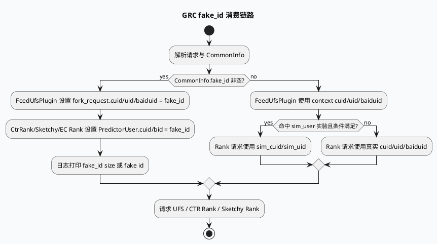

# GRC fake_id 关闭/替换链路

> 日期：2026-06-06（Sat）  
> 来源：`daily-plan-20260529.json` 的 `recommended_7_plus_7.sat.business`  
> KU 状态：今日计划 `business_doc_urls=[]`，内网文档证据需人工补充；本文以本地代码检索结果替代。

## 架构全景图

<style>.arch-fake{font-family:-apple-system,BlinkMacSystemFont,"Segoe UI",sans-serif;background:#f8fafc;border:1px solid #dbe3ef;border-radius:16px;padding:18px;margin:16px 0;color:#1f2937}.arch-fake .title{font-weight:850;font-size:22px;margin-bottom:4px}.arch-fake .sub{font-size:13px;color:#64748b;margin-bottom:14px}.arch-fake .wrap{display:grid;grid-template-columns:1fr 1.2fr 1fr;gap:12px}.arch-fake .lane{border-radius:14px;border:1px solid #cbd5e1;background:#fff;padding:12px}.arch-fake .lane h3{font-size:15px;margin:0 0 10px}.arch-fake .box{border-radius:11px;padding:10px;margin:8px 0;border:1px solid #d8e2ee;background:#f8fafc;font-size:13px;line-height:1.45}.arch-fake .box b{display:block;font-size:14px;margin-bottom:3px}.arch-fake .hot{background:#fff7ed;border-color:#fdba74}.arch-fake .ok{background:#f0fdf4;border-color:#86efac}.arch-fake .arrow{text-align:center;color:#2563eb;font-weight:800;margin:6px 0}</style><div class="arch-fake"><div class="title">fake_id 替换面：CommonInfo → 下游用户标识字段</div><div class="sub">fake_id 存在时，多条请求链路会用它覆盖 cuid/bid/uid；关闭或替换必须按“写入点 + 消费点”双向排查。</div><div class="wrap"><div class="lane"><h3>1. 来源与状态</h3><div class="box"><b>CommonInfo.fake_id</b>`base.h:126` 定义字段，reset 时清空。</div><div class="box"><b>计算工具</b>`util.hpp:4134-4140` 基于 uid/cuid/bid/logid hash。</div><div class="box hot"><b>需补证</b>fake_id 的具体开关/关闭入口未在今日 KU 中提供。</div></div><div class="lane"><h3>2. GRC 消费点</h3><div class="box hot"><b>FeedUfsPlugin</b>`feed_ufs_plugin.cpp:114-118` fake_id 覆盖 cuid/uid/baiduid。</div><div class="box hot"><b>CtrRank</b>`ctr_rank.cpp:609-611` fake_id 覆盖 predictor user 的 cuid/bid。</div><div class="box"><b>多路 Rank</b>ec_sketchy_rank、ctr_rerank、parallel_ctr_rank、video_launch 链路均有类似逻辑。</div><div class="box ok"><b>Fallback</b>fake_id 为空时回退真实 cuid/uid/baiduid 或 sim_user。</div></div><div class="lane"><h3>3. 下游影响</h3><div class="box"><b>UFS</b>用户特征请求按 fake_id 隔离/替换。</div><div class="box"><b>CTR/Sketchy</b>预测请求用户侧特征使用 fake_id。</div><div class="box hot"><b>关闭风险</b>只改一个消费点会产生用户标识不一致。</div></div></div></div>

## 核心流程：fake_id 选择与覆盖



## 消费点信息图

```infographic
infographic list-grid-badge-card
data
  title fake_id 关键消费点
  desc 关闭或替换 fake_id 时，至少检查这些下游请求构造处
  items
    - label FeedUfsPlugin
      desc feed_ufs_plugin.cpp:114-118；覆盖 fork_request cuid/uid/baiduid
      icon mdi/account-switch
    - label CtrRank
      desc ctr_rank.cpp:609-611；覆盖 PredictorUser cuid/bid
      icon mdi/chart-line
    - label ec_sketchy_rank
      desc ec_sketchy_rank.cpp:225-227；EC 粗排用户标识替换
      icon mdi/filter
    - label ctr_rerank
      desc ctr_rerank.cpp:255-257；重排请求用户标识替换
      icon mdi/sort
    - label video_launch rank
      desc ctr_rank_function.cpp:628-630 与 sketchy_rpc_pipeline.cpp:236-238
      icon mdi/video
    - label parallel_ctr_rank
      desc parallel_ctr_rank.cpp:197-199；批量请求中逐个 request 写 user
      icon mdi/call-split
```

## 关键观察

- fake_id 不是单点消费：UFS、CTR Rank、Sketchy/EC Rank、Video Launch、Parallel CTR Rank 都会在 fake_id 非空时覆盖用户标识。
- `feed_ufs_plugin.cpp:114-118` 同时覆盖 `cuid`、`uid`、`baiduid`；而 Rank 类请求多覆盖 `cuid`、`bid`，`uid` 不一定同步写入。
- `ctr_rank.cpp:609-612` 中 fake_id 分支优先级高于 sim_user 实验分支；因此 fake_id 一旦存在，会屏蔽轻度用户相似用户替换逻辑。
- 今日计划提到“关闭/替换链路”，但未给 KU/提交详情；需要人工补充：fake_id 是在哪里生成、哪个实验/开关控制关闭、替换后的预期字段是什么。

## Pitfalls 卡片

<style>.fake-card{font-family:-apple-system,BlinkMacSystemFont,"Segoe UI",sans-serif;background:#f5f7fa;border:1px solid #cbd5e1;border-radius:18px;padding:20px;margin:18px 0;color:#1f2937}.fake-card .meta{font-size:12px;font-weight:850;letter-spacing:.08em;text-transform:uppercase;color:#3d5a80}.fake-card .headline{font-size:27px;font-weight:900;letter-spacing:-.02em;margin:6px 0}.fake-card .bar{height:5px;width:96px;border-radius:999px;background:#3d5a80;margin:12px 0}.fake-card .grid{display:grid;grid-template-columns:2fr 1fr;gap:14px}.fake-card .panel{background:#fff;border-top:3px solid #3d5a80;border-radius:12px;padding:12px}.fake-card p{font-size:14px;line-height:1.65;margin:0}.fake-card b{color:#1d4ed8}</style><div class="fake-card"><div class="meta">pitfall / user identity</div><div class="headline">fake_id 关闭不能只删一个 if 分支</div><div class="bar"></div><div class="grid"><div class="panel"><p><b>典型问题：</b>UFS 仍用 fake_id，但 CTR Rank 已切回真实 cuid，导致特征侧与预测侧用户身份不一致，线上表现会像“特征漂移”。</p></div><div class="panel"><p><b>正确姿势：</b>先列出所有消费点，再统一决定 fake_id、真实 id、sim_user 的优先级。</p></div></div></div>

## 调试 checklist

```infographic
infographic list-column-done-list
data
  title fake_id 关闭/替换排查清单
  desc 从来源、消费点、一致性、日志四个维度确认
  items
    - label 确认 fake_id 来源
      desc 检查 CommonInfo.fake_id 赋值与 util.hpp 中 hash 计算是否仍被调用；今日需人工补充提交/KU证据
      done false
      icon mdi/source-commit
    - label 枚举所有消费点
      desc 检索 fake_id 覆盖 user/fork_request 的全部代码路径，避免漏掉 video_launch 或 parallel 分支
      done true
      icon mdi/text-search
    - label 统一优先级
      desc 明确 fake_id、sim_user、真实 cuid/uid/baiduid 三者优先级
      done false
      icon mdi/arrow-decision
    - label 检查日志
      desc 关注 fake_id_size、fake id 日志，按 logid 对齐 UFS 与 Rank 请求
      done true
      icon mdi/file-document-alert
    - label 做灰度验证
      desc 比较关闭前后 UFS 特征命中、CTR 请求 user 字段、核心指标波动
      done false
      icon mdi/test-tube
```

## 证据来源

- `src/data/base.h:126`：`CommonInfo.fake_id` 字段。
- `src/data/base.h:160-163`：reset 时清空 fake_id。
- `src/util/util.hpp:4134-4140`：`caculate_fake_id` hash 生成逻辑。
- `src/plugin/feed_ufs_plugin.cpp:114-118`：UFS 请求 fake_id 覆盖 cuid/uid/baiduid。
- `src/processor/ctr_rank.cpp:604-612`：CTR Rank fake_id 分支与 sim_user 分支优先级。
- `src/processor/ec_sketchy_rank.cpp:225-227`：EC 粗排 fake_id 覆盖。
- `src/processor/ctr_rerank.cpp:255-257`：CTR rerank fake_id 覆盖。
- `src/processor/video_launch/sketchy_rpc_pipeline.cpp:236-238`：video_launch sketchy 链路覆盖。
- `src/processor/video_launch/ctr_rank_function.cpp:628-630`：video_launch CTR 链路覆盖。
- `src/processor/parallel_ctr_rank.cpp:197-199`：parallel CTR 批量请求覆盖。
- `conf/plugins/feed_ufs_plugin.conf:1-4`：UFS 插件服务、LB、timeout 配置。

---

## 七、业务代码库适配分析
> **分析时间**：2026-07-20T19:26:05.920017
> **目标代码库**：feeda-mv-grg（序列生成）、feeda-mv-grc（召回汇聚）

## 业务代码库适配分析

### 1. 分析摘要

- 本次扫描覆盖两个业务代码库：`feeda-mv-grg`（序列生成服务）与 `feeda-mv-grc`（召回汇聚服务）。从当前技术笔记和本地代码检索结果看，`fake_id` 的核心定义、生成与消费链路主要集中在 `feeda-mv-grc`，尤其是 `CommonInfo.fake_id`、UFS 请求构造、CTR/Sketchy/EC Rank 请求构造等路径。该能力不是单点逻辑，而是贯穿“请求解析 → CommonInfo → UFS 特征请求 → 多路 Rank 请求”的用户标识替换链路。

- 从使用规模看，`feeda-mv-grc` 是本次关闭/替换 `fake_id` 的主要适配对象；`feeda-mv-grg` 当前扫描结果未直接体现完整 fake_id 消费链路，但存在多个业务处理、召回结果生成、向量获取、多样性调整相关文件，后续需要确认是否消费来自 GRC 的用户标识或依赖 fake_id 生成的特征结果。迁移潜力较高，但必须以“统一用户标识优先级”和“全链路一致性”为前提，避免 UFS、CTR、Sketchy、重排等模块出现用户身份不一致。

---

### 2. 代码库详情

#### feeda-mv-grg

- **扫描发现**
  - 已发现相关目标使用文件 10 个，当前列出的典型文件包括：
    - `operator/diversity/microvideo_pk8_adjust.cpp`
    - `process/satisfy_graph_get_result_function.cpp`
    - `process/gen_scene_data.cpp`
    - `process/get_kanju_novel_vec.cpp`
    - `operator/diversity/quota_modi_test1.cpp`
  - 该代码库中 `std` 等价容器使用规模较大：
    - `std::vector`：1969 次，分布在 356 个文件
    - `std::string`：2443 次，分布在 425 个文件
    - `std::unordered_map`：734 次，分布在 205 个文件

- **现状判断**
  - 当前扫描结果中未看到明确的 `CommonInfo.fake_id` 定义或核心消费点，因此 `feeda-mv-grg` 更可能是 fake_id 关闭/替换后的**间接受影响方**。
  - 需要重点确认 GRG 是否：
    - 接收来自 GRC 的用户标识字段；
    - 使用 UFS / CTR / Rank 结果中的用户特征；
    - 在序列生成、图结果合并、多样性调整中依赖 fake_id 隔离后的用户画像或历史行为。

- **可参考代码**
  - `model/model.h`
    ```cpp
    virtual int predict(std::vector<RidTmpInfoPtr>& candidate_vec, uint32_t pos) = 0;
    ```
  - `model/paddle_model.h`
    ```cpp
    virtual int predict(std::vector<RidTmpInfoPtr>& candidate_vec, uint32_t pos) {
        return 0;
    }
    ```
  - `model/paddle_model.h`
    ```cpp
    int predict_with_tensor_input(std::vector<RidTmpInfoPtr>& candidate_vec,
                general_predict::PredictSample* predict_sample = nullptr,
                bool is_from_cube = true) const {
        return predict<ModelDependInput>(candidate_vec, predict_sample, is_from_cube);
    }
    ```

- **适配重点**
  - `feeda-mv-grg` 不建议直接做 fake_id 删除或替换，而应先做输入字段审计。
  - 重点关注 `process/satisfy_graph_get_result_function.cpp`、`process/gen_scene_data.cpp`、`process/get_kanju_novel_vec.cpp` 等是否读取了上游传入的 `cuid`、`uid`、`baiduid`、`bid` 或用户向量标识。
  - 如果这些文件只消费结果而不构造用户请求，则迁移改动可能较小，主要是日志比对和效果验证。

#### feeda-mv-grc

- **扫描发现**
  - 已发现相关目标使用文件 10 个，当前列出的典型文件包括：
    - `data/data_merge_phase.h`
    - `processor/compute_feed_interest_explore.h`
    - `processor/sketchy_vids_gcf_vector.h`
    - `processor/compute_duanju_filter_lcn_info_new.h`
    - `processor/get_user_his_qs_v2_tgi.h`
  - `std` 等价容器使用规模更大：
    - `std::vector`：8442 次，分布在 1279 个文件
    - `std::string`：7170 次，分布在 1234 个文件
    - `std::unordered_map`：2834 次，分布在 639 个文件

- **fake_id 核心链路**
  - `src/data/base.h:126`
    - 定义 `CommonInfo.fake_id` 字段。
  - `src/data/base.h:160-163`
    - `reset` 时清空 `fake_id`。
  - `src/util/util.hpp:4134-4140`
    - `caculate_fake_id` 负责基于 `uid/cuid/bid/logid` 计算 fake_id。
  - `src/plugin/feed_ufs_plugin.cpp:114-118`
    - UFS 请求中使用 fake_id 覆盖 `fork_request.cuid`、`uid`、`baiduid`。
  - `src/processor/ctr_rank.cpp:604-612`
    - CTR Rank 中 fake_id 分支优先级高于 `sim_user`，会覆盖 PredictorUser 的 `cuid`、`bid`。
  - `src/processor/ec_sketchy_rank.cpp:225-227`
    - EC 粗排用户标识覆盖。
  - `src/processor/ctr_rerank.cpp:255-257`
    - CTR 重排请求用户标识覆盖。
  - `src/processor/video_launch/sketchy_rpc_pipeline.cpp:236-238`
    - video launch sketchy 链路覆盖。
  - `src/processor/video_launch/ctr_rank_function.cpp:628-630`
    - video launch CTR 链路覆盖。
  - `src/processor/parallel_ctr_rank.cpp:197-199`
    - parallel CTR 批量请求中逐个 request 写入 user 标识。
  - `conf/plugins/feed_ufs_plugin.conf:1-4`
    - UFS 插件服务、LB、timeout 配置。

- **现状判断**
  - `feeda-mv-grc` 中已经存在完整的 fake_id 使用经验，可直接作为迁移分析和回归验证的参考。
  - 该仓库不是简单的“替换一个字段”，而是要统一 UFS、CTR、Sketchy、EC、Video Launch、Parallel CTR 等多个请求构造点的用户标识策略。
  - 当前最大问题是 fake_id 的**来源与关闭开关证据不足**，即尚未从 KU 或提交中确认 fake_id 由哪个实验、配置或入口控制。

---

### 3. 💡 适用性评估与建议

- **建议一：先在 `feeda-mv-grc` 建立统一的用户标识选择函数，避免多个文件各自判断 fake_id**
  - 适用文件：
    - `src/plugin/feed_ufs_plugin.cpp`
    - `src/processor/ctr_rank.cpp`
    - `src/processor/ec_sketchy_rank.cpp`
    - `src/processor/ctr_rerank.cpp`
    - `src/processor/video_launch/sketchy_rpc_pipeline.cpp`
    - `src/processor/video_launch/ctr_rank_function.cpp`
    - `src/processor/parallel_ctr_rank.cpp`
  - 当前这些文件中都存在类似逻辑：
    - fake_id 非空时覆盖用户标识；
    - fake_id 为空时回退真实 `cuid/uid/baiduid/bid`；
    - 部分 Rank 链路还存在 `sim_user` 分支。
  - 建议抽象一个统一函数，例如：
    - `SelectUserIdentityForUfs(common_info, context)`
    - `SelectUserIdentityForRank(common_info, context, sim_user_info)`
  - 统一返回：
    - `cuid`
    - `uid`
    - `baiduid`
    - `bid`
    - `source_type`，例如 `FAKE_ID`、`SIM_USER`、`REAL_ID`
  - 这样可以避免在关闭 fake_id 时漏改某个 Rank 或 Video Launch 分支。

- **建议二：优先改造 `src/plugin/feed_ufs_plugin.cpp` 与 `src/processor/ctr_rank.cpp`，作为主链路灰度入口**
  - `src/plugin/feed_ufs_plugin.cpp:114-118` 是 UFS 用户特征请求的关键入口，会同时覆盖：
    - `fork_request.cuid`
    - `fork_request.uid`
    - `fork_request.baiduid`
  - `src/processor/ctr_rank.cpp:604-612` 是 CTR Rank 用户侧特征构造的重要入口，且 fake_id 优先级高于 `sim_user`。
  - 建议迁移步骤：
    - 第一步：只增加日志，不改变行为。
      - 打印 `logid`、`fake_id_size`、最终使用的 `cuid/bid/uid/baiduid`、`source_type`。
    - 第二步：在灰度开关下让 UFS 和 CTR 同时切换到新策略。
    - 第三步：对齐同一个 `logid` 下 UFS 请求和 CTR 请求的用户标识，确认两者没有出现一个使用 fake_id、另一个使用真实 id 的情况。
  - 这两个文件可以作为后续改造 `ec_sketchy_rank.cpp`、`ctr_rerank.cpp`、`parallel_ctr_rank.cpp` 的参考代码。

- **建议三：在 `src/data/base.h` 和 `src/util/util.hpp` 明确 fake_id 生命周期，避免“生成已停、消费仍在”或“消费已停、字段仍污染”**
  - `src/data/base.h:126` 定义了 `CommonInfo.fake_id`。
  - `src/data/base.h:160-163` 在 reset 时清空 fake_id。
  - `src/util/util.hpp:4134-4140` 中存在 `caculate_fake_id` 计算逻辑。
  - 关闭或替换 fake_id 时，应明确三件事：
    - `CommonInfo.fake_id` 字段是否继续保留；
    - `caculate_fake_id` 是否仍被调用；
    - fake_id 的赋值入口由哪个实验或配置控制。
  - 如果目标是彻底关闭：
    - 建议先保留字段和日志，停止赋值；
    - 待确认所有消费点不再依赖后，再清理字段和计算函数。
  - 如果目标是替换：
    - 不建议直接复用 `fake_id` 字段承载新语义；
    - 建议增加明确字段，例如 `replace_user_id` 或 `privacy_user_id`，避免历史逻辑误判。

- **建议四：对 `video_launch` 和 `parallel_ctr_rank` 单独做回归，避免非主路径漏改**
  - 需要重点检查：
    - `src/processor/video_launch/sketchy_rpc_pipeline.cpp:236-238`
    - `src/processor/video_launch/ctr_rank_function.cpp:628-630`
    - `src/processor/parallel_ctr_rank.cpp:197-199`
  - 这些链路容易在主流程验证中被遗漏，但同样会构造 Rank 或 Sketchy 请求。
  - 特别是 `parallel_ctr_rank.cpp`，通常是批量请求逐个写 user 字段，迁移时要确认：
    - 每个 request 使用相同的标识选择策略；
    - 不要出现 batch 内部分 request 用 fake_id、部分 request 用真实 id；
    - 日志中应包含 request index 或 item 标识，便于问题定位。

- **建议五：`feeda-mv-grg` 先做只读审计和效果对齐，不建议直接改动业务排序逻辑**
  - 建议优先检查：
    - `process/satisfy_graph_get_result_function.cpp`
    - `process/gen_scene_data.cpp`
    - `process/get_kanju_novel_vec.cpp`
    - `operator/diversity/microvideo_pk8_adjust.cpp`
    - `operator/diversity/quota_modi_test1.cpp`
  - 检查重点：
    - 是否读取或透传 `cuid`、`uid`、`baiduid`、`bid`；
    - 是否依赖用户画像、历史行为、UFS 返回特征；
    - 是否缓存了以用户 id 为 key 的中间结果。
  - 如果这些文件只消费 GRC 输出的候选或特征结果，则不建议在 GRG 内部引入 fake_id 逻辑；应保持 GRG 对用户标识透明，只通过上游 GRC 的结果变化做效果验证。

---

### 4. ⚠️ 引入风险与限制

- **风险一：只关闭部分消费点会导致用户标识不一致**
  - 例如：
    - `feed_ufs_plugin.cpp` 仍使用 fake_id 请求 UFS；
    - `ctr_rank.cpp` 已切回真实 `cuid/bid`；
  - 这种情况下，特征侧和预测侧的用户身份不一致，线上表现可能类似“特征漂移”或“模型效果异常波动”。
  - 因此关闭 fake_id 必须同时覆盖 UFS、CTR、Sketchy、EC、Video Launch、Parallel CTR 等链路。

- **风险二：fake_id 与 sim_user 的优先级变化会影响实验语义**
  - `src/processor/ctr_rank.cpp:604-612` 中 fake_id 分支优先级高于 `sim_user`。
  - 如果关闭 fake_id 后，部分请求开始命中 `sim_user` 分支，线上效果变化不一定完全来自 fake_id 本身，也可能来自 sim_user 替换逻辑重新生效。
  - 灰度验证时需要区分：
    - `FAKE_ID → REAL_ID`
    - `FAKE_ID → SIM_USER`
    - `REAL_ID → SIM_USER`
  - 建议日志中增加 `source_type` 字段，避免归因困难。

- **风险三：fake_id 来源和开关证据不足，当前不适合直接删除字段**
  - 当前技术笔记中明确提到：
    - 今日计划 `business_doc_urls=[]`；
    - fake_id 的具体开关/关闭入口未在 KU 中提供；
    - 需要人工补充提交或内网文档证据。
  - 在确认生成入口前，不建议直接删除：
    - `src/data/base.h` 中的 `CommonInfo.fake_id`；
    - `src/util/util.hpp` 中的 `caculate_fake_id`；
    - 各消费点中的兼容逻辑。
  - 更稳妥的方式是先加灰度开关和日志，再逐步下线。

- **风险四：GRG 可能存在间接效果风险，不能只看是否直接引用 fake_id**
  - `feeda-mv-grg` 当前未体现完整 fake_id 链路，但它可能消费 GRC 的召回、排序、用户特征或向量结果。
  - 如果 GRC 关闭 fake_id 后 UFS 特征命中、CTR 预估分、候选分布发生变化，GRG 的以下模块可能受到间接影响：
    - `process/satisfy_graph_get_result_function.cpp`
    - `process/gen_scene_data.cpp`
    - `process/get_kanju_novel_vec.cpp`
    - `operator/diversity/microvideo_pk8_adjust.cpp`
  - 因此 GRG 侧至少需要做离线 diff 和线上灰度指标观察，而不是完全跳过验证。

---
*本章节由 Hermes Agent 自动分析生成，基于代码库静态扫描结果。*
