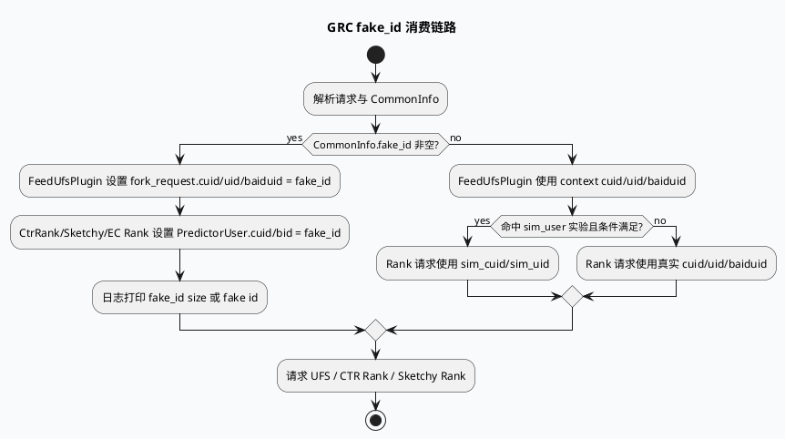

# GRC fake_id 关闭/替换链路

> 日期：2026-06-06（Sat）  
> 来源：`daily-plan-20260529.json` 的 `recommended_7_plus_7.sat.business`  
> KU 状态：今日计划 `business_doc_urls=[]`，内网文档证据需人工补充；本文以本地代码检索结果替代。

## 架构全景图

<style>.arch-fake{font-family:-apple-system,BlinkMacSystemFont,"Segoe UI",sans-serif;background:#f8fafc;border:1px solid #dbe3ef;border-radius:16px;padding:18px;margin:16px 0;color:#1f2937}.arch-fake .title{font-weight:850;font-size:22px;margin-bottom:4px}.arch-fake .sub{font-size:13px;color:#64748b;margin-bottom:14px}.arch-fake .wrap{display:grid;grid-template-columns:1fr 1.2fr 1fr;gap:12px}.arch-fake .lane{border-radius:14px;border:1px solid #cbd5e1;background:#fff;padding:12px}.arch-fake .lane h3{font-size:15px;margin:0 0 10px}.arch-fake .box{border-radius:11px;padding:10px;margin:8px 0;border:1px solid #d8e2ee;background:#f8fafc;font-size:13px;line-height:1.45}.arch-fake .box b{display:block;font-size:14px;margin-bottom:3px}.arch-fake .hot{background:#fff7ed;border-color:#fdba74}.arch-fake .ok{background:#f0fdf4;border-color:#86efac}.arch-fake .arrow{text-align:center;color:#2563eb;font-weight:800;margin:6px 0}</style><div class="arch-fake"><div class="title">fake_id 替换面：CommonInfo → 下游用户标识字段</div><div class="sub">fake_id 存在时，多条请求链路会用它覆盖 cuid/bid/uid；关闭或替换必须按“写入点 + 消费点”双向排查。</div><div class="wrap"><div class="lane"><h3>1. 来源与状态</h3><div class="box"><b>CommonInfo.fake_id</b>`base.h:126` 定义字段，reset 时清空。</div><div class="box"><b>计算工具</b>`util.hpp:4134-4140` 基于 uid/cuid/bid/logid hash。</div><div class="box hot"><b>需补证</b>fake_id 的具体开关/关闭入口未在今日 KU 中提供。</div></div><div class="lane"><h3>2. GRC 消费点</h3><div class="box hot"><b>FeedUfsPlugin</b>`feed_ufs_plugin.cpp:114-118` fake_id 覆盖 cuid/uid/baiduid。</div><div class="box hot"><b>CtrRank</b>`ctr_rank.cpp:609-611` fake_id 覆盖 predictor user 的 cuid/bid。</div><div class="box"><b>多路 Rank</b>ec_sketchy_rank、ctr_rerank、parallel_ctr_rank、video_launch 链路均有类似逻辑。</div><div class="box ok"><b>Fallback</b>fake_id 为空时回退真实 cuid/uid/baiduid 或 sim_user。</div></div><div class="lane"><h3>3. 下游影响</h3><div class="box"><b>UFS</b>用户特征请求按 fake_id 隔离/替换。</div><div class="box"><b>CTR/Sketchy</b>预测请求用户侧特征使用 fake_id。</div><div class="box hot"><b>关闭风险</b>只改一个消费点会产生用户标识不一致。</div></div></div></div>

## 核心流程：fake_id 选择与覆盖



## 消费点信息图

```infographic
infographic list-grid-badge-card
data
  title fake_id 关键消费点
  desc 关闭或替换 fake_id 时，至少检查这些下游请求构造处
  items
    - label FeedUfsPlugin
      desc feed_ufs_plugin.cpp:114-118；覆盖 fork_request cuid/uid/baiduid
      icon mdi/account-switch
    - label CtrRank
      desc ctr_rank.cpp:609-611；覆盖 PredictorUser cuid/bid
      icon mdi/chart-line
    - label ec_sketchy_rank
      desc ec_sketchy_rank.cpp:225-227；EC 粗排用户标识替换
      icon mdi/filter
    - label ctr_rerank
      desc ctr_rerank.cpp:255-257；重排请求用户标识替换
      icon mdi/sort
    - label video_launch rank
      desc ctr_rank_function.cpp:628-630 与 sketchy_rpc_pipeline.cpp:236-238
      icon mdi/video
    - label parallel_ctr_rank
      desc parallel_ctr_rank.cpp:197-199；批量请求中逐个 request 写 user
      icon mdi/call-split
```

## 关键观察

- fake_id 不是单点消费：UFS、CTR Rank、Sketchy/EC Rank、Video Launch、Parallel CTR Rank 都会在 fake_id 非空时覆盖用户标识。
- `feed_ufs_plugin.cpp:114-118` 同时覆盖 `cuid`、`uid`、`baiduid`；而 Rank 类请求多覆盖 `cuid`、`bid`，`uid` 不一定同步写入。
- `ctr_rank.cpp:609-612` 中 fake_id 分支优先级高于 sim_user 实验分支；因此 fake_id 一旦存在，会屏蔽轻度用户相似用户替换逻辑。
- 今日计划提到“关闭/替换链路”，但未给 KU/提交详情；需要人工补充：fake_id 是在哪里生成、哪个实验/开关控制关闭、替换后的预期字段是什么。

## Pitfalls 卡片

<style>.fake-card{font-family:-apple-system,BlinkMacSystemFont,"Segoe UI",sans-serif;background:#f5f7fa;border:1px solid #cbd5e1;border-radius:18px;padding:20px;margin:18px 0;color:#1f2937}.fake-card .meta{font-size:12px;font-weight:850;letter-spacing:.08em;text-transform:uppercase;color:#3d5a80}.fake-card .headline{font-size:27px;font-weight:900;letter-spacing:-.02em;margin:6px 0}.fake-card .bar{height:5px;width:96px;border-radius:999px;background:#3d5a80;margin:12px 0}.fake-card .grid{display:grid;grid-template-columns:2fr 1fr;gap:14px}.fake-card .panel{background:#fff;border-top:3px solid #3d5a80;border-radius:12px;padding:12px}.fake-card p{font-size:14px;line-height:1.65;margin:0}.fake-card b{color:#1d4ed8}</style><div class="fake-card"><div class="meta">pitfall / user identity</div><div class="headline">fake_id 关闭不能只删一个 if 分支</div><div class="bar"></div><div class="grid"><div class="panel"><p><b>典型问题：</b>UFS 仍用 fake_id，但 CTR Rank 已切回真实 cuid，导致特征侧与预测侧用户身份不一致，线上表现会像“特征漂移”。</p></div><div class="panel"><p><b>正确姿势：</b>先列出所有消费点，再统一决定 fake_id、真实 id、sim_user 的优先级。</p></div></div></div>

## 调试 checklist

```infographic
infographic list-column-done-list
data
  title fake_id 关闭/替换排查清单
  desc 从来源、消费点、一致性、日志四个维度确认
  items
    - label 确认 fake_id 来源
      desc 检查 CommonInfo.fake_id 赋值与 util.hpp 中 hash 计算是否仍被调用；今日需人工补充提交/KU证据
      done false
      icon mdi/source-commit
    - label 枚举所有消费点
      desc 检索 fake_id 覆盖 user/fork_request 的全部代码路径，避免漏掉 video_launch 或 parallel 分支
      done true
      icon mdi/text-search
    - label 统一优先级
      desc 明确 fake_id、sim_user、真实 cuid/uid/baiduid 三者优先级
      done false
      icon mdi/arrow-decision
    - label 检查日志
      desc 关注 fake_id_size、fake id 日志，按 logid 对齐 UFS 与 Rank 请求
      done true
      icon mdi/file-document-alert
    - label 做灰度验证
      desc 比较关闭前后 UFS 特征命中、CTR 请求 user 字段、核心指标波动
      done false
      icon mdi/test-tube
```

## 证据来源

- `src/data/base.h:126`：`CommonInfo.fake_id` 字段。
- `src/data/base.h:160-163`：reset 时清空 fake_id。
- `src/util/util.hpp:4134-4140`：`caculate_fake_id` hash 生成逻辑。
- `src/plugin/feed_ufs_plugin.cpp:114-118`：UFS 请求 fake_id 覆盖 cuid/uid/baiduid。
- `src/processor/ctr_rank.cpp:604-612`：CTR Rank fake_id 分支与 sim_user 分支优先级。
- `src/processor/ec_sketchy_rank.cpp:225-227`：EC 粗排 fake_id 覆盖。
- `src/processor/ctr_rerank.cpp:255-257`：CTR rerank fake_id 覆盖。
- `src/processor/video_launch/sketchy_rpc_pipeline.cpp:236-238`：video_launch sketchy 链路覆盖。
- `src/processor/video_launch/ctr_rank_function.cpp:628-630`：video_launch CTR 链路覆盖。
- `src/processor/parallel_ctr_rank.cpp:197-199`：parallel CTR 批量请求覆盖。
- `conf/plugins/feed_ufs_plugin.conf:1-4`：UFS 插件服务、LB、timeout 配置。
