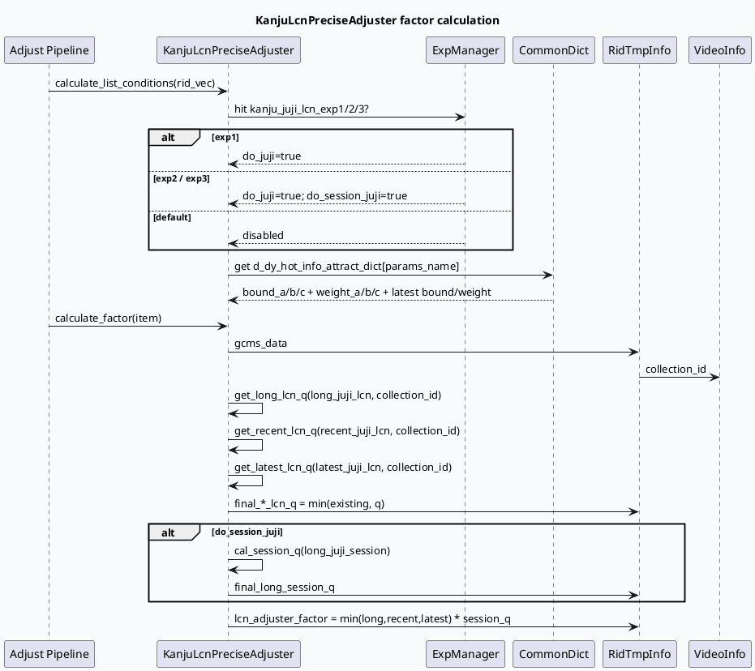

# 看剧 / 合集 / 短剧 LCN 与扶持策略

> 日期：2026-06-12  
> 今日主题来源：`daily-plan-20260529.json` Friday business slot  
> 范围：GRC `KanjuLcnPreciseAdjuster` 对合集/剧集 LCN 的调权，以及 `DataMergeFunction` 对短剧、合集、多品类 quota 的合并与日志观测。  
> 内网文档状态：本次未成功取得 KU 正文，相关业务口径需人工补充；下文以代码证据为主。

## 1. 架构全景图：正排分类 → LCN 调权 → 融合 quota → 漏斗日志

<style>.biz-arch{font-family:-apple-system,BlinkMacSystemFont,"Segoe UI",sans-serif;background:#f8fafc;border:1px solid #d9e2ec;border-radius:18px;padding:18px;margin:16px 0;color:#243b53}.biz-title{font-size:22px;font-weight:900;margin-bottom:12px;color:#102a43}.biz-row{display:grid;grid-template-columns:1fr 1fr 1fr 1fr;gap:12px}.biz-col{background:#fff;border:1px solid #e3e8ef;border-radius:14px;padding:12px;min-height:170px;box-shadow:0 6px 18px rgba(16,42,67,.06)}.biz-col h3{font-size:15px;margin:0 0 10px;color:#334e68}.biz-box{border-radius:10px;padding:9px 10px;margin:8px 0;background:#edf7ff;border-left:4px solid #3d5a80;font-size:13px;line-height:1.45}.biz-box.green{background:#edfdf5;border-left-color:#2d6a4f}.biz-box.orange{background:#fff7ed;border-left-color:#c2410c}.biz-box.pink{background:#fff1f2;border-left-color:#be123c}.biz-note{font-size:12px;color:#52606d;margin-top:10px}</style><div class="biz-arch"><div class="biz-title">看剧/合集/短剧业务链路全景</div><div class="biz-row"><div class="biz-col"><h3>内容识别</h3><div class="biz-box">GCMS VideoInfo：collection_id / is_heji / get_is_duanju / get_is_microvideo</div><div class="biz-box green">DataMerge 统计 mv/sv/dt/dj/heji 输入占比</div></div><div class="biz-col"><h3>LCN 参数</h3><div class="biz-box orange">实验命中：kanju_juji_lcn_exp1/2/3</div><div class="biz-box orange">词典：d_dy_hot_info_attract_dict，读取 12 个 bound/weight</div></div><div class="biz-col"><h3>调权计算</h3><div class="biz-box pink">long/recent/latest juji_lcn 分别计算 q</div><div class="biz-box pink">session 维度可叠乘 final_q</div><div class="biz-box pink">最终 factor 写入 lcn_adjuster_factor</div></div><div class="biz-col"><h3>融合与观测</h3><div class="biz-box green">保量先入，非保量按低活/兴趣策略进入，再兜底填充</div><div class="biz-box green">fsq_1400 + Merge Video Stats 输出品类漏斗</div></div></div><div class="biz-note">代码层面看到的是“合集/短剧分类 + LCN 惩罚 + quota 合并 + 漏斗日志”闭环；具体扶持策略的业务目标、实验白名单和收益口径需人工从 KU/周报补充。</div></div>

## 2. 核心流程图：Kanju LCN 调权时序



## 3. 配置/结构信息图：业务字段与策略参数

```infographic
infographic list-grid-badge-card
data
  title 看剧/合集/短剧链路关键字段
  desc 这些字段决定“识别、惩罚、合并、观测”四个阶段如何串起来
  items
    - label collection_id
      desc 从 VideoInfo.article_collections_info 读取，用作 juji LCN map 的 key
      icon mdi/key-variant
    - label is_heji
      desc 合集识别字段；DataMerge 输入/输出统计 heji_num/heji_rate
      icon mdi/folder-multiple-outline
    - label get_is_duanju
      desc 短剧识别字段；DataMerge 统计 dj_num/dj_rate
      icon mdi/movie-open-outline
    - label long/recent/latest LCN
      desc 三段时间窗分别生成 long_lcn_q、recent_lcn_q、latest_lcn_q
      icon mdi/timeline-clock-outline
    - label session_juji
      desc exp2/exp3 开启后再叠乘长周期 session q
      icon mdi/account-clock-outline
    - label total_quota
      desc DataMerge 输出上限；保量、非保量、兜底都受它约束
      icon mdi/counter
```

## 4. 代码链路拆解

### 4.1 KanjuLcnPreciseAdjuster：实验 + 词典驱动 LCN 惩罚

- `kanju_lcn_precise_adjuster.cpp:43-55`：根据 `kanju_juji_lcn_hit_exp1/2/3` 选择参数名；exp2/exp3 会额外打开 `do_session_juji`。
- `kanju_lcn_precise_adjuster.cpp:57-73`：从 `d_dy_hot_info_attract_dict` 读取至少 12 个值，依次作为 recent/latest 两组 `bound_a/b/c` 与 `weight_a/b/c`。
- `kanju_lcn_precise_adjuster.cpp:99-130`：从 `gcms_data->_video_info.get_article_collections_info().collection_id` 取合集/剧集 id，并分别计算 long/recent/latest LCN q。
- `kanju_lcn_precise_adjuster.cpp:151-165`：最终 `factor` 取 long/recent/latest 三者最小值；如果打开 session 维度，再乘 `final_q`，最后写入 `item->lcn_adjuster_factor`。
- `kanju_lcn_precise_adjuster.cpp:204-274`：三个 q 的衰减函数不同：long 使用指数衰减并通过 `exp(lcn * -0.2 + 0.4)` 平滑；recent/latest 使用分段 bound/weight。

### 4.2 DataMergeFunction：品类合并与日志观测闭环

- `data_merge.cpp:79-135`：合并前分别统计保量与非保量输入中的 `mv/sv/dt/dj/heji` 数量与占比。
- `data_merge.cpp:138-151`：通过 `[fsq_1400]` 输出输入漏斗日志，包含 `input_dj_num`、`input_heji_num`、`input_dj_rate`、`input_heji_rate`。
- `data_merge.cpp:153-178`：输出 `reserve(total_quota)`；先放保量，再处理非保量效果队列，最后兜底遍历效果队列补齐。
- `data_merge.cpp:160-168`：低活用户 + 兴趣 quota 实验 + 兴趣信息存在时走 `handle_effect_other_data_v2`，否则走 `handle_effect_other_data`。
- `data_merge.cpp:230-288`：合并后重新统计 `type_3248`、`Heji`、`Duanju`，输出 `Merge Video Stats`。
- `data_merge.cpp:292-320`：输出端继续计算 `output_dj_rate`、`output_heji_rate` 等，支撑策略效果观测。

## 5. Pitfalls 卡片

<style>.biz-card-frame{font-family:-apple-system,BlinkMacSystemFont,"Segoe UI",sans-serif;margin:18px 0}.biz-card{background:#faf8f4;border:1px solid #e7d8c9;border-radius:18px;padding:20px;color:#3f342a;box-shadow:0 8px 24px rgba(63,52,42,.08)}.biz-meta{font-size:12px;font-weight:800;letter-spacing:.08em;color:#7c6853;text-transform:uppercase}.biz-card-title{font-size:28px;font-weight:900;letter-spacing:-.02em;margin:6px 0 12px}.biz-card-grid{display:grid;grid-template-columns:1.2fr 1fr;gap:14px}.biz-panel{background:#fff;border-top:4px solid #7c6853;border-radius:12px;padding:12px;font-size:14px;line-height:1.65}.biz-panel strong{color:#5f4b3b}.biz-end{font-weight:900;color:#7c6853;margin-top:10px}</style><div class="biz-card-frame"><div class="biz-card"><div class="biz-meta">business pitfalls</div><div class="biz-card-title">“扶持”与“惩罚”不是同一层逻辑</div><div class="biz-card-grid"><div class="biz-panel"><strong>LCN Adjuster 层：</strong>看到的是合集/剧集重复消费后的调权惩罚，输出是 item 级 factor。不要把这里的 <code>lcn_adjuster_factor</code> 直接解释成“扶持短剧/合集”。</div><div class="biz-panel"><strong>DataMerge 层：</strong>看到的是保量、非保量、兜底和品类漏斗；短剧/合集的占比变化应结合输入/输出两段 fsq_1400 日志判断。</div></div><div class="biz-end">∎ 业务结论必须同时看 factor 与 quota 漏斗</div></div></div>

## 6. 调试 checklist

```infographic
infographic list-column-done-list
data
  title 看剧/合集/短剧策略排查清单
  desc 排查策略不生效、合集过多/过少、短剧占比异常、实验收益波动
  items
    - label 先确认实验命中
      desc 看 kanju_juji_lcn_hit_exp1/2/3；未命中时 do_juji 为 false
      done true
    - label 校验词典长度
      desc d_dy_hot_info_attract_dict 至少需要 12 个值，否则 bound/weight 保持默认/空效果
      done true
    - label 检查 collection_id
      desc LCN map key 来自 collection_id；缺失会让 long/recent/latest q 保持 1
      done true
    - label 对比输入输出漏斗
      desc 同时看 input_dj/heji_rate 与 output_dj/heji_rate，不只看最终输出
      done true
    - label 区分 heji 与 duanju
      desc is_heji 来自 article_collections_info；duanju 来自 get_is_duanju
      done true
    - label 补充业务口径
      desc 本次 KU 正文不可用；实验目的、白名单、收益口径需人工补充
      done false
```

## 7. 证据来源

- `src/operator/adjuster/precise/kanju_lcn_precise_adjuster.cpp:43-55`：实验命中与参数名选择。
- `src/operator/adjuster/precise/kanju_lcn_precise_adjuster.cpp:57-73`：词典读取 12 个 bound/weight 参数。
- `src/operator/adjuster/precise/kanju_lcn_precise_adjuster.cpp:99-130`：collection_id 与 long/recent/latest LCN q 写入。
- `src/operator/adjuster/precise/kanju_lcn_precise_adjuster.cpp:151-165`：最终 factor 与 `lcn_adjuster_factor`。
- `src/operator/adjuster/precise/kanju_lcn_precise_adjuster.cpp:204-274`：long/recent/latest q 的衰减与分段逻辑。
- `src/processor/video_launch/data_merge.cpp:79-178`：输入品类统计、保量/非保量/兜底合并。
- `src/processor/video_launch/data_merge.cpp:230-320`：输出端短剧/合集统计与漏斗日志。

## 8. 待人工补充

- KU/周报中“看剧资源扶持”“合集追打”的实验背景、目标人群与收益口径。
- `kanju_juji_lcn_exp1/2/3` 对应线上实验配置与流量范围。
- `type_3248` 在当前业务中的具体含义，以及它与短剧/合集口径的对应关系。