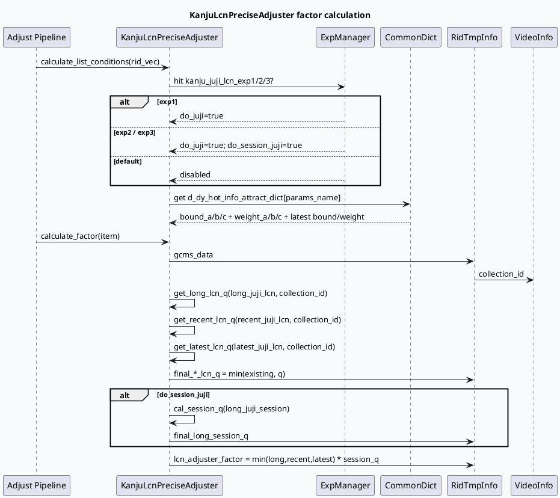

# 看剧 / 合集 / 短剧 LCN 与扶持策略

> 日期：2026-06-12  
> 今日主题来源：`daily-plan-20260529.json` Friday business slot  
> 范围：GRC `KanjuLcnPreciseAdjuster` 对合集/剧集 LCN 的调权，以及 `DataMergeFunction` 对短剧、合集、多品类 quota 的合并与日志观测。  
> 内网文档状态：本次未成功取得 KU 正文，相关业务口径需人工补充；下文以代码证据为主。

## 1. 架构全景图：正排分类 → LCN 调权 → 融合 quota → 漏斗日志

<style>.biz-arch{font-family:-apple-system,BlinkMacSystemFont,"Segoe UI",sans-serif;background:#f8fafc;border:1px solid #d9e2ec;border-radius:18px;padding:18px;margin:16px 0;color:#243b53}.biz-title{font-size:22px;font-weight:900;margin-bottom:12px;color:#102a43}.biz-row{display:grid;grid-template-columns:1fr 1fr 1fr 1fr;gap:12px}.biz-col{background:#fff;border:1px solid #e3e8ef;border-radius:14px;padding:12px;min-height:170px;box-shadow:0 6px 18px rgba(16,42,67,.06)}.biz-col h3{font-size:15px;margin:0 0 10px;color:#334e68}.biz-box{border-radius:10px;padding:9px 10px;margin:8px 0;background:#edf7ff;border-left:4px solid #3d5a80;font-size:13px;line-height:1.45}.biz-box.green{background:#edfdf5;border-left-color:#2d6a4f}.biz-box.orange{background:#fff7ed;border-left-color:#c2410c}.biz-box.pink{background:#fff1f2;border-left-color:#be123c}.biz-note{font-size:12px;color:#52606d;margin-top:10px}</style><div class="biz-arch"><div class="biz-title">看剧/合集/短剧业务链路全景</div><div class="biz-row"><div class="biz-col"><h3>内容识别</h3><div class="biz-box">GCMS VideoInfo：collection_id / is_heji / get_is_duanju / get_is_microvideo</div><div class="biz-box green">DataMerge 统计 mv/sv/dt/dj/heji 输入占比</div></div><div class="biz-col"><h3>LCN 参数</h3><div class="biz-box orange">实验命中：kanju_juji_lcn_exp1/2/3</div><div class="biz-box orange">词典：d_dy_hot_info_attract_dict，读取 12 个 bound/weight</div></div><div class="biz-col"><h3>调权计算</h3><div class="biz-box pink">long/recent/latest juji_lcn 分别计算 q</div><div class="biz-box pink">session 维度可叠乘 final_q</div><div class="biz-box pink">最终 factor 写入 lcn_adjuster_factor</div></div><div class="biz-col"><h3>融合与观测</h3><div class="biz-box green">保量先入，非保量按低活/兴趣策略进入，再兜底填充</div><div class="biz-box green">fsq_1400 + Merge Video Stats 输出品类漏斗</div></div></div><div class="biz-note">代码层面看到的是“合集/短剧分类 + LCN 惩罚 + quota 合并 + 漏斗日志”闭环；具体扶持策略的业务目标、实验白名单和收益口径需人工从 KU/周报补充。</div></div>

## 2. 核心流程图：Kanju LCN 调权时序



## 3. 配置/结构信息图：业务字段与策略参数

```infographic
infographic list-grid-badge-card
data
  title 看剧/合集/短剧链路关键字段
  desc 这些字段决定“识别、惩罚、合并、观测”四个阶段如何串起来
  items
    - label collection_id
      desc 从 VideoInfo.article_collections_info 读取，用作 juji LCN map 的 key
      icon mdi/key-variant
    - label is_heji
      desc 合集识别字段；DataMerge 输入/输出统计 heji_num/heji_rate
      icon mdi/folder-multiple-outline
    - label get_is_duanju
      desc 短剧识别字段；DataMerge 统计 dj_num/dj_rate
      icon mdi/movie-open-outline
    - label long/recent/latest LCN
      desc 三段时间窗分别生成 long_lcn_q、recent_lcn_q、latest_lcn_q
      icon mdi/timeline-clock-outline
    - label session_juji
      desc exp2/exp3 开启后再叠乘长周期 session q
      icon mdi/account-clock-outline
    - label total_quota
      desc DataMerge 输出上限；保量、非保量、兜底都受它约束
      icon mdi/counter
```

## 4. 代码链路拆解

### 4.1 KanjuLcnPreciseAdjuster：实验 + 词典驱动 LCN 惩罚

- `kanju_lcn_precise_adjuster.cpp:43-55`：根据 `kanju_juji_lcn_hit_exp1/2/3` 选择参数名；exp2/exp3 会额外打开 `do_session_juji`。
- `kanju_lcn_precise_adjuster.cpp:57-73`：从 `d_dy_hot_info_attract_dict` 读取至少 12 个值，依次作为 recent/latest 两组 `bound_a/b/c` 与 `weight_a/b/c`。
- `kanju_lcn_precise_adjuster.cpp:99-130`：从 `gcms_data->_video_info.get_article_collections_info().collection_id` 取合集/剧集 id，并分别计算 long/recent/latest LCN q。
- `kanju_lcn_precise_adjuster.cpp:151-165`：最终 `factor` 取 long/recent/latest 三者最小值；如果打开 session 维度，再乘 `final_q`，最后写入 `item->lcn_adjuster_factor`。
- `kanju_lcn_precise_adjuster.cpp:204-274`：三个 q 的衰减函数不同：long 使用指数衰减并通过 `exp(lcn * -0.2 + 0.4)` 平滑；recent/latest 使用分段 bound/weight。

### 4.2 DataMergeFunction：品类合并与日志观测闭环

- `data_merge.cpp:79-135`：合并前分别统计保量与非保量输入中的 `mv/sv/dt/dj/heji` 数量与占比。
- `data_merge.cpp:138-151`：通过 `[fsq_1400]` 输出输入漏斗日志，包含 `input_dj_num`、`input_heji_num`、`input_dj_rate`、`input_heji_rate`。
- `data_merge.cpp:153-178`：输出 `reserve(total_quota)`；先放保量，再处理非保量效果队列，最后兜底遍历效果队列补齐。
- `data_merge.cpp:160-168`：低活用户 + 兴趣 quota 实验 + 兴趣信息存在时走 `handle_effect_other_data_v2`，否则走 `handle_effect_other_data`。
- `data_merge.cpp:230-288`：合并后重新统计 `type_3248`、`Heji`、`Duanju`，输出 `Merge Video Stats`。
- `data_merge.cpp:292-320`：输出端继续计算 `output_dj_rate`、`output_heji_rate` 等，支撑策略效果观测。

## 5. Pitfalls 卡片

<style>.biz-card-frame{font-family:-apple-system,BlinkMacSystemFont,"Segoe UI",sans-serif;margin:18px 0}.biz-card{background:#faf8f4;border:1px solid #e7d8c9;border-radius:18px;padding:20px;color:#3f342a;box-shadow:0 8px 24px rgba(63,52,42,.08)}.biz-meta{font-size:12px;font-weight:800;letter-spacing:.08em;color:#7c6853;text-transform:uppercase}.biz-card-title{font-size:28px;font-weight:900;letter-spacing:-.02em;margin:6px 0 12px}.biz-card-grid{display:grid;grid-template-columns:1.2fr 1fr;gap:14px}.biz-panel{background:#fff;border-top:4px solid #7c6853;border-radius:12px;padding:12px;font-size:14px;line-height:1.65}.biz-panel strong{color:#5f4b3b}.biz-end{font-weight:900;color:#7c6853;margin-top:10px}</style><div class="biz-card-frame"><div class="biz-card"><div class="biz-meta">business pitfalls</div><div class="biz-card-title">“扶持”与“惩罚”不是同一层逻辑</div><div class="biz-card-grid"><div class="biz-panel"><strong>LCN Adjuster 层：</strong>看到的是合集/剧集重复消费后的调权惩罚，输出是 item 级 factor。不要把这里的 <code>lcn_adjuster_factor</code> 直接解释成“扶持短剧/合集”。</div><div class="biz-panel"><strong>DataMerge 层：</strong>看到的是保量、非保量、兜底和品类漏斗；短剧/合集的占比变化应结合输入/输出两段 fsq_1400 日志判断。</div></div><div class="biz-end">∎ 业务结论必须同时看 factor 与 quota 漏斗</div></div></div>

## 6. 调试 checklist

```infographic
infographic list-column-done-list
data
  title 看剧/合集/短剧策略排查清单
  desc 排查策略不生效、合集过多/过少、短剧占比异常、实验收益波动
  items
    - label 先确认实验命中
      desc 看 kanju_juji_lcn_hit_exp1/2/3；未命中时 do_juji 为 false
      done true
    - label 校验词典长度
      desc d_dy_hot_info_attract_dict 至少需要 12 个值，否则 bound/weight 保持默认/空效果
      done true
    - label 检查 collection_id
      desc LCN map key 来自 collection_id；缺失会让 long/recent/latest q 保持 1
      done true
    - label 对比输入输出漏斗
      desc 同时看 input_dj/heji_rate 与 output_dj/heji_rate，不只看最终输出
      done true
    - label 区分 heji 与 duanju
      desc is_heji 来自 article_collections_info；duanju 来自 get_is_duanju
      done true
    - label 补充业务口径
      desc 本次 KU 正文不可用；实验目的、白名单、收益口径需人工补充
      done false
```

## 7. 证据来源

- `src/operator/adjuster/precise/kanju_lcn_precise_adjuster.cpp:43-55`：实验命中与参数名选择。
- `src/operator/adjuster/precise/kanju_lcn_precise_adjuster.cpp:57-73`：词典读取 12 个 bound/weight 参数。
- `src/operator/adjuster/precise/kanju_lcn_precise_adjuster.cpp:99-130`：collection_id 与 long/recent/latest LCN q 写入。
- `src/operator/adjuster/precise/kanju_lcn_precise_adjuster.cpp:151-165`：最终 factor 与 `lcn_adjuster_factor`。
- `src/operator/adjuster/precise/kanju_lcn_precise_adjuster.cpp:204-274`：long/recent/latest q 的衰减与分段逻辑。
- `src/processor/video_launch/data_merge.cpp:79-178`：输入品类统计、保量/非保量/兜底合并。
- `src/processor/video_launch/data_merge.cpp:230-320`：输出端短剧/合集统计与漏斗日志。

## 8. 待人工补充

- KU/周报中“看剧资源扶持”“合集追打”的实验背景、目标人群与收益口径。
- `kanju_juji_lcn_exp1/2/3` 对应线上实验配置与流量范围。
- `type_3248` 在当前业务中的具体含义，以及它与短剧/合集口径的对应关系。
---

## 七、业务代码库适配分析
> **分析时间**：2026-07-20T19:27:35.510542
> **目标代码库**：feeda-mv-grg（序列生成）、feeda-mv-grc（召回汇聚）

## 业务代码库适配分析

### 1. 分析摘要

- 从扫描结果看，`feeda-mv-grg` 与 `feeda-mv-grc` 都已经存在目标库的少量使用，说明该技术并非完全从零引入，具备一定的工程落地基础。其中 `feeda-mv-grg` 已发现 6 个相关文件，集中在看剧偏好计算、小说向量获取、热门内容 diversity 规则等链路；`feeda-mv-grc` 已发现 3 个相关文件，集中在短剧 LCN 信息计算、基础数据结构和短剧过滤算子中。
- 两个代码库中 `std::vector`、`std::string`、`std::unordered_map` 的使用规模都非常大，尤其是 `feeda-mv-grc`，`std::vector` 出现 8442 次、`std::unordered_map` 出现 2834 次，说明如果目标技术是面向容器、字符串、哈希表或基础数据结构的性能优化替换，则迁移潜力较高。但考虑到推荐系统链路对稳定性、排序一致性和线上实验可解释性要求较高，建议采用“热点路径定点替换 + 压测验证 + 灰度实验”的方式推进，而不是全仓批量替换。

---

### 2. 代码库详情

#### feeda-mv-grg：序列生成服务

- **目标库使用现状**
  - 已发现目标库使用：6 个文件。
  - 相关文件包括：
    - `operator/diversity/douyin_popular_soft_rule.cpp`
    - `process/cal_kanju_kezi_prefer.cpp`
    - `process/get_kanju_novel_vec.cpp`
    - `process/cal_kanju_prefer.cpp`
    - `operator/diversity/mcv_recpage_tgi_manju_set2setq_rule.cpp`
  - 这些文件多与看剧偏好、看剧小说向量、热门内容 diversity 规则相关，和本篇笔记中的“看剧 / 合集 / 短剧”业务链路有较强关联。

- **std 等价物使用规模**
  - `std::vector`：1969 次，分布在 356 个文件。
  - `std::string`：2443 次，分布在 425 个文件。
  - `std::unordered_map`：734 次，分布在 205 个文件。

- **典型现有代码**
  - `model/model.h`
    ```cpp
    class Model {
    public:
        virtual int predict(std::vector<RidTmpInfoPtr>& candidate_vec, uint32_t pos) = 0;
    };
    ```
  - `model/paddle_model.h`
    ```cpp
    virtual int predict(std::vector<RidTmpInfoPtr>& candidate_vec, uint32_t pos) {
        return 0;
    }
    ```
  - `model/paddle_model.h`
    ```cpp
    int predict_with_tensor_input(std::vector<RidTmpInfoPtr>& candidate_vec,
                general_predict::PredictSample* predict_sample = nullptr,
                bool is_from_cube = true) const {
        return predict<ModelDependInput>(candidate_vec, predict_sample, is_from_cube);
    }
    ```

- **初步判断**
  - `feeda-mv-grg` 中 `std::vector` 主要承担候选队列、模型输入、特征列表等角色。
  - 对于 `candidate_vec` 这类贯穿模型预测接口的容器，不建议优先替换接口类型，否则会引发大量 ABI/API 兼容改造。
  - 更适合作为第一阶段优化目标的是局部临时容器、短生命周期哈希表、频繁构造的字符串拼接或统计 map。

---

#### feeda-mv-grc：召回汇聚服务

- **目标库使用现状**
  - 已发现目标库使用：3 个文件。
  - 相关文件包括：
    - `processor/compute_duanju_explore_lcn_info.cpp`
    - `data/base.h`
    - `processor/filter/duanju_video_filter_operator.cc`
  - 这些文件与短剧探索 LCN 信息、基础数据结构、短剧过滤强相关，可作为后续在短剧 / 合集 / 看剧链路中引入目标技术的参考样例。

- **std 等价物使用规模**
  - `std::vector`：8442 次，分布在 1279 个文件。
  - `std::string`：7170 次，分布在 1234 个文件。
  - `std::unordered_map`：2834 次，分布在 639 个文件。

- **典型现有代码**
  - `service/grc_http_service.cpp`
    ```cpp
    std::unordered_map<std::string, std::vector<int>> depend_map;
    auto &all_vertex = graph_engine->get_vertexs_message(graph_name);
    for (int i = 0; i < all_vertex.size(); ++i) {
        for (auto &depend : all_vertex[i].depends) {
    ```
  - `service/grc_http_service.cpp`
    ```cpp
    static std::vector<std::string> colors{
        "#FFB6C1", "#DC143C", "#DB7093", "#FF1493", "#FF00FF", "#800080",
        "#4B0082", "#7B68EE", "#0000FF", "#4169E1", "#778899", "#4682B4",
        ...
    };
    ```
  - `service/grc_http_service.cpp`
    ```cpp
    std::string resp_str;

    std::vector<std::string> sub_access_off_vec;
    std::vector<std::string> sub_access_on_vec;
    const std::string *sub_access_off_vec_str = cntl->http_request().uri().GetQuery("off");
    const std::string *sub_access_on_vec_str = cntl->http_request().uri().GetQuery("on");
    ```

- **初步判断**
  - `feeda-mv-grc` 是更适合做性能优化试点的代码库：一方面 std 容器规模更大，另一方面召回汇聚服务中有较多 map 查询、候选集合合并、过滤、统计日志逻辑。
  - 与本文业务主题直接相关的 `processor/compute_duanju_explore_lcn_info.cpp`、`processor/filter/duanju_video_filter_operator.cc`、`data/base.h` 可以作为短剧 / 合集链路优化的优先观察点。
  - 对于 `service/grc_http_service.cpp` 这类 HTTP 管理或图展示逻辑，虽然存在 `std::unordered_map<std::string, std::vector<int>>` 和大量 `std::string`，但不一定在核心推荐路径上，优先级应低于在线召回、过滤、合并、LCN 计算链路。

---

### 3. 💡 适用性评估与建议

- **建议一：优先在 `feeda-mv-grc/data/base.h` 做数据结构兼容层，而不是直接全局替换**
  - `data/base.h` 已经出现在目标库使用文件列表中，说明它可能承载了基础数据结构、公共类型定义或核心数据对象。
  - 建议在这里优先梳理短剧、合集、LCN 相关字段，例如：
    - `collection_id`
    - `is_heji`
    - `get_is_duanju`
    - LCN 统计 map
    - 候选 item 容器
  - 如果目标技术涉及替换 `std::vector`、`std::string`、`std::unordered_map`，建议先在 `data/base.h` 增加类型别名或适配层，例如：
    ```cpp
    using CandidateVec = std::vector<RidTmpInfoPtr>;
    using CollectionLcnMap = std::unordered_map<uint64_t, float>;
    ```
  - 后续可以在实现层逐步替换为目标容器，避免业务代码直接依赖具体实现。
  - 这样做的好处是可以降低大规模改造风险，同时为 `KanjuLcnPreciseAdjuster`、短剧过滤、DataMerge 统计等链路预留性能优化空间。

- **建议二：在 `processor/compute_duanju_explore_lcn_info.cpp` 优先评估哈希表替换收益**
  - 该文件与短剧探索 LCN 信息计算直接相关，属于本篇笔记中“LCN 惩罚 / 探索 / 调权”的核心业务路径。
  - LCN 计算通常会涉及：
    - 按 `collection_id` 查询历史消费次数；
    - 按短剧或合集 id 聚合曝光 / 点击 / session 信息；
    - 按候选 item 批量计算 q 值。
  - 如果当前实现中存在大量 `std::unordered_map` 查询、插入、清空、重建，可以优先评估替换为目标哈希容器。
  - 迁移重点不是所有 map，而是以下场景：
    - key 为整数型 `collection_id`、`rid`、`author_id` 的 map；
    - 生命周期在单次请求内；
    - 每次请求都会构造并销毁；
    - 查询次数明显大于插入次数；
    - map 大小可预估，能够提前 `reserve`。
  - 建议改造前后对比：
    - 单请求 CPU 耗时；
    - P99 延迟；
    - map 构造 / rehash 次数；
    - RSS 或 arena 内存峰值；
    - LCN q 值输出一致性。

- **建议三：`processor/filter/duanju_video_filter_operator.cc` 适合做短剧过滤链路的局部容器优化**
  - 该文件是短剧过滤算子，与本篇中的 `get_is_duanju`、短剧占比控制、短剧漏斗观测强相关。
  - 过滤逻辑通常会维护若干临时集合，例如：
    - 已过滤 rid 集合；
    - 命中特定短剧规则的 rid 集合；
    - 用户已看过的短剧 / 合集集合；
    - 白名单、黑名单、实验名单。
  - 如果这些集合当前使用 `std::unordered_map` 或 `std::unordered_set`，建议优先替换请求内临时集合，而不是替换跨模块传递的公共接口。
  - 对于只做存在性判断的场景，应优先使用 set 类结构，而不是 `unordered_map<key, bool>`。
  - 如果目标库已有高性能 flat hash 容器，可重点迁移：
    - `rid -> bool`
    - `collection_id -> bool`
    - `collection_id -> lcn_count`
  - 需要保留过滤前后的日志字段，例如短剧输入数、过滤数、输出数，避免迁移后只看到性能变化，看不到业务口径变化。

- **建议四：`feeda-mv-grg/process/cal_kanju_prefer.cpp` 与 `process/cal_kanju_kezi_prefer.cpp` 可作为看剧偏好计算的试点**
  - 这两个文件已经出现在目标库使用列表中，说明它们对目标技术具有一定接入经验。
  - 看剧偏好计算通常会处理用户行为序列、剧集集合、短剧偏好、小说偏好等特征，可能存在大量：
    - `std::vector` 遍历；
    - `std::string` 特征名拼接；
    - `std::unordered_map` 聚合计数；
    - 临时结果 merge。
  - 建议优先优化请求内局部对象，例如：
    - 用户行为序列解析后的临时 vector；
    - 偏好分桶 map；
    - `collection_id` 到偏好分的 map；
    - 短剧 / 合集 tag 到权重的 map。
  - 不建议第一阶段修改 `model/model.h` 中的接口：
    ```cpp
    virtual int predict(std::vector<RidTmpInfoPtr>& candidate_vec, uint32_t pos) = 0;
    ```
    因为该接口可能被多个模型实现依赖，直接替换会扩大改造面。
  - 更稳妥的做法是在函数内部用目标容器做临时计算，最终仍回写到 `std::vector<RidTmpInfoPtr>& candidate_vec`。

- **建议五：`service/grc_http_service.cpp` 可低优先级处理，主要关注字符串拼接和静态 vector**
  - 该文件中存在：
    ```cpp
    std::unordered_map<std::string, std::vector<int>> depend_map;
    static std::vector<std::string> colors{...};
    std::string resp_str;
    std::vector<std::string> sub_access_off_vec;
    std::vector<std::string> sub_access_on_vec;
    ```
  - 这类代码更偏服务管理、图展示或调试接口，不一定是推荐主链路。
  - 如果接口调用频率较低，不建议优先做容器替换。
  - 可以做一些低风险优化：
    - 对 `resp_str` 进行 `reserve`；
    - 对 `sub_access_off_vec`、`sub_access_on_vec` 根据 query 数量预估 `reserve`；
    - 对 `depend_map` 根据 vertex 数量提前 `reserve`；
    - 静态 `colors` 如果只读，可保持不动，避免无收益改造。
  - 该文件可以作为非核心链路的验证样例，但不应作为性能收益的主要来源。

---

### 4. ⚠️ 引入风险与限制

- **风险一：不要直接替换跨模块接口中的 `std::vector`**
  - 例如 `feeda-mv-grg/model/model.h` 中：
    ```cpp
    virtual int predict(std::vector<RidTmpInfoPtr>& candidate_vec, uint32_t pos) = 0;
    ```
  - 该接口很可能被多个模型、多个派生类、多个编译单元依赖。
  - 如果直接替换为目标容器，会带来：
    - 大量编译错误；
    - ABI / API 不兼容；
    - 模型推理接口适配成本上升；
    - 单测和回归范围扩大。
  - 建议保持外部接口稳定，先优化函数内部临时容器。

- **风险二：哈希容器替换可能改变遍历顺序，影响排序和日志稳定性**
  - 推荐系统中部分逻辑可能隐式依赖 `std::unordered_map` 当前的遍历顺序，虽然这本身不是严格语义保证。
  - 替换为目标 hash map 后，遍历顺序可能变化，进而影响：
    - 候选合并顺序；
    - 相同分数 item 的 tie-break；
    - 日志输出顺序；
    - 实验 diff 判断。
  - 对 `DataMergeFunction`、短剧过滤、LCN 调权这类会影响最终输出列表的逻辑，必须做结果一致性 diff。
  - 建议迁移后至少验证：
    - 输出 rid 集合一致性；
    - topN 顺序一致性；
    - `input_dj_rate` / `output_dj_rate` 是否异常；
    - `input_heji_rate` / `output_heji_rate` 是否异常；
    - `lcn_adjuster_factor` 分布是否变化。

- **风险三：短生命周期容器优化收益高，但内存峰值和 clear 行为要重点观察**
  - 很多高性能容器为了提升查询性能，会使用更高的装载空间或不同的内存布局。
  - 在 `processor/compute_duanju_explore_lcn_info.cpp`、`processor/filter/duanju_video_filter_operator.cc` 这类请求级链路中，如果每个请求都构造大量容器，需要关注：
    - `clear()` 后是否释放内存；
    - 单请求峰值内存；
    - 线程并发下 RSS；
    - rehash 次数；
    - 是否需要 `reserve` 或复用对象池。
  - 不建议只看 CPU 降低，还要同时看内存和尾延迟。

- **风险四：业务指标必须和性能指标一起验收**
  - 本篇技术笔记中的核心链路不是单纯容器性能问题，而是“合集 / 短剧识别 + LCN 惩罚 + quota 合并 + 漏斗日志”闭环。
  - 因此迁移后不能只验证耗时下降，还要验证业务观测字段稳定：
    - `input_dj_num`
    - `input_heji_num`
    - `input_dj_rate`
    - `input_heji_rate`
    - `output_dj_rate`
    - `output_heji_rate`
    - `lcn_adjuster_factor`
    - long / recent / latest LCN q 值分布
  - 尤其是 `feeda-mv-grc` 中的短剧探索和过滤链路，任何集合顺序、去重逻辑、map 默认值变化，都可能影响短剧 / 合集最终占比。

---
*本章节由 Hermes Agent 自动分析生成，基于代码库静态扫描结果。*
