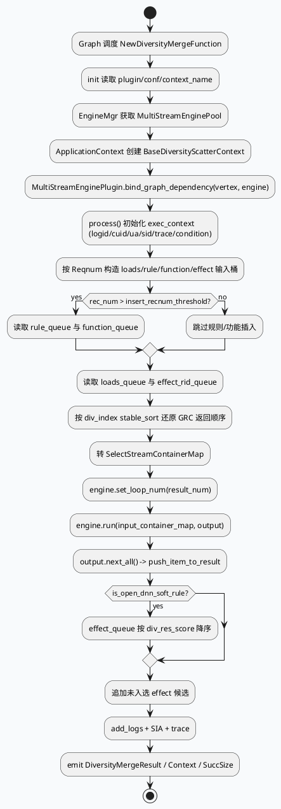

# GRG NewDiversityMerge / MultiStreamEngine 执行闭环（2026-06-19）

> 本次 cron 未发现 `daily-plan-20260619.json`，按周五回退主题选取 GRG 新版多样性合并链路。内网 KU 未提供 URL/doc-id，需人工补充业务策略口径；本文以代码库检索结果为准。

## 一、架构全景图

<style>.arch-div{font-family:-apple-system,BlinkMacSystemFont,"Segoe UI",sans-serif;background:#f8fafc;border:1px solid #d9e2ec;border-radius:18px;padding:18px;color:#1f2937}.arch-div .title{font-size:24px;font-weight:850;margin-bottom:6px}.arch-div .desc{font-size:13px;color:#64748b;margin-bottom:16px}.arch-div .cols{display:grid;grid-template-columns:1fr 1.35fr 1fr;gap:12px}.arch-div .col{border-radius:14px;padding:12px;border:1px solid #d7dee8}.arch-div .c1{background:#eef6ff}.arch-div .c2{background:#f0fdf4}.arch-div .c3{background:#fff7ed}.arch-div .box{background:#fff;border:1px solid #d9e2ec;border-radius:12px;padding:10px;margin:8px 0;box-shadow:0 2px 8px rgba(15,23,42,.05)}.arch-div .box b{display:block;font-size:14px;margin-bottom:4px}.arch-div .box span{font-size:12px;color:#64748b;line-height:1.45}.arch-div .arrow{font-weight:800;color:#2d6a4f;text-align:center;padding:6px}.arch-div .badge{display:inline-block;background:#dcfce7;color:#166534;border-radius:999px;padding:2px 8px;font-size:11px;margin-left:6px}</style><div class="arch-div"><div class="title">NewDiversityMerge：四类输入队列 → MultiStreamEngine → 去重输出</div><div class="desc">新版合并函数把 loads / rule / function / effect 四类候选投喂给 MultiStreamEngine，由配置化 stream / executor / rule 选择最终序列，并用 trace + SIA 留下可回放证据。</div><div class="cols"><div class="col c1"><b>输入侧</b><div class="box"><b>loads_queue</b><span>保底/兜底候选，按 merge_pos 分桶</span></div><div class="box"><b>rule_queue</b><span>规则插入候选，受 insert 阈值控制</span></div><div class="box"><b>function_queue</b><span>功能队列候选，单桶输入</span></div><div class="box"><b>effect_rid_queue</b><span>效果队列，最终补齐与软打散排序</span></div></div><div class="col c2"><b>执行核心 <span class="badge">MultiStreamEngine</span></b><div class="box"><b>EngineMgr::get_multi_stream_engine_pool()</b><span>按 conf 获取引擎池并取 PooledObject</span></div><div class="box"><b>bind_graph_dependency()</b><span>MultiStreamEnginePlugin 将图依赖绑定到执行引擎</span></div><div class="box"><b>input_container_map</b><span>将 RidTmpInfo* reinterpret 为 DynamicStruct* 容器</span></div><div class="box"><b>run(input, output)</b><span>按 loads_select / rule_select / function_select / effect_pk / merge_pk 配置执行</span></div></div><div class="col c3"><b>输出与观测</b><div class="box"><b>push_item_to_result()</b><span>根据 div_reason 统计 queue_type 并去重 nid</span></div><div class="box"><b>effect_append</b><span>未进入结果的 effect 候选按分数追加</span></div><div class="box"><b>add_logs()</b><span>输出 result_list、force/ignore indexes、trace_info</span></div><div class="box"><b>reset()</b><span>清理 context、engine、输入桶、计数器</span></div></div></div></div>

## 二、核心执行流程



## 三、配置结构信息图

```infographic sequence-timeline-simple
data
  title multi_stream_diversity_new.conf 执行拓扑
  desc 配置文件把选择、PK 与打散规则拆成多个 stream/executor
  items
    - time stream 1
      label loads_select
      desc loads 输入走 loads_select_executor，支持回退
    - time stream 2
      label rule_select
      desc rule 输入走 select_executor，通常用于规则插入最小下标选择
    - time stream 3
      label function_select
      desc function 输入走 select_executor，功能候选单桶选择
    - time stream 4
      label final_select / effect_pk
      desc effect 输入先规则过滤与软打散打分，再提前 PK 降低候选集
    - time stream 5
      label merge_pk
      desc 本地串行合并 loads/rule/function/effect_pk 的输出，形成最终选择
```

```infographic list-grid-badge-card
data
  title NewDiversityMerge 关键计数与日志
  desc 排查线上效果时优先看的 SIA / 日志字段
  items
    - label loads_input_size
      desc read_queue(loads_queue) 后的保底候选数量
      icon mdi/database-arrow-down
    - label rule_input_size
      desc rec_num 超过阈值后才读取规则插入候选
      icon mdi/ruler
    - label div_succ_size
      desc engine 输出后真正进入结果的数量
      icon mdi/check-circle
    - label div_news_num
      desc push_item_to_result 中按 _news_info 统计图文内容数
      icon mdi/newspaper
    - label r_div_queue_*
      desc 按 div_reason 归因 loads/rule/function/effect
      icon mdi/chart-bar
    - label trace_log_size
      desc trace 数据体积，过大可能放大日志成本
      icon mdi/file-chart
```

## 四、关键代码解读

### 1. init 阶段必须同时绑定引擎和图依赖

`new_diversity_merge.cpp:43-76` 从配置读取 `plugin/conf/context_name`，通过 `EngineMgr::instance().get_multi_stream_engine_pool(conf)` 取得引擎，再把 `BaseDiversityScatterContext` 挂到 `exec_context->custom_context`。随后 `dynamic_cast<MultiStreamEnginePlugin*>` 并调用 `bind_graph_dependency()`；如果这里未绑定，后续 executor/rule 中声明的图依赖不会被注入。

### 2. 输入桶不是普通队列合并，而是按展示位置分桶

`new_diversity_merge.cpp:203-220` 为 loads/rule 创建 `rec_num` 个桶，而 function/effect 是单桶；`new_diversity_merge.cpp:343-371` 使用 `merge_pos()` 作为 slot_index，把候选放回对应位置。这决定了多样性选择不是单纯按分数排序，而是在位置维度做规则选择与插入。

### 3. engine 输出后还有 effect 追加兜底

`new_diversity_merge.cpp:283-311` 先消费 engine output，然后对 effect_queue 中尚未入选的候选设置 `div_reason = "effect_append"` 并追加。若打开 DNN soft rule，还会先按 `div_res_score` 降序稳定排序，避免补齐阶段破坏效果分。

### 4. reset 是复用安全边界

`new_diversity_merge.cpp:573-604` 清理 `_diversity_context`、`_diversity_engine`、`_input_map`、containers、index set、计数器。如果遗漏，会把上一请求的插入索引、去重 nid、trace 候选泄漏到下一次图执行。

## 五、Pitfalls 卡片

<style>.pit-div{font-family:-apple-system,BlinkMacSystemFont,"Segoe UI",sans-serif;background:#f4f8f6;border:1px solid #b7d7c5;border-radius:16px;padding:18px;margin:18px 0;color:#1f3428}.pit-div .meta{font-size:12px;font-weight:800;letter-spacing:.08em;text-transform:uppercase;color:#2d6a4f}.pit-div .headline{font-size:24px;font-weight:850;margin:6px 0 12px}.pit-div .grid{display:grid;grid-template-columns:1fr 1fr;gap:12px}.pit-div .panel{background:rgba(255,255,255,.76);border-top:4px solid #2d6a4f;border-radius:12px;padding:12px}.pit-div p{margin:0;font-size:14px;line-height:1.65}.pit-div b{color:#14532d}</style><div class="pit-div"><div class="meta">Pitfalls · MultiStream Diversity</div><div class="headline">看结果乱序时，先确认 merge_pos 与 div_index，不要只看 score</div><div class="grid"><div class="panel"><p><b>位置桶陷阱：</b>候选先按 `merge_pos()` 放入 slot，再在每个桶内用 `div_index` stable_sort 还原 GRC 顺序；分数只影响部分 executor 或 effect_append。</p></div><div class="panel"><p><b>配置陷阱：</b>`multi_stream_diversity_new.conf` 中 rule 依赖很多图数据，任一依赖未绑定或字段名不一致，都可能导致 rule 不生效而不是函数直接失败。</p></div></div></div>

## 六、调试 checklist

```infographic list-column-done-list
data
  title NewDiversityMerge 排查清单
  desc 从初始化、输入桶、engine 输出到日志归因逐层确认
  items
    - label 检查 init 配置
      desc plugin/conf/context_name 必须存在，EngineMgr 能根据 conf 取到 engine pool
      done true
    - label 验证 bind_graph_dependency
      desc 失败会 FATAL；若 rule 数据缺失，先看插件绑定和配置依赖名
      done true
    - label 对比四类输入规模
      desc SIA 中 loads/rule/function/effect_input_size 判断候选是否进入引擎
      done true
    - label 检查 rec_num 阈值
      desc rec_num <= insert_recnum_threshold 时 rule/function 不会读取
      done true
    - label 追踪 div_reason
      desc result_list 与 r_div_queue_* 可解释 loads/rule/function/effect 的占比
      done true
    - label 留意 reset 泄漏
      desc 去重 set、force/ignore indexes、containers 都依赖 reset 清理
      done true
```

## 七、证据来源

- `src/main.cpp:39-85`：GRG 服务启动、初始化、brpc service 注册。
- `src/process/new_diversity_merge.cpp:43-76`：读取配置、获取 MultiStreamEngine、绑定图依赖。
- `src/process/new_diversity_merge.cpp:109-180`：process 初始化 exec_context、sid、trace、condition。
- `src/process/new_diversity_merge.cpp:203-220`：构造 loads/rule/function/effect 输入桶并读取队列。
- `src/process/new_diversity_merge.cpp:233-259`：按 div_index 排序并转换 SelectStreamContainerMap。
- `src/process/new_diversity_merge.cpp:266-311`：执行 engine、生成结果并追加 effect 候选。
- `src/process/new_diversity_merge.cpp:376-421`：去重、队列归因、内容类型计数。
- `src/process/new_diversity_merge.cpp:449-570`：结果日志、trace 与 SIA 指标。
- `src/process/new_diversity_merge.cpp:573-604`：reset 清理复用状态。
- `conf/plugins/exec_engine/multi_stream_diversity_new.conf:1-66`：stream 拓扑。
- `conf/plugins/exec_engine/multi_stream_diversity_new.conf:70-160`：select_executor 与关键依赖。
- `conf/plugins/exec_engine/multi_stream_diversity_new.conf:324-480`：effect_select_executor 与 searchc 条件分支。

---

## 七、业务代码库适配分析
> **分析时间**：2026-07-20T19:28:59.426902
> **目标代码库**：feeda-mv-grg（序列生成）、feeda-mv-grc（召回汇聚）

## 业务代码库适配分析

### 1. 分析摘要

- 从扫描结果看，`NewDiversityMerge / MultiStreamEngine` 相关能力已经在两个业务代码库中出现，说明业务侧并非完全从零引入。`feeda-mv-grg` 作为序列生成服务，已发现 10 个文件使用目标链路或相关多样性组件，覆盖 `process/*` 与 `operator/diversity/*`；`feeda-mv-grc` 作为召回汇聚服务，已发现 6 个相关文件，主要集中在召回选择、回退规则、scatter context 与 diversity rule。

- 整体迁移潜力较高。`feeda-mv-grg` 更接近最终排序与合并出口，适合作为 `NewDiversityMerge + MultiStreamEngine` 的主适配方；`feeda-mv-grc` 更适合作为上游数据与多样性字段生产方，重点保证 `merge_pos`、`div_index`、`div_reason`、候选分数、规则依赖字段等信息完整传递。两个代码库中 `std::vector`、`std::string`、`std::unordered_map` 使用规模都较大，说明候选集合、依赖映射、上下文数据结构较多，后续适配时需要关注容器复用、预分配、去重集合生命周期与日志体积控制。

---

### 2. 代码库详情

#### feeda-mv-grg

- **扫描发现**
  - 已发现目标库或相关多样性链路使用：10 个文件。
  - 代表文件包括：
    - `process/smallflow_function.cpp`
    - `process/news_fill_meta_pipeline.cpp`
    - `operator/diversity/diversity_rule_event_with_showlist.cpp`
    - `operator/diversity/video_type_diversity_rule.cpp`
    - `operator/diversity/longterm_soft_rule.cpp`

- **现有 STL 使用规模**
  - `std::vector`：1969 次，分布在 356 个文件。
  - `std::string`：2443 次，分布在 425 个文件。
  - `std::unordered_map`：734 次，分布在 205 个文件。

- **典型代码形态**
  - `model/model.h`
    ```cpp
    class Model {
    public:
        virtual int predict(std::vector<RidTmpInfoPtr>& candidate_vec, uint32_t pos) = 0;
    };
    ```
  - `model/paddle_model.h`
    ```cpp
    virtual int predict(std::vector<RidTmpInfoPtr>& candidate_vec, uint32_t pos) {
        return 0;
    }
    ```
  - `model/paddle_model.h`
    ```cpp
    int predict_with_tensor_input(std::vector<RidTmpInfoPtr>& candidate_vec,
                general_predict::PredictSample* predict_sample = nullptr,
                bool is_from_cube = true) const {
        return predict<ModelDependInput>(candidate_vec, predict_sample, is_from_cube);
    }
    ```

- **适配判断**
  - `feeda-mv-grg` 是更适合落地 `NewDiversityMerge` 的代码库，因为它本身承担序列生成、候选合并、规则打散与结果输出。
  - `process/smallflow_function.cpp`、`process/news_fill_meta_pipeline.cpp` 可以作为接入新版合并链路的候选入口。
  - `operator/diversity/*` 下已有规则实现，可作为迁移到 `MultiStreamEngine` executor / rule 配置化的参考。

---

#### feeda-mv-grc

- **扫描发现**
  - 已发现目标库或相关多样性链路使用：6 个文件。
  - 代表文件包括：
    - `strategy/virtual_mark_select.cpp`
    - `operator/diversity/author_vec_diversity_rule.cpp`
    - `operator/diversity/rollback_rule.cpp`
    - `processor/vids_gcf_embeddings.cpp`
    - `operator/diversity/scatter_context.cpp`

- **现有 STL 使用规模**
  - `std::vector`：8442 次，分布在 1279 个文件。
  - `std::string`：7170 次，分布在 1234 个文件。
  - `std::unordered_map`：2834 次，分布在 639 个文件。

- **典型代码形态**
  - `service/grc_http_service.cpp`
    ```cpp
    std::unordered_map<std::string, std::vector<int>> depend_map;
    auto &all_vertex = graph_engine->get_vertexs_message(graph_name);
    for (int i = 0; i < all_vertex.size(); ++i) {
        for (auto &depend : all_vertex[i].depends) {
    ```
  - `service/grc_http_service.cpp`
    ```cpp
    static std::vector<std::string> colors{
        "#FFB6C1", "#DC143C", "#DB7093", "#FF1493", "#FF00FF", "#800080",
        "#4B0082", "#7B68EE", "#0000FF", "#4169E1", "#778899", "#4682B4",
        ...
    };
    ```
  - `service/grc_http_service.cpp`
    ```cpp
    std::string resp_str;

    std::vector<std::string> sub_access_off_vec;
    std::vector<std::string> sub_access_on_vec;
    const std::string *sub_access_off_vec_str = cntl->http_request().uri().GetQuery("off");
    const std::string *sub_access_on_vec_str = cntl->http_request().uri().GetQuery("on");
    ```

- **适配判断**
  - `feeda-mv-grc` 更适合作为 `NewDiversityMerge` 的上游候选生产与规则特征补充方。
  - 重点不是替换最终合并逻辑，而是保证下游 GRG 所需的多样性字段、候选桶信息、排序恢复字段和规则依赖字段稳定输出。
  - `operator/diversity/scatter_context.cpp`、`operator/diversity/author_vec_diversity_rule.cpp`、`operator/diversity/rollback_rule.cpp` 可作为理解现有 GRC 多样性语义的参考代码。

---

### 3. 💡 适用性评估与建议

- **建议 1：优先在 `feeda-mv-grg` 的合并出口接入 `NewDiversityMerge`，不要直接分散改造所有 diversity rule**
  - 适用文件：
    - `process/smallflow_function.cpp`
    - `process/news_fill_meta_pipeline.cpp`
  - 建议做法：
    - 将现有 loads、rule、function、effect 类型候选在合并前统一整理成新版 `NewDiversityMerge` 所需的四类输入队列。
    - 对齐技术笔记中的输入结构：
      - `loads_queue`
      - `rule_queue`
      - `function_queue`
      - `effect_rid_queue`
    - 合并逻辑交给 `MultiStreamEngine` 执行，业务代码只负责构造输入、读取输出、记录归因。
  - 收益：
    - 降低手写规则插入、兜底追加、效果队列补齐的复杂度。
    - 便于通过 `multi_stream_diversity_new.conf` 调整 stream / executor / rule，而不是频繁改 C++ 逻辑。

- **建议 2：将 `operator/diversity/*` 中稳定规则逐步配置化，保留复杂规则的 C++ 实现作为 executor / rule 依赖**
  - 适用文件：
    - `operator/diversity/diversity_rule_event_with_showlist.cpp`
    - `operator/diversity/video_type_diversity_rule.cpp`
    - `operator/diversity/longterm_soft_rule.cpp`
  - 建议做法：
    - 对低变更、条件明确的规则，迁移到 `conf/plugins/exec_engine/multi_stream_diversity_new.conf` 中的 rule / executor 配置。
    - 对依赖复杂上下文或模型结果的规则，保留 C++ 实现，但通过 `MultiStreamEnginePlugin::bind_graph_dependency()` 显式声明和绑定依赖。
    - 对每个规则补充 `div_reason` 或 queue type 归因，便于 `push_item_to_result()` 统计 `r_div_queue_*`。
  - 收益：
    - 规则实验可通过配置灰度完成。
    - 线上排查时可以通过 SIA 指标和 trace 快速定位是 loads、rule、function 还是 effect 贡献了最终结果。

- **建议 3：在 `feeda-mv-grc` 中规范输出 `merge_pos` 与 `div_index`，避免 GRG 侧出现“看似乱序”的问题**
  - 适用文件：
    - `strategy/virtual_mark_select.cpp`
    - `operator/diversity/author_vec_diversity_rule.cpp`
    - `operator/diversity/rollback_rule.cpp`
    - `operator/diversity/scatter_context.cpp`
  - 建议做法：
    - 明确区分两个字段：
      - `merge_pos`：下游 GRG 分桶位置，用于决定候选进入哪个 slot。
      - `div_index`：桶内稳定排序字段，用于还原 GRC 返回顺序。
    - 上游 GRC 产出的候选如果参与 rule/function/effect 插入，应保证这两个字段均有稳定取值。
    - 对 `rollback_rule.cpp` 这类回退逻辑，需要确认回退候选是否应该保留原始 `div_index`，还是重新生成下游可解释的顺序。
  - 收益：
    - 减少 GRG 侧因为 `stable_sort(div_index)` 造成的结果顺序疑惑。
    - 避免业务误以为最终结果完全由 score 排序决定。

- **建议 4：对候选集合类代码增加容器预分配与复用，降低 MultiStream 输入构造成本**
  - 适用文件：
    - `model/model.h`
    - `model/paddle_model.h`
    - `service/grc_http_service.cpp`
  - 建议做法：
    - 对 `std::vector<RidTmpInfoPtr>& candidate_vec` 这类候选向量，调用侧在已知候选规模时提前 `reserve()`。
    - 在 GRG 构造 loads/rule/function/effect 输入桶时，按照 `rec_num` 和候选数预估容量，避免多次扩容。
    - 在 `service/grc_http_service.cpp` 中类似：
      ```cpp
      std::unordered_map<std::string, std::vector<int>> depend_map;
      ```
      如果 graph vertex 数量可预估，建议：
      ```cpp
      depend_map.reserve(all_vertex.size());
      ```
    - 对请求级临时容器，优先保证 `reset()` 完整清理，而不是频繁 new/delete。
  - 收益：
    - 降低每次请求输入桶构造、依赖映射构造、候选复制过程中的分配成本。
    - 对候选数较大的推荐场景收益更明显。

- **建议 5：复用已有目标链路代码作为落地参考，先做旁路验证再切主链路**
  - 可参考文件：
    - `process/smallflow_function.cpp`
    - `process/news_fill_meta_pipeline.cpp`
    - `operator/diversity/diversity_rule_event_with_showlist.cpp`
    - `operator/diversity/scatter_context.cpp`
  - 建议做法：
    - 第一阶段：旁路构造 `NewDiversityMerge` 输入，运行 `MultiStreamEngine`，只记录输出和原链路 diff，不影响线上结果。
    - 第二阶段：按队列维度开启灰度，例如先只接 loads/effect，再接 rule/function。
    - 第三阶段：观察：
      - `loads_input_size`
      - `rule_input_size`
      - `function_input_size`
      - `effect_input_size`
      - `div_succ_size`
      - `r_div_queue_*`
      - `trace_log_size`
    - 第四阶段：确认排序、去重、兜底、日志体积稳定后再替换原合并逻辑。

---

### 4. ⚠️ 引入风险与限制

- **风险 1：字段语义不一致会导致规则静默失效**
  - `MultiStreamEngine` 依赖配置中的字段名、图依赖和上下文数据。
  - 如果 `merge_pos`、`div_index`、`div_reason`、候选分数或上下文字段在 GRG/GRC 两侧命名不一致，可能不是直接失败，而是某些 rule 不生效。
  - 特别需要检查：
    - `operator/diversity/scatter_context.cpp`
    - `operator/diversity/author_vec_diversity_rule.cpp`
    - `operator/diversity/diversity_rule_event_with_showlist.cpp`

- **风险 2：`reset()` 不完整会造成跨请求污染**
  - 技术笔记中 `new_diversity_merge.cpp:573-604` 明确指出，`reset()` 是复用安全边界。
  - 如果迁移后新增了输入桶、去重 set、trace buffer、force/ignore indexes，却没有纳入 reset，会导致上一请求状态泄漏到下一请求。
  - 在 `process/smallflow_function.cpp`、`process/news_fill_meta_pipeline.cpp` 等请求级处理函数中尤其需要关注对象生命周期。

- **风险 3：effect append 与 DNN soft rule 可能改变线上尾部结果分布**
  - 新版链路中 engine 输出后还会追加未入选的 effect 候选。
  - 如果开启 DNN soft rule，会按 `div_res_score` 降序稳定排序后再追加。
  - 这会影响尾部补齐结果，可能带来点击率、时长、内容类型占比变化。
  - 建议通过 `r_div_queue_effect`、`effect_append`、`div_news_num` 等指标做灰度观测。

- **风险 4：trace 与 SIA 日志可能放大请求成本**
  - `NewDiversityMerge` 为了可解释性会记录 result list、force/ignore indexes、trace info 和 SIA 指标。
  - 在候选规模较大或 trace 字段过多时，日志序列化和字符串拼接会成为额外开销。
  - 建议对 `trace_log_size` 设置阈值或采样策略，避免全量请求输出过大的 trace。

---
*本章节由 Hermes Agent 自动分析生成，基于代码库静态扫描结果。*
