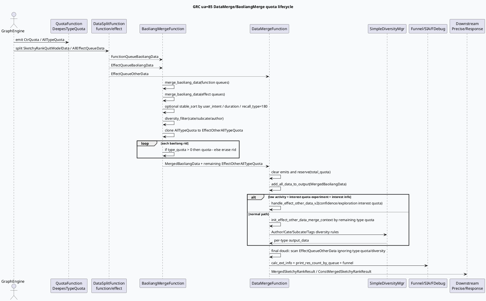

# 2026-06-26 周度代码理解：GRC DataMerge/BaoliangMerge 召回配额与保量合流

> 本文面向排查 GRC ua=85 视频沉浸式链路中“粗排有量但精排前截断异常”“保量资源挤占效果队列”“某类型 quota 未按预期扣减”“低活用户兴趣保量失效”等问题。  
> 本次未使用 KU 正文检索补充；如需历史策略背景，需人工补充保量策略、DeepES quota 和 MultiStreamEngine 内部设计文档。

## 1. 架构全景图：从召回结果到精排前 1400 截断

<style>.arch-wrap{font-family:-apple-system,BlinkMacSystemFont,"Segoe UI",sans-serif;background:#f8fafc;border:1px solid #d9e2ec;border-radius:18px;padding:18px;margin:16px 0;color:#243b53}.arch-title{font-size:22px;font-weight:800;margin-bottom:12px;color:#102a43}.arch-grid{display:grid;grid-template-columns:1fr 1.1fr 1fr;gap:12px}.arch-layer{background:#fff;border:1px solid #e3e8ef;border-radius:14px;padding:12px;box-shadow:0 6px 18px rgba(16,42,67,.06)}.arch-layer h3{font-size:15px;margin:0 0 10px;color:#334e68}.arch-box{border-radius:10px;padding:9px 10px;margin:8px 0;background:#edf7ff;border-left:4px solid #3d5a80;font-size:13px;line-height:1.45}.arch-box.green{background:#edfdf5;border-left-color:#2d6a4f}.arch-box.orange{background:#fff7ed;border-left-color:#c2410c}.arch-box.gray{background:#f1f5f9;border-left-color:#64748b}.arch-arrow{text-align:center;font-weight:800;color:#627d98;margin:6px 0}.arch-note{font-size:12px;color:#52606d;margin-top:10px}.arch-badge{display:inline-block;background:#dbeafe;color:#1e3a8a;border-radius:999px;padding:2px 8px;font-size:11px;font-weight:700;margin-left:6px}</style><div class="arch-wrap"><div class="arch-title">GRC DataMerge/BaoliangMerge 合流骨架 <span class="arch-badge">ua=85 video_immersion</span></div><div class="arch-grid"><div class="arch-layer"><h3>上游：召回与分流</h3><div class="arch-box">video_immersion_graph.conf include strategy_graph / diversity / grg_response</div><div class="arch-box">QuotaFunction → CtrQuota；DeepesTypeQuotaFunction → AllTypeQuota</div><div class="arch-box orange">DataSplitFunction 双实例：FunctionBaoliangData + EffectQueueBaoliangData + EffectQueueOtherData</div></div><div class="arch-layer"><h3>核心合流：保量先占位</h3><div class="arch-box orange">BaoliangMergeFunction：function 保量 + effect 保量合并，nid_set 去重</div><div class="arch-arrow">↓</div><div class="arch-box orange">对保量数据 rerank / diversity_filter，再按 AllTypeQuota 扣减剩余额度</div><div class="arch-arrow">↓</div><div class="arch-box green">DataMergeFunction：先写入保量，再按剩余 quota 合并非保量效果队列</div></div><div class="arch-layer"><h3>输出：进入精排/回包</h3><div class="arch-box green">MergedSketchyRankResult：精排前候选结果</div><div class="arch-box gray">ConstMergedSketchyRankResult：用于日志、ext info、funnel 统计</div><div class="arch-box">MergedSketchyRankExtInfo：DeepES label / cupai score avg / group_rid_list</div><div class="arch-box gray">ResponseForGrg 依赖 effect/function/slot 等结果完成下游回包</div></div></div><div class="arch-note">关键心智：保量不是最后附加，而是在 DataMerge 开始阶段优先占据总 quota；非保量只消费 BaoliangMerge 扣减后的 EffectOtherAllTypeQuota。</div></div>

## 2. 主题选择与范围

本周选择 **GRC video_launch DataMerge/BaoliangMerge：召回 quota 与保量/非保量合流**。原因：上周已覆盖 PipelineGraphFunction 批消费框架，本周继续沿 GRC 热路径向后追踪，进入粗排后、精排前的候选裁剪阶段。这个阶段决定了哪些队列能进入精排，常见问题不是“召回没回来”，而是：

1. 保量资源优先写入后占满总 quota；
2. BaoliangMerge 先扣减类型 quota，导致 EffectQueueOtherData 看似有量但无法进入结果；
3. DataMerge 的最终兜底会突破类型 quota / 多样性约束，但仍受 `_total_quota` 和 `is_insert_sketchy_rank` 控制；
4. 低活用户兴趣 quota 分支 `handle_effect_other_data_v2()` 只在实验、用户类型、兴趣信息三者同时满足时启用。

重点阅读范围：

- 服务入口：`src/main.cpp:73-128`，GRC brpc service 注册、global initializer、Dapper collector 启动。
- 图入口：`conf/plugins/graph/video_immersion_graph/video_immersion_graph.conf:42-58`，include `strategy_graph.conf`、`diversity.conf`、`grg_response.conf`。
- 策略图：`conf/plugins/graph/video_launch/strategy_graph.conf:329-488`，BaoliangFunction / BaoliangMergeFunction / DataMergeFunction 依赖与产出。
- 保量合并：`src/processor/video_launch/baoliang_merge.cpp:16-169`、`src/processor/video_launch/baoliang_merge.cpp:173-354`。
- 数据合流：`src/processor/video_launch/data_merge.cpp:48-79`、`src/processor/video_launch/data_merge.cpp:153-178`、`src/processor/video_launch/data_merge.cpp:447-604`、`src/processor/video_launch/data_merge.cpp:606-665`、`src/processor/video_launch/data_merge.cpp:983-1007`。
- 下游多样性/回包参照：`src/processor/video_launch/diversity_merge.cpp:73-123`、`src/processor/video_launch/diversity_merge.cpp:280-348`、`conf/plugins/graph/video_launch/grg_response.conf:1-34`。

## 3. 核心流程图：保量、非保量与 quota 的生命周期



## 4. 配置结构信息图：哪些依赖真正影响合流结果

```infographic
infographic list-grid-badge-card
data
  title DataMerge 合流关键依赖
  desc 从配置依赖到运行时变量的最小排查模型
  items
    - label CtrQuota
      desc 总候选 quota；DataMerge reserve(total_quota)，所有插入都受总量上限保护
      icon mdi/counter
    - label AllTypeQuota
      desc DeepES 或策略计算出的类型 quota；BaoliangMerge 先复制并扣减，剩余给非保量
      icon mdi/chart-donut
    - label FunctionQueueBaoliangData
      desc 功能队列保量输入；BaoliangMerge 用 func_nid_set 标记，后续可统计功能队列保量占用
      icon mdi/source-branch
    - label EffectQueueBaoliangData
      desc 效果队列保量输入；与功能保量共享 nid_set 去重
      icon mdi/playlist-check
    - label EffectQueueOtherData
      desc 非保量效果队列；DataMerge 正常路径按剩余类型 quota + diversity 选入，最后兜底再扫一遍
      icon mdi/playlist-plus
    - label diversity_dependency
      desc strategy_graph option 传入 sid/subcate/author 依赖，DataMerge bind 到 SimpleDiversityContext
      icon mdi/vector-link
```

## 5. 保量合并拆解：BaoliangMerge 不是简单 concat

`BaoliangMergeFunction` 的职责有四层：

1. **合并与去重**：先合并功能队列保量，再合并效果队列保量；`merge_baoliang_data()` 使用 `nid_set` 去重，功能队列额外写入 `func_nid_set`。
2. **可选重排**：ua=85 命中 `bl_data_rerank` 时，可能按用户意图、CP 时长或默认 duration 进行 `stable_sort`；命中 `new_searchc_cp_new_baoliang` 时，`type_vec` 包含 180 的资源前置。
3. **保量内部多样性过滤**：`diversity_filter()` 统计 cate/subcate/author 比例，并在 `bl_jf_exp` 等实验下删除过度集中的资源；`type_vec` 包含 3249 的资源跳过该过滤。
4. **扣减非保量 quota**：把 `AllTypeQuota` 复制为 `EffectOtherAllTypeQuota`，遍历保量结果；命中类型且 quota > 0 时扣减，否则从保量结果中删除该资源。

这解释了两个常见现象：

- “保量输入有资源但最终没进结果”可能发生在 BaoliangMerge 的内部多样性或类型 quota 扣减阶段；
- “非保量效果队列有资源但进不去”可能是因为保量已经消耗了该类型 quota，而非 DataMerge 读不到数据。

## 6. DataMerge 合流拆解：三段式写入 + 两类兜底

`DataMergeFunction::process()` 的固定顺序是：

1. emit 并清空 `_merged_data_result` / `_const_merged_data_result` / `_merged_data_ext_info`；
2. `merge_data()` 生成大小不超过 `_total_quota` 的结果；
3. 复制一份 const 结果用于 `calc_ext_info()` 和日志；
4. 打印 funnel、队列返回数和 fdebug 结果。

`merge_data()` 里真正影响结果的顺序是：

- **第一段：保量优先写入**  
  `add_all_data_to_output(*_merged_baoliang_data, merged_data_result)`，写入后每个 rid 设置 `is_insert_sketchy_rank=true`。这是后续去重的核心状态位。

- **第二段：非保量按策略合流**  
  如果低活用户 + 兴趣 quota 实验 + 兴趣信息齐备，走 `handle_effect_other_data_v2()`：置信兴趣与探索兴趣分别按总 quota 比例、单兴趣 quota 加入。否则走普通路径：按 `EffectOtherAllTypeQuota` 构建 `EffectOtherDataMergeContext`，每类资源初始化 Author/Cate/Subcate/Tags 多样性规则，选出 `output_data`。

- **第三段：最终兜底**  
  `add_all_data_to_output(*_effect_other_data, merged_data_result)` 会再次扫描全部非保量效果队列。注释明确说明：这里不再考虑各类别 quota 和多样性限制，但仍受 `_total_quota` 与 `is_insert_sketchy_rank` 控制。

因此，排查 DataMerge 时要同时看 `baoliang_count`、`merge_effect_other_count`、`final_doudi_count` 三个阶段，而不是只看最终 size。

## 7. 普通合流 vs 低活兴趣合流对照

| 维度 | 普通路径 `handle_effect_other_data` | 低活兴趣路径 `handle_effect_other_data_v2` | 排查含义 |
|---|---|---|---|
| 触发条件 | 默认 | `get_is_low_activity_user()` + `is_hit_interest_quota` + `VideoInterestInfo` 非空 | 兴趣保量没生效先查三个门控 |
| 候选组织 | 按 TypeQuota 拆成多个 `EffectOtherDataMergeContext` | 按 `new_sub_cate_v2/new_sub_cate` 建兴趣候选 map | 前者看类型 quota，后者看兴趣名是否能对上类目 |
| quota 来源 | BaoliangMerge 扣减后的 `EffectOtherAllTypeQuota` | 置信/探索总比例与单兴趣 quota 参数 | 兴趣路径可能绕开传统类型上下文 |
| 多样性 | SimpleDiversityMgr：Author/Cate/Subcate/Tags | 当前代码主要按兴趣 quota + rid 去重 | 多样性问题先判断走了哪个分支 |
| 兜底 | 类型内 doudi + 最终全量 doudi | 兴趣路径结束后仍有最终全量 doudi | 最终结果里可能混入非兴趣资源 |

## 8. 数据流结构图：strategy_graph 中的关键节点

```infographic
infographic sequence-timeline-rounded-rect-node
data
  title strategy_graph 合流节点链路
  desc 只列与 DataMerge/BaoliangMerge 直接相关的配置节点
  items
    - time 1
      label QuotaFunction
      desc 产出 CtrQuota，作为总截断上限
      icon mdi/numeric
    - time 2
      label DataSplitFunction x2
      desc FunctionBaoliangData / EffectQueueBaoliangData / EffectQueueOtherData 三类输入
      icon mdi/call-split
    - time 3
      label DeepesTypeQuotaFunction
      desc 产出 AllTypeQuota、PcsQuota400/800
      icon mdi/chart-areaspline
    - time 4
      label BaoliangMergeFunction
      desc 合并保量、重排、内部多样性、扣减剩余类型 quota
      icon mdi/merge
    - time 5
      label DataMergeFunction
      desc 保量优先写入，非保量按 quota/diversity 合流，最后兜底
      icon mdi/source-commit-end
```

## 9. Pitfalls 卡片

<style>.card-frame{font-family:-apple-system,BlinkMacSystemFont,"Segoe UI",sans-serif;margin:18px 0}.pit-card{background:#fffaf0;border:1px solid #f3d19e;border-radius:18px;padding:20px;box-shadow:0 8px 24px rgba(120,53,15,.08);color:#3f2d20}.pit-meta{font-size:12px;font-weight:800;letter-spacing:.08em;color:#9a3412;text-transform:uppercase}.pit-title{font-size:28px;font-weight:900;letter-spacing:-.02em;margin:6px 0 12px}.pit-grid{display:grid;grid-template-columns:1.35fr 1fr;gap:14px}.pit-panel{background:#fff;border-top:4px solid #c2410c;border-radius:12px;padding:12px;font-size:14px;line-height:1.65}.pit-panel strong{color:#7c2d12}.pit-end{font-weight:900;color:#9a3412;margin-top:10px}</style><div class="card-frame"><div class="pit-card"><div class="pit-meta">debug pitfalls</div><div class="pit-title">不要把 DataMerge 当成“保量 + 非保量直接拼接”</div><div class="pit-grid"><div class="pit-panel"><strong>quota 扣减陷阱：</strong>非保量拿到的是 BaoliangMerge 扣完后的 EffectOtherAllTypeQuota，不是原始 AllTypeQuota。保量过多时，某类型非保量可能天然没有额度。</div><div class="pit-panel"><strong>状态位陷阱：</strong>add_data_to_output 会写 <code>is_insert_sketchy_rank=true</code>。如果同一 RidTmpInfoPtr 被多路引用，后续兜底会因为状态位跳过。</div><div class="pit-panel"><strong>最终兜底陷阱：</strong>最终 doudi 不看类型 quota / diversity，但仍看 total_quota 与 is_insert_sketchy_rank。结果“看似突破 quota”可能是预期兜底。</div><div class="pit-panel"><strong>兴趣分支陷阱：</strong>低活兴趣保量需要低活识别、实验参数、VideoInterestInfo 三者同时满足；兴趣名还要能匹配资源 sub_cate。</div></div><div class="pit-end">∎ 先看 baoliang_count / merge_effect_other_count / final_doudi_count，再追具体队列</div></div></div>

## 10. 调试 checklist

```infographic
infographic list-column-done-list
data
  title DataMerge/BaoliangMerge 排查清单
  desc 适用于保量挤占、类型 quota 异常、精排前候选量不足、低活兴趣保量无效
  items
    - label 确认图入口
      desc ua=85 是否走 video_immersion_graph，并 include video_launch/strategy_graph.conf
      done true
    - label 打印 CtrQuota 与 AllTypeQuota
      desc 对齐总 quota、各类型 quota 以及 BaoliangMerge 扣减前后差异
      done true
    - label 检查保量输入
      desc FunctionQueueBaoliangData 与 EffectQueueBaoliangData 是否为空，是否被 nid_set 去重
      done true
    - label 检查保量内部过滤
      desc bl_data_rerank、new_searchc_cp_new_baoliang、bl_jf_exp、type_vec 180/3249 都可能改变保量顺序或保留
      done false
    - label 对齐非保量分支
      desc 是否命中低活兴趣路径；否则查看 EffectOtherDataMergeContext 的 type_name/quota/candidate_data
      done true
    - label 验证 diversity_dependency
      desc DataMerge option 中 sid/subcate/author 依赖是否绑定到 SimpleDiversityContext
      done true
    - label 观察三阶段计数
      desc baoliang_count、merge_effect_other_count、final_doudi_count 共同解释最终结果
      done true
    - label 查下游消费
      desc MergedSketchyRankResult 是否继续进入精排、ResponseForGrg 是否消费 function/effect/slot 结果
      done false
```

## 11. 证据索引

### 服务与图入口

- `src/main.cpp:73-128`：GRC main 注册 `GenericGRCService`，初始化全局资源、ExpManager、Dapper collector，并启动 brpc server。
- `conf/plugins/graph/video_immersion_graph/video_immersion_graph.conf:42-58`：ua=85 主图 include `strategy_graph.conf`、`diversity.conf`、`grg_response.conf`。

### 配置链路

- `conf/plugins/graph/video_launch/strategy_graph.conf:183-270`：旧版 `DataMergeForVfsFunction` 产出 `DataMergeResult` / `SketchyRankExtInfo`。
- `conf/plugins/graph/video_launch/strategy_graph.conf:329-371`：`BaoliangFunction` 依赖保量输入并产出 `MergedBaoliangData` / `EffectOtherAllTypeQuota`。
- `conf/plugins/graph/video_launch/strategy_graph.conf:373-428`：旧版 `BaoliangMergeFunction` 配置，注释说明“合并保量、重排和多样性过滤”。
- `conf/plugins/graph/video_launch/strategy_graph.conf:429-488`：新版 `DataMergeFunction` 配置，说明“合并保量数据和非保量数据，完成粗排 4500→精排 1400 的截断”。
- `conf/plugins/graph/video_launch/grg_response.conf:1-34`：回包节点依赖 loads/function/effect 等队列结果。

### 代码实现

- `src/processor/video_launch/baoliang_merge.cpp:16-169`：BaoliangMerge 主流程：合并保量、重排、多样性过滤、扣减剩余 quota。
- `src/processor/video_launch/baoliang_merge.cpp:173-196`：`merge_baoliang_data()` 用 `nid_set` 去重，并记录功能队列保量 nid。
- `src/processor/video_launch/baoliang_merge.cpp:198-354`：保量内部 cate/subcate/author 多样性过滤逻辑。
- `src/processor/video_launch/data_merge.cpp:48-76`：DataMerge process 生命周期：emit、merge、复制 const 结果、统计日志。
- `src/processor/video_launch/data_merge.cpp:153-178`：保量优先写入、非保量合流、最终兜底三段式主干。
- `src/processor/video_launch/data_merge.cpp:181-206`：`add_all_data_to_output()` / `add_data_to_output()` 的 `_total_quota` 上限与 `is_insert_sketchy_rank` 状态位。
- `src/processor/video_launch/data_merge.cpp:447-604`：低活用户兴趣 quota 分支，置信兴趣和探索兴趣分别分配 quota。
- `src/processor/video_launch/data_merge.cpp:606-665`：普通路径初始化类型 merge context 和 SimpleDiversityMgr 规则。
- `src/processor/video_launch/data_merge.cpp:667-733`：`calc_ext_info()` 生成 DeepES label、粗排平均融合分与 group_rid_list。
- `src/processor/video_launch/data_merge.cpp:983-1007`：GraphFunction 依赖/产出声明与函数注册。
- `src/processor/video_launch/diversity_merge.cpp:73-123`：DiversityMerge 准备 MultiStreamEngine context、sid/ua/trace。
- `src/processor/video_launch/diversity_merge.cpp:280-348`：DiversityEngine run 后生成结果，并把 effect 队列未命中资源 append。

## 12. 结论

DataMerge/BaoliangMerge 的核心不是“把多路召回结果合起来”，而是把 **总 quota、类型 quota、保量优先级、多样性约束、低活兴趣补偿、最终兜底** 串成一个有状态的候选裁剪器。排查这类问题时，先不要追单个队列为什么没进结果，而要按顺序确认：保量输入多少、扣掉了多少类型 quota、非保量走普通还是兴趣分支、最终兜底补了多少、`is_insert_sketchy_rank` 是否提前被置位。只要这五个点对齐，绝大多数“召回有量但精排前不见了”的问题都能快速定位。

---

## 七、业务代码库适配分析
> **分析时间**：2026-07-20T19:30:29.633212
> **目标代码库**：feeda-mv-grg（序列生成）、feeda-mv-grc（召回汇聚）

## 业务代码库适配分析

### 1. 分析摘要

- 从扫描结果看，目标高性能库/容器在两个业务代码库中**已有少量落地**，但整体覆盖率仍然较低。`feeda-mv-grg` 仅发现 1 个目标库使用文件，`feeda-mv-grc` 发现 9 个目标库使用文件；相比之下，两边仍大量使用 `std::vector`、`std::string`、`std::unordered_map` 等标准库容器，说明迁移空间较大。

- 结合本次技术笔记关注的 **GRC DataMerge/BaoliangMerge 召回配额与保量合流链路**，优先适配价值集中在 `feeda-mv-grc` 的热路径：`baoliang_merge.cpp`、`data_merge.cpp`、`diversity_merge.cpp` 等文件中存在大量候选集遍历、去重、quota 扣减、类型聚合和多样性过滤逻辑。这些场景通常对哈希表查找、vector 扩容、字符串 key 构造较敏感，具备较高的性能优化潜力。`feeda-mv-grg` 当前更多体现为序列生成和多样性规则侧的适配，可作为较低风险的增量试点。

---

### 2. 代码库详情

#### feeda-mv-grg

- **目标库使用现状**
  - 已发现目标库使用：1 个文件
    - `strategy/diversity/rule/low_clarity_diversity_rule.cpp`
  - 该文件可以作为后续在 GRG 侧引入目标库的参考样例，重点关注：
    - include 方式；
    - 命名空间使用方式；
    - 编译依赖是否已在 BUILD/CMake 中接入；
    - 与现有业务结构体、规则框架的兼容方式。

- **std 等价物使用规模**
  - `std::vector`：1969 次，分布在 356 个文件
  - `std::string`：2443 次，分布在 425 个文件
  - `std::unordered_map`：734 次，分布在 205 个文件

- **典型代码场景**
  - `model/model.h`
    ```cpp
    virtual int predict(std::vector<RidTmpInfoPtr>& candidate_vec, uint32_t pos) = 0;
    ```
    - 这是模型接口层，`std::vector<RidTmpInfoPtr>&` 已经成为跨模块 ABI/API 的一部分，不建议直接替换接口类型。
    - 如果要优化，应优先在函数内部减少临时容器、减少重复遍历，而不是改动接口签名。

  - `model/paddle_model.h`
    ```cpp
    int predict_with_tensor_input(std::vector<RidTmpInfoPtr>& candidate_vec,
                general_predict::PredictSample* predict_sample = nullptr,
                bool is_from_cube = true) const {
        return predict<ModelDependInput>(candidate_vec, predict_sample, is_from_cube);
    }
    ```
    - 该类代码位于模型预测链路，通常对延迟敏感。
    - 适合评估候选集预分配、批量访问连续内存、避免中间 `std::string` key 构造等优化，而不是贸然替换公共接口容器。

- **整体判断**
  - GRG 侧目标库使用较少，但 `std::vector` / `std::string` / `std::unordered_map` 规模不小。
  - 建议先从规则类、局部临时容器、非接口层内部数据结构开始试点，避免影响模型接口和序列生成主流程稳定性。

---

#### feeda-mv-grc

- **目标库使用现状**
  - 已发现目标库使用：9 个文件，包括：
    - `processor/multi_factor/ltr_factor_gen_scene.cpp`
    - `processor/new_adjust/precise_score_init_first_refresh.cpp`
    - `operator/adjuster/sketchy/ltv_factor_cp_opt.cpp`
    - `processor/new_adjust/precise_score_init.cpp`
    - `processor/multi_factor/session_ltr_dibar_factor_gen.cpp`
  - 这些文件已经可以作为 GRC 侧引入目标库的参考：
    - 因子生成；
    - 精排/粗排分数初始化；
    - sketchy adjuster；
    - 多因子处理链路。

- **std 等价物使用规模**
  - `std::vector`：8442 次，分布在 1279 个文件
  - `std::string`：7170 次，分布在 1234 个文件
  - `std::unordered_map`：2834 次，分布在 639 个文件

- **典型代码场景**
  - `service/grc_http_service.cpp`
    ```cpp
    std::unordered_map<std::string, std::vector<int>> depend_map;
    auto &all_vertex = graph_engine->get_vertexs_message(graph_name);
    for (int i = 0; i < all_vertex.size(); ++i) {
        for (auto &depend : all_vertex[i].depends) {
    ```
    - 这是图依赖展示/HTTP 服务相关代码，不属于 DataMerge 热路径。
    - 可作为低风险容器替换试验点，但对线上主链路性能收益有限。

  - `service/grc_http_service.cpp`
    ```cpp
    static std::vector<std::string> colors{"#FFB6C1", "#DC143C", ...};
    ```
    - 静态只读字符串数组更适合改为 `std::array<std::string_view, N>` 或目标库中的轻量字符串视图类型。
    - 该优化主要减少静态初始化和字符串对象开销，但不是核心瓶颈。

  - 本次笔记重点涉及的文件：
    - `src/processor/video_launch/baoliang_merge.cpp`
    - `src/processor/video_launch/data_merge.cpp`
    - `src/processor/video_launch/diversity_merge.cpp`
  - 这些文件处于召回汇聚、quota 扣减、保量合流和精排前截断的关键路径，适合优先评估容器和内存分配优化。

- **整体判断**
  - GRC 侧目标库已有一定使用经验，且 `std` 容器使用规模远大于 GRG。
  - 由于 GRC 的 DataMerge/BaoliangMerge 是高频请求热路径，迁移收益可能更明显，但也需要更严格的灰度、指标和回滚机制。

---

### 3. 💡 适用性评估与建议

- **建议一：优先优化 `src/processor/video_launch/baoliang_merge.cpp` 中的去重集合**
  - 适用场景：
    - `BaoliangMergeFunction::merge_baoliang_data()` 中使用 `nid_set` 做保量资源去重；
    - 功能队列还会额外写入 `func_nid_set`；
    - 后续还会遍历保量结果，按照 `AllTypeQuota` 扣减 `EffectOtherAllTypeQuota`。
  - 优化建议：
    - 如果当前使用的是 `std::unordered_set` / `std::unordered_map`，可评估替换为目标库中的 flat hash set / flat hash map 类容器；
    - 对 `nid_set`、`func_nid_set` 这类只存储 rid/nid 的集合，flat hash 结构通常能减少节点分配和 cache miss；
    - 在合并前根据保量输入规模调用 `reserve()`，避免 rehash。
  - 预期收益：
    - 降低保量合并阶段的哈希查找成本；
    - 减少多队列合并时的内存分配；
    - 对“保量资源很多但最终进入精排前数量有限”的请求尤其有价值。
  - 参考代码：
    - GRC 侧已有目标库使用可参考：
      - `processor/multi_factor/ltr_factor_gen_scene.cpp`
      - `processor/new_adjust/precise_score_init.cpp`
      - `operator/adjuster/sketchy/ltv_factor_cp_opt.cpp`

- **建议二：优化 `src/processor/video_launch/data_merge.cpp` 中 EffectOtherData 合流上下文**
  - 适用场景：
    - `DataMergeFunction::merge_data()` 先写入 `MergedBaoliangData`；
    - 再根据 `EffectOtherAllTypeQuota` 构建普通合流上下文；
    - 最后通过兜底逻辑再次扫描 `EffectQueueOtherData`。
  - 优化建议：
    - 对类型 quota 上下文、rid 去重状态、type 到候选列表的映射，优先评估替换局部 `std::unordered_map` 为目标库 hash map；
    - 对短生命周期的临时 `std::vector<RidTmpInfoPtr>`，保留 `std::vector` 也可以，但必须系统性补充 `reserve(_total_quota)` 或按 type quota 预估容量；
    - 对最终输出 `merged_data_result`，当前逻辑中已经有 `reserve(total_quota)` 的思路，应继续保持，不建议替换公共输出类型。
  - 预期收益：
    - 减少 DataMerge 中多轮扫描与聚合产生的临时分配；
    - 降低普通合流路径下 type 维度 map 查找成本；
    - 对 `EffectQueueOtherData` 较大、保量先占位后剩余额度较少的 case 更明显。
  - 注意：
    - `add_all_data_to_output()` 会修改 `RidTmpInfoPtr` 内部状态，例如 `is_insert_sketchy_rank=true`。
    - 不要因为替换容器改变对象生命周期或指针稳定性。

- **建议三：针对 `src/processor/video_launch/data_merge.cpp` 的低活兴趣路径做局部容器试点**
  - 适用场景：
    - `handle_effect_other_data_v2()` 用于低活用户兴趣 quota；
    - 触发条件包括：
      - `get_is_low_activity_user()`；
      - `is_hit_interest_quota`；
      - `VideoInterestInfo` 非空；
    - 逻辑中会按 `new_sub_cate_v2/new_sub_cate` 构建兴趣候选 map。
  - 优化建议：
    - 对兴趣名到候选列表的映射，若当前使用 `std::unordered_map<std::string, std::vector<...>>`，可评估：
      - key 改为轻量字符串视图或 intern 后的 id；
      - map 替换为目标库 flat hash map；
      - 候选 vector 按单兴趣 quota 做 `reserve()`。
    - 如果兴趣名来自稳定枚举或类目 id，优先改为整数 key，收益通常比单纯替换 hash map 更高。
  - 预期收益：
    - 降低字符串 hash 与字符串拷贝开销；
    - 改善低活兴趣保量请求中的尾延迟；
    - 便于排查“兴趣保量没生效但候选存在”的问题。

- **建议四：在 `src/processor/video_launch/diversity_merge.cpp` 和 Baoliang 内部 diversity 逻辑中优化计数结构**
  - 适用场景：
    - `BaoliangMergeFunction::diversity_filter()` 会统计 cate/subcate/author 占比；
    - `diversity_merge.cpp` 中也会围绕 author、cate、subcate、tags 做多样性约束；
    - 这些字段通常是整数 id 或短字符串，适合使用更紧凑的哈希结构。
  - 优化建议：
    - 对 `author_id -> count`、`cate_id -> count`、`subcate_id -> count` 这类计数表，优先替换为目标库 flat hash map；
    - 如果 id 范围较小且稠密，可进一步评估使用 `std::vector<int>` 或 bitmap/count array，避免 hash；
    - 对 tags 这类多值字段，先统计实际基数，再决定是否替换容器。
  - 预期收益：
    - 降低多样性过滤阶段的频繁哈希访问；
    - 对保量资源较多、`bl_jf_exp` 等实验开启时的请求收益更明显。

- **建议五：`service/grc_http_service.cpp` 可作为低风险改造样例，但不应作为性能收益主战场**
  - 适用场景：
    - `depend_map`：
      ```cpp
      std::unordered_map<std::string, std::vector<int>> depend_map;
      ```
    - 静态颜色列表：
      ```cpp
      static std::vector<std::string> colors{...};
      ```
  - 优化建议：
    - `depend_map` 可尝试替换为目标库 hash map，验证编译依赖、include 方式和基础兼容性；
    - `colors` 建议改为：
      ```cpp
      static constexpr std::array<std::string_view, N> colors = {...};
      ```
      或等价的轻量只读结构。
  - 预期收益：
    - 主要用于降低迁移风险、积累代码规范；
    - 对线上 DataMerge 主链路延迟帮助有限，不建议投入过多性能调优资源。

---

### 4. ⚠️ 引入风险与限制

- **风险一：不要直接替换跨模块接口中的 `std::vector` / `std::string`**
  - 例如 `feeda-mv-grg` 中：
    - `model/model.h`
    - `model/paddle_model.h`
  - 这些文件中的 `std::vector<RidTmpInfoPtr>& candidate_vec` 是模型接口的一部分。
  - 直接替换为目标库容器可能导致：
    - 大量调用方同步修改；
    - ABI/API 不兼容；
    - 模型模板实例化膨胀；
    - 编译耗时和二进制体积上升。
  - 建议：
    - 公共接口保持 `std` 类型；
    - 仅在函数内部或局部临时结构中使用目标库。

- **风险二：哈希容器替换可能改变遍历顺序，影响召回合流结果**
  - DataMerge/BaoliangMerge 逻辑中，候选顺序具有业务含义：
    - 保量优先写入；
    - `stable_sort` 后的顺序；
    - diversity filter 后的保留顺序；
    - final doudi 的扫描顺序。
  - 如果将 `std::unordered_map` / `std::unordered_set` 替换为其他 hash 容器，遍历顺序可能变化。
  - 对于只做 membership check 的 `nid_set` 风险较低；
  - 对于会遍历 map 并输出结果的结构，必须增加 diff 测试。

- **风险三：注意 `RidTmpInfoPtr` 的共享状态与对象生命周期**
  - `DataMergeFunction::add_all_data_to_output()` 会设置：
    - `is_insert_sketchy_rank=true`
  - 同一个 `RidTmpInfoPtr` 可能被多路队列共享引用。
  - 替换容器时需要确认：
    - 不改变指针指向对象的生命周期；
    - 不引入对象拷贝导致状态位失效；
    - 不因 vector reallocation 影响外部保存的引用或迭代器。
  - 建议优先存储 `RidTmpInfoPtr`，避免存储裸引用或指向 vector 内部元素的指针。

- **风险四：性能收益需要用链路指标验证，不能只看容器微基准**
  - 对 GRC DataMerge/BaoliangMerge，应至少观察：
    - `baoliang_count`
    - `merge_effect_other_count`
    - `final_doudi_count`
    - `_total_quota`
    - `EffectOtherAllTypeQuota` 扣减前后差异
    - DataMerge/BaoliangMerge 单阶段耗时
    - 请求 P99/P999 延迟
  - 某些请求中最终瓶颈可能在上游召回、DeepES quota、精排或下游 response，而不是容器本身。
  - 建议按文件和场景逐步灰度：
    - 先 `service/grc_http_service.cpp` 验证依赖；
    - 再 `diversity_merge.cpp` / `baoliang_merge.cpp` 局部替换；
    - 最后评估 `data_merge.cpp` 主合流路径。

---
*本章节由 Hermes Agent 自动分析生成，基于代码库静态扫描结果。*
