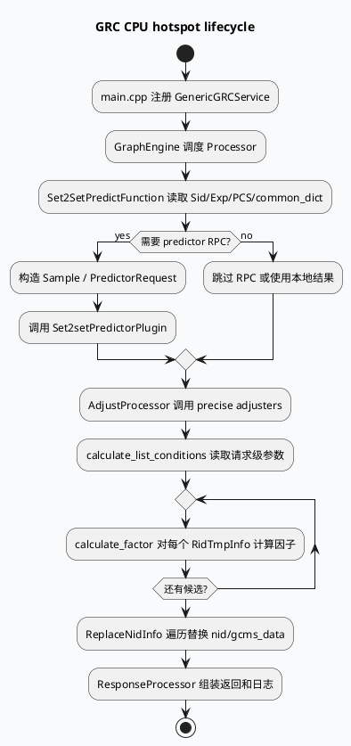

# 2026-07-07 周度代码理解：GRC 成本/CPU 性能优化热点复盘

> 本文面向排查 feeda-mv-grc 中调权/过滤热点、Set2Set/PCS 链路、序列化与响应组装导致的 CPU 上涨问题。  
> 今日 daily-plan 记录的内网周报仅有摘要，未读取 KU 正文；本文以本地代码检索结果为主，业务收益与实验背景需人工补充。

## 1. 架构全景图：GRC CPU 热点从哪里聚合

<style>.arch-wrap{font-family:-apple-system,BlinkMacSystemFont,"Segoe UI",sans-serif;background:#f8fafc;border:1px solid #d9e2ec;border-radius:16px;padding:18px;margin:16px 0;color:#243b53}.arch-title{font-size:22px;font-weight:800;margin-bottom:12px;color:#102a43}.arch-grid{display:grid;grid-template-columns:1fr 1.15fr 1fr;gap:12px}.arch-layer{background:#fff;border:1px solid #d9e2ec;border-radius:12px;padding:12px}.arch-layer h4{margin:0 0 10px;font-size:14px;color:#334e68}.arch-box{border-radius:10px;padding:10px;margin:8px 0;background:#eef4fb;border-left:4px solid #3d5a80;font-size:13px;line-height:1.45}.arch-box.hot{background:#fff4e6;border-left-color:#c05621}.arch-box.ok{background:#ecfdf5;border-left-color:#2d6a4f}.arch-note{font-size:12px;color:#627d98;margin-top:10px}.arch-mid{font-weight:800;text-align:center;color:#486581;margin:10px 0}</style><div class="arch-wrap"><div class="arch-title">GRC 成本优化热点地图</div><div class="arch-grid"><div class="arch-layer"><h4>输入与特征</h4><div class="arch-box">CommonInfo / SidInfo / ExpManager 决定场景与实验参数</div><div class="arch-box hot">PCS ResultMap 与 common_dict 参数读取形成 per-request 热点</div><div class="arch-box">Set2Set 请求拼装引入用户、序列、推荐特征</div></div><div class="arch-layer"><h4>策略计算热区</h4><div class="arch-box hot">调权算子：calculate_list_conditions 先取依赖，再在 calculate_factor 中逐 item 计算</div><div class="arch-box hot">过滤/替换：ReplaceNidInfo 遍历候选并维护 replace_map / replaceed_nid_set</div><div class="arch-box ok">优化方向：请求级缓存参数、候选级早停、减少日志字符串拼接</div></div><div class="arch-layer"><h4>输出与观测</h4><div class="arch-box">SIA / Dapper / GRC_FLOW_LOG 负责定位耗时</div><div class="arch-box hot">TRACE/NOTICE 字符串拼接与 pb2json 可能在高 QPS 下放大成本</div><div class="arch-box">response processor 聚合大量 GraphDependency</div></div></div><div class="arch-mid">CPU 优化 = 参数读取前移 + per-item 计算瘦身 + 日志采样 + 序列化裁剪</div><div class="arch-note">重点关注“请求级只需算一次”的逻辑是否被放进 item 循环，以及日志/字典/实验参数是否跟候选数线性增长。</div></div>

## 2. 核心流程图：一次 GRC 请求中的成本放大点



## 3. 配置/结构信息图：热点治理分层

```infographic
infographic list-grid-badge-card
data
  title GRC CPU 热点治理旋钮
  desc 按请求级、候选级、输出级分层治理
  items
    - label 请求级参数
      desc SidInfo、ExpManager、common_dict、PCS ResultMap 应尽量在 list_conditions 阶段读取一次
      icon mdi/tune-variant
    - label 候选级计算
      desc calculate_factor 中只保留和 item 强相关的字段访问与数学计算
      icon mdi/vector-point
    - label 日志采样
      desc TRACE/NOTICE 拼接字符串、pb2json、长向量打印需按 logid 或采样门控
      icon mdi/text-box-search
    - label 容器复用
      desc replace_map、vector、unordered_set 需要 reserve/clear，避免候选数放大 rehash
      icon mdi/database-sync
    - label RPC/序列化
      desc Set2Set request/response、response extmsg 是跨层 CPU 成本边界
      icon mdi/protocol
    - label 观测闭环
      desc SIA、DapperDirectCollect、FDebug 需区分构造、RPC、后处理耗时
      icon mdi/chart-timeline-variant
theme
  palette #3d5a80 #2d6a4f #c05621
```

## 4. 代码观察

### 4.1 Set2Set/PCS 是复合型热点

`set2set_predict_function.cpp:76-90` 在请求开始处读取多个 sid/实验参数并决定 predictor 版本；`set2set_predict_function.cpp:153-168`、`set2set_predict_function.cpp:713-731` 等处再从 common_dict 和 PCS 结果提取调权参数。这个函数同时覆盖：

- 特征对象构造；
- predictor RPC 路由；
- PCS 字符串解析与数值转换；
- 多组 factor vector 读取；
- SIA/Dapper 观测。

因此性能优化不能只盯 RPC 耗时，要把“构造请求 + 解析参数 + predictor 返回后处理”分段统计。

### 4.2 调权算子要区分请求级与 item 级成本

`microvideo_fancate_downrank_adjuster.cpp:36-79` 在 `calculate_list_conditions()` 中读取 `CommonInfo`、`PcsResultMap` 与实验参数，这是正确方向：请求级参数先算一次。随后 `microvideo_fancate_downrank_adjuster.cpp:121-180` 在每个 item 上读取 cate/subcate、预测分数并计算指数或幂函数。

需要注意的成本点：

- `microvideo_fancate_downrank_adjuster.cpp:80-110` 会拼接并打印 `fancate_ratio_vec` 与 `cocoon_downrank_vec`，虽然 NOTICE 有 logid 采样，但字符串已提前构造；如果 TRACE 级别打开，会放大请求级 CPU。
- `calculate_factor()` 中 `std::exp` / `std::pow` 是候选级成本，只有在门控命中后才应执行。
- fan cate 字典查找若命中率低，可考虑把 `cate-subcate -> ratio_index` 结果缓存到请求上下文或预编码字段。

### 4.3 替换链路的容器与日志成本

`replace_nid_info.cpp:48-58` 将 `_after_vfs_result` 构造成 `replace_map`，随后 `replace_nid_info.cpp:61-124` 遍历 `replace_result_emiter` 并维护 `replaceed_nid_set`。这条链路的性能取决于候选量、替换比例、日志级别和 gcms_data 替换是否发生。

排查“二跳 nid 替换后 CPU 上升”时，不应只看 replace 数量，还要看：

- `_after_vfs_result` 与 `_item_lists` 的大小；
- unordered_map 是否频繁 rehash；
- GRC_FLOW_LOG 是否打印 `gcms_data->to_string()`；
- `gk_udpate` 等实验是否改变 erase 行为并导致 vector 元素移动。

## 5. Pitfalls 卡片

<style>.pit-card{font-family:-apple-system,BlinkMacSystemFont,"Segoe UI",sans-serif;background:#fffaf0;border:1px solid #f6d6ad;border-radius:14px;padding:18px;margin:18px 0;color:#2d3748}.pit-meta{font-size:12px;font-weight:800;color:#9c4221;text-transform:uppercase;letter-spacing:.04em}.pit-title{font-size:24px;font-weight:850;margin:6px 0 10px;color:#1a202c}.pit-grid{display:grid;grid-template-columns:1fr 1fr;gap:12px}.pit-panel{background:#fff;border-left:4px solid #c05621;border-radius:10px;padding:12px;font-size:13px;line-height:1.6}.pit-end{margin-top:10px;font-weight:800;color:#7b341e}</style><div class="pit-card"><div class="pit-meta">debug pitfalls</div><div class="pit-title">不要把“CPU 优化”只理解成删一行慢函数</div><div class="pit-grid"><div class="pit-panel"><b>日志陷阱：</b>即使 NOTICE 有采样，字符串可能已经在采样判断前完成拼接；向量 to_string 和 gcms_data->to_string 尤其要小心。</div><div class="pit-panel"><b>参数陷阱：</b>实验参数、common_dict、PCS 解析应尽量请求级读取；如果被放进 item 循环，候选数一涨 CPU 立即线性放大。</div><div class="pit-panel"><b>容器陷阱：</b>unordered_map/set 在候选量大时 rehash 明显；已知输入规模时先 reserve。</div><div class="pit-panel"><b>数学函数陷阱：</b>exp/pow 属于候选级高成本操作，应在所有廉价门控命中后再执行。</div></div><div class="pit-end">∎ 优化顺序：量化 → 门控 → 缓存 → reserve → 裁日志 → 再改编码格式</div></div>

## 6. 调试 checklist

```infographic
infographic list-column-done-list
data
  title GRC CPU 热点排查清单
  desc 适用于调权、过滤、Set2Set、二跳替换与响应组装
  items
    - label 确认场景与候选量
      desc 记录 ua、sid、队列、输入候选数、最终候选数，避免跨场景对比
      done true
    - label 分段 SIA
      desc 将请求参数读取、RPC、response 解析、per-item 计算拆分埋点
      done false
    - label 检查 list_conditions
      desc 请求级 PCS/common_dict/实验参数是否只读取一次
      done true
    - label 检查 calculate_factor
      desc 是否存在日志拼接、字典访问、exp/pow 等候选级高成本操作
      done false
    - label 检查容器 reserve
      desc replace_map、replaceed_nid_set、输出 vector 是否按输入规模预留
      done false
    - label 检查日志采样位置
      desc 采样判断应包住字符串构造，而不是只包住 LOG(NOTICE)
      done false
    - label 对齐收益口径
      desc CPU 下降需同时验证召回量、策略指标、FDebug 与线上耗时分位
      done false
theme
  palette #3d5a80 #2d6a4f #c05621
```

## 7. 证据来源

- `src/main.cpp:73-128`（GRC 服务启动、插件、实验参数、Dapper collector）
- `src/processor/set2set_predict_function.cpp:76-90`（Set2Set 实验与 predictor 路由）
- `src/processor/set2set_predict_function.cpp:153-168`（common_dict 参数读取）
- `src/processor/set2set_predict_function.cpp:713-731`（PCS 相关 factor 参数读取）
- `src/operator/adjuster/precise/microvideo_fancate_downrank_adjuster.cpp:36-79`（请求级依赖与实验参数读取）
- `src/operator/adjuster/precise/microvideo_fancate_downrank_adjuster.cpp:80-110`（日志字符串构造与采样）
- `src/operator/adjuster/precise/microvideo_fancate_downrank_adjuster.cpp:121-180`（候选级 factor 计算）
- `src/processor/replace_nid_info.cpp:48-58`（replace_map 构造）
- `src/processor/replace_nid_info.cpp:61-124`（候选遍历、替换与日志）
- `notes/weekly-topic-selection/daily-plan-20260529.json:173-181`（今日业务主题与历史摘要）

---

## 七、业务代码库适配分析
> **分析时间**：2026-07-20T19:33:47.371396
> **目标代码库**：feeda-mv-grg（序列生成）、feeda-mv-grc（召回汇聚）

## 业务代码库适配分析

### 1. 分析摘要

- 从扫描结果看，目标高性能库在两个业务代码库中已经有少量落地，但整体仍处于**局部试用阶段**。`feeda-mv-grg` 仅发现 1 个文件使用目标库，而 `feeda-mv-grc` 已有 9 个文件使用，说明 GRC 侧已经具备一定迁移经验，可优先复用现有写法与工程依赖配置。

- 从 `std` 等价物的使用规模看，两个代码库都存在较大的迁移潜力，尤其是 `feeda-mv-grc`：`std::vector` 出现 8442 次、`std::string` 出现 7170 次、`std::unordered_map` 出现 2834 次，且 GRC 本身存在调权、过滤、Set2Set、替换链路等明确 CPU 热点。建议不要做全量机械替换，而是围绕**请求级参数读取、候选级循环、日志字符串构造、unordered_map/set 热点容器**做定向迁移和优化。

---

### 2. 代码库详情

#### feeda-mv-grg：序列生成服务

- **目标库使用现状**
  - 已发现目标库使用：1 个文件
    - `strategy/diversity/rule/low_clarity_diversity_rule.cpp`
  - 说明 GRG 侧已有少量实践，但覆盖面较窄，建议将该文件作为后续迁移时的代码风格和依赖接入参考。

- **std 等价物使用规模**
  - `std::vector`：1969 次，分布在 356 个文件
  - `std::string`：2443 次，分布在 425 个文件
  - `std::unordered_map`：734 次，分布在 205 个文件

- **典型场景**
  - `model/model.h`
    ```cpp
    virtual int predict(std::vector<RidTmpInfoPtr>& candidate_vec, uint32_t pos) = 0;
    ```
    - 这是模型预测接口，`std::vector<RidTmpInfoPtr>&` 属于核心 ABI/API 边界，不建议直接替换容器类型。
    - 可优先优化调用方的构造、reserve、复用，而不是修改虚函数接口签名。

  - `model/paddle_model.h`
    ```cpp
    int predict_with_tensor_input(std::vector<RidTmpInfoPtr>& candidate_vec,
                general_predict::PredictSample* predict_sample = nullptr,
                bool is_from_cube = true) const {
        return predict<ModelDependInput>(candidate_vec, predict_sample, is_from_cube);
    }
    ```
    - 该类路径与模型预测、Tensor 输入构造相关，通常是高频调用链路。
    - 适合做候选列表容量预估、临时 vector 复用、避免重复字符串构造等优化。

- **迁移判断**
  - GRG 中 `std::vector` 和 `std::string` 使用量较大，但目标库使用经验较少。
  - 建议先从非接口层、非虚函数边界、非跨库 ABI 的局部热点开始，例如 diversity rule、特征构造临时容器、日志拼接辅助函数等。

---

#### feeda-mv-grc：召回汇聚服务

- **目标库使用现状**
  - 已发现目标库使用：9 个文件，包括：
    - `processor/multi_factor/subcate_future_factor_gen.cpp`
    - `processor/filter/low_agile_goodrate_filter_operator.cc`
    - `processor/multi_factor/ltr_factor_gen_scene.cpp`
    - `processor/new_adjust/precise_score_init.cpp`
    - `processor/filter/user_explore_interest_ugc_filter_operator.cc`
  - GRC 侧已经有多处目标库使用，且集中在 factor、filter、adjust 等性能敏感模块，说明该库与业务编译链路、运行环境基本兼容。

- **std 等价物使用规模**
  - `std::vector`：8442 次，分布在 1279 个文件
  - `std::string`：7170 次，分布在 1234 个文件
  - `std::unordered_map`：2834 次，分布在 639 个文件

- **典型场景**
  - `service/grc_http_service.cpp`
    ```cpp
    std::unordered_map<std::string, std::vector<int>> depend_map;
    auto &all_vertex = graph_engine->get_vertexs_message(graph_name);
    for (int i = 0; i < all_vertex.size(); ++i) {
        for (auto &depend : all_vertex[i].depends) {
    ```
    - 这里存在 `unordered_map<string, vector<int>>` 组合容器，适合检查是否存在频繁 rehash、临时字符串拷贝、vector 扩容。
    - 如果该逻辑只用于 HTTP debug 或图展示，收益可能有限；如果在高频请求路径上，应优先 reserve 或替换为更高效 hash map。

  - `service/grc_http_service.cpp`
    ```cpp
    static std::vector<std::string> colors{"#FFB6C1", "#DC143C", "#DB7093", ...};
    ```
    - 静态颜色表属于低频辅助逻辑，不建议作为首批迁移对象。
    - 如果要优化，可考虑 `string_view` / 静态数组，但 CPU 收益有限。

  - `service/grc_http_service.cpp`
    ```cpp
    std::string resp_str;

    std::vector<std::string> sub_access_off_vec;
    std::vector<std::string> sub_access_on_vec;
    ```
    - HTTP 参数解析涉及字符串拆分和 vector 构造，若仅管理接口使用，优先级低。
    - 若同类逻辑存在于线上请求链路，应关注字符串拷贝和临时 vector 分配。

- **迁移判断**
  - GRC 是更适合开展目标库适配的代码库。
  - 原因是：
    - std 容器使用规模更大；
    - 已有目标库落地文件可参考；
    - 当前技术笔记中识别的 CPU 热点集中在 GRC；
    - 调权、过滤、替换、Set2Set、响应组装均存在容器、字符串、参数解析、日志拼接等优化空间。

---

### 3. 💡 适用性评估与建议

- **建议 1：优先优化 `processor/replace_nid_info.cpp` 中的替换链路容器**
  - 适用场景：
    - `replace_nid_info.cpp:48-58` 构造 `replace_map`
    - `replace_nid_info.cpp:61-124` 遍历 `replace_result_emiter`，维护 `replaceed_nid_set`
  - 当前问题：
    - 替换链路与候选量强相关；
    - `unordered_map` / `unordered_set` 在候选量大时容易出现 rehash；
    - `gcms_data->to_string()` 如果在日志中被频繁触发，会额外放大 CPU。
  - 具体建议：
    - 对 `replace_map` 按 `_after_vfs_result.size()` 提前 `reserve()`；
    - 对 `replaceed_nid_set` 按替换候选规模提前 `reserve()`；
    - 如果目标库提供更高效 hash map/set，可在该文件局部试点替换 `std::unordered_map` / `std::unordered_set`；
    - 日志采样条件应包住 `gcms_data->to_string()` 和复杂字符串拼接，而不是只包住最终 `LOG`。
  - 迁移收益判断：
    - 该链路属于候选级循环，优化收益会随候选数线性放大；
    - 建议作为 GRC 首批落地点。

- **建议 2：在 `microvideo_fancate_downrank_adjuster.cpp` 中拆分请求级与 item 级成本**
  - 适用场景：
    - `src/operator/adjuster/precise/microvideo_fancate_downrank_adjuster.cpp:36-79`
    - `src/operator/adjuster/precise/microvideo_fancate_downrank_adjuster.cpp:80-110`
    - `src/operator/adjuster/precise/microvideo_fancate_downrank_adjuster.cpp:121-180`
  - 当前问题：
    - `calculate_list_conditions()` 已经把部分请求级参数前置，这是正确方向；
    - 但日志字符串构造、vector 打印、`std::exp` / `std::pow` 等成本如果进入高频路径，会造成明显 CPU 放大。
  - 具体建议：
    - 保持 PCS、实验参数、common 信息在 `calculate_list_conditions()` 中读取一次；
    - `calculate_factor()` 中只保留 item 强相关逻辑；
    - 对 `fancate_ratio_vec`、`cocoon_downrank_vec` 等日志输出增加采样前置判断；
    - 如果目标库提供低拷贝字符串视图能力，可用于只读参数传递，避免 `std::string` 临时对象；
    - 对 cate/subcate 到 ratio index 的映射结果可考虑请求级缓存，减少候选级字典查找。
  - 参考代码：
    - 可参考 GRC 已使用目标库的 `processor/multi_factor/subcate_future_factor_gen.cpp`、`processor/multi_factor/ltr_factor_gen_scene.cpp` 中的写法，保持风格一致。

- **建议 3：对 `processor/set2set_predict_function.cpp` 做参数读取和临时容器治理**
  - 适用场景：
    - `set2set_predict_function.cpp:76-90`
    - `set2set_predict_function.cpp:153-168`
    - `set2set_predict_function.cpp:713-731`
  - 当前问题：
    - Set2Set 链路同时包含实验参数读取、common_dict 访问、PCS 解析、factor vector 构造、RPC 请求组装、返回后处理；
    - 如果只看 predictor RPC 耗时，容易忽略本地 CPU 成本。
  - 具体建议：
    - 将 SidInfo、ExpManager、PCS、common_dict 参数读取统一前置到请求级上下文；
    - 对多组 factor vector 做容量预估和 `reserve()`；
    - 对只读字符串参数优先使用轻量引用或 string_view 类能力，减少 `std::string` 拷贝；
    - 对 PCS 字符串解析结果做请求级缓存，避免同一请求内多次转换；
    - 增加分段 SIA：参数读取、请求构造、RPC、response parse、后处理分别计时。
  - 迁移收益判断：
    - 该文件是复合型热点，适合做“少改接口、局部替换”的渐进式优化。

- **建议 4：谨慎处理 `service/grc_http_service.cpp`，优先区分线上路径与调试路径**
  - 适用场景：
    - `service/grc_http_service.cpp:62`
    - `service/grc_http_service.cpp:81`
    - `service/grc_http_service.cpp:152`
  - 当前问题：
    - 文件中存在 `std::unordered_map<std::string, std::vector<int>>`、`std::vector<std::string>`、`std::string resp_str` 等典型容器和字符串对象；
    - 但该文件可能包含较多 HTTP 管理、debug、图展示逻辑。
  - 具体建议：
    - 如果是低频 debug 接口，不建议优先迁移；
    - 如果 `depend_map` 构造在高频路径上，应增加 `reserve()`，并评估替换为目标库 hash map；
    - `colors` 这类静态常量表不应作为 CPU 优化重点；
    - URI 参数解析中的 `sub_access_off_vec` / `sub_access_on_vec` 可先通过减少拷贝、预留容量优化，不建议直接大规模改接口。

- **建议 5：GRG 侧优先从 `strategy/diversity/rule/low_clarity_diversity_rule.cpp` 扩展，而不是改模型接口**
  - 适用场景：
    - `strategy/diversity/rule/low_clarity_diversity_rule.cpp`
    - `model/model.h`
    - `model/paddle_model.h`
  - 当前问题：
    - GRG 目标库使用文件只有 1 个，工程经验较少；
    - `model/model.h`、`model/paddle_model.h` 中的 `std::vector<RidTmpInfoPtr>&` 是核心预测接口，直接替换风险较高。
  - 具体建议：
    - 将 `low_clarity_diversity_rule.cpp` 作为目标库使用参考；
    - 在 diversity rule、局部特征构造、临时 map/vector 场景中先试点；
    - 模型接口继续保持 `std::vector`，避免影响虚函数、多态调用和跨模块 ABI；
    - 对调用前构造的候选 vector 做 `reserve()`、复用和 clear，优先减少分配次数。

---

### 4. ⚠️ 引入风险与限制

- **风险 1：不要直接替换公共接口和虚函数签名**
  - 例如：
    - `model/model.h`
    - `model/paddle_model.h`
  - 这些文件中的 `std::vector<RidTmpInfoPtr>&` 属于模型预测核心接口。
  - 如果直接替换为目标库容器，可能影响：
    - 继承体系；
    - 动态链接 ABI；
    - 模板实例化；
    - 第三方模型组件调用；
    - 单测和线上插件兼容性。
  - 建议只在函数内部临时容器、局部 map/set、字符串解析结果上试点。

- **风险 2：目标库容器不一定总是优于 std 容器**
  - 对小规模、低频、静态数据场景，例如 `service/grc_http_service.cpp` 中的静态 `colors`：
    - 替换收益很小；
    - 反而可能增加代码理解成本。
  - 建议优先选择：
    - 候选级循环；
    - 大 map/set；
    - 高频字符串解析；
    - 日志拼接；
    - response 组装；
    - PCS/common_dict 参数读取。

- **风险 3：日志采样位置错误会掩盖真实 CPU 成本**
  - 在 `microvideo_fancate_downrank_adjuster.cpp`、`replace_nid_info.cpp` 等文件中，常见问题是：
    - 采样只包住 `LOG(NOTICE)`；
    - 但字符串拼接、vector to_string、pb2json、`gcms_data->to_string()` 已经提前执行。
  - 迁移或优化时应确保采样判断包住整个构造过程。

- **风险 4：需要用分段指标验证收益，避免只看单点函数耗时**
  - 尤其是 `processor/set2set_predict_function.cpp`：
    - RPC 耗时；
    - 请求构造；
    - PCS 解析；
    - factor vector 构造；
    - response parse；
    - 后处理；
    - 日志打印；
    都可能贡献 CPU。
  - 建议上线前后同时对齐：
    - CPU 使用率；
    - 请求耗时 P50/P90/P99；
    - 候选量；
    - 召回量；
    - 策略指标；
    - FDebug；
    - SIA / Dapper 分段耗时。

---
*本章节由 Hermes Agent 自动分析生成，基于代码库静态扫描结果。*
