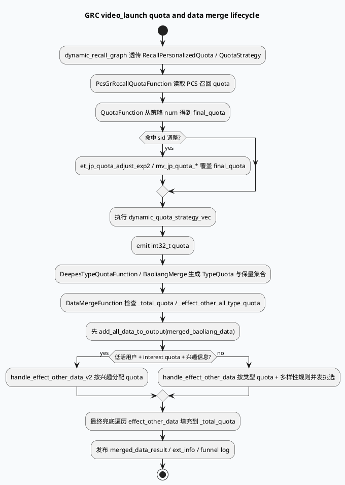

# 2026-07-09 周度代码理解：召回 quota 与 video_launch 数据合并

> 今日未获得可直接读取的 KU doc-id；本文以本地 feeda-mv-grc 代码与配置检索为主，业务实验背景和收益口径需人工补充。

## 1. 架构全景图：从召回 quota 到 video_launch DataMerge

<style>.arch-wrap{font-family:-apple-system,BlinkMacSystemFont,"Segoe UI",sans-serif;background:#f8fafc;border:1px solid #d9e2ec;border-radius:14px;padding:18px;margin:16px 0;color:#243b53}.arch-title{font-size:22px;font-weight:800;margin-bottom:12px;color:#102a43}.arch-grid{display:grid;grid-template-columns:1fr 1.1fr 1fr;gap:12px}.arch-layer{background:#fff;border:1px solid #d9e2ec;border-radius:12px;padding:12px}.arch-layer h3{margin:0 0 10px;font-size:15px;color:#334e68}.arch-box{border-radius:10px;border-left:4px solid #3d5a80;background:#eef4fb;padding:10px;margin:8px 0;font-size:13px;line-height:1.45}.arch-box.hot{background:#fff4e6;border-left-color:#c05621}.arch-box.ok{background:#ecfdf5;border-left-color:#2d6a4f}.arch-foot{font-size:12px;color:#627d98;margin-top:10px}</style><div class="arch-wrap"><div class="arch-title">GRC video_launch quota / merge 全景</div><div class="arch-grid"><div class="arch-layer"><h3>召回与 quota 输入</h3><div class="arch-box">dynamic_recall_graph 透传 RecallPersonalizedQuota / PersonalizedRatio / QuotaStrategy</div><div class="arch-box hot">PcsGrRecallQuotaFunction 拉取 PCS 召回 quota 参数</div><div class="arch-box">QuotaFunction 读取静态 num 并叠加 sid / 动态策略</div></div><div class="arch-layer"><h3>类型拆分与保量</h3><div class="arch-box ok">DeepesTypeQuotaFunction / TypeQuota 描述 sv/mv/dt/dj/heji 等类型配额</div><div class="arch-box">BaoliangMerge 先保障保量资源</div><div class="arch-box hot">DataMergeFunction 把保量和效果队列合并到 _total_quota</div></div><div class="arch-layer"><h3>输出与观测</h3><div class="arch-box">merged_data_result / const_merged_data_result 发布给后续 VFS/GRG</div><div class="arch-box">SketchyRankExtInfo 记录 group_rid_list、cupai_score_avg</div><div class="arch-box hot">fsq_1400 / Merge Video Stats 日志统计输入输出类型比例</div></div></div><div class="arch-foot">核心判断：quota 决定目标容量，TypeQuota 决定类型边界，DataMerge 负责保量优先、效果队列按类型挑选、最后兜底填满。</div></div>

## 2. 核心流程图：一次 video_launch 合并如何执行



## 3. 配置/结构信息图：quota 相关数据节点

```infographic
infographic list-grid-badge-card
data
  title quota 与 merge 数据节点
  desc 配置层先产出召回/个性化 quota，再由 video_launch 合并阶段消费
  items
    - label PcsGrRecallQuota
      desc vertex.conf:397-415，从 PCS 拉取 grc_recall 参数
      icon mdi/database-search
    - label RecallPersonalizedQuota
      desc vertex.conf:417-430，结合 SidInfo/CommonInfo 输出个性化召回 quota
      icon mdi/account-filter
    - label NewQuota
      desc vertex.conf:1430-1450，ComputeQuotaProcessor 输出新 quota
      icon mdi/chart-bell-curve
    - label TypeQuota
      desc vertex.conf:1477-1490，ComputeReadlistQuotaProcessor 输出按类 quota
      icon mdi/shape-outline
    - label CtrQuota
      desc QuotaFunction 输出 int32_t quota，作为总容量控制
      icon mdi/counter
    - label DataMergeResult
      desc DataMergeFunction 产出合并结果与只读副本
      icon mdi/source-merge
theme
  palette #3D5A80 #2D6A4F #C05621
```

`conf/plugins/graph/dynamic_recall_graph.conf:26-29` 明确把 `RecallPersonalizedQuota`、`PersonalizedRatio`、`QuotaStrategy` 作为动态召回图输入。`conf/plugins/graph/vertex.conf:397-430` 先从 PCS 获取召回 quota，再由 `RecallPersonalizedQuotaProcessor` 输出 `QuotaStrategy`。这条链路解释了为什么 video_launch 不是孤立合并：它继承了召回侧的个性化配额意图。

## 4. 代码观察

### 4.1 QuotaFunction：静态 num + sid 覆盖 + 动态策略串联

`src/processor/video_launch/quota.cpp:24-56` 展示了总 quota 的计算方式：

1. `quota_conf_p->num` 是基础静态 quota；
2. 命中 `et_jp_quota_adjust_exp2` 时设置为 1400，命中 `mv_jp_quota_1` / `mv_jp_quota_2` 时分别设置为 1100 / 1000；
3. 之后串行执行 `dynamic_quota_strategy_vec`，最后通过 `quota.emit()` 发布。

这意味着线上排查 quota 异常时，不能只看策略配置中的 num，还要同时看 sid 命中与动态策略是否二次改写。

### 4.2 DataMergeFunction：保量优先、效果队列按类型挑选、最终兜底

`src/processor/video_launch/data_merge.cpp:48-74` 是 DataMerge 主入口，先检查 `_total_quota`、`_effect_other_all_type_quota`、`_effect_other_data`、`_merged_baoliang_data`，再发布 `merged_data_result`、`const_merged_data_result` 和 `merged_data_ext_info`。

`src/processor/video_launch/data_merge.cpp:153-178` 是关键合并顺序：

- `merged_data_result.reserve(*_total_quota)`：容量按最终 quota 预留；
- 先 `add_all_data_to_output(*_merged_baoliang_data, merged_data_result)`：保量优先进入结果；
- 再根据低活用户、兴趣 quota 和兴趣列表决定走 `handle_effect_other_data_v2` 或 `handle_effect_other_data`；
- 最后 `add_all_data_to_output(*_effect_other_data, merged_data_result)` 做兜底，这一步注释明确“不再考虑各类别 quota 以及多样性限制”。

### 4.3 去重标记隐藏在输出函数里

`src/processor/video_launch/data_merge.cpp:181-205` 的 `add_data_to_output()` 会跳过空指针、跳过 `is_insert_sketchy_rank` 已插入项，并在成功输出后设置 `rid_tmp_info_ptr->is_insert_sketchy_rank = true`。因此“为什么候选在兜底里没补进去”的排查重点之一，是该标记是否已在保量或类型 merge 阶段被置位。

## 5. Pitfalls 卡片

<style>.card-frame{font-family:-apple-system,BlinkMacSystemFont,"Segoe UI",sans-serif;margin:18px 0}.pit-card{background:#fffaf0;border:1px solid #f6d6ad;border-radius:14px;padding:18px;color:#2d3748}.pit-meta{font-size:12px;font-weight:800;color:#9c4221;text-transform:uppercase;letter-spacing:.04em}.pit-title{font-size:24px;font-weight:850;margin:6px 0 10px;color:#1a202c}.pit-grid{display:grid;grid-template-columns:repeat(2,minmax(0,1fr));gap:12px}.pit-panel{background:#fff;border-left:4px solid #c05621;border-radius:10px;padding:12px;font-size:13px;line-height:1.6}.pit-end{margin-top:10px;font-weight:800;color:#7b341e}</style><div class="card-frame"><div class="pit-card"><div class="pit-meta">debug pitfalls</div><div class="pit-title">quota 问题常被误判为召回不足</div><div class="pit-grid"><div class="pit-panel"><b>sid 覆盖陷阱：</b>策略 num 不是最终值；QuotaFunction 可能先被 sid 改写，再被 dynamic_quota_strategy_vec 改写。</div><div class="pit-panel"><b>兜底突破陷阱：</b>最终兜底明确不再考虑类型 quota 和多样性，因此输出比例异常时要区分“类型 merge 阶段”和“最终兜底阶段”。</div><div class="pit-panel"><b>已插入标记陷阱：</b>is_insert_sketchy_rank 一旦置位，后续同一 rid 不会再被插入；重复候选可能表现为 quota 填不满。</div><div class="pit-panel"><b>日志解释陷阱：</b>fsq_1400 统计输入比例，Merge Video Stats 统计输出比例，两者不能混用。</div></div><div class="pit-end">排查顺序：QuotaFunction → TypeQuota → Baoliang → DataMerge 分阶段计数 → 兜底数量。</div></div></div>

## 6. 调试 checklist

```infographic
infographic list-column-done-list
data
  title video_launch quota / merge 排查 checklist
  desc 适用于输出数不足、类型比例异常、保量挤占、兜底过多等问题
  items
    - label 确认总 quota 来源
      desc 检查 quota_conf_p->num、sid 命中、dynamic_quota_strategy_vec 输出
      done false
    - label 对齐 PCS 与召回 quota
      desc vertex.conf:397-430 与 dynamic_recall_graph.conf:26-29 一起看
      done false
    - label 拆分保量与非保量
      desc data_merge.cpp:153-170，统计 baoliang_count 与 merge_effect_other_count
      done false
    - label 查看最终兜底数量
      desc data_merge.cpp:172-178，final_doudi_count 高说明类型/多样性阶段填不满
      done false
    - label 检查 is_insert_sketchy_rank
      desc data_merge.cpp:181-205，重复候选或提前插入会影响后续补齐
      done false
    - label 区分输入/输出类型比例日志
      desc fsq_1400 是输入，Merge Video Stats 是输出
      done false
theme
  palette #3D5A80 #2D6A4F #C05621
```

## 7. 证据来源

- `conf/plugins/graph/dynamic_recall_graph.conf:26-29`：动态召回图透传召回个性化 quota 与 QuotaStrategy。
- `conf/plugins/graph/vertex.conf:397-430`：PCS 召回 quota 与 RecallPersonalizedQuotaProcessor 节点。
- `conf/plugins/graph/vertex.conf:1430-1490`：NewQuota、TypeQuota 等 quota 结构节点。
- `src/processor/video_launch/quota.cpp:24-56`：静态 quota、sid 覆盖、动态策略串行执行。
- `src/processor/video_launch/data_merge.cpp:48-74`：DataMerge 主入口与输出发布。
- `src/processor/video_launch/data_merge.cpp:153-178`：保量优先、效果队列处理、最终兜底。
- `src/processor/video_launch/data_merge.cpp:181-205`：输出插入和 `is_insert_sketchy_rank` 标记。

---

## 七、业务代码库适配分析
> **分析时间**：2026-07-20T19:35:18.560814
> **目标代码库**：feeda-mv-grg（序列生成）、feeda-mv-grc（召回汇聚）

## 业务代码库适配分析报告

### 1. 分析摘要

- 从扫描结果看，目标技术在两个业务代码库中**已有少量落地经验**，但整体仍处于局部使用阶段。`feeda-mv-grg` 中仅发现 1 个目标库使用文件，`feeda-mv-grc` 中发现 9 个目标库使用文件，说明业务侧并非完全没有接入基础，但尚未形成大规模统一迁移。

- 两个代码库中 `std::vector`、`std::string`、`std::unordered_map` 的使用规模非常大：  
  - `feeda-mv-grg`：`std::vector` 1969 次，`std::string` 2443 次，`std::unordered_map` 734 次  
  - `feeda-mv-grc`：`std::vector` 8442 次，`std::string` 7170 次，`std::unordered_map` 2834 次  

  因此，如果目标技术是用于替换或优化标准库容器 / 字符串 / 哈希表的高性能实现，则迁移潜力主要集中在**高频请求链路、临时容器构造、召回结果合并、图依赖构建、特征生成和排序调整模块**。但不建议全仓机械替换，应优先从热点路径、生命周期清晰、无跨模块 ABI 暴露的局部容器开始。

---

### 2. 代码库详情

#### feeda-mv-grg：序列生成服务

- **目标库使用现状**
  - 已发现目标库使用：1 个文件
    - `strategy/diversity/rule/low_clarity_diversity_rule.cpp`
  - 该文件可作为 `feeda-mv-grg` 内部迁移参考，重点查看：
    - 目标库的 include 方式
    - 命名空间使用方式
    - 是否已有封装 typedef / using
    - 与现有排序、多样性规则代码的交互方式

- **std 等价物使用规模**
  - `std::vector`：1969 次，分布在 356 个文件
  - `std::string`：2443 次，分布在 425 个文件
  - `std::unordered_map`：734 次，分布在 205 个文件

- **典型场景**
  - `model/model.h`
    ```cpp
    virtual int predict(std::vector<RidTmpInfoPtr>& candidate_vec, uint32_t pos) = 0;
    ```
    这里 `std::vector<RidTmpInfoPtr>&` 是模型接口参数，属于跨模块公共接口，不适合直接替换。

  - `model/paddle_model.h`
    ```cpp
    virtual int predict(std::vector<RidTmpInfoPtr>& candidate_vec, uint32_t pos) {
        return 0;
    }
    ```
    该类同样属于模型预测接口层，建议保持接口稳定，仅优化函数内部临时容器。

  - `model/paddle_model.h`
    ```cpp
    int predict_with_tensor_input(std::vector<RidTmpInfoPtr>& candidate_vec,
                general_predict::PredictSample* predict_sample = nullptr,
                bool is_from_cube = true) const {
        return predict<ModelDependInput>(candidate_vec, predict_sample, is_from_cube);
    }
    ```
    `candidate_vec` 是核心候选序列输入，若直接更换容器类型，影响面会扩散到预测模板、调用方和候选生成链路，不建议作为首批迁移点。

#### feeda-mv-grc：召回汇聚服务

- **目标库使用现状**
  - 已发现目标库使用：9 个文件，扫描结果中列举了部分文件：
    - `operator/adjuster/sketchy/ltv_factor_cp_opt.cpp`
    - `processor/new_adjust/precise_score_init_first_refresh.cpp`
    - `processor/new_adjust/precise_score_init.cpp`
    - `processor/multi_factor/ltr_factor_gen_scene.cpp`
    - `processor/multi_factor/session_ltr_dibar_factor_gen.cpp`
  - 这些文件主要分布在：
    - sketchy 调整器
    - 精排 / 新调权初始化
    - 多因子特征生成
    - session LTR 特征链路  
  - 说明目标库已经在部分性能敏感链路中使用，可作为 `feeda-mv-grc` 后续迁移的直接参考。

- **std 等价物使用规模**
  - `std::vector`：8442 次，分布在 1279 个文件
  - `std::string`：7170 次，分布在 1234 个文件
  - `std::unordered_map`：2834 次，分布在 639 个文件

- **典型场景**
  - `service/grc_http_service.cpp`
    ```cpp
    std::unordered_map<std::string, std::vector<int>> depend_map;
    auto &all_vertex = graph_engine->get_vertexs_message(graph_name);
    for (int i = 0; i < all_vertex.size(); ++i) {
        for (auto &depend : all_vertex[i].depends) {
    ```
    这是图依赖构建场景，`unordered_map<string, vector<int>>` 存在哈希表构建、字符串 key、vector 追加等开销，适合作为局部容器优化候选。

  - `service/grc_http_service.cpp`
    ```cpp
    static std::vector<std::string> colors{"#FFB6C1", "#DC143C", ...};
    ```
    静态颜色表属于低频、只读、小规模数据，不是性能优化重点，不建议迁移。

  - `service/grc_http_service.cpp`
    ```cpp
    std::string resp_str;

    std::vector<std::string> sub_access_off_vec;
    std::vector<std::string> sub_access_on_vec;
    ```
    HTTP 请求解析和响应拼接场景可能有字符串分割、临时 vector 构造、响应字符串增长等问题，但是否值得迁移取决于该接口访问频率。

---

### 3. 💡 适用性评估与建议

- **建议 1：优先在 `feeda-mv-grc` 的图依赖构建逻辑中试点哈希表替换**
  - 目标文件：
    - `service/grc_http_service.cpp`
  - 当前代码：
    ```cpp
    std::unordered_map<std::string, std::vector<int>> depend_map;
    ```
  - 适用场景：
    - 图节点数量较多
    - 每次请求或每次管理接口调用都需要重新构建依赖关系
    - `depend_map` 只在函数内部使用，不跨模块返回
  - 优化建议：
    - 如果目标库提供高性能 hash map，可将局部 `std::unordered_map` 替换为目标库 hash map。
    - 同时增加容量预留：
      ```cpp
      depend_map.reserve(all_vertex.size());
      ```
    - 对 `std::vector<int>` 的 value 侧，如果可以提前估算依赖数量，也建议 `reserve`，减少扩容。
  - 迁移收益：
    - 降低哈希表 rehash 成本
    - 降低节点依赖构建时的内存分配次数
    - 对图规模较大的场景收益更明显

- **建议 2：`video_launch` 合并链路中只优化局部临时容器，不改变业务对象接口**
  - 目标文件：
    - `src/processor/video_launch/data_merge.cpp`
  - 相关逻辑：
    - `merged_data_result.reserve(*_total_quota)`
    - `add_all_data_to_output(*_merged_baoliang_data, merged_data_result)`
    - `handle_effect_other_data`
    - `handle_effect_other_data_v2`
    - 最终兜底 `add_all_data_to_output(*_effect_other_data, merged_data_result)`
  - 适用场景：
    - `_total_quota` 较大，例如命中 `fsq_1400` 或 sid quota 调整时
    - `effect_other_data` 候选量远大于最终输出量
    - 类型队列、多样性过滤过程中存在大量临时 vector / map / set
  - 优化建议：
    - 保留对外发布的 `merged_data_result` 类型，避免影响后续 VFS / GRG 消费。
    - 优先替换函数内部临时聚合容器，例如类型桶、rid 去重表、兴趣分桶等。
    - 已有的：
      ```cpp
      merged_data_result.reserve(*_total_quota);
      ```
      是正确方向，应继续检查其他中间容器是否缺少 `reserve`。
  - 注意：
    - `add_data_to_output()` 内部会设置：
      ```cpp
      rid_tmp_info_ptr->is_insert_sketchy_rank = true;
      ```
      迁移容器时不能改变遍历顺序和去重语义，否则会影响最终输出内容。

- **建议 3：`QuotaFunction` 中不建议优先替换容器，重点应放在策略链路可观测性**
  - 目标文件：
    - `src/processor/video_launch/quota.cpp`
  - 当前逻辑特征：
    - 基础 quota 来自 `quota_conf_p->num`
    - sid 命中后可能覆盖为 1400 / 1100 / 1000
    - `dynamic_quota_strategy_vec` 串行执行并可能二次改写 quota
  - 适用性判断：
    - 该函数的主要成本通常不是容器本身，而是策略执行链路和配置判断。
    - 如果 `dynamic_quota_strategy_vec` 长度较小，替换 `std::vector` 的收益有限。
  - 优化建议：
    - 保持当前容器类型稳定。
    - 增加策略前后 quota 变化日志或 debug counter。
    - 若后续确认 `dynamic_quota_strategy_vec` 在高 QPS 下存在明显遍历成本，再考虑局部替换或改为更轻量的视图类型。

- **建议 4：`feeda-mv-grg` 的模型接口层不建议直接替换 `std::vector`**
  - 目标文件：
    - `model/model.h`
    - `model/paddle_model.h`
  - 当前接口：
    ```cpp
    virtual int predict(std::vector<RidTmpInfoPtr>& candidate_vec, uint32_t pos) = 0;
    ```
  - 适用性判断：
    - 这是公共虚函数接口。
    - 直接替换参数类型会影响所有派生类、调用方、测试代码和模型预测模板。
    - 还可能带来 ABI / ODR / 编译依赖问题。
  - 优化建议：
    - 不在接口层做容器替换。
    - 如果模型内部需要构建特征临时数组、候选过滤数组或 tensor 输入中间结构，可以在 `.cpp` 内部使用目标库容器。
    - 对 `candidate_vec` 的访问建议保持引用传递，避免额外拷贝。
  - 可参考文件：
    - `strategy/diversity/rule/low_clarity_diversity_rule.cpp`  
      该文件是 `feeda-mv-grg` 中已发现的目标库使用点，可作为本仓迁移风格参考。

- **建议 5：在 `feeda-mv-grc` 的特征生成和调权模块中扩大局部试点**
  - 目标文件：
    - `operator/adjuster/sketchy/ltv_factor_cp_opt.cpp`
    - `processor/new_adjust/precise_score_init.cpp`
    - `processor/new_adjust/precise_score_init_first_refresh.cpp`
    - `processor/multi_factor/ltr_factor_gen_scene.cpp`
    - `processor/multi_factor/session_ltr_dibar_factor_gen.cpp`
  - 适用场景：
    - rid 到特征值的映射
    - session 内候选分组
    - 多因子特征临时缓存
    - score 初始化过程中的中间 map / vector
  - 优化建议：
    - 优先选择函数内部生命周期短、容量较大的容器进行替换。
    - 对 `std::unordered_map<rid, feature>`、`std::unordered_map<std::string, score>` 这类结构重点评估。
    - 对小规模、固定长度、只读配置类 vector 不建议迁移。
  - 迁移收益：
    - 减少 hash map 分配和 rehash
    - 降低特征链路尾延迟
    - 改善高 QPS 下 CPU cache locality

---

### 4. ⚠️ 引入风险与限制

- **风险 1：公共接口容器类型不能轻易替换**
  - 例如：
    - `model/model.h`
    - `model/paddle_model.h`
  - 这些文件中的 `std::vector<RidTmpInfoPtr>&` 是跨模块接口。
  - 如果直接替换为目标库容器，会导致：
    - 派生类签名不匹配
    - 调用方大面积修改
    - 模板实例化膨胀
    - ABI 不兼容
  - 建议仅在函数内部使用目标库容器，接口仍保持 `std::vector`。

- **风险 2：`DataMergeFunction` 的输出顺序和去重语义不能变化**
  - 目标文件：
    - `src/processor/video_launch/data_merge.cpp`
  - 当前合并顺序具有明确业务语义：
    1. 保量资源优先
    2. 效果队列按类型 / 兴趣 quota 选择
    3. 最终兜底补齐
  - 同时 `is_insert_sketchy_rank` 控制去重。
  - 如果替换容器导致遍历顺序变化，可能影响：
    - 类型比例
    - 保量资源位置
    - 兜底数量
    - `Merge Video Stats` 输出分布
  - 因此迁移后必须对比：
    - 输出 rid 集合
    - 输出顺序
    - 各类型数量
    - 兜底数量
    - `is_insert_sketchy_rank` 命中数量

- **风险 3：小规模静态数据迁移收益有限，可能增加维护成本**
  - 例如：
    - `service/grc_http_service.cpp` 中的静态颜色数组：
      ```cpp
      static std::vector<std::string> colors{...};
      ```
  - 这类数据规模小、访问频率低、初始化一次后复用，替换目标库容器收益有限。
  - 不建议为了统一风格而迁移。

- **风险 4：目标库与 std 容器的行为差异需要验证**
  - 重点关注：
    - iterator 失效规则
    - rehash 后引用 / 指针稳定性
    - 遍历顺序
    - string view / string 的生命周期
    - hash 策略差异
  - 对召回、排序、合并链路尤其重要，因为这些链路通常对稳定性和可解释性要求较高。
  - 建议每个迁移点至少补充：
    - 单测
    - diff 工具对比
    - 灰度日志
    - 性能压测数据

---

### 5. 建议的迁移优先级

- **P0：低风险局部试点**
  - `service/grc_http_service.cpp`
    - `depend_map`
    - 局部临时 vector
  - `processor/multi_factor/ltr_factor_gen_scene.cpp`
  - `processor/multi_factor/session_ltr_dibar_factor_gen.cpp`

- **P1：性能敏感链路试点**
  - `src/processor/video_launch/data_merge.cpp`
    - 类型分桶
    - 兴趣分桶
    - 临时去重表
  - `operator/adjuster/sketchy/ltv_factor_cp_opt.cpp`
  - `processor/new_adjust/precise_score_init.cpp`

- **P2：暂缓迁移**
  - `model/model.h`
  - `model/paddle_model.h`
  - `src/processor/video_launch/quota.cpp`
  - 小规模静态配置 vector / string 场景

总体建议是：**先利用 `feeda-mv-grc` 已有 9 个目标库使用点建立迁移规范，再选择热点函数内部容器做局部替换；不要从公共接口和全仓 std 容器替换开始。**

---
*本章节由 Hermes Agent 自动分析生成，基于代码库静态扫描结果。*
