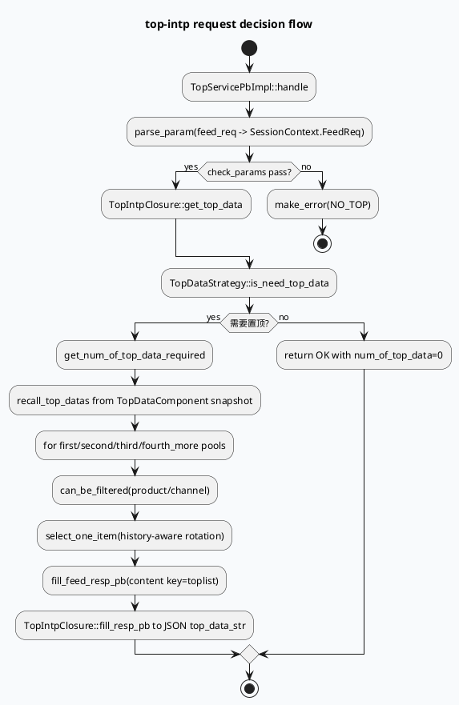

# 2026-07-10 周五代码理解：top-intp 置顶干预业务链路与返回组装

> 本文基于本地 `top-intp` 代码阅读生成；未获得可直接读取的 KU 背景文档，运营投放规则、城市分层含义和线上实验需人工补充。

## 1. 架构全景图：从 FeedRequest 到 toplist 返回

<style>.arch-wrap{font-family:-apple-system,BlinkMacSystemFont,"Segoe UI",sans-serif;background:#f8fafc;border:1px solid #d9e2ec;border-radius:14px;padding:18px;margin:16px 0;color:#243b53}.arch-title{font-size:22px;font-weight:850;margin-bottom:12px;color:#102a43}.arch-row{display:grid;grid-template-columns:repeat(5,minmax(0,1fr));gap:10px}.arch-box{background:#fff;border:1px solid #d9e2ec;border-top:4px solid #3d5a80;border-radius:12px;padding:10px;font-size:13px;line-height:1.45}.arch-box b{display:block;color:#102a43;margin-bottom:4px}.arch-box.hot{border-top-color:#c05621;background:#fff7ed}.arch-box.ok{border-top-color:#2d6a4f;background:#ecfdf5}.arch-arrow{text-align:center;color:#627d98;font-size:18px;margin:8px 0}.arch-foot{font-size:12px;color:#627d98;margin-top:10px}</style><div class="arch-wrap"><div class="arch-title">top-intp 业务决策流水线</div><div class="arch-row"><div class="arch-box"><b>请求解析</b>TopRequest.feed_req → FeedReq：product/channel/city/osbranch/refresh/history</div><div class="arch-box hot"><b>是否需要置顶</b>只允许手百推荐、选城用户、非特定老人版、非 notop 刷新态</div><div class="arch-box"><b>置顶数量</b>Redis RedAutoData：lite/shoubai + red/green/blue + top_news_top</div><div class="arch-box hot"><b>候选选择</b>按 is_top 位置池顺序过滤产品线和频道，再避开历史</div><div class="arch-box ok"><b>返回组装</b>Content key=toplist，ContentItem + DisplayStrategy + ext → JSON top_data_str</div></div><div class="arch-arrow">FeedRequest → gate → required_num → recall/select → FeedResponse/top_data_str</div><div class="arch-foot">业务含义：top-intp 不是排序主链路，而是面向置顶干预的轻量服务；它把运营池子映射为下游可消费的 toplist 内容。</div></div>

## 2. 核心流程：请求门控、数量计算、池内选择



`src/service/top_service_pb.cc:64-159` 是请求字段归一化：从 `FeedRequest` 提取 `cuid`、`uid`、`baiduid`、`channel_id`、`city_user_type`、`product`、`osbranch`、`refresh_state`、`ua`、`app_version`，并把 `history_info.item` 与 `history_info.video_item` 写入 `top_data_hislist` / `top_data_showlist`。`src/strategy/top_data_strategy.cc:69-107` 决定是否需要置顶；`src/strategy/top_data_strategy.cc:109-175` 决定需要几条置顶。

## 3. 业务门控信息图

```infographic
infographic list-grid-candy-card-lite
data
  title 置顶返回前置条件
  desc 任一条件不满足，TopDataStrategy 会把 is_need_top_data 置为 false 或返回失败
  items
    - label product
      desc 必须是 PRODUCT_SHOUBAI
      icon mdi/cellphone-check
    - label channel
      desc 必须是 TAB_RECOMMENDATION
      icon mdi/view-dashboard-outline
    - label city_user
      desc is_choosen_city_user 不能为 0，且决定 red/green/blue key
      icon mdi/map-marker-star
    - label osbranch
      desc SENIOR_OS_ANDROID / SENIOR_OS_IOS 不下发置顶
      icon mdi/account-clock
    - label refresh_state
      desc R_BOTTOM/R_UP/R_AUTO_NOTOP 等 notop 场景不下发
      icon mdi/refresh-alert
    - label required_num
      desc RedAutoData key 命中后才知道需要几条
      icon mdi/counter
theme
  palette #3D5A80 #2D6A4F #C05621
```

`src/strategy/top_data_strategy.cc:69-107` 明确了“不要置顶”的大类：非手百、非推荐频道、非选城用户、老人版 Android/iOS、以及多种底刷/上滑/自动 notop 刷新态。`src/strategy/top_data_strategy.cc:109-175` 拼 Redis key：`lite_` 或 `shoubai_` + `red_` / `green_` / `blue_` + `top_news_top`，如果 city priority 不在三类中，则直接把 `num_of_top_data_required` 置 0。

## 4. 候选池选择与轮转机制

`src/strategy/top_data_strategy.cc:178-208` 将后台快照按位置顺序展开：一位、二位、三位、四位及以上。每个位置池只选一个候选，直到达到 `num_of_top_data_required`。

`src/strategy/top_data_strategy.cc:211-270` 的 `recall_one_item_from_pool()` 会先过滤产品线和频道：

- `is_product_filtered()` 读取 `product_array`，lite 分支要求 CMS_PRODUCT_LIGHT，普通手百分支通过 `product_id_trans()` 映射 CMS product；
- `is_channel_filtered()` 要求 item 的 `channel_id` 等于请求 channel。

`src/strategy/top_data_strategy.cc:272-326` 的 `select_one_item()` 包含一个容易忽略的历史轮转逻辑：先选择没有出现在 `top_data_hislist` 的候选；如果整个池子都已下发过，则在 `top_data_showlist` 中找时间戳最大的已展现项，再选择它的下一个位置。也就是说“所有候选都历史命中”不等于不返回，而是退化成顺序轮转。

```infographic
infographic sequence-snake-steps-simple
data
  title 单个位置池选择流程
  desc first_top_vec/second_top_vec/third_top_vec/fourth_more_top_map 中每个池子独立执行
  items
    - label 池为空
      desc 直接失败，进入下一个位置池
    - label 产品线过滤
      desc product_array 不匹配则过滤
    - label 频道过滤
      desc item.channel_id 不等于请求频道则过滤
    - label 历史优先
      desc 优先选不在 top_data_hislist 中的候选
    - label 顺序轮转
      desc 全部历史命中时，选择最近展现项的下一个
    - label JSON转PB
      desc parse_item 后填入 RespItem
theme
  palette #3D5A80 #2D6A4F #C05621
```

## 5. 返回组装：FeedResponse 与最终 JSON

`src/strategy/top_data_strategy.cc:452-483` 将 `result_items` 写入 `feed_gr::FeedResponse`：设置 logid/cuid/uid/baiduid，新增 content，`key` 固定为 `toplist`，每个 `RespItem` 变成 `ContentItem`，并设置 `id`、`cs`、`resource_type`、`item_type`、`ext.rec_src`、`ext.mark` 和 `display_strategy`。`src/strategy/top_data_strategy.cc:486-541` 会把运营侧 `display_strategy` 的模板、showtag、mark、title、top_title、more_link、url、attention、is_top、scope 等字段透传到 PB。

`src/service/top_service.cc:67-108` 再把 `FeedResponse.content(0).items()` 转成最终的 `top_data_str` JSON。这里有一个强约束：`num_of_top_data_issued` 必须等于 `num_of_top_data_required`，否则响应 `error_no` 被置为 `NO_TOP`，`num_of_top_data` 为 0。

## 6. 输出字段结构信息图

```infographic
infographic hierarchy-structure
data
  title toplist 输出结构
  desc FeedResponse 是中间 PB，TopResponse.top_data_str 是最终 JSON 字符串
  items
    - label TopResponse
      desc error_no / error_msg / num_of_top_data / top_data_str
      children
        - label top_data_str[]
          desc JSON array，由 pb2json_of_contentitem 生成
    - label FeedResponse
      desc logid/cuid/uid/baiduid + content
      children
        - label content.key
          desc 固定为 toplist
        - label ContentItem
          desc id/nid/cs/resource_type/item_type/top/overwrite/timestamp
        - label DisplayStrategy
          desc templates/title/top_title/mark/scope/url/attention
        - label ext
          desc rec_src/top/ua/channel_id/log_id/refresh_state/GCMS 元数据
theme
  palette #3D5A80 #2D6A4F #C05621
```

`src/service/top_service.cc:112-145` 的 `pb2json_of_contentitem()` 根据 `resource_type` 给 id 加前缀：新闻是 `news_`，视频是 `sv_`，不支持的类型直接过滤。`src/service/top_service.cc:203-280` 之后会在 ext 中写入 ua、channel_id、log_id、refresh_state、cs，并从 `gcms_resp_map` 补充垂类、短视频类目、敏感信息等元数据。

## 7. Pitfalls 卡片

<style>.card-frame{font-family:-apple-system,BlinkMacSystemFont,"Segoe UI",sans-serif;margin:18px 0}.pit-card{background:#fffaf0;border:1px solid #f6d6ad;border-radius:14px;padding:18px;color:#2d3748}.pit-meta{font-size:12px;font-weight:800;color:#9c4221;text-transform:uppercase;letter-spacing:.04em}.pit-title{font-size:24px;font-weight:850;margin:6px 0 10px;color:#1a202c}.pit-grid{display:grid;grid-template-columns:repeat(2,minmax(0,1fr));gap:12px}.pit-panel{background:#fff;border-left:4px solid #c05621;border-radius:10px;padding:12px;font-size:13px;line-height:1.65}.pit-end{margin-top:10px;font-weight:800;color:#7b341e}</style><div class="card-frame"><div class="pit-card"><div class="pit-meta">Business Pitfalls</div><div class="pit-title">置顶少一条，最终可能一条都不返回</div><div class="pit-grid"><div class="pit-panel"><b>数量强一致陷阱：</b>`fill_resp_pb()` 后如果实际 issued 数不等于 required 数，TopResponse 会被置为 NO_TOP，而不是返回部分置顶。</div><div class="pit-panel"><b>历史轮转陷阱：</b>候选出现在历史中不会立刻过滤到底；当池子全历史命中，会选择最近展现项的下一个。</div><div class="pit-panel"><b>key 拼接陷阱：</b>置顶条数 key 受 osbranch 与 city_user_type 共同影响，不能只搜 `top_news_top`。</div><div class="pit-panel"><b>类型前缀陷阱：</b>最终 JSON id 会按 resource_type 加 `news_` 或 `sv_`，排查 id mismatch 时要看 nid 和 id 两个字段。</div></div><div class="pit-end">优先看：is_need_top_data → num_of_top_data_required → 每个 top_pos 池过滤后大小 → num_of_top_data_issued。</div></div></div>

## 8. 调试 checklist

```infographic
infographic list-column-done-list
data
  title top-intp 业务链路排查 checklist
  desc 适用于用户无置顶、置顶数量不对、返回 NO_TOP、重复轮转异常
  items
    - label 检查请求必填字段
      desc top_service_pb.cc:162-201，product/channel/cuid/uid/baiduid/refresh_state/app_version 必须存在
      done false
    - label 检查是否被 is_need_top_data 拦截
      desc top_data_strategy.cc:69-107，产品、频道、城市、老人版、刷新态逐项确认
      done false
    - label 检查 required_num key
      desc top_data_strategy.cc:109-175，lite/shoubai + red/green/blue + top_news_top
      done false
    - label 检查候选池按位置是否为空
      desc top_data_strategy.cc:186-205，first/second/third/fourth_more 顺序取候选
      done false
    - label 检查产品线与频道过滤
      desc top_data_strategy.cc:384-427，product_array 与 channel_id 任一不匹配都会过滤
      done false
    - label 检查 issued 与 required 是否相等
      desc top_service.cc:94-108，不相等会返回 NO_TOP
      done false
theme
  palette #3D5A80 #2D6A4F #C05621
```

## 9. 证据来源

- `src/service/top_service_pb.cc:12-56`：RPC 入口、创建 SessionContext 与 Closure。
- `src/service/top_service_pb.cc:64-159`：FeedRequest 字段提取和历史列表构造。
- `src/service/top_service_pb.cc:162-201`：请求必填字段校验。
- `src/strategy/top_data_strategy.cc:69-107`：是否需要置顶的业务门控。
- `src/strategy/top_data_strategy.cc:109-175`：置顶条数 Redis key 拼接与 RedAutoData 读取。
- `src/strategy/top_data_strategy.cc:178-250`：按位置池召回和单池选择入口。
- `src/strategy/top_data_strategy.cc:252-326`：产品/频道过滤与历史轮转选择。
- `src/strategy/top_data_strategy.cc:329-361`：JSON item 转 RespItem。
- `src/strategy/top_data_strategy.cc:452-541`：FeedResponse 与 DisplayStrategy 组装。
- `src/service/top_service.cc:67-108`：最终 TopResponse/top_data_str 数量校验与输出。
- `src/service/top_service.cc:112-145`：ContentItem 转 JSON，处理 `news_` / `sv_` 前缀。

---

## 七、业务代码库适配分析
> **分析时间**：2026-07-20T19:36:33.859111
> **目标代码库**：feeda-mv-grg（序列生成）、feeda-mv-grc（召回汇聚）

## 业务代码库适配分析

### 1. 分析摘要

- 从扫描结果看，目标技术已经在两个业务代码库中有少量落地：`feeda-mv-grg` 中发现 1 个使用文件，`feeda-mv-grc` 中发现 9 个使用文件，说明代码库具备一定的引入基础，可以优先参考这些已落地文件的接入方式、编译依赖和代码风格。
- 同时，两个代码库中 `std::vector`、`std::string`、`std::unordered_map` 的使用规模非常大，尤其是 `feeda-mv-grc`，`std::vector` 出现 8442 次、`std::unordered_map` 出现 2834 次，说明如果目标技术面向容器、字符串或哈希表替换优化，具备较高的迁移潜力。但不建议全量替换，应优先选择召回、排序、因子生成、过滤、HTTP 聚合等高频路径中的局部热点进行灰度改造。

---

### 2. 代码库详情

#### feeda-mv-grg：序列生成服务

- **目标技术使用现状**
  - 已发现目标库使用：1 个文件。
  - 可作为迁移参考：
    - `strategy/diversity/rule/low_clarity_diversity_rule.cpp`
  - 说明该代码库已有少量目标技术接入经验，但覆盖范围较小，后续迁移需要重点确认：
    - 头文件依赖是否已纳入公共编译配置；
    - 是否存在统一 alias 或 wrapper；
    - 是否有性能收益数据或线上稳定性记录。

- **std 等价物使用规模**
  - `std::vector`：1969 次，分布在 356 个文件。
  - `std::string`：2443 次，分布在 425 个文件。
  - `std::unordered_map`：734 次，分布在 205 个文件。
  - 使用规模中等偏大，说明在候选序列生成、模型预测、规则处理等场景中可能存在较多容器分配、拷贝和哈希查找开销。

- **典型场景**
  - `model/model.h`
    ```cpp
    virtual int predict(std::vector<RidTmpInfoPtr>& candidate_vec, uint32_t pos) = 0;
    ```
    该接口处于模型预测抽象层，`candidate_vec` 很可能贯穿多个模型实现，是候选序列处理的核心数据结构。
  - `model/paddle_model.h`
    ```cpp
    virtual int predict(std::vector<RidTmpInfoPtr>& candidate_vec, uint32_t pos) {
        return 0;
    }

    int predict_with_tensor_input(std::vector<RidTmpInfoPtr>& candidate_vec,
                general_predict::PredictSample* predict_sample = nullptr,
                bool is_from_cube = true) const {
        return predict<ModelDependInput>(candidate_vec, predict_sample, is_from_cube);
    }
    ```
    该文件中 `std::vector<RidTmpInfoPtr>` 出现在预测入口，如果目标技术涉及容器替换，应谨慎处理 ABI、接口兼容和调用链传播问题。

#### feeda-mv-grc：召回汇聚服务

- **目标技术使用现状**
  - 已发现目标库使用：9 个文件。
  - 已扫描到的代表文件包括：
    - `processor/multi_factor/session_ltr_dibar_factor_gen.cpp`
    - `operator/adjuster/function_queue/youzhi_queue_adjust.cpp`
    - `processor/new_adjust/precise_score_init.cpp`
    - `processor/filter/low_agile_goodrate_filter_operator.cc`
    - `processor/multi_factor/subcate_future_factor_gen.cpp`
  - 说明 `feeda-mv-grc` 对目标技术已有更充分的使用基础，可优先从这些文件中抽取接入范式，例如：
    - include 路径；
    - 命名空间使用方式；
    - 是否封装在局部函数内部；
    - 是否与业务结构体、PB 对象、上下文对象混用。

- **std 等价物使用规模**
  - `std::vector`：8442 次，分布在 1279 个文件。
  - `std::string`：7170 次，分布在 1234 个文件。
  - `std::unordered_map`：2834 次，分布在 639 个文件。
  - 该代码库容器使用规模远高于 `feeda-mv-grg`，并且服务定位是召回汇聚，通常存在大量候选 item 聚合、过滤、去重、打分、因子生成和队列调整逻辑，因此迁移收益潜力更高。

- **典型场景**
  - `service/grc_http_service.cpp`
    ```cpp
    std::unordered_map<std::string, std::vector<int>> depend_map;
    auto &all_vertex = graph_engine->get_vertexs_message(graph_name);
    for (int i = 0; i < all_vertex.size(); ++i) {
        for (auto &depend : all_vertex[i].depends) {
    ```
    该场景存在 `string -> vector<int>` 的依赖关系映射，适合评估哈希表替换、预分配、减少 rehash 等优化。
  - `service/grc_http_service.cpp`
    ```cpp
    static std::vector<std::string> colors{"#FFB6C1", "#DC143C", "#DB7093", ...};
    ```
    该场景是静态字符串数组，通常不是优先性能瓶颈，除非目标技术能降低初始化成本或二进制体积，否则不建议作为首批迁移对象。
  - `service/grc_http_service.cpp`
    ```cpp
    std::string resp_str;

    std::vector<std::string> sub_access_off_vec;
    std::vector<std::string> sub_access_on_vec;
    const std::string *sub_access_off_vec_str = cntl->http_request().uri().GetQuery("off");
    ```
    HTTP 参数解析和响应拼接中存在较多字符串和 vector 使用，可结合请求 QPS、字符串生命周期、拷贝次数判断是否适合替换。

---

### 3. 💡 适用性评估与建议

- **建议一：优先在 `feeda-mv-grc` 的因子生成与过滤热点中复用已有目标技术用法**
  - 推荐参考文件：
    - `processor/multi_factor/session_ltr_dibar_factor_gen.cpp`
    - `processor/multi_factor/subcate_future_factor_gen.cpp`
    - `processor/filter/low_agile_goodrate_filter_operator.cc`
  - 这些文件已经发现目标技术使用，可作为后续迁移的模板。
  - 建议做法：
    - 梳理其中目标技术的 include、类型声明、构造方式和生命周期管理；
    - 将相似的因子生成逻辑中高频 `std::unordered_map` 查询、候选列表临时聚合结构迁移为目标容器；
    - 优先迁移函数内部的局部临时容器，避免一开始修改跨模块接口。
  - 适用场景：
    - 每次请求都会构造的临时 map；
    - key 数量较大且频繁查找的 item 特征表；
    - 过滤算子中用于去重、命中统计、召回源归因的哈希结构。

- **建议二：`service/grc_http_service.cpp` 中的 `depend_map` 可作为哈希表替换试点**
  - 现有代码：
    ```cpp
    std::unordered_map<std::string, std::vector<int>> depend_map;
    ```
  - 该结构用于图依赖关系组织，存在字符串 key、vector value 和循环填充逻辑，比较适合作为局部替换试点。
  - 优化方向：
    - 如果目标技术提供更高性能的 hash map，可将 `std::unordered_map<std::string, std::vector<int>>` 替换为目标 map；
    - 在构造前根据 `all_vertex.size()` 做容量预估，减少 rehash；
    - 如果 key 来自稳定配置或图结构名称，可评估是否能使用 string view 类 key，降低字符串拷贝。
  - 注意事项：
    - 该文件属于 HTTP 服务路径，除了性能，还要关注调试可读性和异常场景；
    - 如果 `depend_map` 只用于低频可视化或管理接口，收益可能有限，应先确认调用频率。

- **建议三：`model/model.h` 和 `model/paddle_model.h` 不建议直接替换公共接口中的 `std::vector`**
  - 相关接口：
    ```cpp
    virtual int predict(std::vector<RidTmpInfoPtr>& candidate_vec, uint32_t pos) = 0;
    ```
  - 该接口属于模型预测抽象层，修改 `std::vector` 类型会影响所有派生类、调用方和编译单元，迁移成本较高。
  - 建议策略：
    - 不直接改接口类型；
    - 可以在函数内部针对临时索引、特征收集、候选子集构造使用目标容器；
    - 如果需要减少 `candidate_vec` 相关开销，优先检查是否存在不必要的拷贝、重复 resize、未 reserve、按值传递等问题。
  - 迁移判断标准：
    - 如果 `candidate_vec` 只是外部传入并原地遍历，替换容器收益有限；
    - 如果预测过程中频繁构造临时 `vector`、`unordered_map` 或 `string`，应优先迁移这些局部结构。

- **建议四：`feeda-mv-grg` 可从 `strategy/diversity/rule/low_clarity_diversity_rule.cpp` 反向沉淀迁移规范**
  - 该文件是 `feeda-mv-grg` 中唯一发现的目标技术使用点，应作为代码库内适配参考。
  - 建议整理以下信息：
    - 目标技术头文件如何引入；
    - 是否与现有 `std::vector`、`std::string` 混用；
    - 是否存在类型转换、拷贝或生命周期风险；
    - 是否已在规则链路中稳定运行。
  - 后续可选择同目录下其他 diversity rule 进行小范围迁移，例如与低清晰度、多样性、候选去重相关的规则逻辑。
  - 这样可以控制影响面，避免直接扩散到模型层或公共数据结构层。

- **建议五：对大量 `std::string` 使用场景优先做“减少拷贝”而不是盲目替换**
  - 两个代码库中 `std::string` 使用量都很高：
    - `feeda-mv-grg`：2443 次；
    - `feeda-mv-grc`：7170 次。
  - 但字符串替换收益依赖生命周期和所有权模型，不应机械替换。
  - 优先优化场景：
    - HTTP 参数解析，如 `service/grc_http_service.cpp` 中 `GetQuery("off")`、`GetQuery("on")` 返回指针后的字符串拆分逻辑；
    - 日志字段、召回源、频道、垂类等短字符串高频拼接场景；
    - map key 中重复存储的字符串。
  - 建议手段：
    - 对只读、不持有的入参使用 string view 类能力；
    - 对响应拼接使用预估容量和 append，减少多次扩容；
    - 对固定枚举类字符串考虑转为 enum 或 intern id。

---

### 4. ⚠️ 引入风险与限制

- **风险一：公共接口替换会放大迁移影响面**
  - 例如 `model/model.h` 中的：
    ```cpp
    virtual int predict(std::vector<RidTmpInfoPtr>& candidate_vec, uint32_t pos) = 0;
    ```
  - 该接口一旦替换容器类型，会影响所有模型实现和调用方，可能引入 ABI、编译依赖和模板膨胀问题。
  - 建议首阶段只迁移函数内部局部容器，不改公共头文件接口。

- **风险二：目标容器与 `std` 容器的迭代器、引用稳定性可能不同**
  - 如果业务代码保存了 map/vector 中元素的引用、指针或迭代器，替换后需要确认：
    - rehash 后引用是否失效；
    - erase 后迭代器行为是否一致；
    - move/copy 后元素地址是否变化；
    - 是否依赖 `std::unordered_map` 的桶行为或遍历顺序。
  - 对召回、排序、过滤链路来说，遍历顺序变化还可能影响最终结果稳定性，需要做 diff 验证。

- **风险三：字符串 view 类优化容易引入悬垂引用**
  - 如果将 `std::string` 替换为非持有型 string view，需要严格确认底层字符串生命周期。
  - 高风险场景包括：
    - HTTP 请求参数解析；
    - PB 字段临时对象；
    - 局部 `std::string` 拆分后的子串引用；
    - 日志或异步任务中延迟使用字符串。
  - 建议只在同步、只读、生命周期明确的函数内部使用。

- **风险四：性能收益需要以热点画像为准，不能按出现次数直接判断**
  - 虽然 `feeda-mv-grc` 中 `std::vector`、`std::string`、`std::unordered_map` 使用数量很大，但部分代码可能是低频管理接口、调试接口或初始化逻辑。
  - 例如 `service/grc_http_service.cpp` 中静态颜色数组：
    ```cpp
    static std::vector<std::string> colors{...};
    ```
    这类场景即使替换，也未必带来明显线上收益。
  - 建议迁移前结合：
    - CPU profile；
    - alloc profile；
    - 请求 QPS；
    - P99/P999 延迟；
    - 召回候选量规模；
    - 容器元素数量分布。

---
*本章节由 Hermes Agent 自动分析生成，基于代码库静态扫描结果。*
