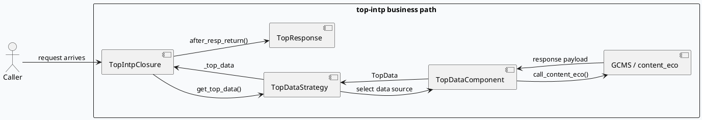
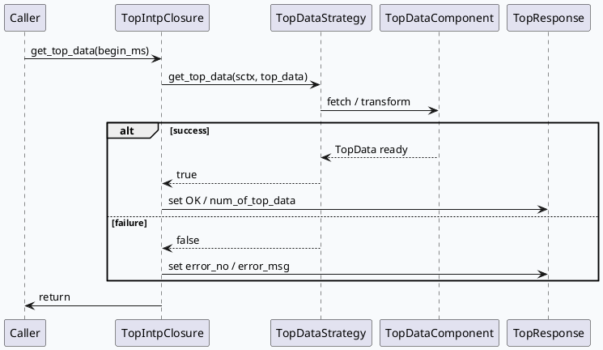

# 2026-08-18 周二代码理解：top-intp GCMS 请求与响应边界

> 日期：2026-08-18  
> 主题来源：2026-08-18 daily-plan 文件未找到，按历史未覆盖主题 fallback 到 `top-intp` 的请求到 GCMS 取数与响应装配链路；KU/业务背景需人工补充。  
> 范围：只分析 `src/service/top_service.cc`、`src/strategy/top_data_strategy.cc`、`src/component/top_data_component.cc`、`src/component/gcms_component.h`、`src/common/gcms_data.h`、`conf/common_component/gcms_plugin_pb.conf`，关注请求封装、策略分发、GCMS 响应回填和结果出网，不展开服务启动。

---

## 0. 架构全景图
<div style="font-family:system-ui,-apple-system,BlinkMacSystemFont,'Segoe UI',Roboto,sans-serif;background:#f8fafc;border:1px solid #d9e2ec;border-radius:14px;padding:18px;margin:16px 0;color:#243b53"><div style="font-size:22px;font-weight:800;margin-bottom:12px;color:#102a43">请求进入后如何走到 GCMS，再回到 TopResponse</div><div style="display:grid;grid-template-columns:1.05fr 1.15fr 1fr;gap:12px"><div style="background:#fff;border:1px solid #d9e2ec;border-radius:10px;padding:12px"><div style="font-weight:700;margin-bottom:8px;color:#1d4e89">入口封装</div><div>• `TopIntpClosure::get_top_data()` 持有请求上下文</div><div>• `DeleteTopIntpClosure` 管理 closure 生命周期</div><div>• `TopDataStrategy::get_top_data()` 接管业务取数</div></div><div style="background:#fff;border:1px solid #d9e2ec;border-radius:10px;padding:12px"><div style="font-weight:700;margin-bottom:8px;color:#1d4e89">GCMS 取数</div><div>• `content_eco` HTTP 调用拿回介质数据</div><div>• `req_batch_size` / `req_max_concurrency` 限制吞吐</div><div>• `req_type=2` 允许广播查找场景</div><div>• `timeoutms=100` 约束尾延迟</div></div><div style="background:#fff;border:1px solid #d9e2ec;border-radius:10px;padding:12px"><div style="font-weight:700;margin-bottom:8px;color:#1d4e89">出网装配</div><div>• `transform_response()` 整理 `TopData`</div><div>• `SmfwGcmsRespItem` 承载结构字段</div><div>• `TopResponse` 写回成功态和数量</div></div></div><div style="margin-top:12px;background:#eef4f9;border:1px dashed #b6c6d6;border-radius:10px;padding:10px 12px;font-size:13px;line-height:1.55">业务判断：这条链路的核心不是单纯“请求返回”，而是把策略选择、GCMS 查询语义和 TopResponse 的错误/成功状态统一起来。真正的业务边界在 `TopIntpClosure` 和 `TopDataStrategy` 之间。</div></div>

## 1. 请求到响应的主路径
`TopIntpClosure::get_top_data()` 先用 `std::unique_ptr` 持有自身，避免 closure 在异步路径上泄漏，再转到 `TopDataStrategy::get_top_data()`。策略对象成功后，`after_resp_return()` 会把结果回写到 `TopResponse`，失败则设置错误状态。

### 关键路径
- `src/service/top_service.cc:15-18`：closure 删除器
- `src/service/top_service.cc:21-39`：请求上下文驱动的取数和结束回调
- `src/service/top_service.cc:42-64`：策略获取 `TopData`
- `src/service/top_service.cc:68-95`：回填 `TopResponse` 状态
- `src/strategy/top_data_strategy.cc:12-20`：策略入口

## 2. 核心流程图


### 时序图：成功与失败两条分支


## 3. 配置/结构信息图
```infographic
infographic list-grid-badge-card
 data
  title GCMS 业务配置面
  desc 请求语义和服务质量阈值都由插件配置约束
  items
   - label service_name
     desc topintp
     value 1
     icon mdi/cube-outline
   - label need_report_data
     desc 1
     value 1
     icon mdi/checkbox-marked-circle-outline
   - label need_check_srv
     desc 1
     value 1
     icon mdi/shield-check-outline
   - label req_batch_size
     desc 10
     value 10
     icon mdi/view-grid-plus
   - label req_max_concurrency
     desc 100
     value 100
     icon mdi/axis-arrow
   - label req_type
     desc 2
     value 2
     icon mdi/route
   - label timeoutms
     desc 100
     value 100
     icon mdi/timer-outline
   - label ttl_sec
     desc 1200
     value 1200
     icon mdi/cache-clock
 theme
  palette #0f766e #2563eb #f59e0b
```

## 4. 业务边界
`TopDataStrategy` 目前只保留 `initialize()`、`wireup()` 和 `get_top_data()` 的最小策略接口。这个形态说明业务代码把“选什么源、怎么回填”从传输层剥离出来，后续扩展时更适合在策略里加分流，而不是在 closure 里堆 if/else。

`TopDataComponent` 则负责把外部返回整理成统一结构：`call_content_eco()` 取数，`transform_response()` 处理响应，`parse_one_item()` 拆字段，`SmfwGcmsRespItem` 作为结构承载。`gcms_data.h` 提供 `MEMBER_BEGIN` 系列字段宏，说明这个层更接近协议适配器，而不是业务规则本身。

### 证据来源
- `src/service/top_service.cc:15-18`
- `src/service/top_service.cc:21-39`
- `src/service/top_service.cc:42-95`
- `src/strategy/top_data_strategy.h:19-22`
- `src/strategy/top_data_strategy.cc:12-20`
- `src/component/top_data_component.cc:15-18`
- `src/component/top_data_component.cc:30-33`
- `src/component/top_data_component.cc:73-77`
- `src/component/top_data_component.cc:144-249`
- `src/component/gcms_component.h:17-21`
- `src/common/gcms_data.h:17-29`
- `conf/common_component/gcms_plugin_pb.conf:3-17`

## 5. Pitfalls
<div style="display:grid;grid-template-columns:1fr;gap:10px;margin:14px 0"><div style="background:#fff7ed;border:1px solid #fdba74;border-radius:10px;padding:12px 14px"><div style="font-weight:800;color:#9a3412;margin-bottom:4px">closure 退出顺序要稳</div><div style="color:#7c2d12;line-height:1.55">`TopIntpClosure` 在异步/回调尾部负责回收自身，若把 `done` 生命周期和结果回填拆开，容易出现重复释放或悬空引用。</div></div><div style="background:#eff6ff;border:1px solid #93c5fd;border-radius:10px;padding:12px 14px"><div style="font-weight:800;color:#1d4ed8;margin-bottom:4px">错误态不能只看返回值</div><div style="color:#1e3a8a;line-height:1.55">成功与否最终要落到 `TopResponse` 的 `error_no`、`error_msg` 和 `num_of_top_data`。只看 `bool` 返回值会漏掉空结果和业务降级态。</div></div><div style="background:#f0fdf4;border:1px solid #86efac;border-radius:10px;padding:12px 14px"><div style="font-weight:800;color:#166534;margin-bottom:4px">配置值会改变业务语义</div><div style="color:#14532d;line-height:1.55">`req_type=2`、`req_batch_size=10`、`timeoutms=100` 不只是性能参数，它们会直接改变可查范围、并发和尾延迟，必须和策略层一起看。</div></div></div>

## 6. 调试 checklist
```infographic
infographic list-column-done-list
 data
  title 调试 checklist
  items
   - label TopIntpClosure 是否走到 get_top_data() 主分支
     done true
   - label TopDataStrategy 是否成功返回 TopData
     done true
   - label content_eco 调用是否有返回且解析成功
     done true
   - label transform_response 是否填充了内部结构
     done true
   - label TopResponse 是否写入 OK / error_no / num_of_top_data
     done true
   - label gcms_plugin_pb.conf 的并发和超时是否匹配预期
     done true
 theme
  palette #0f766e #2563eb #f59e0b
```

## 7. 结论
这条业务链路的关键不是“有没有调用 GCMS”，而是“请求、策略、协议适配、结果回填”是否被稳定地分层。`TopIntpClosure` 管的是请求出口，`TopDataStrategy` 管的是数据源选择，`TopDataComponent` 管的是协议和结构转换，四者分工清楚时，错误态和扩展点才不会互相污染。

---

## 七、业务代码库适配分析
> **分析时间**：2026-08-29T19:06:19.479631
> **目标代码库**：feeda-mv-grg（序列生成）、feeda-mv-grc（召回汇聚）

# 业务代码库适配分析报告

## 1. 分析摘要

- 从代码结构看，这套“**请求入口 / 策略分发 / 协议适配 / 响应回填**”的边界拆分方式，适合迁移到同样存在多阶段处理链路的业务服务中。`feeda-mv-grg` 和 `feeda-mv-grc` 都已经是典型的策略/处理器/调整器架构，说明引入类似的分层思路，改造阻力不算高。
- 从扫描规模看，`feeda-mv-grg` 只发现 **1 个目标文件**，适合做低风险试点；`feeda-mv-grc` 发现 **10 个目标文件**，说明相关逻辑已经分散到多个处理链路，迁移收益更大，但需要统一规范。两边都大量使用 `std::vector`、`std::string`、`std::unordered_map`，表明业务数据拼装和中间态流转很重，引入统一的请求/响应边界层，有助于减少散落的字段拼接和错误态处理。

---

## 2. 代码库详情

### `feeda-mv-grg`（序列生成服务）

- 扫描到 **1 个目标文件**：
  - `strategy/diversity/rule/low_clarity_diversity_rule.cpp`
- `std` 等价物使用规模较大：
  - `std::vector`：1969 次，356 个文件
  - `std::string`：2443 次，425 个文件
  - `std::unordered_map`：734 次，205 个文件
- 现有参考代码可借鉴：
  - `model/model.h`
  - `model/paddle_model.h`
- 适配判断：
  - 这个库已经有明显的“模型接口 + 规则策略”风格，和“入口封装 + 策略分发 + 结果回填”的思路相容。
  - `strategy/diversity/rule/low_clarity_diversity_rule.cpp` 适合作为试点文件，优先验证是否能把业务判断和数据装配拆开。
  - `model/model.h` 中的抽象接口、`model/paddle_model.h` 中的 `predict_with_tensor_input` 这类包装方式，可作为“业务层不直连底层实现”的参考。

### `feeda-mv-grc`（召回汇聚服务）

- 扫描到 **10 个目标文件**，覆盖更广：
  - `processor/multi_factor/ltr_factor_gen_scene.cpp`
  - `processor/filter/low_agile_goodrate_filter_operator.cc`
  - `processor/multi_factor/session_ltr_dibar_factor_gen.cpp`
  - `processor/new_adjust/precise_score_init.cpp`
  - `operator/adjuster/sketchy/ltv_factor_cp_opt.cpp`
  - 以及其他相关 processor / operator 文件
- `std` 等价物使用规模更大：
  - `std::vector`：8520 次，1290 个文件
  - `std::string`：7267 次，1247 个文件
  - `std::unordered_map`：2860 次，646 个文件
- 现有参考代码可借鉴：
  - `service/grc_http_service.cpp`
- 适配判断：
  - 这个库的处理链更长，且多处存在“输入解析、规则过滤、特征生成、结果聚合”式流程，非常适合引入统一的边界层。
  - `service/grc_http_service.cpp` 已经表现出“HTTP 参数解析 + 业务数据装配”的混合特征，适合优先拆分为“请求归一化”和“结果序列化”两个阶段。
  - `processor/*` 和 `operator/*` 文件说明业务逻辑已经模块化，但边界一致性仍可继续加强，尤其适合引入统一错误码、统一响应结构、统一配置化阈值。

---

## 3. 💡 适用性评估与建议

- **建议 1：在 `feeda-mv-grg/strategy/diversity/rule/low_clarity_diversity_rule.cpp` 先做策略边界试点**
  - 场景：当前如果规则判断和候选结果装配写在同一层，建议拆成“策略入口 + 数据适配器 + 结果输出”。
  - 目标：让规则只关心“选什么”，让适配层负责“怎么组装”。
  - 价值：改动面小，适合验证这种边界拆分是否能减少分支膨胀。

- **建议 2：在 `feeda-mv-grc/service/grc_http_service.cpp` 抽离请求解析与响应拼装**
  - 场景：HTTP 查询参数、业务参数、结果 JSON/字符串拼装混在一起时，容易把 transport 逻辑和业务逻辑耦合。
  - 目标：增加一个类似 `TopDataComponent` 的适配层，把 `query -> internal request -> response` 分开。
  - 价值：便于统一错误态、超时态和空结果态，后续扩展新接口更稳。

- **建议 3：在 `feeda-mv-grc/processor/multi_factor/ltr_factor_gen_scene.cpp` 和 `processor/multi_factor/session_ltr_dibar_factor_gen.cpp` 引入统一策略接口**
  - 场景：不同 scene/factor 生成逻辑如果存在大量 `if/else` 或分散的配置判断，建议统一成策略分发。
  - 目标：把“场景选择”从“具体实现”中剥离出来，避免每个新场景都复制一套分支。
  - 价值：和技术笔记里的 `TopDataStrategy` 思路一致，适合后续持续扩展。

- **建议 4：在 `feeda-mv-grc/processor/filter/low_agile_goodrate_filter_operator.cc` 统一错误与空结果语义**
  - 场景：过滤器常见问题是“返回成功但结果为空”，或“返回失败但调用方只看 bool”。
  - 目标：引入类似 `TopResponse::error_no / error_msg / num_of_top_data` 的统一结果对象。
  - 价值：减少调用方误判，提升链路可观测性。

- **建议 5：在 `feeda-mv-grc/processor/new_adjust/precise_score_init.cpp`、`operator/adjuster/sketchy/ltv_factor_cp_opt.cpp` 中配置化并发/超时/批量阈值**
  - 场景：如果这些文件里涉及外部请求、批处理或多路并发，建议把 batch size、timeout、并发上限从代码挪到配置。
  - 目标：参考 `gcms_plugin_pb.conf` 的做法，把性能阈值和业务语义一起管理。
  - 价值：避免硬编码导致的性能回退，也便于灰度调参。

---

## 4. ⚠️ 引入风险与限制

- **风险 1：生命周期和回调顺序容易出问题**
  - 如果改造后引入类似 closure / 异步回调的边界层，要特别注意对象释放顺序。
  - 对 `feeda-mv-grc/service/grc_http_service.cpp` 这类入口尤其要小心，避免“结果回填后对象已销毁”的问题。

- **风险 2：错误语义可能被弱化**
  - 现有代码可能习惯只返回 `bool` 或 `int`，但新边界层需要同时表达“失败、空结果、降级、部分成功”。
  - 如果没有统一响应对象，迁移后容易出现调用方只看返回值、忽略业务状态的情况。

- **风险 3：配置驱动会改变业务语义**
  - 一旦把 batch、并发、超时、TTL 这类参数配置化，就不只是性能参数，而会直接影响结果覆盖范围和尾延迟。
  - 对 `feeda-mv-grg` 和 `feeda-mv-grc` 的线上链路，都需要先评估默认值和兜底策略。

- **风险 4：抽象层增加后，热路径可能有额外开销**
  - `feeda-mv-grc` 的处理链已经很重，如果再叠加过多虚函数、适配对象和中间拷贝，可能影响吞吐。
  - 建议优先做“薄适配层”，避免为了分层而引入明显的性能损耗。

---

如果你愿意，我可以继续把这份报告整理成你笔记风格一致的 **“可直接粘贴到章节里的最终版”**，或者进一步补一版 **“两库迁移优先级排序表”**。

---
*本章节由 Hermes Agent 自动分析生成，基于代码库静态扫描结果。*
