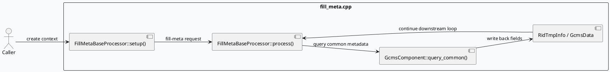

# 2026-08-22 周六代码理解：GRC 正排 fill_meta 请求与响应边界

> 日期：2026-08-22  
> 主题来源：`notes/weekly-topic-selection/daily-plan-20260529.json` 的历史候选项回退；本次 cron 没有可直接执行的当日 daily-plan，KU/业务背景需人工补充。  
> 范围：只分析 `src/processor/fill_meta.cpp` 中的 `FillMetaBaseProcessor`、`GcmsComponent::query_common()`、`RidTmpInfo`、`GcmsData` 与响应封装边界，不展开整条策略树。

---

## 0. 架构全景图
<div style="font-family:system-ui,-apple-system,BlinkMacSystemFont,'Segoe UI',sans-serif;border:1px solid #d0d7de;border-radius:8px;padding:14px;background:#f8fafc;line-height:1.45;">
  <div style="display:grid;grid-template-columns:1.15fr 1.2fr 1fr;gap:12px;align-items:stretch;">
    <div style="background:#ffffff;border:1px solid #cbd5e1;border-radius:8px;padding:12px;">
      <div style="font-size:12px;font-weight:700;color:#475569;text-transform:uppercase;letter-spacing:.04em;">请求准备</div>
      <div style="margin-top:8px;font-size:14px;color:#1f2937;">`FillMetaBaseProcessor::setup()` / `process()`</div>
      <div style="margin-top:8px;font-size:12px;color:#475569;">构造 `FillMetaBaseContext`，准备 `RidTmpInfoPtr` 队列</div>
    </div>
    <div style="background:#eef6ff;border:1px solid #bfdbfe;border-radius:8px;padding:12px;">
      <div style="font-size:12px;font-weight:700;color:#1d4ed8;text-transform:uppercase;letter-spacing:.04em;">GCMS/IFCS 中枢</div>
      <div style="margin-top:8px;font-size:14px;color:#1e3a8a;">`GcmsComponent::query_common()`</div>
      <div style="margin-top:8px;font-size:12px;color:#1e40af;">把公共元信息回填到临时条目，再转成业务可用对象</div>
    </div>
    <div style="background:#fff7ed;border:1px solid #fed7aa;border-radius:8px;padding:12px;">
      <div style="font-size:12px;font-weight:700;color:#c2410c;text-transform:uppercase;letter-spacing:.04em;">响应边界</div>
      <div style="margin-top:8px;font-size:14px;color:#7c2d12;">`GcmsData` / `MicroVideoInfo`</div>
      <div style="margin-top:8px;font-size:12px;color:#9a3412;">把查询结果封装进 `tmp->gcms_data` 并继续下游处理</div>
    </div>
  </div>
  <div style="margin-top:12px;display:grid;grid-template-columns:1fr 70px 1fr 70px 1fr;gap:10px;align-items:center;">
    <div style="background:#fff;border:1px solid #cbd5e1;border-radius:8px;padding:10px;text-align:center;">上下文建立<br><span style="font-size:12px;color:#64748b;">`FillMetaBaseContext`</span></div>
    <div style="text-align:center;color:#64748b;font-size:18px;">→</div>
    <div style="background:#fff;border:1px solid #cbd5e1;border-radius:8px;padding:10px;text-align:center;">GCMS 查询<br><span style="font-size:12px;color:#64748b;">`query_common()`</span></div>
    <div style="text-align:center;color:#64748b;font-size:18px;">→</div>
    <div style="background:#fff;border:1px solid #cbd5e1;border-radius:8px;padding:10px;text-align:center;">结果回填<br><span style="font-size:12px;color:#64748b;">`tmp->gcms_data`</span></div>
  </div>
</div>

## 1. 核心调用链


## 2. 结构信息图
```infographic
infographic sequence-ascending-steps
data
  title fill_meta 处理步骤
  desc 请求从上下文准备到公共字段回填的主路径
  items
    - label 初始化上下文
      desc `setup()` 生成 `FillMetaBaseContext`
      icon mdi:state-machine
    - label 收集临时条目
      desc 构造 `RidTmpInfoPtr` 容器
      icon mdi:playlist-plus
    - label 执行 GCMS 查询
      desc `GcmsComponent::get_instance().query_common(...)`
      icon mdi:cloud-search
    - label 封装业务对象
      desc 生成 `GcmsData` 并挂到 `tmp->gcms_data`
      icon mdi:package-variant
```

```infographic
infographic compare-binary-horizontal-underline-text-vs
data
  title 请求与响应边界
  items
    - label 请求侧
      desc `setup()`、输入解析、临时容器准备
    - label 响应侧
      desc `query_common()` 后的字段回填与对象封装
```

## 3. 关键结论
<div style="font-family:system-ui,-apple-system,BlinkMacSystemFont,'Segoe UI',sans-serif;border:1px solid #cbd5e1;border-left:4px solid #2563eb;border-radius:8px;padding:14px;background:#ffffff;margin:14px 0;">
  <div style="font-size:13px;font-weight:700;color:#1e3a8a;margin-bottom:6px;">结论 1</div>
  <div style="font-size:14px;color:#1f2937;">`fill_meta` 不是单纯的字段拷贝，它先把输入对象组织成临时队列，再批量走 `query_common()` 回填公共元信息，最后把结果重新挂回业务对象。</div>
</div>
<div style="font-family:system-ui,-apple-system,BlinkMacSystemFont,'Segoe UI',sans-serif;border:1px solid #cbd5e1;border-left:4px solid #ea580c;border-radius:8px;padding:14px;background:#ffffff;margin:14px 0;">
  <div style="font-size:13px;font-weight:700;color:#9a3412;margin-bottom:6px;">结论 2</div>
  <div style="font-size:14px;color:#1f2937;">`RidTmpInfo` 是中间承载体，`GcmsData` 才是对外可流转的数据边界；这说明响应结构和查询结构是分层设计的。</div>
</div>

## 4. Pitfalls
<div style="font-family:system-ui,-apple-system,BlinkMacSystemFont,'Segoe UI',sans-serif;border:1px solid #e2e8f0;border-radius:8px;padding:14px;background:#f8fafc;">
  <div style="font-size:13px;font-weight:700;color:#334155;margin-bottom:8px;">常见坑</div>
  <div style="font-size:14px;color:#1f2937;">1. 只看 `query_common()` 的入参，忽略前面的临时对象组织，会误判数据形态。</div>
  <div style="font-size:14px;color:#1f2937;margin-top:6px;">2. 把 `GcmsData` 当成纯查询结果，忽略它实际上承担了响应封装边界。</div>
  <div style="font-size:14px;color:#1f2937;margin-top:6px;">3. 以为 `setup()` 只是样板代码，实际上它决定了 `Context` 的后续承载能力。</div>
</div>

```infographic
infographic list-column-done-list
data
  title 调试 checklist
  items
    - label 确认 `FillMetaBaseContext` 在 `setup()` 中成功创建
      done true
    - label 检查 `card_no_gcms` / 临时队列是否按预期填充
      done true
    - label 核对 `GcmsComponent::query_common()` 的调用参数与返回码
      done true
    - label 验证 `tmp->gcms_data` 是否被正确写回
      done true
    - label 检查异常分支是否会跳过后续对象封装
      done true
```

## 5. 证据来源
- `src/processor/fill_meta.cpp:33-33`
- `src/processor/fill_meta.cpp:126-181`
- `src/processor/fill_meta.cpp:244-327`

> 需人工补充：KU/业务背景未逐篇读取正文，仅使用日计划候选与源码证据。

---

## 七、业务代码库适配分析
> **分析时间**：2026-09-01T19:12:59.283490
> **目标代码库**：feeda-mv-grg（序列生成）、feeda-mv-grc（召回汇聚）

## 1. 分析摘要

- 从技术笔记看，这里分析的不是单点函数，而是一种**“请求准备 → 批量查询 → 响应封装”**的边界设计：`FillMetaBaseProcessor::setup()/process()` 负责组织上下文，`GcmsComponent::query_common()` 负责公共元信息回填，`GcmsData` 负责对外输出边界。
- 放到业务代码库里看，这种模式对 **feeda-mv-grc** 更适配：它本身已有较多 processor/filter 场景，且 `std::vector`、`std::string`、`std::unordered_map` 使用规模都很大，说明“先组装临时对象、再批量处理、最后回填结果”的迁移收益较高。  
- **feeda-mv-grg** 的扫描命中较少，仅发现 1 个目标文件，说明直接迁移面较小，更适合做局部引入；如果要落地，也应优先放在 `candidate_vec` 这种天然的批处理入口上，而不是大范围重构。

---

## 2. 代码库详情

### feeda-mv-grg

- 扫描结果只发现 1 个相关文件：
  - `strategy/diversity/rule/low_clarity_diversity_rule.cpp`
- 这说明在 grg 中，该技术目前不是主流模式，更多像是“可选增强点”。
- 但 grg 内部已经有明显的批处理/候选集传递形态，可作为迁移参考：
  - `model/model.h`
    ```cpp
    virtual int predict(std::vector<RidTmpInfoPtr>& candidate_vec, uint32_t pos) = 0;
    ```
  - `model/paddle_model.h`
    ```cpp
    virtual int predict(std::vector<RidTmpInfoPtr>& candidate_vec, uint32_t pos) {
        return 0;
    }
    ```
- 说明 grg 的模型接口已经接受 `std::vector<RidTmpInfoPtr>` 这种容器化输入，和“临时条目 + 批量处理 + 结果回填”的思路是兼容的。

### feeda-mv-grc

- 扫描结果发现 10 个相关文件，覆盖范围明显更广：
  - `processor/multi_factor/subcate_future_factor_gen.cpp`
  - `processor/filter/low_agile_goodrate_filter_operator.cc`
  - `processor/multi_factor/ltr_factor_gen_scene.cpp`
  - `processor/new_adjust/precise_score_init.cpp`
  - `processor/filter/user_explore_interest_ugc_filter_operator.cc`
  - 其余 5 个文件未在摘要中展开，但说明该模式在 processor/filter/multi_factor/new_adjust 这类路径上更容易落点。
- grc 的 std 容器使用规模很大：
  - `std::vector`：8520 次，1290 个文件
  - `std::string`：7267 次，1247 个文件
  - `std::unordered_map`：2860 次，646 个文件
- 这意味着 grc 里大量逻辑本身就以“容器驱动的数据流”为主，因此引入 `FillMetaBaseContext` / `RidTmpInfo` / `GcmsData` 这种边界拆分，通常不会破坏整体风格。
- 现有可参考代码：
  - `service/grc_http_service.cpp`
    ```cpp
    std::unordered_map<std::string, std::vector<int>> depend_map;
    ```
  - `service/grc_http_service.cpp`
    ```cpp
    std::set<std::pair<int, int>, decltype(comp_pair)> p_set(comp_pair);
    static std::vector<std::string> colors{...};
    ```
  - `service/grc_http_service.cpp`
    ```cpp
    std::string resp_str;
    std::vector<std::string> sub_access_off_vec;
    std::vector<std::string> sub_access_on_vec;
    ```
- 说明 grc 已经存在较明显的“请求参数解析 / 容器组织 / 响应拼装”模式，可以直接借鉴 fill_meta 的边界拆分方式。

---

## 3. 💡 适用性评估与建议

- **建议 1：在 `feeda-mv-grc/processor/multi_factor/ltr_factor_gen_scene.cpp` 和 `processor/new_adjust/precise_score_init.cpp` 中，引入类似 `FillMetaBaseContext` 的上下文对象。**
  - 如果这两个文件当前把请求参数、临时中间态、输出结果混在一起处理，建议拆成：
    - 输入解析层
    - 临时上下文层
    - 结果封装层
  - 这样可以把公共元信息、特征初始化、候选项状态统一收口，减少后续 processor 之间的重复字段传递。

- **建议 2：在 `feeda-mv-grc/processor/filter/low_agile_goodrate_filter_operator.cc`、`processor/filter/user_explore_interest_ugc_filter_operator.cc` 里，优先做“批量回填”而不是“逐条查询”。**
  - 这两个 filter 文件很适合套用 `query_common()` 的思路：
    - 先收集所有待处理 item 到临时容器
    - 再统一查公共字段
    - 最后批量写回
  - 如果当前是循环内逐条拉取公共信息，改成批处理通常能明显降低 RPC/IO 次数。

- **建议 3：在 `feeda-mv-grc/processor/multi_factor/subcate_future_factor_gen.cpp` 中，将“临时条目结构”和“对外输出结构”分层。**
  - 可以参考 `RidTmpInfo` / `GcmsData` 的边界设计：
    - `RidTmpInfo` 承载处理中间态
    - `GcmsData` 承载最终可下游流转的数据
  - 这类拆分特别适合特征生成场景，避免把调试字段、回退字段、业务字段全塞进一个 struct。

- **建议 4：在 `feeda-mv-grg/strategy/diversity/rule/low_clarity_diversity_rule.cpp` 里，只做轻量适配，不建议全量引入重型上下文。**
  - grg 目前目标文件很少，说明收益主要来自“局部降耦”。
  - 可以优先围绕 `model/model.h` 的 `predict(std::vector<RidTmpInfoPtr>& candidate_vec, uint32_t pos)` 做包装：
    - 在进入 rule 前补齐必要公共字段
    - 在 rule 输出后再回填到候选集
  - 这样能复用现有 `candidate_vec` 入口，迁移成本较低。

- **建议 5：在 `feeda-mv-grc/service/grc_http_service.cpp` 里，把“请求参数解析”和“响应字符串拼装”进一步解耦。**
  - 这是最接近 fill_meta 章节中的“请求侧 / 响应侧边界”的位置。
  - 可以把 `std::vector<std::string>` 的解析逻辑和 `resp_str` 的生成逻辑分开，形成明确的输入对象、处理中间对象、输出对象三段式流程。
  - 这会让后续接入 `GcmsData` 风格的封装更自然。

---

## 4. ⚠️ 引入风险与限制

- **风险 1：边界对象过多会增加拷贝和封装成本。**
  - 如果在高频路径里频繁创建 `Context`、`TmpInfo`、`Data`，可能带来额外内存分配和对象搬移开销。
  - 建议配合 `reserve()`、移动语义、引用传递来控制成本。

- **风险 2：批量查询会改变错误语义。**
  - `query_common()` 这类批量回填如果出现部分失败，原来逐条处理的“局部失败可继续”语义可能被打散。
  - 在 `processor/filter/*` 和 `service/grc_http_service.cpp` 里要明确：
    - 是整体失败
    - 还是部分降级
    - 失败项是否保留原值

- **风险 3：现有接口可能已经依赖“直接可变候选集”。**
  - grg 的 `predict(std::vector<RidTmpInfoPtr>& candidate_vec, uint32_t pos)` 说明很多逻辑默认直接操作容器引用。
  - 如果强行改成强封装上下文，可能需要额外适配层，短期内会增加改造量。

- **风险 4：上下文对象不要跨线程复用请求态引用。**
  - 如果 `FillMetaBaseContext` 或类似对象里保存了请求引用、字符串视图、临时指针，在异步或多线程场景下容易出现生命周期问题。
  - 建议只保存稳定数据或明确所有权。

--- 

如果你愿意，我可以继续把这份内容整理成更像“学习笔记章节”的最终版，包括：
- “适配结论表”
- “可迁移文件清单”
- “建议落地顺序（P0/P1/P2）”

---
*本章节由 Hermes Agent 自动分析生成，基于代码库静态扫描结果。*
