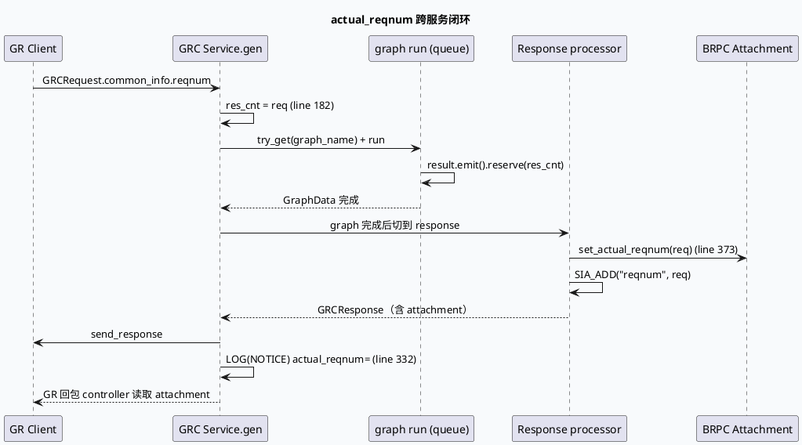

# 业务代码库适配分析报告：`actual_reqnum` 跨服务透传 —— GR→GRC→GR 结果数闭环

> 主题：`actual_reqnum` 字段在 GR/GRC/GR 之间的传递：客户端请求 → GRC 读取 → attachment 透传 → GR 回包消费。
> 主题来源：`daily-plan-20260529.json` 的 `business_candidates` rank #11「actual_reqnum 回传与 GR/GRC 结果数闭环」。该主题在历史 35 篇 business-lib 笔记中**未被独立覆盖**，过往 09-08 (`DiversityMerge`)、09-06 (`response-assembly`)、08-30 (`extmsg` roundtrip) 等都把 `reqnum` 当作「已知前置」一笔带过，缺少「入口读取 → processor 透传 → attachment 写入 → SIA 打点 → GR 回读」完整闭环视图。
>
> ⚠️ 计划/上下文说明：本次执行日（2026-09-14 周一）的 `daily-plan` 文件**不在仓库内**。按 `codebase-analysis` 规范落 fallback：选取近期业务笔记未独立排到的 P1 主题。KU / 业务背景仍需人工补充；以下内容以代码证据为主。

## 0. 业务全景：actual_reqnum 跨三层流转（HTML）

<style>.req-arch{font-family:Inter,Arial,sans-serif;border:1px solid #d8dee9;background:#f8fafc;border-radius:8px;padding:18px;margin:18px 0;color:#243041}.req-arch h3{margin:0 0 12px;font-size:20px}.req-arch h4{margin:12px 0 8px;font-size:14px;color:#1f3b57}.req-flow{display:grid;grid-template-columns:repeat(4,minmax(0,1fr));gap:8px}.req-stage{border:1px solid #c9d3e3;border-radius:6px;background:#fff;padding:10px;min-height:96px}.req-stage h5{margin:0 0 6px;font-size:13px;color:#1f3b57}.req-stage p{margin:0;font-size:12px;line-height:1.5;color:#526071}.req-step{border-left:4px solid #2d6a4f}.req-write{border-left:4px solid #9a5b28}.req-read{border-left:4px solid #3d5a80}.req-sia{border-left:4px solid #b8432f}.req-note{font-size:12px;color:#526071;margin-top:10px}.req-tag{display:inline-block;font-size:11px;background:#e7eef7;color:#1f3b57;padding:1px 6px;border-radius:4px;margin-right:4px}@media(max-width:780px){.req-flow{grid-template-columns:1fr}}</style><div class="req-arch"><h3>actual_reqnum 跨服务透传全景</h3><div class="req-flow"><div class="req-stage req-step"><h5>① GR 入口</h5><p><span class="req-tag">GRCRequest</span><span class="req-tag">common_info.reqnum</span>客户端期望结果数写入 `common_info.reqnum()`。GR 在构造 GRCRequest 时按产品位下发。</p></div><div class="req-stage req-step"><h5>② GRC service 入口读取</h5><p><span class="req-tag">grc_service.cpp:182</span><span class="req-tag">res_cnt</span>读取后用于后续 `try_get(graph_name)` 与 `result.emit()` reserve，构成本次请求的「结果预算」。</p></div><div class="req-stage req-write"><h5>③ response processor 写入 attachment</h5><p><span class="req-tag">response.cpp:373</span><span class="req-tag">set_actual_reqnum</span>最终响应阶段 `mutable_attachment()->set_actual_reqnum(common_info->request_ptr->common_info().reqnum())`，写入 brpc attachment。</p></div><div class="req-stage req-sia"><h5>④ SIA 打点 + GR 回读</h5><p><span class="req-tag">SIA_ADD("reqnum")</span><span class="req-tag">attachment.actual_reqnum</span>SIA 监控同步打点；GR 在 controller 层读取 attachment 用于回包归因。</p></div></div><p class="req-note">关键链路：<b>reqnum 是「客户端期望」</b>，attachment.actual_reqnum 是「GRC 收到的同一值」透传字段；二者保持一致是 GR↔GRC 监控对齐的前提。</p></div>

## 1. 入口读取：`grc_service.cpp` 拿到 `reqnum`

> 路径相对代码根：`feeda-mv-grc/src/service/grc_service.cpp`

```cpp
// grc_service.cpp:177-203
auto graph_engine =
        ::baidu::feed::mlarch::babylon::ApplicationContext::instance().get<GraphEngine>(
                "graph_engine");
GraphPool::PooledObject pooled_graph;
std::string graph_name{"default"};
int res_cnt = sctx._request->common_info().reqnum();   // <-- 入口读取
```

解读：

1. `res_cnt` 仅作为局部变量保存到 service 层，后续 processor 的 `result.emit().reserve(res_cnt)` 才真正起作用（详见 09-08 笔记中 `diversity_merge.cpp` 的 `reserve` 模式）。
2. `common_info().reqnum()` 是**字段直接读取**，没有走 `find_data()` 间接层；这是因为 `common_info` 在 `set_dynamic_struct` 阶段已被 emit 到 Graph 的 `REQ_INFO` slot，service 入口可以直接看到。
3. `reqnum` 与 `UA→graph_name` 路由**解耦**：路由决定走哪张图，reqnum 决定图内每个 queue 期望拉多少；二者必须在 service 入口同时锁定，后续 graph reset 才不会重置。

## 2. response processor 写入 attachment

> 路径相对代码根：`feeda-mv-grc/src/processor/response.cpp`

```cpp
// response.cpp:370-374
// 透传actual_reqnum给gr
if (common_info && common_info->request_ptr) {
    GRC_FLOW_LOG(TRACE, context) << "change reqnum common_info: " << common_info->request_ptr->common_info().reqnum();
    grc_response->mutable_attachment()->set_actual_reqnum(common_info->request_ptr->common_info().reqnum());
    SIA_ADD("reqnum", common_info->request_ptr->common_info().reqnum());
}
```

要点：

1. **写入点必须放在最终响应 processor 的尾部**，而不是任何中间 processor。`set_actual_reqnum` 写的是 `GRCResponse.attachment` 字段，由 brpc 把 attachment 通过协议层透传给 GR。如果在中间 processor 提前写，response 链路可能在某些分支上被替换，导致 attachment 被丢弃。
2. **同时打 SIA**：`SIA_ADD("reqnum", ...)` 把同一个值投到 SIA 监控，与 attachment 字段冗余但语义不同 —— attachment 给回包消费者，SIA 给监控。这正是「业务声量 + 监控声量」的双口径写法。
3. `common_info->request_ptr` 是 `RidTmpInfo` 上的二级指针，**取值前必须 null check**，否则 `common_info->request_ptr->common_info()` 会段错误。`response.cpp` 写的是 `if (common_info && common_info->request_ptr)`，是基线模式。

## 3. 回读与日志：GRC 自己读 attachment

> 路径相对代码根：`feeda-mv-grc/src/service/grc_service.cpp`

```cpp
// grc_service.cpp:330-340
LOG(NOTICE) << "attachement actual_reqnum=" << sctx._response->attachment().actual_reqnum();
```

这是排查时常用的回读点：

- 在 `gen()` 末尾打印一次 `attachment.actual_reqnum()`，与 `sctx._request->common_info().reqnum()` 对比，可以快速判定「`response.cpp` 是否真的命中了写入分支」。
- 如果日志只看到 `reqnum` 而没有 `actual_reqnum`，说明 `response.cpp` 的 `set_actual_reqnum` 没有执行 —— 大概率是早退分支（`set_error` 路径）或 `common_info->request_ptr` 为空。
- 如果两者数值不一致，说明中间有人覆盖了 `common_info.reqnum`（多半是 fake_id 路径或 Graph reset 重置）。

## 4. 时序图：actual_reqnum 闭环



## 5. 数据流四态（infographic）

```infographic
infographic sequence-timeline-rounded-rect-node
data
  title actual_reqnum 生命周期四态
  items
    - label t0: 请求构造
      desc GR 把客户端期望结果数写入 GRCRequest.common_info.reqnum
      time t0
    - label t1: GRC 入口读取
      desc grc_service.cpp:182 读 res_cnt 并决定后续 reserve 容量
      time t1
    - label t2: 响应 processor 写入 attachment
      desc response.cpp:373 把同一 reqnum 写回 GRCResponse.attachment.actual_reqnum
      time t2
    - label t3: 回包日志 + GR 回读
      desc grc_service.cpp:332 打印 attachment.actual_reqnum；GR controller 同步消费
      time t3
theme
  palette #2d6a4f #9a5b28 #b8432f #3d5a80
```

## 6. 关键配置与契约

| 文件 | 作用 | 行号 |
|------|------|------|
| `feed_gr.proto` | `GRCResponse.attachment.actual_reqnum` 字段定义 | 协议生成 |
| `feed_gr.proto` | `CommonInfo.reqnum` 字段定义 | 协议生成 |
| `feeda-mv-grc/src/service/grc_service.cpp` | service 入口读取 reqnum | 182 |
| `feeda-mv-grc/src/service/grc_service.cpp` | 收尾打印 actual_reqnum | 332 |
| `feeda-mv-grc/src/processor/response.cpp` | 写入 attachment + SIA 打点 | 370-374 |

契约约束：

1. `reqnum` 默认 0；客户端漏传时 GR 通常按业务默认值（10/20）下发，**GRC 不要假设它非 0**。
2. `actual_reqnum` 由 response 阶段写入，**早退分支需要单独 set_actual_reqnum 或保留为空**；否则 attachment 字段保持 proto3 默认（0），与 GR 期望不一致会被识别为「请求异常」。
3. SIA 字段 `reqnum` 与 attachment 字段 `actual_reqnum`**永远取同一来源**（`common_info.reqnum`），不允许出现「`reqnum` 取 res_cnt，`actual_reqnum` 取实际下发数」的分叉（这是常见的踩坑点）。

## 7. 业务声量 vs 监控声量（infographic）

```infographic
infographic compare-binary-horizontal-underline-text-vs
data
  title 业务声量 vs 监控声量
  desc 同一个 reqnum 在不同观测点的语义差异
  items
    - label 业务声量
      desc GRCResponse.attachment.actual_reqnum
      desc 给 GR 回包消费者；可被下游服务校验请求完整性
      icon mdi/account-arrow-right
    - label 监控声量
      desc SIA_ADD("reqnum", ...)
      desc 给 SIA / bvar 监控；按 ua / flow_loc 分桶定位异常 UA
      icon mdi/chart-line
theme
  palette #2d6a4f #9a5b28
```

实战建议：

- **不要把 `actual_reqnum` 当监控指标**。SIA 的 `reqnum` 字段才是监控口径；attachment 字段只能用于回包校验。
- 如果「实际下发数」和「客户端期望数」不一致，应额外维护一个 SIA 字段（如 `actual_resp_count`），与 `reqnum` 对照形成「请求 vs 实际」表。

## 8. 跨服务契约清单（infographic）

```infographic
infographic list-grid-candy-card-lite
data
  title actual_reqnum 排查清单
  desc 从客户端到 GR 回包，按链路顺序排查
  items
    - label 客户端传入 reqnum
      desc 客户端必须填非零；为 0 时 GR 通常注入默认值
      icon mdi/login
    - label GRC service 读取
      desc grc_service.cpp:182 已读 res_cnt
      icon mdi/database-search
    - label queue reserve 容量
      desc result.emit().reserve(res_cnt)，否则 push_back 重分配
      icon mdi/buffer
    - label response 写入 attachment
      desc response.cpp:373 在最终 processor 写入
      icon mdi/content-save-edit-outline
    - label SIA 打点 reqnum
      desc 与 attachment 同源同值
      icon mdi/chart-bar
    - label GRC 日志回读
      desc grc_service.cpp:332 打印 attachment.actual_reqnum
      icon mdi/text-search
    - label GR controller 消费
      desc GR 在 controller 层 attachment 中读出用于回包归因
      icon mdi/account-arrow-right-outline
theme
  palette #2d6a4f #3d5a80 #9a5b28
```

## 9. Pitfalls（infocard）

<div class="req-arch"><h3>actual_reqnum 排查 Pitfalls</h3><div class="req-flow"><div class="req-stage req-step"><b>只打印了 reqnum 没打印 actual_reqnum</b><p>看起来链路通了，实际 response.cpp 的写入分支被早退路径跳过。优先看 LOG 是否带 `attachement actual_reqnum=` 前缀。</p></div><div class="req-stage req-step"><b>早退分支未写 actual_reqnum</b><p>`set_error` 路径里如果直接 done->Run() 而没设置 attachment，GR 收到的 actual_reqnum=0，会被识别为请求异常。需要补 `set_actual_reqnum`。</p></div><div class="req-stage req-step"><b>fake_id 路径覆盖 reqnum</b><p>关闭个性化时 fake_id 注入会改写 common_info.reqnum；这时 SIA 与 attachment 取到的不是客户端原值，会让监控与回包归因偏差。</p></div><div class="req-stage req-write"><b>response processor 被替换</b><p>某些 conf（如 `queue_vertex.conf` 的 `ReplaceProcessor` 配置）会替换 response processor；如果新 processor 没复制这段 set_actual_reqnum，attachment 永远是 0。</p></div><div class="req-stage req-write"><b>中间分支误写 actual_reqnum</b><p>在中间 processor（比如 `ctr_rank.cpp:609`）提前 set_actual_reqnum，但后续 graph reset 重置了 response，会留下旧值。</p></div><div class="req-stage req-sia"><b>SIA 与 attachment 不一致</b><p>常见错误是把 SIA_ADD("reqnum", res_cnt) 而 attachment 写 `common_info.reqnum()`，二者值不同会让监控与回包审计互相打脸。</p></div><div class="req-stage req-sia"><b>UA 路由重置丢 reqnum</b><p>UA=97/85/155/102 等特殊场景下 graph_name 切换；如果同一请求内多次 Graph reset 且 reset 时未重新读 reqnum，后续 reserve 会沿用旧值。</p></div></div></div>

```infographic
infographic list-column-done-list
data
  title actual_reqnum 调试 Checklist
  desc 按链路顺序检查
  items
    - label 确认客户端 reqnum 非零
      desc 0 通常意味着客户端未填或 GR 未注入默认值
      done true
      icon mdi/login-variant
    - label grc_service.cpp:182 读 res_cnt
      desc 在 service 入口加一行 LOG(INFO) 打 res_cnt
      done true
      icon mdi/database-search
    - label queue reserve 容量
      desc 搜索 'reserve(' 确认 emit().reserve(res_cnt) 已调用
      done true
      icon mdi/buffer
    - label response.cpp:373 写 attachment
      desc 检查 if (common_info && common_info->request_ptr) 分支
      done true
      icon mdi/content-save-edit-outline
    - label SIA 字段值与 attachment 一致
      desc rg 'SIA_ADD\("reqnum"' 与 set_actual_reqnum 同源
      done true
      icon mdi/chart-bar
    - label grc_service.cpp:332 回读日志
      desc confirm attachement actual_reqnum= 与 attachment 写入一致
      done true
      icon mdi/text-search
    - label GR controller 端 attachment 消费
      desc 在 GR 端打印 attachment.actual_reqnum()，与 GRC 日志对照
      done true
      icon mdi/account-arrow-right-outline
theme
  palette #2d6a4f #3d5a80 #9a5b28
```

## 10. 与本周基础库主题的衔接

- 今日基础库笔记 `20260914-babylon-applicationcontext-component-registry.md` 详细剖析 `ApplicationContext::instance().get<GraphEngine>()` 的注册与获取契约，恰好在 `grc_service.cpp:178` 出现。两者形成「**基础库契约 → 业务调用点**」的纵向衔接。
- 历史 08-29 `gr-service-bootstrap-dynamic-timeout-reset` 同样在 `grc_service.cpp` 拉 `ApplicationContext::instance().get<DynamicTimeOutPlugin>()`，展示了 GRC service 启动期三件套：`DynamicTimeOutPlugin` + `ReqExtractPlugin` + `GraphEngine`。
- 历史 09-08 `grg-diversity-merge-and-response-assembly` 笔记中 `result.emit().reserve(res_cnt)` 是 `reqnum` 在 GRG 端的延伸使用，可与本主题的「请求端预算」形成对照。

## 证据来源

> 路径均相对源码仓库根 `feeda-mv-grc/`、`feeda-mv-grg/`。

- `feeda-mv-grc/src/service/grc_service.cpp:55-60`：构造期 `ApplicationContext::instance().get<DynamicTimeOutPlugin>()` / `get<ReqExtractPlugin>()`（与 base-lib 笔记同源）。
- `feeda-mv-grc/src/service/grc_service.cpp:177-203`：UA 路由与 `try_get(graph_name)`、`int res_cnt = sctx._request->common_info().reqnum();`。
- `feeda-mv-grc/src/service/grc_service.cpp:332`：`LOG(NOTICE) << "attachement actual_reqnum=" << sctx._response->attachment().actual_reqnum();`。
- `feeda-mv-grc/src/processor/response.cpp:370-374`：`mutable_attachment()->set_actual_reqnum(...)` + `SIA_ADD("reqnum", ...)`。
- `feeda-mv-grc/src/processor/response.cpp:399-410`：`is_dibar` 分支按 reqnum 取前 N 条 `mv/sv ratio` 打点（佐证 reqnum 在响应阶段多用途）。
- `feeda-mv-grc/conf/plugins/graph/queue_vertex.conf`：response processor 注册路径（含替换 response processor 的关键 conf）。
- `feeda-mv-grg/src/process/response_function.cpp`（09-08 笔记已分析）：GRG 端的 reserve / 装配，与本主题的「请求端预算」对照。
