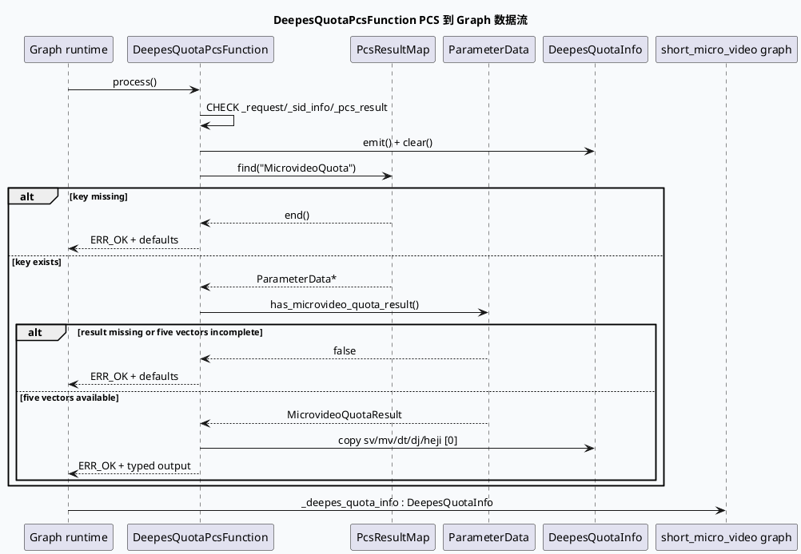

# 业务代码理解：GRG `DeepesQuotaPcsFunction` 配额生成与 Graph 数据边界

> 主题：PCS 返回的 `MicrovideoQuotaResult` 如何被转换成五类内容配额比例，并通过 graph vertex 的 emit/depend 契约交给后续业务节点。
> 主题选择说明：仓库内 daily-plan 文件为 2026-05-29 周计划，已落后于本次执行日 2026-09-24；近期 business-lib 已覆盖 actual_reqnum、response assembly、DiversityMerge、FillMeta、成本热点等主题。本次按 fallback 规则选取计划候选池中的 `DeepesQuotaInfo` 主题，避开已覆盖的 DiversityMerge 细节，聚焦 PCS 适配器与 Graph 数据契约。KU/业务上下文未逐篇读取，需人工补充；以下以源码和配置为主。

## 0. 业务全景图

<style>.quota-arch{font-family:Inter,Arial,sans-serif;border:1px solid #d8dee9;background:#f8fafc;border-radius:8px;padding:18px;margin:18px 0;color:#243041}.quota-arch h3{margin:0 0 12px;font-size:20px}.quota-arch h4{margin:14px 0 8px;font-size:14px;color:#1f3b57}.quota-grid{display:grid;grid-template-columns:repeat(4,minmax(0,1fr));gap:8px}.quota-box{border:1px solid #c9d3e3;border-left:4px solid #2d6a4f;background:#fff;border-radius:6px;padding:10px;min-height:90px}.quota-box b{display:block;font-size:13px;color:#1a2f44}.quota-box span{display:block;font-size:12px;line-height:1.5;color:#526071;margin-top:4px}.quota-pcs{border-left-color:#3d5a80}.quota-contract{border-left-color:#9a5b28}.quota-risk{border-left-color:#b8432f}.quota-note{font-size:12px;line-height:1.5;color:#526071;margin-top:10px}@media(max-width:820px){.quota-grid{grid-template-columns:repeat(2,minmax(0,1fr))}}@media(max-width:520px){.quota-grid{grid-template-columns:1fr}}</style><div class="quota-arch"><h3>DeepES 配额在 GRG graph 中的边界</h3><h4>输入、转换、输出、消费</h4><div class="quota-grid"><div class="quota-box quota-pcs"><b>PCS map</b><span>`PcsResultMap` 按 key 查找 `MicrovideoQuota`，缺失时保持默认值并正常返回。</span></div><div class="quota-box quota-pcs"><b>MicrovideoQuotaResult</b><span>要求 sv/mv/dt/dj/heji 五个 repeated 字段都非空，当前实现各取 index 0。</span></div><div class="quota-box quota-contract"><b>DeepesQuotaInfo</b><span>五个 float ratio 通过 `GRAPH_FUNCTION_EMIT_DATA` 写入 graph 数据流。</span></div><div class="quota-box quota-contract"><b>short_micro_video vertex</b><span>配置把 `_deepes_quota_info` 声明为 `DeepesQuotaInfo`，供后续节点按 data contract 依赖。</span></div></div><h4>缺失数据语义</h4><div class="quota-grid"><div class="quota-box"><b>缺少 PCS key</b><span>返回 `ERR_OK`，不覆盖默认比例。</span></div><div class="quota-box"><b>结构不完整</b><span>五类列表任一为空时不写入任何新比例，保留 reset 后默认值。</span></div><div class="quota-box quota-risk"><b>只取首元素</b><span>重复字段中的 index 1+ 不会参与当前计算，需确认 PCS 约定确实是单值列表。</span></div><div class="quota-box quota-risk"><b>消费边界需继续核对</b><span>当前快照能确认生产和 graph wiring，但没有直接命中后续消费字段的源码位置。</span></div></div><div class="quota-note">这不是“模型直接改排序分数”的函数；它是 PCS 结果到 graph typed data 的适配器，真正的配额消费发生在后续节点或 engine 逻辑中。</div></div>

## 1. 输入契约：PCS 结果按 key 查找

`src/process/deepes_quota_pcs_function.cpp:15-37` 定义 `DeepesQuotaPcsFunction`。函数依赖 `_request`、`_sid_info` 和 `_pcs_result`，其中 `_pcs_result` 是 `std::unordered_map<std::string, const ParameterData*>`。处理开始先做三个输入 null check，再 emit 输出对象并调用 `clear()`，随后查找固定 key `MicrovideoQuota`。

如果 map 中不存在该 key，函数直接返回 `ERR_OK`。这意味着“PCS 没有返回配额”在当前实现中是正常降级，不是错误；由于 `clear()` 之后 output object 已恢复默认比例，后续节点拿到的是默认配额，而不是未初始化内存。



## 2. 输出契约：五类 ratio 与默认值

`src/data/base.h:1248-1261` 的 `DeepesQuotaInfo` 是一个轻量结构，包含 `sv_quota_ratio`、`mv_quota_ratio`、`dt_quota_ratio`、`dj_quota_ratio`、`heji_quota_ratio` 五个 float。默认值分别为 `0.4486`、`0.3640`、`0.0118`、`0.0628`、`0.1128`；`clear()` 会恢复同一组默认值。

这组默认值在当前代码中承担“无 PCS 结果时的稳定 fallback”，不是本函数运行时计算出的比例。文档和调试日志应区分两种来源：

- 默认路径：key 缺失、result 不存在或五个 repeated 字段不完整。
- 模型路径：五个字段都存在时，每个 repeated 字段只取 `[0]`。

`deepes_quota_pcs_function.cpp:39-50` 的完整性判断是一个全有或全无 gate：只要 `sv_t/mv_t/dt_t/dj_t/heji_t` 任意一个为空，就不会部分覆盖。这避免了五类比例来自不同批次或不同完整度的混合状态，但也意味着单类字段异常会让全部五类回退默认值。

```infographic
infographic compare-hierarchy-left-right-circle-node-pill-badge
data
  title DeepesQuotaInfo 五类配额
  desc PCS 完整结果到 graph 输出的字段映射
  items
    - label SV
      desc sv_t[0] -> sv_quota_ratio; default 0.4486
      value 44.86
      icon mdi/video-outline
    - label MV
      desc mv_t[0] -> mv_quota_ratio; default 0.3640
      value 36.40
      icon mdi/movie-open-outline
    - label DT
      desc dt_t[0] -> dt_quota_ratio; default 0.0118
      value 1.18
      icon mdi/clock-video-outline
    - label DJ
      desc dj_t[0] -> dj_quota_ratio; default 0.0628
      value 6.28
      icon mdi/playlist-play
    - label Heji
      desc heji_t[0] -> heji_quota_ratio; default 0.1128
      value 11.28
      icon mdi/shape-outline
 theme
  palette #2d6a4f #3d5a80 #9a5b28 #b8432f
```

> 数值展示来自 `DeepesQuotaInfo` 默认初始化常量的百分比换算，仅用于阅读；函数本身不校验五个值的和是否等于 1，也不对 PCS 返回值做范围裁剪。若业务要求 ratio 和、上下界或 NaN 检查，应在 PCS 适配器或消费节点补充显式校验。

## 3. Graph 配置边界：emit/depend 类型必须一致

`conf/plugins/graph/short_micro_video/vertex.conf:1812-1827` 注册了 `DeepesQuotaPcsFunction`，声明输出 `_deepes_quota_info`，类型为 `DeepesQuotaInfo`，同时声明 `_pcs_result`、`_request`、`_sid_info` 作为输入。该配置与 C++ 尾部的 `GRAPH_FUNCTION_INTERFACE` 一一对应：

- `GRAPH_FUNCTION_DEPEND_DATA(PcsResultMap, _pcs_result)` 对应配置中的 `GrgPcsData` 运行时数据。
- `GRAPH_FUNCTION_EMIT_DATA(DeepesQuotaInfo, _deepes_quota_info)` 对应 vertex emit 的 typed output。
- `REGISTER_GRG_FUNCTION(DeepesQuotaPcsFunction)` 让函数名可被配置加载。

因此排查“函数执行了但后续拿不到配额”时，应分别验证注册名、vertex 名称、emit data 名称和 data type；只看 C++ 类名不足以确认 graph wiring 正确。

```infographic
infographic list-grid-badge-card
data
  title Graph wiring 四项契约
  desc 从注册到后续消费需要同时成立的边界
  items
    - label 函数注册名
      desc REGISTER_GRG_FUNCTION(DeepesQuotaPcsFunction) 必须与 vertex function 一致
      icon mdi/identifier
    - label 输入 data 名
      desc _pcs_result、_request、_sid_info 的名字必须和 GRAPH_FUNCTION_INTERFACE 对齐
      icon mdi/input
    - label 输出 data 名与类型
      desc _deepes_quota_info 的类型必须是 DeepesQuotaInfo
      icon mdi/export
    - label 后续节点依赖
      desc 消费者必须依赖同名同类型 output；当前快照需继续追踪具体消费者
      icon mdi/source-branch
 theme
  palette #2d6a4f #3d5a80 #b8432f
```

## 4. 与 DiversityMerge 的边界

`src/process/diversity_merge.cpp:73-105` 展示了另一个 graph 业务节点的装配方式：从 `EngineMgr` 获取 `MultiStreamEngine` pool，取得 pooled engine，把业务 context ref 到 engine context，再通过 `ApplicationContext` 取得 `ExecEnginePlugin` 并调用 `bind_graph_dependency`。这说明 `DeepesQuotaPcsFunction` 的输出并不会自动进入 DiversityMerge；typed data 需要由 graph 配置或 processor interface 明确连接。

`diversity_merge.cpp:797-809` 的当前逻辑以 `rec_num` 与配置 `result_num` 决定输出容量，并设置 engine loop num；`_output_*_num` 在 956-986 行统计各内容类型的实际输出数量。源码中可直接确认“结果数与输出类型计数”边界，但在本次快照内未命中 `DeepesQuotaInfo` 字段在该文件中的直接读取。因此不要把 DeepES 五类 ratio 已经参与 DiversityMerge 的结论写死；应继续从 graph 配置、Context 字段和 rule/operator 读取点验证。

## 5. 缺失、异常与默认回退

```infographic
infographic sequence-timeline-simple
data
  title DeepES 配额异常处理路径
  items
    - label 输入为空
      desc _request、_sid_info 或 _pcs_result 为空，CHECK_IS_NULL 返回 -1
      time Guard
    - label 输出无法 emit
      desc _deepes_quota_info.emit() 得到空指针，返回 -1
      time Emit
    - label PCS key 缺失
      desc 找不到 MicrovideoQuota，保持 clear() 后默认比例并返回 ERR_OK
      time Missing
    - label 五类字段不完整
      desc 任一 repeated 字段为空，不部分覆盖，继续使用默认比例
      time Partial
    - label 五类字段完整
      desc 每类读取 index 0，写入 DeepesQuotaInfo 并返回 ERR_OK
      time Model
 theme
  palette #b8432f #9a5b28 #3d5a80 #2d6a4f
```

需要特别注意：`reset()` 在 `deepes_quota_pcs_function.cpp:55-56` 是空实现。函数每次 `process()` 自己调用 output 的 `clear()`，因此当前默认恢复依赖 process 路径，而不是 graph function 的 reset 回调。如果框架未来复用对象并在 process 之前依赖 reset 清理，必须重新确认这个空 reset 是否仍然安全。

## 6. Pitfalls

<div class="quota-arch"><h3>DeepES 配额排查卡片</h3><div class="quota-grid"><div class="quota-box quota-risk"><b>把 key 缺失当错误</b><span>找不到 MicrovideoQuota 会返回 ERR_OK，并保留默认值。监控上应区分“正常降级”和“函数失败”。</span></div><div class="quota-box quota-risk"><b>只校验部分字段</b><span>当前实现五个 vector 全部非空才写入；不要根据单个 sv/mv 字段判断模型结果有效。</span></div><div class="quota-box quota-risk"><b>误以为会读取全部 repeated 值</b><span>每类只取 index 0。若 PCS 开始返回多阶段结果，当前代码不会自动聚合或选择最佳元素。</span></div><div class="quota-box quota-risk"><b>默认值没有范围校验</b><span>clear() 只恢复常量，PCS 值没有检查 [0,1]、总和或 NaN；异常值可能继续向后传播。</span></div><div class="quota-box quota-contract"><b>类型名漂移</b><span>配置里的 DeepesQuotaInfo、头文件结构名和 GRAPH_FUNCTION_EMIT_DATA 必须同时变更，否则运行时可能加载成功但数据不匹配。</span></div><div class="quota-box quota-contract"><b>消费点未证实</b><span>当前代码快照可证实生产端与 vertex wiring，不能仅凭命名断言后续 DiversityMerge 已消费这些比例。</span></div></div></div>

```infographic
infographic list-column-done-list
data
  title DeepES 配额调试 Checklist
  desc 按输入、转换、输出、消费四层核对
  items
    - label 检查 PCS map key
      desc 确认 _pcs_result 中存在 MicrovideoQuota
      done true
      icon mdi/key-chain
    - label 检查五个 repeated 字段
      desc sv_t/mv_t/dt_t/dj_t/heji_t 都非空且 index 0 值在预期范围
      done true
      icon mdi/format-list-checks
    - label 区分默认与模型路径
      desc 记录 key 缺失、字段不完整和完整覆盖三种状态
      done true
      icon mdi/source-branch-check
    - label 检查 emit 类型
      desc DeepesQuotaInfo 的字段名和类型必须与 graph data contract 一致
      done true
      icon mdi/shape-outline
    - label 检查 vertex wiring
      desc short_micro_video/vertex.conf 中 function、emit、depend 名称对齐
      done true
      icon mdi/file-tree
    - label 继续定位消费点
      desc 从 _deepes_quota_info 或 DeepesQuotaInfo 反向搜索后续 processor/operator
      done true
      icon mdi/magnify-expand
 theme
  palette #2d6a4f #3d5a80 #9a5b28
```

## 证据来源

- `baidu/feed-gr/feeda-mv-grg/src/process/deepes_quota_pcs_function.cpp:15-66`：函数注册、输入依赖、PCS key 查找、五字段转换与 emit contract。
- `baidu/feed-gr/feeda-mv-grg/src/data/base.h:1248-1261`：`DeepesQuotaInfo` 字段、默认值和 clear 语义。
- `baidu/feed-gr/feeda-mv-grg/conf/plugins/graph/short_micro_video/vertex.conf:1812-1827`：`DeepesQuotaPcsFunction` 的 vertex、emit 和 depend 配置。
- `baidu/feed-gr/feeda-mv-grg/src/process/diversity_merge.cpp:73-105`：MultiStreamEngine pool、业务 context 与 graph dependency 装配边界。
- `baidu/feed-gr/feeda-mv-grg/src/process/diversity_merge.cpp:797-809`：DiversityMerge 结果容量与 engine loop 设置。
- `baidu/feed-gr/feeda-mv-grg/src/process/diversity_merge.cpp:956-986`：五类内容实际输出计数与日志字段。

---

## 七、业务代码库适配分析
> **分析时间**：2026-09-26T19:07:27.712435
> **目标代码库**：feeda-mv-grg（序列生成）、feeda-mv-grc（召回汇聚）

# 业务代码库适配分析

## 1. 分析摘要

当前两个业务代码库中均**尚未发现 `DeepesQuotaPcsFunction`、`DeepesQuotaInfo` 或同类 PCS 配额适配器的直接使用**，因此暂时没有可直接复用的 DeepES 配额实现经验。现有代码主要使用标准容器完成模型输入、候选集合、Graph 依赖和 HTTP 参数处理，其中 `std::vector`、`std::string`、`std::unordered_map` 的使用规模较大，说明业务代码对“容器承载多值结果”和“按 key 查找数据”的模式已经比较成熟。

这项技术的迁移潜力主要不在于替换现有 STL 容器，而在于引入一套明确的 **PCS 结果适配 + Graph typed data contract**。其中，`feeda-mv-grg` 更适合作为配额生成函数和后续消费节点的落点；`feeda-mv-grc` 已有 Graph 依赖解析和拓扑处理代码，可作为 Graph wiring、依赖校验和配置可视化的参考。若只是将 `std::vector` 或 `std::unordered_map` 替换为其他容器，预计性能收益有限，反而会增加维护和迁移风险。

## 2. 代码库详情

### 2.1 `feeda-mv-grg`：序列生成服务

- **扫描结论**
  - 尚未发现目标库直接使用：
    - `DeepesQuotaPcsFunction`
    - `DeepesQuotaInfo`
    - `MicrovideoQuotaResult`
    - `GRAPH_FUNCTION_EMIT_DATA`
    - `GRAPH_FUNCTION_DEPEND_DATA`
  - 因此当前没有现成的 PCS 配额转换器或同类 Graph typed output 可直接复制。

- **现有 STL 使用规模**
  - `std::vector`：1969 次，分布在 356 个文件。
  - `std::string`：2443 次，分布在 425 个文件。
  - `std::unordered_map`：734 次，分布在 205 个文件。

- **可参考代码**
  - `model/model.h:9`
    ```cpp
    class Model {
    public:
        virtual int predict(std::vector<RidTmpInfoPtr>& candidate_vec,
                            uint32_t pos) = 0;
    };
    ```
    该接口体现了候选集合通过 `std::vector` 在模型层传递的现有模式。如果后续需要将配额应用到候选集或内容类型统计，可以参考其“批量候选数据作为函数参数传递”的方式。

  - `model/paddle_model.h:103`
    ```cpp
    virtual int predict(std::vector<RidTmpInfoPtr>& candidate_vec,
                        uint32_t pos) {
        return 0;
    }
    ```
    该实现说明当前模型接口对候选集合的传递已经较为稳定，新增配额信息时不建议直接修改所有模型接口，而应优先通过独立的 context 或 Graph data contract 传递。

  - `model/paddle_model.h:107`
    ```cpp
    int predict_with_tensor_input(std::vector<RidTmpInfoPtr>& candidate_vec,
                                  general_predict::PredictSample* predict_sample = nullptr,
                                  bool is_from_cube = true) const {
        return predict<ModelDependInput>(candidate_vec,
                                         predict_sample,
                                         is_from_cube);
    }
    ```
    这里可以作为“配额信息是否应该进入模型输入层”的边界参考。当前技术笔记中的 `DeepesQuotaInfo` 更像 Graph 中间数据，不建议在没有消费需求证明前直接扩展到 `PredictSample` 或模型 tensor 输入。

- **适配判断**
  - `feeda-mv-grg` 是最适合落地该技术的代码库，因为技术笔记中的实现本身属于序列生成 Graph 内的业务适配函数。
  - 但是当前扫描没有命中同类实现，迁移时需要同时补齐：
    - 数据结构定义；
    - PCS map 查找；
    - 默认值和异常回退；
    - Graph vertex 配置；
    - 后续消费者；
    - 单元测试和监控字段。

### 2.2 `feeda-mv-grc`：召回汇聚服务

- **扫描结论**
  - 尚未发现目标库直接使用 `DeepesQuotaPcsFunction` 或 `DeepesQuotaInfo`。
  - 当前代码更偏向 Graph 服务、依赖解析、HTTP 请求参数和召回结果汇聚，不是该 PCS 配额转换逻辑的直接承载位置。

- **现有 STL 使用规模**
  - `std::vector`：8520 次，分布在 1290 个文件。
  - `std::string`：7267 次，分布在 1247 个文件。
  - `std::unordered_map`：2860 次，分布在 646 个文件。

- **可参考代码**
  - `service/grc_http_service.cpp:62`
    ```cpp
    std::unordered_map<std::string, std::vector<int>> depend_map;
    auto &all_vertex = graph_engine->get_vertexs_message(graph_name);
    for (int i = 0; i < all_vertex.size(); ++i) {
        for (auto &depend : all_vertex[i].depends) {
            // ...
        }
    }
    ```
    该代码虽然不是 `DeepesQuotaInfo` 的消费者，但可以作为 Graph 依赖关系解析和配置检查的参考。未来如果需要校验 `_deepes_quota_info` 是否被后续 vertex 正确依赖，可以复用类似的 vertex/depends 遍历思路。

  - `service/grc_http_service.cpp:81`
    ```cpp
    std::set<std::pair<int, int>, decltype(comp_pair)> p_set(comp_pair);
    static std::vector<std::string> colors{ /* ... */ };
    ```
    这里体现了 GRC 对 Graph 节点和拓扑关系进行辅助处理的模式。若要增加 Graph data contract 的可视化或诊断信息，可以考虑在现有 Graph 配置解析能力上增加 emit/depend 类型展示。

  - `service/grc_http_service.cpp:152`
    ```cpp
    std::string resp_str;
    std::vector<std::string> sub_access_off_vec;
    std::vector<std::string> sub_access_on_vec;
    ```
    该代码可作为字符串和多值参数处理的参考，但不建议直接将 HTTP 参数处理逻辑与 PCS 配额转换逻辑耦合。

- **适配判断**
  - `feeda-mv-grc` 不适合作为 `DeepesQuotaPcsFunction` 的主要落点。
  - 更适合承担：
    - Graph 配置检查；
    - vertex 依赖关系展示；
    - emit/depend 名称冲突检测；
    - 配额数据链路的调试接口；
    - 线上诊断和配置可视化。
  - 由于 `std::unordered_map` 和 `std::vector` 使用量很高，若只是将 `PcsResultMap` 换成其他 map 或将 repeated 字段换成其他序列容器，收益预计不明显。

## 3. 💡 适用性评估与建议

- **建议一：在 `feeda-mv-grg` 中按现有适配器模式引入独立配额数据结构**

  - 如果业务确实需要接入 PCS 配额，建议在 `data/base.h` 中定义或扩展 `DeepesQuotaInfo`，保持五个字段的业务语义独立：
    - `sv_quota_ratio`
    - `mv_quota_ratio`
    - `dt_quota_ratio`
    - `dj_quota_ratio`
    - `heji_quota_ratio`
  - 不建议直接把五个比例散落到模型参数、候选对象或全局配置中。
  - 这样可以保持配额作为 Graph 中间数据存在，便于后续节点按类型读取，也避免侵入 `model/model.h` 和 `model/paddle_model.h` 的公共预测接口。

- **建议二：在 `src/process/deepes_quota_pcs_function.cpp` 保留“全有或全无”转换策略，但补充显式校验**

  - 当前实现已经具备合理的基本结构：
    - 先 `emit()`；
    - 再 `clear()`；
    - 查找 `MicrovideoQuota`；
    - 五个 repeated 字段全部非空时才写入；
    - 缺失或不完整时返回默认值。
  - 建议在该文件中增加以下校验：
    - 五个值是否为有限浮点数，排除 `NaN` 和无穷大；
    - 每个比例是否处于 `[0, 1]`；
    - 五个比例之和是否在允许误差范围内接近 `1.0`；
    - `index 0` 是否确实符合 PCS 单值返回约定。
  - 如果历史 PCS 数据可能存在总和不为 1 的情况，不建议直接静默归一化，应先通过监控区分“模型返回异常”和“业务允许非归一化”。

- **建议三：在 `conf/plugins/graph/short_micro_video/vertex.conf` 中增加 Graph contract 校验**

  - 当前技术依赖以下名称和类型严格一致：
    - vertex function：`DeepesQuotaPcsFunction`
    - emit data：`_deepes_quota_info`
    - emit type：`DeepesQuotaInfo`
    - depend data：`_pcs_result`
    - 其他输入：`_request`、`_sid_info`
  - 建议在配置发布或启动检查阶段校验：
    - 注册名是否能解析到 `REGISTER_GRG_FUNCTION(DeepesQuotaPcsFunction)`；
    - emit 名称是否被后续 vertex 依赖；
    - emit/depend 类型是否完全一致；
    - 是否存在同名但不同类型的数据定义。
  - `feeda-mv-grc/service/grc_http_service.cpp` 中已有 vertex 和 `depends` 遍历逻辑，可以作为 Graph wiring 检查和诊断接口的参考实现。

- **建议四：不要为了迁移该技术而替换现有 STL 容器**

  - `PcsResultMap` 使用 `std::unordered_map<std::string, const ParameterData*>` 的主要操作是固定 key 查找，例如：
    ```cpp
    _pcs_result->find("MicrovideoQuota");
    ```
  - 该场景下 `std::unordered_map` 已经与访问模式匹配，没有明显理由替换为其他容器。
  - `MicrovideoQuotaResult` 的 repeated 字段当前只读取 `[0]`。如果 PCS 约定始终只返回单元素，可以在数据协议层明确单值语义；如果未来可能返回多个值，再考虑引入显式聚合策略，而不是仅替换 `std::vector`。
  - 现有 `std::vector` 的大规模使用说明业务已经具备成熟的序列数据处理能力，优化重点应放在：
    - 减少不必要拷贝；
    - 避免重复解析；
    - 明确所有权；
    - 降低 Graph 数据序列化和转换次数。

- **建议五：先确认真实消费点，再决定是否把配额接入模型或 DiversityMerge**

  - 当前材料可以确认 `DeepesQuotaInfo` 的生产和 Graph wiring，但不能确认后续 `DiversityMerge` 已经读取这些比例。
  - 建议从 `_deepes_quota_info`、`DeepesQuotaInfo` 及五个字段名反向搜索后续 processor、operator 和 rule。
  - 只有确认消费点后，才决定将其接入：
    - 候选配额截断；
    - 内容类型调度；
    - `DiversityMerge` 的输出容量控制；
    - 模型输入或排序打分。
  - `model/model.h` 和 `model/paddle_model.h` 当前仅体现候选集合传递，不能据此推断 DeepES 配额已经进入模型推理过程。

## 4. ⚠️ 引入风险与限制

- **缺少现成同类实现经验**

  - 两个代码库都没有直接使用该技术，意味着迁移时不能只复制 `DeepesQuotaPcsFunction` 的 C++ 文件。
  - 需要同时验证数据结构、Graph 配置、函数注册、运行时数据类型和后续消费者，否则可能出现函数执行成功但配额没有真正生效的情况。

- **PCS 数据语义存在不确定性**

  - 当前实现对五个 repeated 字段只取 `index 0`，并未处理多个元素。
  - 如果 PCS 后续返回多版本、多阶段或多候选结果，现有代码可能静默忽略 `index 1+`，导致配额选择错误。
  - 迁移前需要确认 PCS 接口是否保证每个字段只有一个有效元素。

- **默认值与异常值可能被混淆**

  - `MicrovideoQuota` key 缺失、结果对象缺失、五类字段不完整，都会返回 `ERR_OK` 并使用默认比例。
  - 这有利于稳定性，但可能掩盖 PCS 服务异常。建议增加路径标识或计数指标，至少区分：
    - 正常模型覆盖；
    - key 缺失；
    - 结果结构不完整；
    - 值范围非法；
    - emit 或输入对象为空。

- **Graph contract 对名称和类型高度敏感**

  - `_deepes_quota_info`、`DeepesQuotaInfo`、`_pcs_result` 等名称和类型任一处漂移，都可能造成运行时数据无法传递。
  - `reset()` 当前为空，而 `process()` 内部依赖 `clear()` 恢复默认值。若未来调整 Graph function 生命周期或对象复用方式，需要重新确认 reset 和 process 的初始化边界，避免旧请求的配额值泄漏到新请求。

- **不应直接假设 DiversityMerge 已消费配额**

  - 当前材料没有命中 `DeepesQuotaInfo` 在 `DiversityMerge` 中的直接读取位置。
  - 在消费点未确认前，不建议将“DeepES 配额已经影响最终排序或输出比例”作为迁移完成标准。应以实际字段读取、配置依赖和运行时指标为准。

## 5. 总体结论

- **直接替换收益：低**
  - 业务代码中没有目标技术的现成使用，且现有 `std::vector`、`std::unordered_map` 已广泛使用并匹配当前数据访问模式。
  - 不建议以“替换 STL 容器”为迁移目标。

- **业务模式复用收益：中高**
  - `feeda-mv-grg` 可以复用“PCS 结果适配为强类型 Graph 数据”的设计。
  - `feeda-mv-grc` 可以复用 Graph vertex 依赖遍历和 wiring 诊断能力。

- **推荐落地路径**
  - 先在 `data/base.h` 和 `src/process/deepes_quota_pcs_function.cpp` 固化数据结构与异常语义；
  - 再在 `conf/plugins/graph/short_micro_video/vertex.conf` 中完成 emit/depend 类型接线；
  - 通过 `feeda-mv-grc/service/grc_http_service.cpp` 类似的 Graph 依赖解析能力补充配置检查；
  - 最后反向确认实际消费点，再决定是否接入模型、配额截断或 `DiversityMerge`。

---
*本章节由 Hermes Agent 自动分析生成，基于代码库静态扫描结果。*
