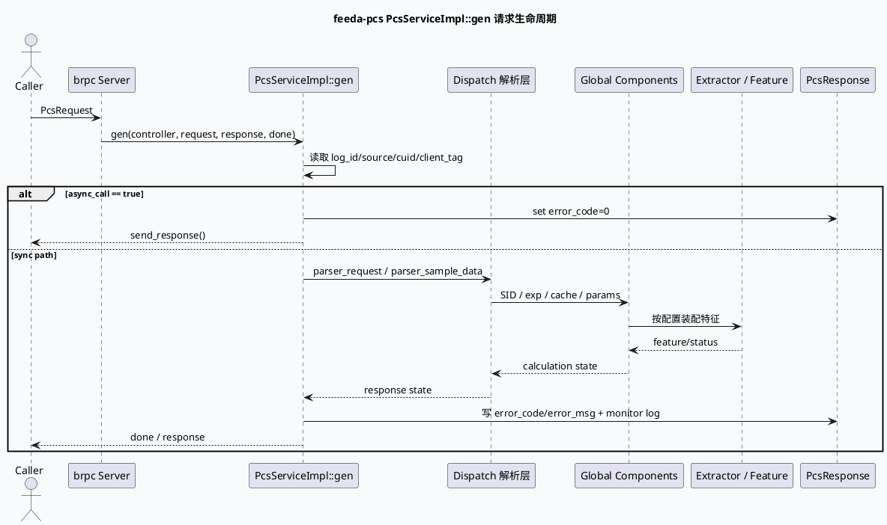

# 2026-08-14 周五代码理解选题：feeda-pcs 请求生命周期与特征装配边界

> 自动选题说明：本次未发现 2026-08-14 的 daily-plan 文件；按周五任务要求，从近期笔记覆盖情况中避开 `MultiStreamEngine`、`video_launch`、`History Service gr_state`、`bthread_async` 等高频主题，选择近期笔记中几乎未覆盖的 `feeda-pcs` C++ brpc 服务架构。KU/业务背景仍需人工补充。

## 选题结论

`feeda-pcs` 的核心不是单个策略函数，而是一条从 brpc `PcsServiceImpl::gen` 入口进入、经 `Dispatch` 解析请求上下文、再由全局组件和配置驱动的 extractor/feature/外部组件完成特征装配的服务链路。它适合作为本周代码理解主题，因为它同时覆盖 C++ 服务入口、RPC 协议、配置化组件初始化、SID/实验参数解析和多场景 extractor 注册。

<style>.pcs-arch{font-family:Inter,Arial,sans-serif;border:1px solid #d8dee9;background:#f8fafc;border-radius:8px;padding:18px;margin:18px 0;color:#243041}.pcs-arch h3{margin:0 0 12px;font-size:20px}.pcs-layers{display:grid;grid-template-columns:1fr;gap:10px}.pcs-layer{border:1px solid #c9d3e3;border-radius:7px;background:#fff;padding:12px}.pcs-layer-title{font-weight:700;font-size:14px;margin-bottom:8px;color:#1f3b57}.pcs-grid{display:grid;grid-template-columns:repeat(4,minmax(0,1fr));gap:8px}.pcs-box{border:1px solid #d8dee9;border-left:4px solid #2d6a4f;background:#fbfdff;border-radius:6px;padding:9px;min-height:48px}.pcs-box b{display:block;font-size:13px;color:#1a2f44}.pcs-box span{display:block;font-size:12px;line-height:1.45;color:#526071;margin-top:3px}.pcs-note{font-size:12px;color:#526071;margin-top:10px}.pcs-accent{border-left-color:#9a5b28}.pcs-warn{border-left-color:#b8432f}@media(max-width:760px){.pcs-grid{grid-template-columns:1fr}}</style><div class="pcs-arch"><h3>feeda-pcs 分层全景</h3><div class="pcs-layers"><div class="pcs-layer"><div class="pcs-layer-title">RPC 入口层</div><div class="pcs-grid"><div class="pcs-box"><b>main.cpp</b><span>注册 ReusableRPCProtocol，初始化实验参数，启动 brpc server。</span></div><div class="pcs-box"><b>PcsServiceImpl</b><span>`gen` 作为 protobuf RPC 入口，处理 async_call、日志和回包。</span></div><div class="pcs-box"><b>brpc Controller</b><span>承载 log_id、错误状态、remote side 与压缩协议。</span></div><div class="pcs-box pcs-accent"><b>MBvar/Monitor</b><span>记录 client_cost、response_size、pipeline 日志。</span></div></div></div><div class="pcs-layer"><div class="pcs-layer-title">请求上下文层</div><div class="pcs-grid"><div class="pcs-box"><b>Dispatch</b><span>解析 SID、实验参数、sample data 和上下文缓存。</span></div><div class="pcs-box"><b>SidCache</b><span>对 sid/exp 解析结果做缓存，减少重复解析成本。</span></div><div class="pcs-box"><b>SampledData</b><span>承接 request 样本和计算状态，供后续 feature 使用。</span></div><div class="pcs-box pcs-warn"><b>Error Path</b><span>解析失败时需要把 error_code 与 response_state 同步到响应。</span></div></div></div><div class="pcs-layer"><div class="pcs-layer-title">组件与配置层</div><div class="pcs-grid"><div class="pcs-box"><b>GlobalInitializer</b><span>按 `global_initializer.conf` 装配 ScheduleStrategy、ExtractorManager、GCMS、SNDB 等组件。</span></div><div class="pcs-box"><b>ExtractorManager</b><span>按 extractor list 加载 scene/ctr/es 等特征抽取器。</span></div><div class="pcs-box"><b>GraphManager</b><span>加载图/参数配置，是 graph-engine 调度的集中入口。</span></div><div class="pcs-box"><b>External Components</b><span>GCMS、IFCS、Cube、SNDB、Paddle 等作为特征或内容依赖。</span></div></div></div></div><div class="pcs-note">证据引用均使用模块内相对路径，避免机器本地绝对路径泄漏。</div></div>

## 入口链路证据

- `src/main.cpp:48-55`：注册 `ReusableRPCProtocol`，按 `FLAGS_module_name` 初始化 `microvideo` 或 `shoubai` 的实验参数。
- `src/main.cpp:59-82`：执行 `GlobalInitializer::init()`，创建 `PcsServiceImpl`，通过 `server.AddService` 挂到 brpc server，并启动端口监听。
- `src/common_base/service/pcs_service.cpp:51-64`：`PcsServiceImpl::gen` 是 RPC 主入口；`async_call` 会先设置成功并立即 `send_response()`。
- `src/common_base/service/pcs_service.cpp:66-96`：入口读取 `log_id`、`source`、`cuid`、`client_tag` 等请求标签，为后续监控和错误归因打基础。
- `src/common_base/service/pcs_service.cpp:250-318`：响应阶段记录 request/response size、压缩大小、response json size，并在失败时设置错误码与错误消息。



## 配置驱动的组件装配

`feeda-pcs` 的可维护性重点在配置和组件边界。入口只负责把服务拉起来，真正的特征能力由 initializer 与 extractor 列表驱动。

```infographic
infographic hierarchy-structure
data
  title feeda-pcs 配置装配结构
  desc 从 module_name 到组件与 extractor 的层级关系
  items
    - label module_name
      desc main.cpp 根据 microvideo/shoubai 选择实验配置目录
      icon mdi/source-branch
      children
        - label global_initializer.conf
          desc 声明 ScheduleStrategy、ExtractorManager、GCMS、SNDB、Cube 等组件
          icon mdi/cog-outline
        - label extractor_list.conf
          desc 声明 scene、scene_plus、scene_ctr、immersion_information 等 extractor
          icon mdi/view-list-outline
        - label component runtime
          desc GlobalInitializer 按名称初始化外部依赖和策略组件
          icon mdi/server-network
        - label request context
          desc Dispatch 将 SID、实验参数和 SampledData 转成可计算上下文
          icon mdi/file-tree-outline
theme
  palette #2d6a4f #3d5a80 #9a5b28 #b8432f
```

关键配置证据：

- `conf/shoubai/global_initializer.conf:1-58`：`shoubai` 场景启用 `ScheduleStrategy`、`SidComponent`、`GcmsComponent`、`ExtractorManager`、`PaddleComponent`、`SndbComponent`、`CubeComponent` 等组件。
- `conf/microvideo/global_initializer.conf:1-50`：`microvideo` 场景组件更重，包含 `Tracer`、`RequestClientManager`、`GcmsPBComponentMini`、`IfcsSdk`、`EsConfComponent`、`EsFeatureComponent` 等。
- `conf/shoubai/strategy/extractor/extractor_list.conf:1-30`：多个 extractor 以 `name/conf_dir/conf_name/pb_name` 形式注册，说明策略能力并不硬编码在 service 入口。

## 代码阅读重点

1. RPC 入口不要只看 `main.cpp`。`main.cpp` 只能说明服务注册；请求语义主要在 `PcsServiceImpl::gen` 和 `Dispatch` 内。
2. `async_call` 是第一个分叉点。它会先回成功包，后续如果仍继续计算，监控口径要区分“已回包”和“实际处理完成”。
3. `source/cuid/client_tag` 是定位线上问题的主键。错误日志、MBvar 和 response_state 都围绕这些标签做归因。
4. `global_initializer.conf` 是组件能力清单。缺少某组件时，不应先怀疑 extractor 代码，先检查 module 对应配置是否启用。
5. extractor 列表只给出装配入口，真正特征字段仍需继续跳到 `conf_dir` 下的 `extract_online.conf` 和对应 processor 实现。

<div class="pcs-arch"><h3>排查 Pitfalls</h3><div class="pcs-grid"><div class="pcs-box pcs-warn"><b>只读 main.cpp 会误判服务逻辑</b><span>入口主要做协议、实验参数和 brpc 注册；业务处理藏在 service、dispatch、组件和 extractor 配置链里。</span></div><div class="pcs-box pcs-warn"><b>module_name 切错会加载另一套世界</b><span>`microvideo` 与 `shoubai` 的 initializer 和 extractor 列表不同，排查时必须先确认启动参数。</span></div><div class="pcs-box pcs-warn"><b>async_call 影响监控解释</b><span>异步请求先返回成功，后续处理异常如果没有独立日志，容易被响应成功掩盖。</span></div><div class="pcs-box pcs-warn"><b>组件缺失不一定是代码 bug</b><span>GCMS、SNDB、Cube、Paddle 等能力由配置启用；先查 `global_initializer.conf`，再查实现。</span></div></div></div>

```infographic
infographic list-column-done-list
data
  title 调试 Checklist
  desc 线上问题建议按这个顺序缩小范围
  items
    - label 确认 module_name
      desc 判断当前进程加载 microvideo 还是 shoubai 配置
      done true
      icon mdi/check-circle-outline
    - label 查 PcsServiceImpl::gen 日志
      desc 用 log_id、cuid、client_tag 对齐请求入口和响应状态
      done true
      icon mdi/text-search
    - label 查 Dispatch 解析结果
      desc 关注 SID、实验参数、SampledData、cache 命中和解析失败
      done true
      icon mdi/source-merge
    - label 查 global_initializer.conf
      desc 确认依赖组件是否在当前模块启用
      done true
      icon mdi/cog
    - label 查 extractor_list.conf
      desc 定位具体 extractor 的 conf_dir 和 pb_name，再进入特征配置
      done true
      icon mdi/format-list-bulleted
theme
  palette #2d6a4f #3d5a80 #9a5b28
```

## 本周建议深挖路径

- 第一层：`src/main.cpp`、`include/common_base/service/pcs_service.h`、`src/common_base/service/pcs_service.cpp`。
- 第二层：`src/common_base/service/dispatch.cpp`，重点看 `parser_request`、SID/exp/cache/sample data 解析。
- 第三层：`src/common_base/initializer/global_initializer.cpp` 与对应 `conf/*/global_initializer.conf`。
- 第四层：`conf/*/strategy/extractor/extractor_list.conf` 以及每个 extractor 的 `extract_online.conf`。

## 证据来源

- `src/main.cpp:48-82`
- `include/common_base/service/pcs_service.h:20-27`
- `src/common_base/service/pcs_service.cpp:51-96`
- `src/common_base/service/pcs_service.cpp:250-318`
- `src/common_base/service/dispatch.cpp:36-96`
- `src/common_base/initializer/global_initializer.cpp:53-155`
- `conf/shoubai/global_initializer.conf:1-58`
- `conf/microvideo/global_initializer.conf:1-50`
- `conf/shoubai/strategy/extractor/extractor_list.conf:1-30`
